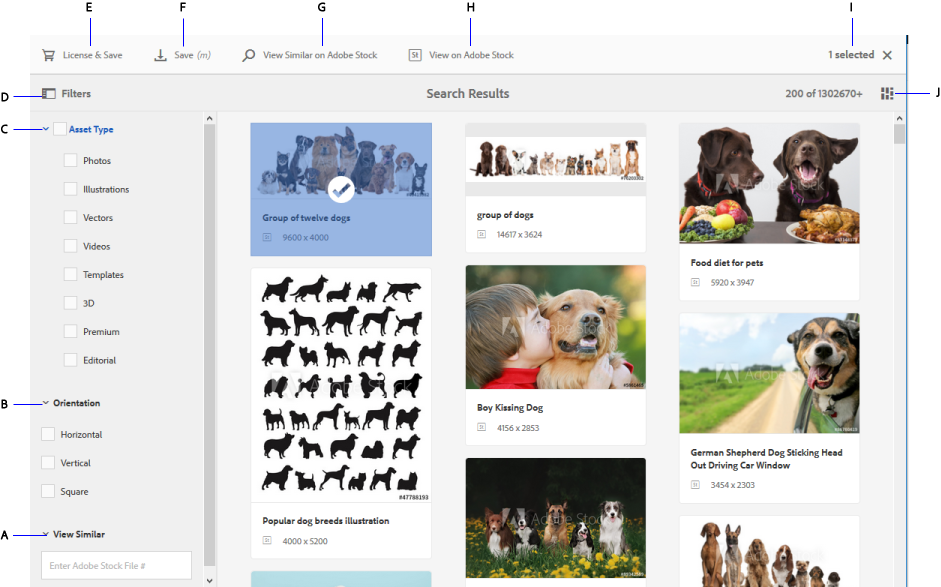

# 使用 [!DNL Adobe Stock] 資產 [!DNL Adobe Experience Manager Assets] {#use-adobe-stock-assets-in-aem-assets}

>[!CAUTION]
>
>AEM 6.4已結束延伸支援，本檔案不再更新。 如需詳細資訊，請參閱 [技術支援期](https://helpx.adobe.com//tw/support/programs/eol-matrix.html). 尋找支援的版本 [此處](https://experienceleague.adobe.com/docs/).

組織可以整合其 [!DNL Adobe Stock] 企業計畫 [!DNL Experience Manager Assets] 確保授權資產可廣泛供其創意及行銷專案使用，並具備強大的資產管理功能 [!DNL Experience Manager].

[!DNL Adobe Stock] 該服務為設計人員和企業提供數百萬張高質量、精心策劃、免版稅的照片、向量圖、插圖、視頻、模板和3D資產，供其所有創意項目使用。 [!DNL Experience Manager] 使用者可快速找到、預覽和授權 [!DNL Adobe Stock] 儲存於的資產 [!DNL Experience Manager]，而不需離開 [!DNL Experience Manager] 介面。

## 必備條件 {#prerequisites}

整合需要 [企業Adobe Stock計畫](https://stockenterprise.adobe.com/) 和 [!DNL Experience Manager] 6.4，至少部署了Service Pack 2。 針對 [!DNL Experience Manager] 6.4 service pack詳細資訊，請參閱下列 [發行說明](/help/release-notes/sp-release-notes.md).

## 整合 [!DNL Experience Manager] 和 [!DNL Adobe Stock] {#integrate-aem-and-adobe-stock}

允許在 [!DNL Experience Manager] 和 [!DNL Adobe Stock]，建立IMS設定，並 [!DNL Adobe Stock] 配置 [!DNL Experience Manager].

>[!NOTE]
>
>僅 [!DNL Experience Manager] 管理員和 [!DNL Admin Console] 組織的管理員可依需要管理員權限的方式執行整合。

### 建立IMS設定 {#create-an-ims-configuration}

1. 在 [!DNL Experience Manager] 使用者介面，導覽至 **[!UICONTROL 工具]** > **[!UICONTROL 安全性]** > **[!UICONTROL Adobe IMS設定]**. 按一 **[!UICONTROL 下「建立]** 」，然後選 **[!UICONTROL 取「雲端解決方案]** > **[!UICONTROL Adobe Stock]**」。
1. 重複使用現有證書或選擇 **[!UICONTROL 建立新憑證]**.
1. 按一下&#x200B;**[!UICONTROL 建立憑證]**。建立後，下載公開金鑰。 按一下&#x200B;**[!UICONTROL 下一步]**。保留 [!UICONTROL Adobe IMS技術帳戶設定] 螢幕開啟，即可提供所需的值。
1. 存取 [Adobe Developer Console](https://console.adobe.io). 確認您的帳戶擁有需要整合之組織的管理員權限。
1. 按一下 **[!UICONTROL 建立新專案]** 按一下 **[!UICONTROL 新增API]**. 選擇 **[!UICONTROL Adobe Stock]** 從您可用的API清單。 選擇 [!UICONTROL OAUTH 2.0網頁版].
1. 提供 **[!UICONTROL 預設重定向URI]** 和 **[!UICONTROL 重定向URI模式]** 值。 按一下&#x200B;**[!UICONTROL 「儲存已設定的 API」]**。複製產生的ID和機密。
1. 在 [!UICONTROL Adobe IMS技術帳戶設定] 畫面中，在標題為 **[!UICONTROL 標題]**, **[!UICONTROL 授權伺服器]**, **[!UICONTROL API金鑰]**, **[!UICONTROL 用戶端密碼]**，和 **[!UICONTROL 裝載]**. 如需這些值的詳細資訊，請參閱 [JWT驗證快速入門](https://www.adobe.io/authentication/auth-methods.html#!AdobeDocs/adobeio-auth/master/JWT/JWT.md).

<!-- TBD: Update the URL when the new URL is available. Logged issue github.com/AdobeDocs/adobeio-auth/issues/63.
-->

### 建立 [!DNL Adobe Stock] 配置 [!DNL Experience Manager] {#create-adobe-stock-configuration-in-aem}

1. 在 [!DNL Experience Manager] 使用者介面，導覽至 **[!UICONTROL 工具]** > **[!UICONTROL Cloud Services]** > **[!UICONTROL Adobe Stock]**.
1. 按一下 **[!UICONTROL 建立]** 來建立設定，並將其與您現有的IMS設定建立關聯。 選擇 `PROD` 作為環境參數。
1. 在 **[!UICONTROL 授權資產路徑]** 欄位中，將位置保留原樣。 請勿變更儲存位置 [!DNL Adobe Stock] 資產。
1. 新增所有必要屬性以完成建立。 按一下&#x200B;**[!UICONTROL 「儲存並關閉」]**。
1. 新增 [!DNL Experience Manager] 可授權資產的使用者或群組。

>[!NOTE]
>
>如果有多個 [!DNL Adobe Stock] 設定，請在「使用者偏好設定」面板中選取所需的設定(**[!UICONTROL AEM]** > **[!UICONTROL 使用者圖示]** > **[!UICONTROL 使用者偏好設定]** > **[!UICONTROL 庫存配置]**)。

## 使用和管理 [!DNL Adobe Stock] 資產 [!DNL Experience Manager] {#usemanage}

使用此功能，組織可讓其使用者透過 [!DNL Adobe Stock] 資產 [!DNL Experience Manager Assets]. 從 [!DNL Experience Manager] 用戶介面，用戶可搜索 [!DNL Adobe Stock] 資產及授權所需資產。

一次 [!DNL Adobe Stock] 資產授權於 [!DNL Experience Manager]，它可像一般資產一樣使用和管理。 在 [!DNL Experience Manager]，使用者可以搜尋及預覽資產；複製並發佈資產；於 [!DNL Brand Portal];透過 [!DNL Experience Manager] 案頭應用程式；等等。

*圖：搜尋 [!DNL Adobe Stock] 資產和篩選結果 [!DNL Experience Manager] 介面。*

**A.**[!DNL Adobe Stock] 搜尋與已提供 ID 之資產的類似資產。**B.** 搜尋與您選取的型態或方向相符的資產。**C.** 搜尋一或多個支援的資產類型 **D.** 開啟或收合篩選器窗格 **E.** 在 中為選取的資產授權並加以儲存 [!DNL Experience Manager]**F.**[!DNL Experience Manager] 將資產儲存在 中並加上浮水印 **G.**[!DNL Adobe Stock] 在 網站上探索與選取的資產類似的資產 **H.**[!DNL Adobe Stock] 在 網站上檢視選取的資產 **I.** 搜尋結果中選取的資產數目 **J.** 在卡片檢視與清單檢視之間切換

### 尋找資產 {#find-assets}

您的 [!DNL Experience Manager] 使用者可在兩者中搜尋資產， [!DNL Experience Manager] 和 [!DNL Adobe Stock]. 當搜尋位置不限於 [!DNL Adobe Stock]，搜尋結果來自 [!DNL Experience Manager] 和 [!DNL Adobe Stock] 的下界。

* 要搜索 [!DNL Adobe Stock] 資產，按一下 **[!UICONTROL 導覽]** > **[!UICONTROL 資產]** > **[!UICONTROL 搜尋Adobe Stock]**.

* 若要在 [!DNL Adobe Stock] 和 [!DNL Experience Manager Assets]，按一下搜尋 .

或者，開始鍵入 `Location: Adobe Stock` ，以選取 [!DNL Adobe Stock] 資產。 [!DNL Experience Manager] 針對所搜尋的資產提供進階篩選功能，讓使用者能使用篩選器（例如支援的資產類型、影像方向和授權狀態），快速將目標鎖定於所需的資產。

>[!NOTE]
>
>搜尋的資產 [!DNL Adobe Stock] 顯示於 [!DNL Experience Manager]. [!DNL Adobe Stock] 資產會擷取並儲存於 [!DNL Experience Manager] 僅在用戶 [儲存資產](/help/assets/aem-assets-adobe-stock.md#saveassets) 或 [授權並儲存資產](/help/assets/aem-assets-adobe-stock.md#licenseassets). 已儲存於 [!DNL Experience Manager] 會顯示並反白顯示，以方便參考和存取。 此外， [!DNL Stock] 資產會與某些其他中繼資料一起儲存，以指出來源為 [!DNL Stock].

*圖：在中搜尋篩選器 [!DNL Experience Manager] 突出顯示 [!DNL Adobe Stock] 搜尋結果中的資產。*

### 儲存並檢視所需資產 {#saveassets}

選取您要儲存的資產 [!DNL Experience Manager]. 按一下 [!UICONTROL 儲存] 在頂端的工具列中，並提供資產的名稱和位置。 未授權的資產會以浮水印儲存在本機。

下次搜尋資產時，儲存的資產會以徽章強調顯示，以指出這些資產可用於 [!DNL Experience Manager Assets].

>[!NOTE]
>
>最近新增的資產會顯示「新」徽章，而非「授權」徽章。

### 授權資產 {#licenseassets}

使用者可取得授權 [!DNL Adobe Stock] 資產，透過 [!DNL Adobe Stock] 企業計畫。 當您授權資產時，資產會儲存且不含浮水印，且可供在中搜尋及使用 [!DNL Experience Manager Assets].

*圖：對話方塊以授權和儲存 [!DNL Adobe Stock] 資產 [!DNL Experience Manager Assets].*

### 存取中繼資料和資產屬性 {#access-metadata-and-asset-properties}

使用者可以存取和預覽中繼資料，包括 [!DNL Adobe Stock] 儲存於中之資產的中繼資料屬性 [!DNL Experience Manager]，然後新增 **[!UICONTROL 授權參考]** 的URL。 不過，系統不會在 [!DNL Experience Manager] 和 [!DNL Adobe Stock] 網站。

使用者可以查看授權和未授權資產的屬性。

*圖：檢視及存取儲存資產的中繼資料和授權參考。*

## 已知限制 {#known-limitations}

* **未顯示編輯影像警告**:授權影像時，使用者無法檢查影像是否為「僅編輯使用」。 為了防止可能的誤用，管理員可以關閉Admin Console對編輯資產的存取權。

* **顯示的許可證類型錯誤**:中可能顯示不正確的授權類型 [!DNL Experience Manager] 的URL。 使用者可登入 [!DNL Adobe Stock] 網站以查看授權類型。

* **未同步參考欄位和中繼資料**:當用戶更新許可證參考欄位時，許可證參考資訊在 [!DNL Experience Manager] 但不在 [!DNL Adobe Stock] 網站。 同樣地，如果使用者更新 [!DNL Adobe Stock] 網站，更新不會同步於 [!DNL Experience Manager].

>[!MORELIKETHIS]
>
>* [使用的教學課程影片 [!DNL Adobe Stock] 資產 [!DNL Experience Manager Assets]](https://experienceleague.adobe.com/docs/experience-manager-learn/assets/creative-workflows/adobe-stock.html)
>* [[!DNL Adobe Stock] 企業計畫幫助](https://helpx.adobe.com/enterprise/admin-guide.html/enterprise/using/adobe-stock-enterprise.ug.html)
>* [[!DNL Adobe Stock] 常見問題集](https://helpx.adobe.com/stock/faq.html)

