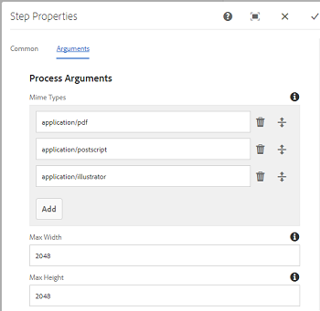
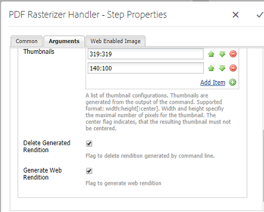

# 使用PDF點陣化器 {#using-pdf-rasterizer}

有時，當您上傳大型、內容密集的PDF或AI檔案至Adobe Experience Manager(AEM)Assets時，預設資料庫可能無法產生正確的輸出。 在這種情況下，Adobe的PDF點陣化器程式庫可產生比預設程式庫的輸出更可靠、更精確的輸出。

Adobe建議針對下列項目使用PDF點陣化器程式庫：

* 大量、內容密集的AI或PDF檔案。
* AI或PDF檔案的縮圖不會立即產生。
* AI檔案搭配Pantone Matching System(PMS)色彩。

使用PDF點陣化器產生的縮圖和預覽，與現成可用的輸出相比，品質更佳，因此可跨裝置提供一致的檢視體驗。 Adobe PDF Rasterizer程式庫不支援任何色域轉換。 無論來源檔案的色域為何，都會輸出為RGB。

1. 從「軟體散發」將PDF點陣化器套件安裝在您的AEM [實例上](https://experience.adobe.com/#/downloads/content/software-distribution/en/aem.html?package=/content/software-distribution/en/details.html/content/dam/aem/public/adobe/packages/cq640/product/assets/aem-assets-pdf-rasterizer-pkg)。

   >[!NOTE]
   >
   >PDF點陣化器程式庫僅適用於Windows和Linux。

1. 從存取AEM Assets工作流程主控 `https://[AEM_server]:[port]/workflow`台。
1. 開啟「 **[!UICONTROL DAM更新資產」工作流程]** 頁面。
1. 設定下列項目，以略過PDF和AI檔案的預設縮圖和網頁轉譯產生：

   * 開啟「縮 **[!UICONTROL 圖處理]** 」步驟，並新增 `application/pdf` 或在「跳 `application/postscript` 過Mime類型」欄位中 **** 。

   

   * 在「啟用 **[!UICONTROL 網頁的影像]** 」索引標籤中，根據您的需求，在「略過清單」 `application/pdf` (Skip List `application/postscript`**** )下新增或下方。

   

1. 開啟「點 **[!UICONTROL 陣化PDF/AI影像預覽轉譯」步驟]** ，並移除您要略過預設產生預覽影像轉譯的MIME類型。 例如，從「MIME類型」清單中 *移除MIME類型應用程式/pdf*、 *application/postscript* 或 *application/illustrator***** 。

   

1. 將「 **[!UICONTROL PDF點陣化器處理常式]** 」步驟從側面板拖曳至「處理縮圖」 **[!UICONTROL 步驟的下方]** 。
1. 為「 **[!UICONTROL PDF點陣化器處理常式」步驟設定下列引數]** :

   * Mime類型： *application/pdf* 或application/ *postscript*
   * 命令: `PDFRasterizer -d -p 1 -s 1280 -t PNG -i ${file}`
   * 新增縮圖大小： 319:319, 140:100, 48:48。 視需要新增自訂縮圖設定。

   該命令的命令行參 `PDFRasterizer` 數可以包括以下內容：

   **-d**: 標幟可讓文字、向量圖稿和影像順暢呈現。 建立更高品質的影像。 不過，加入此參數會導致命令執行緩慢，並增加影像大小。

   `-p`: 頁碼。 預設值是所有頁面。 &#39;*&#39;表示所有頁面。

   **-s**: 最大影像尺寸（高度或寬度）。 這會針對每個頁面轉換為DPI。 如果頁面大小不同，每個頁面可能會依不同的數量進行縮放。 預設值為實際頁面大小。

   **-t**: 輸出影像類型。 有效類型有JPEG、PNG、GIF和BMP。 預設值為JPEG。

   **-i**: 輸入PDF的路徑。 此參數為強制參數。

   `-h`: 說明

1. 要刪除中間轉譯，請選擇「刪 **[!UICONTROL 除生成的轉譯」]**。
1. 若要讓PDF點陣化產生Web轉譯，請選取「產 **[!UICONTROL 生Web轉譯」]**。

   

1. 在「啟用網頁的影像」 **[!UICONTROL 索引標籤中指定設定]** 。

   

1. 儲存工作流程。
1. 若要啟用PDF點陣化器以使用PDF程式庫處理PDF頁面，請從工作流程主控台開啟 **[!UICONTROL DAM Process Subset]** model。
1. 從側面面板，拖曳「建立啟用網頁的影像轉譯」步驟 **[!UICONTROL 下的「PDF點陣化處理常式」步驟]** 。
1. 為「 **[!UICONTROL PDF點陣化器處理常式」步驟設定下列引數]** :

   * Mime類型： `application/pdf` 或 `application/postscript`
   * 命令: `PDFRasterizer -d -p 1 -s 1280 -t PNG -i ${file}`
   * 新增縮圖大小： 319:319, 140:100, 48:48。 視需要新增自訂縮圖設定。

   PDFRasterizer命令的命令行參數可以包括：

   **-d**: 標幟可讓文字、向量圖稿和影像順暢呈現。 建立更高品質的影像。 不過，加入此參數會導致命令執行緩慢，並增加影像大小。

   **-p**: 頁碼。 預設值是所有頁面。 星號表 `*` 示所有頁面。

   **-s**: 最大影像尺寸（高度或寬度）。 這會針對每個頁面轉換為DPI。 如果頁面大小不同，每個頁面可能會依不同的數量進行縮放。 預設值為實際頁面大小。

   **-t**: 輸出影像類型。 有效類型有JPEG、PNG、GIF和BMP。 預設值為JPEG。

   **-i**: 輸入PDF的路徑。 此參數為強制參數。

   **-h**: 說明

1. 要刪除中間轉譯，請選擇「刪 **[!UICONTROL 除生成的轉譯」]**。
1. 若要讓PDF點陣化產生Web轉譯，請選取「產 **[!UICONTROL 生Web轉譯」]**。

   

1. 在「啟用網頁的影像」 **[!UICONTROL 索引標籤中指定設定]**。

   

1. 儲存工作流程。
1. 將PDF檔案或AI檔案上傳至AEM Assets。 PDF點陣化器會產生檔案的縮圖和網頁轉譯。
