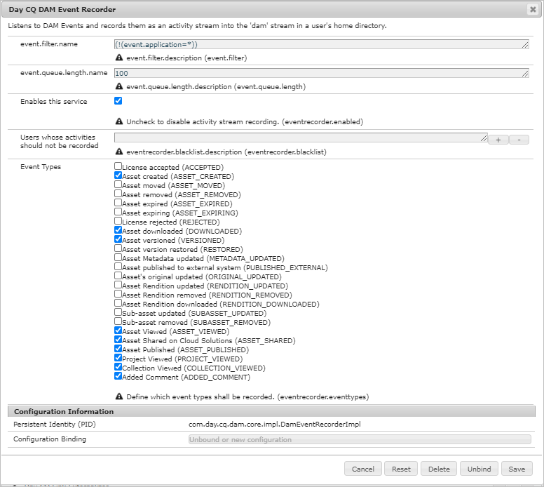

# 資產報表 {#asset-reports}

資產報表可讓您評估[!DNL Adobe Experience Manager Assets]部署的公用程式。 透過[!DNL Assets]，您可以為數位資產產生各種報表。 這些報表提供您系統使用情形、使用者與資產互動方式，以及下載和共用哪些資產的實用資訊。

使用報表中的資訊衍生關鍵成功量度，以評估企業內和客戶採用[!DNL Assets]的情況。

[!DNL Assets]報表架構使用[!DNL Sling]作業，以非同步方式處理報表請求。 它可針對大型存放庫進行擴充。 非同步報表處理可提高報表產生的效率和速度。

報表管理介面是直觀的，包含微調選項和控制項，可存取封存的報表和檢視報表執行狀態（成功、失敗和已排入佇列）。

產生報表時，您會透過電子郵件（選用）和收件匣通知收到通知。 您可以從報表清單頁面檢視、下載或刪除報表，該頁面會顯示所有先前產生的報表。

## 必備條件 {#prerequisite-for-reporting}

若要產生報表，請確定下列項目：

* 從&#x200B;**[!UICONTROL 工具]** > **[!UICONTROL 操作]** > **[!UICONTROL Web控制台]**&#x200B;啟用[!UICONTROL Day CQ DAM事件記錄器]服務。
* 選取您要報告的活動或事件。 例如，若要產生下載資產的報表，請選取「[!UICONTROL 已下載資產(DOWNLOADED)]」。

## 產生報表 {#generate-reports}

[!DNL Experience Manager Assets] 會為您產生下列標準報表：

* 上傳
* 下載
* 過期
* 修改
* 發佈
* [!DNL Brand Portal] 發佈
* 磁碟使用情況
* 檔案
* 連結共用

[!DNL Adobe Experience Manager] 管理員可輕鬆為您的實施產生和自訂這些報表。管理員可依照下列步驟產生報表：

1. 在[!DNL Experience Manager]介面中，按一下「**[!UICONTROL 工具]** > **[!UICONTROL 資產]** > **[!UICONTROL 報表]**」。

   

1. 在[!UICONTROL 資產報表]頁面上，按一下工具列中的&#x200B;**[!UICONTROL 建立]** 。
1. 從&#x200B;**[!UICONTROL 建立報表頁面]**&#x200B;頁面，選擇要建立的報表，然後按一下&#x200B;**[!UICONTROL 下一步]**。

   

   >[!NOTE]
   >
   >依預設，內容片段和連結分享會包含在資產[!UICONTROL 下載報表]中。 選取適當的選項，以建立連結分享的報表，或從下載報表中排除內容片段。

   >[!NOTE]
   >
   >「[!UICONTROL 下載]」報表只顯示個別選取並透過「快速動作」下載或下載的資產的詳細資訊。 不過，它不包含已下載資料夾內資產的詳細資訊。

1. 在儲存報表的CRX存放庫中設定報表詳細資訊，例如標題、說明、縮圖和資料夾路徑。 預設情況下，資料夾路徑為`/content/dam`。 您可以指定不同的路徑。

   

   選擇報表的日期範圍。

   您可以選擇立即產生報表，或在日後的日期和時間產生。

   >[!NOTE]
   >
   >如果您選擇稍後排程報表，請務必在「日期和時間」欄位中指定日期和時間。 如果您未指定任何值，報表引擎會將其視為要立即產生的報表。

   設定欄位可能會因您建立的報表類型而異。 例如， **[!UICONTROL 磁碟使用率]**&#x200B;報表提供選項，可在計算資產使用的磁碟空間時包含資產轉譯。 您可以選擇在子資料夾中包含或排除資產，以便計算磁碟使用量。

   >[!NOTE]
   >
   >「磁 **[!UICONTROL 碟使用情況]** 」報表不包含日期範圍欄位，因為它僅表示目前的磁碟空間使用情況。

   

   建立&#x200B;**[!UICONTROL 檔案]**&#x200B;報表時，您可以包含/排除子資料夾。 不過，您不能為此報表包含資產轉譯。

   

   「**[!UICONTROL 連結共用]**」報表會顯示資產的URL，這些資產是從[!DNL Assets]內與外部使用者共用的。 它包含共用資產之使用者的電子郵件ID、共用資產之使用者的電子郵件ID、連結的共用日期和到期日。欄無法自訂。

   **[!UICONTROL 連結共用]**&#x200B;報表不包含子資料夾和轉譯的選項，因為它只會發佈顯示在`/var/dam/share`下的共用URL。

   

1. 從工具列按一下&#x200B;**[!UICONTROL Next]**。

1. 在&#x200B;**[!UICONTROL 設定欄]**&#x200B;頁面中，依預設會選取某些欄以顯示在報表中。 您可以選取更多欄。 取消選取選取的欄，以在報表中排除該欄。

   

   若要顯示自訂欄名稱或屬性路徑，請在CRX的`jcr:content`節點下配置資產二進位檔的屬性。 或者，透過屬性路徑選擇器新增它。

   

1. 按一下工具列中的&#x200B;**[!UICONTROL 建立]**。 訊息會通知報表產生已開始。
1. 在[!UICONTROL 資產報表]頁面上，報表產生狀態是以報表工作的目前狀態為基礎，例如[!UICONTROL Success]、[!UICONTROL Failed]、[!UICONTROL Queued]或[!UICONTROL Scheduled]。 通知收件箱中會顯示相同的狀態。若要查看報告頁，請按一下報告連結。 或者，選擇報告，然後從工具欄按一下&#x200B;**[!UICONTROL View]**。

   

   按一下工具列中的「**[!UICONTROL 下載]**」 ，以下載CSV格式的報表。

## 新增自訂欄 {#add-custom-columns}

您可以新增自訂欄至下列報表，以根據自訂需求顯示更多資料：

* 上傳
* 下載
* 過期
* 修改
* 發佈
* [!DNL Brand Portal] 發佈
* 檔案

若要將自訂欄新增至這些報表，請遵循下列步驟：

1. 在[!DNL Manager interface]中，按一下「**[!UICONTROL 工具]** > **[!UICONTROL 資產]** > **[!UICONTROL 報表]**」。
1. 在[!UICONTROL 資產報表]頁面上，按一下工具列中的&#x200B;**[!UICONTROL 建立]** 。

1. 從&#x200B;**[!UICONTROL 建立報表]**&#x200B;頁面，選擇您要建立的報表，然後按一下&#x200B;**[!UICONTROL 下一步]**。
1. 視情況設定報表詳細資訊，例如標題、說明、縮圖、資料夾路徑和日期範圍。

1. 要顯示自定義列，請在「自定義列」下指定列 **[!UICONTROL 的名稱]**。

   

1. 使用屬性路徑選擇器，在CRXDE的`jcr:content`節點下新增屬性路徑。 或者，在屬性路徑欄位中輸入路徑。

   

   或者，在屬性路徑欄位中輸入路徑。

   

   若要新增更多自訂欄，請按一下「**[!UICONTROL 新增]**」，並重複步驟5和6。

1. 按一下工具列中的&#x200B;**[!UICONTROL 建立]**。 訊息會通知報表產生已開始。

## 配置清除服務 {#configure-purging-service}

若要移除您不再需要的報表，請從Web主控台設定「DAM報表清除」服務，以根據現有報表的數量和年齡來清除現有報表。

1. 從`https://[aem_server]:[port]/system/console/configMgr`訪問Web控制台（配置管理器）。
1. 開啟&#x200B;**[!UICONTROL DAM報表清除服務]**&#x200B;設定。
1. 在`scheduler.expression.name`欄位中指定清除服務的頻率（時間間隔）。 您也可以設定報表的年齡和數量臨界值。
1. 儲存變更。
