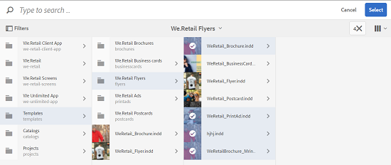
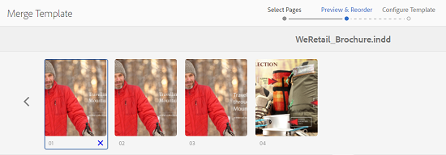

# 資產範本 {#asset-templates}

>[!CAUTION]
>
>AEM 6.4已結束延伸支援，本檔案不再更新。 如需詳細資訊，請參閱 [技術支援期](https://helpx.adobe.com//tw/support/programs/eol-matrix.html). 尋找支援的版本 [此處](https://experienceleague.adobe.com/docs/).

資產範本是特殊的資產類別，可協助您快速重新調整視覺化豐富內容的用途，以用於數位和列印媒體。 資產範本包含兩個部分：固定訊息區段和可編輯區段。

固定報文傳送部分可包含專有內容，如品牌徽標和禁用編輯的版權資訊。 可編輯的區段可包含欄位中的視覺和文字內容，可編輯這些欄位以自訂訊息。

在保護全局簽名的同時進行有限的編輯的靈活性使得資產模板成為快速調整內容和分發內容的理想構建塊，從而成為各種功能的內容偽影。 重新調整內容用途有助於降低管理列印和數位頻道的成本，並在這些頻道間提供全方位且一致的體驗。

身為行銷人員，您可以在 [!DNL Experience Manager] 資產和使用單一基礎範本，輕鬆建立多個個人化的列印體驗。 您可以建立各種類型的行銷宣傳資料，包括小冊子、傳單、明信片、名片等，以便向客戶清晰地傳達您的行銷訊息。 您也可以從現有或新的打印輸出組合多頁打印輸出。 最重要的是，您可以輕鬆同時提供數位和列印體驗，為使用者提供一致且整合的體驗。

雖然資產範本大多是InDesign檔案，但熟練掌握InDesign並不妨礙製作精美的成品。 建立目錄時，您不需要將InDesign範本的欄位與產品欄位對應。 您可以直接在Web介面上以WYSIWYG模式編輯模板。 不過，若要讓InDesign處理您的編輯變更，您必須先設定 [!DNL Experience Manager] 與InDesign伺服器整合的資產。

能夠從網頁介面編輯InDesign範本，有助於促進創意與行銷人員之間更緊密的合作，同時縮短當地促銷活動的上市時間。

您可以對資產範本執行下列動作：

* 從Web介面修改可編輯的模板欄位
* 控制文本的基本樣式，例如字型大小、樣式和標籤級別的類型
* 使用內容選擇器變更範本內的影像
* 預覽範本編輯
* 合併多個模板檔案以建立多頁對象

當您為抵押品選擇模板時， [!DNL Assets] 建立可編輯的範本復本。 原始範本會保留，以確保您的全域標牌保持不變，且可重複使用以強製品牌一致性。

您可以以下列格式匯出父資料夾內更新的檔案：

* INDD
* PDF
* JPG

您也可以將這些格式的輸出下載到您的本機系統。

## 建立宣傳資料 {#creating-a-collateral}

假設您想要製作可打印的數位宣傳資料，例如手冊、傳單和廣告，以供即將推出的活動之用，並與全球特賣店分享。 根據範本建立宣傳資料有助於跨管道提供統一的客戶體驗。 設計人員可以使用創意解決方案(例如InDesign)建立促銷活動範本（單頁或多頁），並將範本上傳至 [!DNL Assets] 為了你。 在建立宣傳資料之前，請先將一個或多個INDD模板上載到Experience Manager，並提前提供。

1. 按一下 [!DNL Experience Manager] 徽標，然後按一下 **[!UICONTROL 資產]** （導覽頁面）。
1. 從選項中，選擇 **[!UICONTROL 範本]**.

   

1. 按一下/點選 **[!UICONTROL 建立]**，然後從菜單中選擇要建立的抵押品。 例如，選擇 **[!UICONTROL 手冊]**.

   

1. 先將一或多個INDD範本上傳至Experience Manager，並提供使用。 選擇手冊的範本，然後按一下/點選 **[!UICONTROL 下一個]**.

   

1. 指定手冊的名稱和可選說明。

   

1. （選用）按一下/點選 **[!UICONTROL 標籤]** 表徵圖 **[!UICONTROL 標籤]** 欄位，並為手冊選擇一個或多個標籤。 按一下/點選 **[!UICONTROL 確認]** 以確認您的選取。

   

1. 按一下&#x200B;**[!UICONTROL 建立]**。對話方塊會確認已建立新手冊。 按一下/點選 **[!UICONTROL 開啟]** 以編輯模式開啟手冊。

   

   或者，關閉對話框，導航到您開始的「模板」頁中的資料夾，以查看您建立的手冊。 宣傳品的類型會顯示在其縮圖上的卡片視圖中。 例如，在此情況下，手冊會顯示在縮圖上。

   

## 編輯宣傳資料 {#editing-a-collateral}

建立宣傳資料後，您可以立即編輯它。 或者，您也可以從「範本」頁面或資產頁面開啟它。

1. 要開啟宣傳資料進行編輯，請執行以下操作之一：

   * 開啟您在 [建立抵押品](asset-templates.md#creating-a-collateral).
   * 從「模板」頁，導航到建立宣傳品的資料夾，然後按一下/點選宣傳品縮圖上的「編輯快速操作」。
   * 在宣傳品的資產頁面中，按一下/點選工具列中的「編輯」圖示。
   * 選擇宣傳品，然後按一下/點選工具列中的「編輯」表徵圖。

   

   資產尋找器和文字編輯器會顯示在頁面左側。 文字編輯器預設為開啟。

   您可以使用文字編輯器來修改要顯示在文字欄位中的文字。 您可以在標籤層級修改字型大小、樣式、顏色和類型。

   使用資產尋找器，您可以在中瀏覽或搜尋影像 [!DNL Assets] 並將範本中可編輯的影像取代為您所選擇的影像。

   

   可編輯的項目會顯示在右側。 讓欄位可在 [!DNL Assets]，範本中的對應欄位必須以InDesign標籤。 換言之，它們應在InDesign中設為可編輯。

   

   >[!NOTE]
   >
   >確保 [!DNL Experience Manager] 實例與InDesign伺服器整合以啟用 [!DNL Assets] 從InDesign範本擷取資料，並供編輯之用。 如需詳細資訊，請參閱 [整合 [!DNL Assets] 與InDesign Server](indesign.md).

1. 若要修改可編輯欄位中的文字，請按一下/點選可編輯欄位清單中的文字欄位，然後編輯欄位中的文字。

   

   可以使用提供的選項編輯文本屬性，例如字型樣式、顏色、大小。

1. 按一下/點選 **[!UICONTROL 預覽]** 圖示來預覽文字變更。

   

1. 若要交換影像，請按一下/點選 **[!UICONTROL 資產尋找器]** 表徵圖。

   

1. 從可編輯欄位清單中選取影像欄位，然後從資產選擇器拖曳所需影像至可編輯欄位。

   

   您也可以使用關鍵字、標籤，並根據其發佈狀態來搜尋影像。 您可以瀏覽 [!DNL Assets] 儲存庫，並導覽至所需影像的位置。

   

1. 按一下/點選 **[!UICONTROL 預覽]** 圖示來預覽影像。

   

1. 要編輯多頁宣傳資料中的特定頁，請使用底部的頁導航器。

   

1. 按一下/點選 **[!UICONTROL 預覽]** 圖示來預覽所有變更。 按一下/點選 **[!UICONTROL 完成]** 以保存對宣傳資料的編輯更改。

   >[!NOTE]
   >
   >只有當宣傳品中可編輯的影像欄位沒有缺少任何表徵圖時，才會啟用「預覽」和「完成」表徵圖。 如果您的宣傳資料中缺少表徵圖，那是因為 [!DNL Experience Manager] 無法解析InDesign模板中的影像。 通常， [!DNL Experience Manager] 在下列情況下無法解析影像：
   >
   >* 映像未嵌入到基礎InDesign模板中
   >* 從本地檔案系統連結影像

   >
   >啟用 [!DNL Experience Manager] 要解析影像，請執行以下操作：
   >
   >* 建立InDesign範本時內嵌影像(請參閱 [關於連結和嵌入式圖形](https://helpx.adobe.com/indesign/using/graphics-links.html))。
   >* 裝載 [!DNL Experience Manager] 將丟失的表徵圖映射到本地檔案系統，並將現有的 [!DNL Experience Manager] 資產。

   >
   >如需使用InDesign檔案的詳細資訊，請參閱 [使用InDesign檔案的最佳實務，位於 [!DNL Experience Manager]](https://helpx.adobe.com/experience-manager/kb/best-practices-idd-docs-aem.html).

1. 若要為手冊產生PDF轉譯，請在對話方塊中選取「Acrobat」選項，然後按一下 **[!UICONTROL 繼續]**.
1. 宣傳資料建立在您開始使用的資料夾中。 要查看格式副本，請開啟宣傳資料並選擇 **[!UICONTROL 轉譯]** 從GlobalNav清單中。

   

1. 從轉譯清單按一下/點選PDF轉譯，以下載PDF檔案。 開啟PDF檔案以審核宣傳資料。

   

## 合併抵押品 {#merge-collateral}

1. 按一下或點選 **[!UICONTROL 工具>資產]**.
1. 從選項中，選擇 **[!UICONTROL 範本]**.
1. 按一下/點選 **[!UICONTROL 建立]** 和選擇 **[!UICONTROL 合併]** 的上界。

   

1. 在「範本合併」頁面中，按一下/點選「合併」圖示。

   

1. 導航到要合併的宣傳品的位置，按一下/點選要合併的宣傳品的縮圖以選擇它們。

   

   您甚至可以從OmniSearch方塊搜尋範本。

   

   您可以瀏覽 [!DNL Assets] 儲存庫或集合，並導覽至所需範本的位置，然後選取它們以合併。

   

   您可以套用各種篩選器以搜尋所需的範本。 例如，您可以根據檔案類型或標籤來搜尋範本。

   

1. 按一下/點選 **[!UICONTROL 下一個]** 的上界。
1. 在 **[!UICONTROL 預覽和重新排序]** 螢幕中，視需要重新排列模板，並預覽要合併的模板選擇。 然後，按一下/點選 **[!UICONTROL 下一個]** 的上界。

   

1. 在「配置模板」螢幕中，指定宣傳品的名稱。 （可選）指定您認為適當的任何標籤。 如果要以PDF格式導出輸出，請選擇 **[!UICONTROL Acrobat(.PDF)]** 選項。 預設情況下，抵押品將以JPG和InDesign格式導出。 要更改多頁宣傳資料的顯示縮圖，請按一下/點選 **[!UICONTROL 變更縮圖]**.

   

1. 按一下/點選 **[!UICONTROL 儲存]** 然後按一下/點選 **[!UICONTROL 確定]** ，以關閉對話方塊。 多頁宣傳資料建立在您開始使用的資料夾中。

   >[!NOTE]
   >
   >您以後不能編輯合併的宣傳資料，也不能使用它建立其他宣傳資料。
