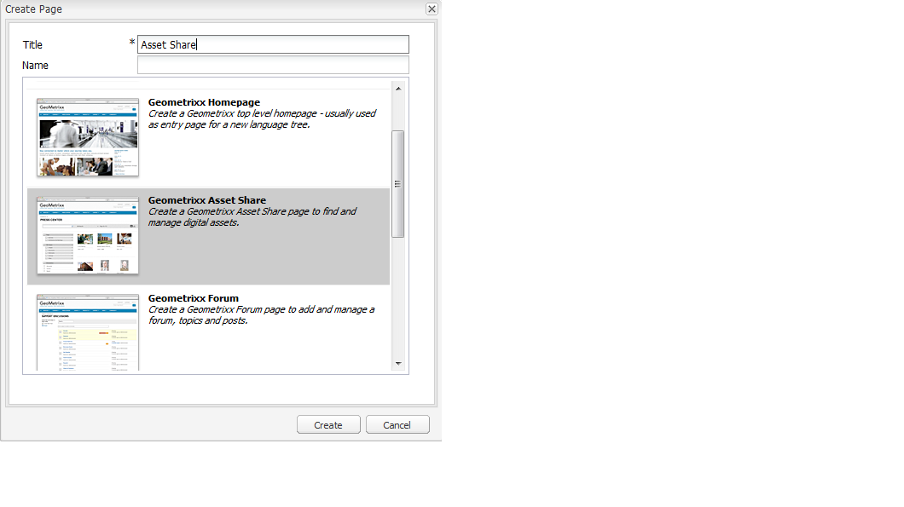
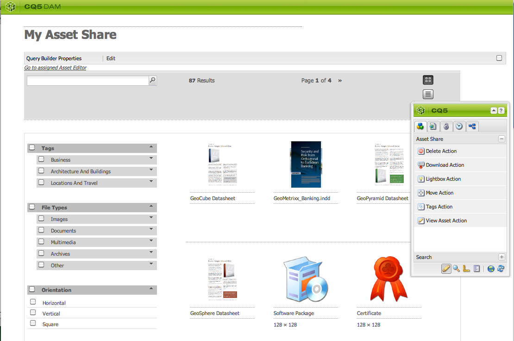

# 建立及設定資產編輯器頁面 {#creating-and-configuring-asset-editor-pages}

本檔案說明下列項目：

* 建立自訂資產編輯器頁面的原因。
* 如何建立和自訂資產編輯器頁面（WCM頁面），可讓您檢視和編輯中繼資料，以及對資產執行動作。
* 如何同時編輯多個資產。

>[!NOTE]
>
>「資產共用」可作為開放原始碼參考實作。 請參閱[資產共用公域](https://adobe-marketing-cloud.github.io/asset-share-commons/) 。 未正式支援。

## 為何建立和設定資產編輯器頁面？ {#why-create-and-configure-asset-editor-pages}

數位資產管理正在越來越多的案例中使用。 當專業用戶從小規模解決方案（例如攝影師或分類學家）向更大、更多樣化的用戶組（例如業務用戶、WCM作者、記者等）轉變時，專業用戶的[!DNL Adobe Experience Manager Assets]強大的用戶介面可能提供太多資訊，而利益相關方開始請求特定的用戶介面或應用程式訪問與他們相關的數字資產。

這些以資產為中心的應用程式可以是內部網路中的簡單照片集，員工可以從貿易展訪問上傳照片，或在公開網站(如隨Geometrixx提供的示例)上傳新聞中心。 以資產為中心的應用程式也可以擴展到完整的解決方案，包括購物車、結帳和驗證流程。

建立以資產為中心的應用程式在很大程度上成為一種配置過程，它不需要編碼，只需了解用戶組及其需要，以及所使用元資料的知識。 以[!DNL Assets]建立的以資產為中心的應用程式可擴展：只要編碼工作量適中，便可建立可重複使用的元件，以便搜尋、檢視和修改資產。

[!DNL Experience Manager]中以資產為中心的應用程式包含資產編輯器頁面，該頁面可用於獲取特定資產的詳細視圖。 如果存取資產的使用者具有必要權限，資產編輯器頁面也允許編輯中繼資料。

## 建立及設定資產共用頁面 {#creating-and-configuring-an-asset-share-page}

您可以自訂DAM Finder功能，並建立具備您所需所有功能的頁面（稱為「資產共用」頁面）。 若要建立新的「資產共用」頁面，您可以使用「Geometrixx資產共用」範本新增頁面，然後自訂使用者可在該頁面上執行的動作、決定檢視者如何檢視資產，以及決定使用者如何建立查詢。

以下是建立自訂「資產共用」頁面的一些使用案例：

* 記者新聞中心
* 適用於內部業務使用者的影像搜尋引擎
* 網站使用者的影像資料庫
* 中繼資料編輯器的媒體標籤介面

### 建立資產共用頁面 {#creating-an-asset-share-page}

若要建立新的「資產共用」頁面，您可以在使用網站時或從數位資產管理員建立頁面。

>[!NOTE]
>
>依預設，當您從數位資產管理員的&#x200B;**New**&#x200B;建立「資產共用」頁面時，系統會自動為您建立資產檢視器和資產編輯器。

若要在&#x200B;**Websites**&#x200B;主控台中建立新的「資產共用」頁面：

1. 在&#x200B;**[!UICONTROL 網站]**&#x200B;標籤中，導覽至您要建立資產共用頁面的位置，然後按一下&#x200B;**[!UICONTROL 新增]**。

1. 選擇&#x200B;**[!UICONTROL 資產共用]**&#x200B;頁面，然後按一下&#x200B;**[!UICONTROL 建立]**。 新頁面隨即建立，資產共用頁面會列在&#x200B;**[!UICONTROL Websites]**&#x200B;標籤中。

使用「DAM資產共用」範本建立的基本Geometrixx外觀如下：

若要自訂「資產共用」頁面，請使用sidekick中的元素，並編輯查詢產生器屬性。 頁面&#x200B;**[!UICONTROL Geometrixx按下中心]**&#x200B;是根據此範本的頁面自訂版本：

若要透過數位資產管理員建立新資產共用頁面：

1. 在數位資產管理器的&#x200B;**[!UICONTROL New]**&#x200B;中，選取&#x200B;**[!UICONTROL New Asset Share]**。
1. 在&#x200B;**[!UICONTROL Title]**&#x200B;中，輸入資產共用頁面的名稱。 如果需要，請輸入URL的名稱。

   

1. 連按兩下資產共用頁面以開啟該頁面並設定頁面。

   

   依預設，當您從&#x200B;**[!UICONTROL New]**&#x200B;建立「資產共用」頁面時，系統會自動為您建立資產檢視器和資產編輯器。

#### 自訂動作 {#customizing-actions}

您可以從一系列預先定義的動作中，決定使用者可以對選取的數位資產執行哪些動作。

若要新增動作至「資產共用」頁面：

1. 在您要自訂的「資產共用」頁面中，按一下sidekick中的&#x200B;**[!UICONTROL Actions]**。

   可使用下列動作：
   

| 動作 | 說明 |
|---|---|
| [!UICONTROL 刪除動作] | 使用者可以刪除選取的資產。 |
| [!UICONTROL 下載動作] | 讓使用者將選取的資產下載至其電腦。 |
| [!UICONTROL Lightbox 動作] | 將資產儲存至「燈箱」   可在其中執行其他動作。 這在工作時很方便   跨多個頁面使用資產。 燈箱也可作為   資產購物車。 |
| [!UICONTROL 移動動作] | 使用者可將資產移至其他   位置 |
| [!UICONTROL 標記動作] | 讓使用者新增標籤至選取的資產 |
| [!UICONTROL 檢視資產動作] | 在資產編輯器中開啟資產，用於   使用者操作。 |

1. 將適當的動作拖曳至頁面上的&#x200B;**Actions**&#x200B;區域。 這樣會建立用於執行該動作的按鈕。

   

#### 確定如何顯示搜索結果 {#determining-how-search-results-are-presented}

從預定義的鏡頭清單中確定結果的顯示方式。

要更改搜索結果的查看方式：

1. 在您要自訂的「資產共用」頁面中，按一下「**[!UICONTROL 搜尋]**」。

   

1. 將適當的鏡頭拖曳至頁面的頂端中央。 在Press Center中，已可使用鏡片。 使用者按下適當的鏡頭圖示，以視需要顯示搜尋結果。

可使用下列鏡頭：

| 鏡頭 | 說明 |
|---|---|
| **[!UICONTROL 列出鏡頭]** | 以清單方式顯示資產並提供詳細資訊。 |
| **[!UICONTROL 馬賽克鏡頭]** | 以馬賽克方式展示資產。 |

#### 馬賽克鏡頭 {#mosaic-lens}

#### 列出鏡頭 {#list-lens}

#### 自訂查詢產生器 {#customizing-the-query-builder}

查詢產生器可讓您輸入搜尋詞，並建立「資產共用」頁面的內容。 編輯查詢產生器時，您也可以決定每頁顯示多少搜尋結果，以及當您連按兩下資產時開啟的資產編輯器、查詢搜尋的路徑，以及自訂索引鍵類型。

若要自訂查詢產生器：

1. 在您要自訂的「資產共用」頁面中，按一下「查詢產生器」中的「**[!UICONTROL 編輯]**」 。 預設情況下，將開啟&#x200B;**[!UICONTROL General]**&#x200B;頁簽。

1. 選取每頁結果數、資產編輯器路徑（如果您有自訂的資產編輯器）和「動作」標題。

   

1. 按一下&#x200B;**[!UICONTROL 路徑]**&#x200B;標籤。 輸入搜索將運行的路徑或多個路徑。 如果使用者使用路徑述詞，則會覆寫這些路徑。

   

1. 如果需要，請輸入其他節點類型。

1. 在&#x200B;**[!UICONTROL 查詢產生器URL]**&#x200B;欄位中，您可以覆寫或包住查詢產生器，並使用現有的查詢產生器元件輸入新的servlet URL。 在&#x200B;**[!UICONTROL 摘要URL]**&#x200B;欄位中，您也可以覆寫摘要URL。

   

1. 在&#x200B;**[!UICONTROL Text]**&#x200B;欄位中，輸入要顯示結果的文本和結果的頁碼。 完成更改後，按一下&#x200B;**[!UICONTROL OK]**。

   

#### 新增謂語 {#adding-predicates}

[!DNL Experience Manager Assets] 包括可新增至「資產共用」頁面的數個謂語。這可讓您的使用者進一步縮小搜尋範圍。 在某些情況下，這些變數可能會覆寫查詢產生器參數（例如，路徑參數）。

要添加謂語：

1. 在您要自訂的「資產共用」頁面中，按一下「**[!UICONTROL 搜尋]**」。

   

1. 將適當的述詞拖曳至查詢產生器下方的「資產共用」頁面。 這樣會建立適當的欄位。

   

   下列謂語可用：

| 述詞 | 說明 |
|---|---|
| **[!UICONTROL 日期述詞]** | 可讓使用者搜尋在特定日期之前和之後修改的資產。 |
| **[!UICONTROL 選項述詞]** | 網站擁有者可以指定要搜尋的屬性（如屬性述詞中的cq:tags），以及要從中填入選項的內容樹（如標籤樹）。 這樣會產生選項清單，使用者可在其中選取所選屬性（標籤屬性）應具有的值（標籤）。 此述詞可讓您建立清單控制項，例如標籤清單、檔案類型、影像方向等。 這非常適合用於一組固定選項。 |
| **[!UICONTROL 路徑述詞]** | 讓使用者視需要定義路徑和子資料夾。 |
| **[!UICONTROL 屬性述詞]** | 網站擁有者會指定要搜尋的屬性（例如tiff:ImageLength），然後使用者就可以輸入值（例如800）。這會傳回高800像素的所有影像。 如果您的屬性可以具有任意值，則此謂語非常實用。 |

如需詳細資訊，請參閱[謂語javadocs](https://helpx.adobe.com/experience-manager/6-4/sites/developing/using/reference-materials/javadoc/com/day/cq/search/eval/package-summary.html)。

1. 若要進一步設定述詞，請連按兩下。 例如，當您開啟「路徑述詞」時，需要指派根路徑。

   

## 建立和設定資產編輯器頁面 {#creating-and-configuring-an-asset-editor-page}

您可以自訂資產編輯器，以決定使用者如何檢視及編輯數位資產。 若要這麼做，您需建立新的資產編輯器頁面，然後自訂使用者可在該頁面上執行的檢視和動作。

>[!NOTE]
>
>如果您想要將自訂欄位新增至DAM資產編輯器，請將新的cq:Widget節點新增至`/apps/dam/content/asseteditors.`

### 建立資產編輯器頁面 {#creating-the-asset-editor-page}

建立「資產編輯器」頁面時，最佳作法是在「資產共用」頁面正下方建立頁面。

若要建立資產編輯器頁面：

1. 在&#x200B;**[!UICONTROL 網站]**&#x200B;標籤中，導覽至您要建立資產編輯器頁面的位置，然後按一下&#x200B;**[!UICONTROL 新增]**。

1. 選擇「**[!UICONTROL Geometrixx資產編輯器]**」，然後按一下「**[!UICONTROL 建立]**」。 新頁面隨即建立，且頁面會列在&#x200B;**[!UICONTROL Websites]**&#x200B;標籤中。

使用Geometrixx資產編輯器範本建立的基本頁面外觀如下：

若要自訂資產編輯器頁面，請使用sidekick中的元素。 從&#x200B;**[!UICONTROL Geometrixx按下中心]**&#x200B;存取的資產編輯器頁面是根據此範本的頁面自訂版本：

#### 設定從「資產共用」頁面開啟的資產編輯器 {#setting-which-asset-editor-opens-from-an-asset-share-page}

建立自訂的「資產編輯器」頁面後，您必須確定當您連按兩下自訂「資產共用」所建立的資產時，會在自訂的「編輯器」頁面中開啟資產。

若要設定「資產編輯器」頁面：

1. 在「資產共用」頁面中，按一下「查詢產生器」旁的「編輯」**** 。

   

1. 如果尚未選擇&#x200B;**[!UICONTROL 常規]**&#x200B;頁簽，請按一下該頁簽。

1. 在&#x200B;**[!UICONTROL 資產編輯器路徑]**&#x200B;欄位中，輸入您希望「資產共用」頁面在中開啟資產的資產編輯器路徑，然後按一下&#x200B;**[!UICONTROL 確定]**。

   

#### 新增資產編輯器元件 {#adding-asset-editor-components}

您可以將元件新增至頁面，借此決定資產編輯器的功能。

若要新增資產編輯器元件：

1. 在您要自訂的「資產編輯器」頁面中，選取sidekick中的&#x200B;**[!UICONTROL 資產編輯器]**。 隨即顯示所有可用的資產編輯器元件。

   >[!NOTE]
   >
   >您可以自訂的項目取決於可用的元件。 要啟用元件，請轉至「設計」模式並選擇需要啟用的元件。

1. 將元件從sidekick拖曳至資產編輯器，並在元件對話方塊中進行任何修改。 這些元件在下表中進行了描述，並在後面的詳細說明中進行了描述。

   >[!NOTE]
   >
   >設計資產編輯器頁面時，您會建立唯讀或可編輯的元件。 使用者知道，如果鉛筆的影像出現在該元件中，便可編輯欄位。 依預設，大部分元件都設為唯讀。

   | 元件 | 說明 |
   |---|---|
   | **[!UICONTROL 中繼資] 料表單 [!UICONTROL 和中繼資料文字欄位]** | 可讓您新增其他中繼資料至資產，並對該資產執行動作（例如提交）。 |
   | **[!UICONTROL 子資產]** | 可讓您自訂子資產。 |
   | **標記** | 讓使用者選取標籤並新增至資產。 |
   | **[!UICONTROL 縮圖]** | 顯示資產的縮圖、其檔案名稱，並讓您新增替代文字。 您也可以在此處新增資產編輯器動作。 |
   | **[!UICONTROL 標題]** | 顯示可自訂的資產標題。 |

   

#### 中繼資料表單和文字欄位 — 設定檢視中繼資料元件 {#metadata-form-and-text-field-configuring-the-view-metadata-component}

「中繼資料表單」是包含開始和結束動作的表單。 在中間輸入&#x200B;**[!UICONTROL Text]**&#x200B;欄位。 如需使用表單的詳細資訊，請參閱[Forms](../sites-authoring/default-components.md)。

1. 按一下表單「開始」區域中的「**[!UICONTROL 編輯]**」，建立啟動操作。 您可以視需要輸入方塊標題。 依預設，Box標題為&#x200B;**[!UICONTROL Metadata]**。 如果要生成用於驗證的java-script客戶端代碼，請選中「客戶端驗證」複選框。

   

1. 按一下表單「結束」區域中的&#x200B;**[!UICONTROL Edit]**&#x200B;建立「結束」操作。 例如，您可能想要建立&#x200B;**[!UICONTROL Submit]**&#x200B;按鈕，讓使用者提交其中繼資料變更。 您可以選擇新增&#x200B;**[!UICONTROL 重設]**&#x200B;按鈕，將中繼資料重設為其原始狀態。

   

1. 在&#x200B;**[!UICONTROL 表單開始]**&#x200B;和&#x200B;**表單結束**&#x200B;之間，將元資料文本欄位拖動到表單。 使用者將中繼資料填入這些文字欄位中，以便提交或完成其他動作。

1. 按兩下欄位名稱，例如&#x200B;**Title**&#x200B;以開啟中繼資料欄位並進行變更。 在[!UICONTROL 編輯元件]窗口的&#x200B;**[!UICONTROL 常規]**&#x200B;頁簽中，定義命名空間和欄位標籤以及類型，例如`dc:title`。

   

   如需修改中繼資料表單中可用命名空間的相關資訊，請參閱[自訂和擴充 [!DNL Assets]](extending-assets.md)。

1. 按一下&#x200B;**[!UICONTROL Constraints]**&#x200B;標籤。 您可以在此選取欄位是否為必要欄位，並視需要新增任何限制。

   

1. 按一下&#x200B;**[!UICONTROL Display]**&#x200B;標籤。 您可以在此為中繼資料欄位輸入新的列寬和數目。 選取「**欄位為唯讀**」核取方塊，讓使用者可編輯中繼資料。

   

   以下是包含各種欄位的中繼資料表單的範例：

   

然後，在「資產編輯器」頁面上，使用者可以在中繼資料欄位中輸入值（如果可編輯），並執行結束動作（例如提交變更）。

#### 子資產 {#sub-assets}

您可以在「子資產」元件檢視並選取子資產。 您可以決定在[主要資產](assets.md#what-are-digital-assets)和子資產底下顯示的名稱。

連按兩下「子資產」元件以開啟子資產對話方塊，您可以在其中變更主要資產和任何子資產的標題。 預設值會顯示在對應欄位下方。

以下是填入的子資產元件的範例：

例如，如果您選取子資產，請注意元件如何顯示適當頁面，且Box標題會從「子資產」變更為「同層級」。

#### 標記 {#tags}

「標籤」元件是供使用者指派現有標籤至資產的元件，有助於日後進行組織與擷取。 您可將此元件設為唯讀，因此使用者無法新增標籤，而只能檢視標籤。

連按兩下「標籤」元件以開啟「標籤」對話方塊，您可以視需要從「標籤」變更標題，也可以在其中選取已分配的命名空間。 要使此欄位可編輯，請清除&#x200B;**Hide Edit**&#x200B;按鈕複選框。 依預設，標籤是可編輯的。

如果使用者可以編輯標籤，則可從「標籤」下拉式選單中選取標籤，以按一下鉛筆來新增標籤。

以下是填入的「標籤」元件：

#### 縮圖 {#thumbnail}

縮圖元件是資產顯示所選縮圖的位置（對於許多格式，會自動擷取縮圖）。 此外，元件還顯示檔案名和可修改](assets-finder-editor.md#adding-asset-editor-actions)的[操作。

按兩下縮圖元件以開啟縮圖對話方塊，您可在其中變更alt文字。 依預設，縮圖alt文字預設為&#x200B;**[!UICONTROL 按一下以下載]**&#x200B;資產。

以下是填入的縮圖元件的範例：

#### 標題 {#title}

標題元件會顯示資產的標題和說明。

依預設，此選件為唯讀模式，因此使用者無法編輯。 若要使其可編輯，請連按兩下元件並清除&#x200B;**Hide edit button**&#x200B;核取方塊。 此外，請輸入多個資產的標題。

如果可以編輯「標題」，您可以按一下「鉛筆」開啟&#x200B;**「資產屬性」**&#x200B;視窗，以新增標題和說明。 此外，您可以選取日期和時間，以開啟或關閉資產。

當使用者按一下「鉛筆」圖示來編輯「標題」時，可以變更&#x200B;**Title**、**Description**，並輸入&#x200B;**On**&#x200B;和&#x200B;**Off Times**&#x200B;以開啟和關閉資產。

以下是填入的標題元件的範例：

#### 新增資產編輯器動作 {#adding-asset-editor-actions}

您可以從一系列預先定義的動作中，決定使用者可以對選取的數位資產執行哪些動作。

若要將動作新增至資產編輯器頁面：

1. 在您要自訂的「資產編輯器」頁面中，按一下sidekick中的&#x200B;**[!UICONTROL 資產編輯器]**。 

   

   可使用下列動作：

   | 動作 | 說明 |
   |---|---|
   | [!UICONTROL 下載] | 讓使用者下載選取的項目   資產。 |
   | [!UICONTROL 編輯] | 讓使用者編輯影像   （互動式編輯） |
   | [!UICONTROL Lightbox] | 將資產儲存至   「燈箱」，您可在此執行其他動作。 這個來了   在多個頁面上使用資產時非常實用。 |
   | [!UICONTROL 鎖定] | 讓使用者鎖定資產。 此   功能預設未啟用，且需在清單中啟用   元件。 |
   | [!UICONTROL 引用] | 按一下此按鈕可顯示哪些頁面   資產正在使用中。 |
   | [!UICONTROL 版本設定] | 可讓您建立和還原   資產的版本。 |

1. 將適當的動作拖曳至頁面上的&#x200B;**Actions**&#x200B;區域。 這樣會建立用於執行該動作的按鈕。

## 使用資產編輯器頁面編輯多個資產 {#multi-editing-assets-with-the-asset-editor-page}

透過[!DNL Assets]，您可以一次變更數個資產。 選取資產後，您可以同時變更其：

* 標記
* 中繼資料

若要使用資產編輯器頁面多次編輯資產：

1. 在`http://localhost:4502/content/geometrixx/en/company/press.html`開啟Geometrixx **[!UICONTROL 按中心]**&#x200B;頁面。
1. 選取資產：

   * 在Windows上：`Ctrl + click`每個資產。
   * 在Mac上：`Cmd + click`每個資產。

   若要選取資產範圍：按一下第一個資產，然後按一下最後一個資產的`Shift + click`。

1. 在&#x200B;**Actions**&#x200B;欄位（頁面左側）中，按一下「**[!UICONTROL 編輯中繼資料]**」。

1. Geometrixx **[!UICONTROL 按中心資產編輯器]**&#x200B;頁面會在新索引標籤中開啟。 資產的中繼資料顯示如下：

   * 標籤不會套用至所有資產，但只會套用至少數資產，而會以斜體顯示。
   * 套用至所有資產的標籤會以一般字型顯示。
   * 標籤以外的中繼資料：只有在所有選取的資產皆相同時，才會顯示欄位的值。

1. 按一下「**[!UICONTROL 下載]**」以下載包含資產原始轉譯的ZIP檔案。
1. 按一下&#x200B;**[!UICONTROL 標籤]**&#x200B;欄位旁的鉛筆圖示以編輯標籤：

   * 不會套用至所有資產，但只會套用至少數資產的標籤，其背景會是灰色。
   * 套用至所有資產的標籤會有白色背景。

   您可以：

   * 按一下`x`圖示以移除所有資產的標籤。
   * 按一下`+`圖示，將標籤新增至所有資產。
   * 按一下`arrow`並選取標籤，以新增標籤至所有資產。

   按一下&#x200B;**[!UICONTROL OK]**&#x200B;將更改寫入表單。 系統會自動勾選&#x200B;**Tags**&#x200B;欄位旁的方塊。

1. 編輯說明欄位。 例如，將其設為：`This is a common description`。 編輯欄位時，其值會在提交表單時覆寫所選資產的現有值。 編輯欄位時，會自動核取欄位旁的方塊。

   `This is a common description`

   編輯欄位時，其值會在提交表單時覆寫所選資產的現有值。

   注意：編輯欄位時，會自動核取欄位旁的方塊。

1. 按一下「**[!UICONTROL 更新中繼資料]**」以提交表單並儲存所有資產的變更。 僅修改已檢查的元資料。
