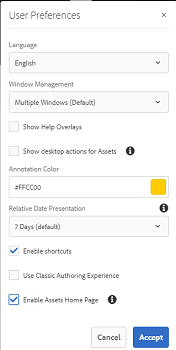

# [!DNL Adobe Experience Manager Assets] 首頁體驗 {#aem-assets-home-page-experience}

個性化 [!DNL Experience Manager Assets] 歡迎使用的豐富螢幕體驗首頁，包括有關資產最近活動的快照。

的 [!DNL Adobe Experience Manager Assets] 首頁提供了豐富且個性化的歡迎螢幕體驗，其中包括最近活動的快照，如最近查看或上載的資產。

預設情況下禁用「資產」首頁。 要啟用它，請執行以下步驟：

1. 訪問 [!DNL Experience Manager] Configuration Manager，按一下 **[!UICONTROL 「工具」>「操作」>「Web控制台」]**。
1. 開啟 **第CQ天大壩事件記錄器** 服務。
1. 選擇 **[!UICONTROL 啟用此服務]** 啟用活動錄制。

   

1. 從 **事件類型** 清單中，選擇要記錄的事件並保存更改。

   >[!CAUTION]
   >
   >啟用「已查看資產」、「已查看項目」和「已查看收集」選項，可顯著增加記錄的事件數。

1. 開啟 **[!UICONTROL DAM資產首頁功能標誌]** 從Configuration Manager提供服務 `https://[AEM_server]:[port]/system/console/configMgr`。
1. 選擇 **[!UICONTROL isEnabled.name]** 選項啟用「資產」首頁功能。 儲存變更。

   

1. 開啟 **[!UICONTROL 用戶首選項]** 對話框，然後選擇 **[!UICONTROL 啟用資產首頁]**。 儲存變更。

   

啟用「資產」首頁後，從「導航」頁導航到「資產」用戶介面。

點擊/按一下 **[!UICONTROL 按一下這裡配置您的體驗連結]** 添加用戶名、背景影像和配置檔案影像。

「資產」首頁包括以下部分：

* 歡迎節
* 小部件部分

**歡迎節**

如果您的配置檔案存在，則「歡迎」部分將顯示一條歡迎消息。 此外，它還顯示您的配置檔案圖片和歡迎影像（如果已配置）。

如果您的配置檔案不完整，則「歡迎」部分將顯示一般歡迎消息和配置檔案圖片的佔位符。

**小部件部分**

此部分顯示在「歡迎」部分下方，並在以下部分下顯示現成小部件：

* 活動
* 最近
* 探索

**活動**:在本節中， **我的活動** 構件顯示登錄用戶使用資產（包括不帶格式副本的資產）執行的最新活動，例如資產上載、下載、資產建立、編輯、注釋、注釋和共用。

**最近**:的 **最近查看** 此部分下的小部件顯示登錄用戶最近訪問的實體，包括資料夾、集合和項目。

**發現**:的 **新建** 此部分下的小部件顯示最近上載到 [!DNL Assets] 實例。

要啟用清除用戶活動資料，請啟用 **DAM事件清除服務** 從Configuration Manager中。 啟用此服務後，系統將刪除已登錄用戶超過指定數目的活動。

「歡迎」螢幕提供了簡單的導航幫助，例如工具欄上的表徵圖可訪問資料夾、收藏和目錄。

>[!NOTE]
>
>啟用「第一天CQ DAM事件記錄器」和「DAM事件清除」服務會增加對JCR的寫操作和搜索索引，這會顯著增加JCR的負載 [!DNL Experience Manager] 伺服器。 上的附加負載 [!DNL Experience Manager] 伺服器會影響其效能。

>[!CAUTION]
>
>捕獲、篩選和清除資產首頁所需的用戶活動會對效能造成開銷。 因此，管理員應為目標用戶有效配置首頁。
>
>Adobe建議執行批量操作的管理員和用戶避免使用資產首頁功能來防止用戶活動增加。 此外，管理員可以通過配置來排除特定用戶的錄制活動 **第CQ天大壩事件記錄器** 從Configuration Manager中。
>
>如果使用該功能，Adobe建議根據伺服器負載計劃清除頻率。
