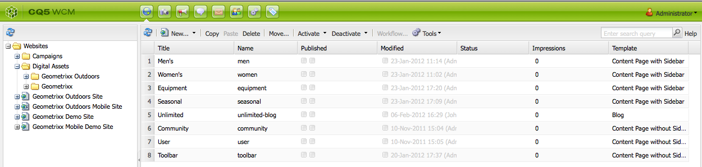

# 關於AEM Assets {#about-assets}

資產是數位資產管理(DAM)工具，已與AEM平台完全整合，讓您的企業能夠共用和分發數位資產。 整個組織的使用者都可管理、儲存和存取影像、視訊、檔案、音訊片段和多媒體，例如Flash檔案，以便在網路、印刷和數位散發中使用。

## 什麼是數位資產管理(DAM)?{#what-is-digital-asset-management}

資產可讓企業分享和分發組織的關鍵數位資產。 組織內的使用者可以透過Web介面（或CIFS或WebDAV資料夾）儲存、管理和存取數位資產，例如影像、圖形、音訊、視訊和檔案。

AEM Assets已完全整合至AEM，可讓您執行下列動作：

* 新增及共用各種檔案格式的影像、文件、音訊檔案與視訊檔案。
* 依標籤、燈箱或星號（您的最愛）將資產分組，以管理資產。 為資產加上註解。
* 搜尋檔案名稱、文件全文，以及搜尋日期、文件類型和標記，來尋找資產。
* 新增或編輯資產的中繼資料資訊。中繼資料會自動與對應的資產一起更新版本。 您可以匯入或匯出資產中繼資料。
* 執行影像編輯功能，例如縮放和新增影像濾鏡。 使用WebDAV或CIFS資料夾同時匯入和匯出多個數位資產。
* 使用工作流程和通知，允許共同處理和下載任何資產集，並管理資產的存取權。

### AEM Assets已與AEM的WCM功能完全整合{#aem-assets-fully-integrated-in-cq-wcm}

AEM Assets已與CQ WCM完全整合，而且可使用DAM圖示提供功能：

<!-- TBD: Update image for branding -->

 

然後，可透過WCM的內容搜尋器存取在CQ DAM中管理的資產：

<!-- TBD: Update image for branding -->

>[!NOTE]
>
>使用者介面的基本導覽與AEM的其他部分相同——如需詳細資訊，請參閱[GUI主控台的概觀。](/help/sites-authoring/qg-page-authoring.md)

### 數位資產管理與影像元件{#digital-asset-management-versus-image-component}

在決定要將影像放入AEM Assets或使用影像元件時，請考慮影像生命週期：

* 如果影像的生命週期與頁面相同，請使用影像元件。
* 例如，如果影像有個別的生命週期，例如，如果您使用影像兩次或在WCM外，請使用AEM Assets。

## 什麼是數位資產？{#what-are-digital-assets}

資產是數位檔案、影像、視訊或音訊（或其一部分），可以有多個轉譯，也可以有子資產（例如，photoshop檔案中的圖層、PowerPoint檔案中的投影片、PDF中的頁面、ZIP中的檔案）。

資產基本上是二進位加中繼資料加轉譯加子資產。如需詳細資訊，請參閱[DAM效能指南](/help/sites-deploying/assets-performance-sizing.md)。

>[!CAUTION]
>
>上傳和／或編輯大量資產（尤其是影像）可能會影響CQ例項的效能。

### AEM Assets術語{#aem-assets-terminology}

在AEM中使用數位資產時，您需要瞭解下列術語：

* **集合：** 資產的集合，根據實際位置（資料夾）、常用屬性（儲存的搜尋資料夾）或使用者選擇（燈箱資料夾）。

* **中繼資料：** 資產有中繼資料；例如，作者、過期日期、DRM資訊（數位版權管理）等。中繼資料受到存取控制。 AEM Assets支援下列各種立即可用的常用中繼資料架構：

   * **Dublin Core**:包括作者、說明、日期、主旨等。
   * **IPTC**:包括事件、模型、位置等。
   * **WCM**:包括頁面屬性、按時和關機等。

* **標籤：** 資產可以標籤和分類。請參閱使用標籤和管理標籤。

* **轉譯：** 轉譯是資產的二進位表示法。資產一律有主要表示法，即上傳的檔案。它們可以有不限數量的其他表示法，例如，可能是由自訂的工作流程步驟或在上傳資產時所建立。轉譯可能有不同大小、不同解析度、加上浮水印，或其他某個已變更的特性。

* **版本：版** 本修訂會在特定時間點建立數位資產的快照。您可以將資產還原為舊版。 請參閱「AEM Assets](managing-assets-touch-ui.md#asset-versioning)中的[版本控制」。

* **子資產：** 子資產是組成資產的資產，例如Adobe Photoshop檔案中的圖層或PDF檔案中的頁面。在AEM Assets中，您可以像管理資產一樣管理子資產。

### 如何使用資產{#how-to-work-with-assets}

您可以對資產或系列執行動作。 動作可以建立或修改資產、系列和轉譯。 您對資產執行的許多基本動作——上傳、刪除、更新、儲存子資產——都會觸發預先設定的工作流程。 這些項目會在AEM Assets中自動開啟，並會在AEM Assets媒體處理常式中詳細說明。

您可以使用這些預先設定的工作流程執行的工作：

* 將資產儲存在儲存庫中，或從中刪除資產。
* 擷取及儲存資產的中繼資料；個別的中繼資料項目會儲存為XMP。
* 產生資產的轉譯和縮圖；包括視需要自動調整大小和裁切。
* 視需要轉碼資產。 例如，行動與網路使用的視訊會轉碼為每秒24個畫格，下載每秒30個畫格的視訊。 行動與網路使用的音訊會以128 kbps轉碼，以192 kbps的音訊下載。

當然，您也可以手動套用工作流程。 如需預設工作流程的清單，請參閱[AEM Assets Media Handlers](media-handlers.md)。

## AEM DAM和AEM MediaLibrary {#cq-dam-vs-cq-medialibrary}

如需差異的詳細資訊，請參閱[AEM DAM和AEM MediaLibrary](medialibrary.md)。
