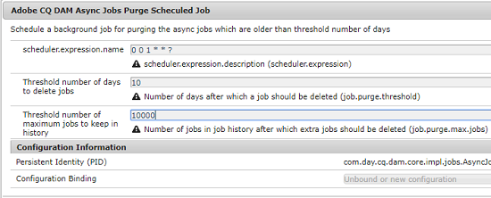

# Asynchronous operations {#asynchronous-operations}

為了減少對效能的不利影響， [!DNL Adobe Experience Manger Assets] 請非同步處理某些長期運行和資源密集型資產操作。 非同步處理包括將多個任務入隊並最終以串列方式執行這些任務，這取決於系統資源的可用性。 這些操作包括：

* 刪除多項資產。
* 移動多項資產或參照眾多的資產.
* 大量匯出和匯入資產中繼資料。

您可以從「非同步作業狀態」頁面查看非同步 **[!UICONTROL 任務的狀態]** 。

>[!NOTE]
>
>預設情況下，任 [!DNL Assets] 務並行執行。 If `N` is the number of CPU cores, `N/2` tasks can execute in parallel, by default. 要使用任務隊列的自定義設定，請從 **[!UICONTROL Web Console]** 中修改非同步操作預設隊列配 [!UICONTROL 置]。 如需詳細資訊，請參閱[佇列設定](https://sling.apache.org/documentation/bundles/apache-sling-eventing-and-job-handling.html#queue-configurations)。

## Monitor the status of asynchronous operations {#monitoring-the-status-of-asynchronous-operations}

Whenever [!DNL Assets] processes an operation asynchronously, you receive a notification in your [!DNL Experience Manager] [Inbox](/help/sites-authoring/inbox.md) and via an email. 如要檢視非同步操作的詳細狀態，請導覽至&#x200B;**[!UICONTROL 「非同步作業狀態」]**&#x200B;頁面。

1. In the [!DNL Experience Manager] interface click **[!UICONTROL Operations]** > **[!UICONTROL Jobs]**.

1. 進入&#x200B;**[!UICONTROL 「非同步作業狀態」]**&#x200B;頁面後，即可檢視操作的詳細資訊。

   

   要確定操作的進度，請參閱「狀 **[!UICONTROL 態]** 」列。 系統會根據進度顯示下列其中一種狀態：

   * **[!UICONTROL 執行中]**：正在處理操作。
   * **[!UICONTROL 成功]**：操作完成.
   * **[!UICONTROL 失敗]**&#x200B;或&#x200B;**[!UICONTROL 錯誤]**：無法處理操作.
   * **[!UICONTROL 已排程]**：操作已排程，等待稍後處理.

1. To stop an active operation, select it from the list and click **[!UICONTROL Stop]**  from the toolbar.

1. To view extra details, for example description and logs, select the operation and click **[!UICONTROL Open]**  from the toolbar. 此時將顯示任務詳細資訊頁。

   

1. 若要從清單中刪除操作，請選取工具列中的&#x200B;**[!UICONTROL 「刪除」]**。若要以 CSV 檔案格式下載詳細資訊，請按&#x200B;**[!UICONTROL 「下載」]**。

   >[!NOTE]
   >
   >如果任務的狀態為活動或已排隊，則不能刪除該任務。

## 清除完成的任務 {#purge-completed-tasks}

[!DNL Experience Manager Assets] 每天01時執行清除任務，以刪除已完成的已超過一天的非同步任務。

<!-- TBD: Find out from the engineering team and mention the time zone of this 1:00 am task.
-->

您可以修改清除任務的調度以及刪除完成任務之前保留其詳細資訊的持續時間。 您也可以設定在任何時間點保留詳細資料的已完成任務數上限。

1. 在介面 [!DNL Experience Manager] 中，按一 **[!UICONTROL 下「工具]** > **[!UICONTROL 作業]** > **[!UICONTROL Web主控台]**」。
1. 開啟 **[!UICONTROL Adobe CQ DAM非同步工作清除排程任務]** 。
1. 指定刪除已完成任務的天數閾值，以及歷史記錄中保留詳細資訊的最大任務數。 儲存變更。

   

## 配置非同步刪除操作的閾值 {#configure-thresholds-for-asynchronous-delete-operations}

如果要刪除的資產或檔案夾數目超過設定的臨界值數目，則會非同步執行刪除作業。

1. 在介面 [!DNL Experience Manager] 中，按一 **[!UICONTROL 下「工具]** > **[!UICONTROL 作業]** > **[!UICONTROL Web主控台]**」。
1. From the [!UICONTROL Web Console], open the **[!UICONTROL Async Delete Operation Job Processing]** configuration.
1. 在「資 **[!UICONTROL 產的臨界值數目]** 」方塊中，指定臨界值數目，以非同步刪除資產、檔案夾或參考。 儲存變更。

   

## 配置非同步移動操作的閾值 {#configure-thresholds-for-asynchronous-move-operations}

如果要移動的資產、資料夾或引用數量超過設定的閾值數量，將非同步執行移動操作。

1. 在介面 [!DNL Experience Manager] 中，按一下「 **[!UICONTROL 工具]** > **[!UICONTROL 作業]** > **[!UICONTROL Web主控台]**」。
1. From the [!UICONTROL Web Console], open the **[!UICONTROL Async Move Operation Job Processing]** configuration.
1. 在「資 **[!UICONTROL 產／參考的臨界值數目]** 」方塊中，指定臨界值數目，以非同步地移動資產、檔案夾或參考。 儲存變更。

   

>[!MORELIKETHIS]
>
>* [在Experience Manager中設定電子郵件](/help/sites-administering/notification.md)。
>* [大量匯入和匯出資產的中繼資料](/help/assets/metadata-import-export.md)。

