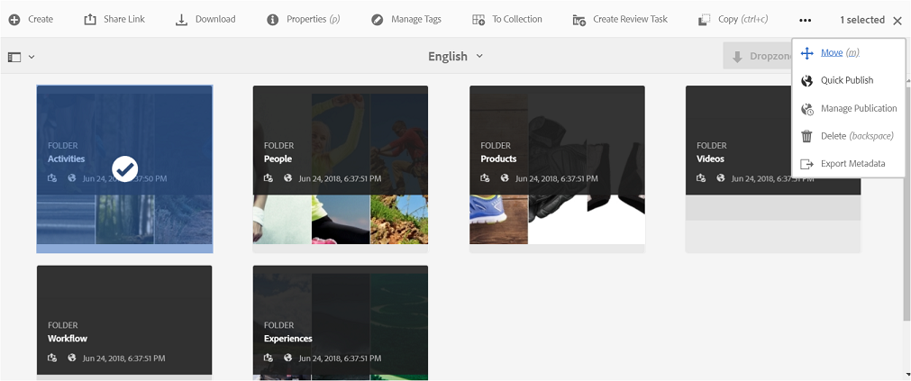

# 將資料夾發佈至 Brand Portal {#publish-folders-to-brand-portal}

身為Adobe Experience Manager(AEM)Assets管理員，您可以發佈資產和檔案夾至組織的AEM Assets Brand Portal例項（或排程發佈工作流程至較晚的日期／時間）。 不過，您必須先將AEM Assets與品牌入口網站整合。 如需詳細資訊，請參閱[使用 Brand Portal 設定 AEM Assets](configure-aem-assets-with-brand-portal.md)。

發佈資產或資料夾後，品牌入口網站的使用者即可使用它。

如果您在AEM Assets中對原始資產或檔案夾進行後續修改，在您重新發佈資產或檔案夾之前，這些變更不會反映在品牌入口網站中。 這項功能可確保對進行中工作所作的變更不會出現在 Brand Portal 中。Brand Portal 僅提供管理員發佈的已核准變更。

## 將資料夾發佈至 Brand Portal {#publish-folders-to-brand-portal-1}

1. 從AEM Assets介面，將滑鼠指標暫留在所要的檔案夾上，然後從快速動作中選 **[!UICONTROL 取]** 「發佈」選項。

   或者，選取所要的檔案夾，然後依照進一步的步驟進行。

   

2. **現在發佈資料夾**

   若要將所選資料夾發佈至 Brand Portal，請執行下列其中一項操作：

   * 在工具列中選取&#x200B;**[!UICONTROL 快速發佈]**。Then from the menu, select **[!UICONTROL Publish to Brand Portal]**.
   * 在工具列中選取&#x200B;**[!UICONTROL 管理出版物]**。

3. 然後從「動作 **[!UICONTROL 」中]** ，選取「發佈至品牌 **[!UICONTROL 入口網站]**」，並從「 **[!UICONTROL Scheduling]** Now」(現 ****&#x200B;在排程)中選取「Publish」。 點選「 **[!UICONTROL 下一步]」。**
4. 在范 **[!UICONTROL 圍內]**，確認您的選擇並點選「 **[!UICONTROL 發佈至品牌入口網站」]**。

   系統會顯示訊息，指出資料夾已排入佇列，等候發佈至 Brand Portal。登入品牌入口網站介面，查看已發佈的資料夾。

   **稍後發佈資料夾**

   若要排程資產檔案夾的發佈至品牌入口網站工作流程，請執行下列動作：

   1. 在您選取要發佈的資產／檔案夾後，從頂端的工 **[!UICONTROL 具列選取「管理出版物]** 」。
   2. 在「出 **[!UICONTROL 版物]** 」頁上，從「 **[!UICONTROL ActionAction]** 」中選擇「發佈到品牌 **[!UICONTROL 」並從「SchedulingPortal」中選]**********&#x200B;擇「Publish to Brand」。

      

   3. 選取&#x200B;**[!UICONTROL 啟用日期]**&#x200B;並指定時間。點選「 **[!UICONTROL 下一步]**」。
   4. 在&#x200B;**[!UICONTROL 範圍]**&#x200B;中確認您的選取項目。點選「 **[!UICONTROL 下一步]**」。
   5. 在&#x200B;**[!UICONTROL 工作流程]**&#x200B;底下指定「工作流程標題」。點選「 **[!UICONTROL 稍後發佈]**」。

      

## 從 Brand Portal 取消發佈資料夾 {#unpublish-folders-from-brand-portal}

您可以從AEM Author例項中取消發佈任何已發佈至品牌入口網站的資產資料夾，以移除它。 取消發佈原始資料夾後，Brand Portal 使用者將無法再取用資料夾副本。

您可以選擇從品牌入口網站快速解除發佈資料夾，或排程檔案夾在稍後的日期和時間。 若要從 Brand Portal 取消發佈資產資料夾：

1. 從AEM Author例項中的AEM Assets介面，選取您要解除發佈的檔案夾。

   

2. 在工具列中點選／按一下「管 **[!UICONTROL 理出版物]**」。

3. **立即從品牌入口網站取消發佈**

   若要從品牌入口網站快速解除發佈所需的檔案夾：

   1. 在「管 **[!UICONTROL 理出版物]** 」頁上，從 **[!UICONTROL Action]** 選 **[!UICONTROL 擇「從Brand Portal取消發佈」和「Scheduling Select Controws]** 」 ********&#x200B;中選擇「從Scheduling Publish」。
   2. 點選／按「下 **[!UICONTROL 一步]」。**
   3. 在范 **[!UICONTROL 圍內]**，確認您的選擇並點選「從品 **[!UICONTROL 牌入口網站取消發佈」]**。

   

   **稍後從品牌入口網站取消發佈**

   若要排程從品牌入口網站發佈資料夾至稍後的日期和時間：

   1. 在「管 **[!UICONTROL 理出版物]** 」頁上，從 **[!UICONTROL Action]** 選擇「從Brand Portal **[!UICONTROL 取消發佈」和「Scheduling Select Aler]** 」選 ******擇AlterLeaterLightPortal。**
   2. 選取&#x200B;**[!UICONTROL 啟用日期]**&#x200B;並指定時間。點選「 **[!UICONTROL 下一步]**」。
   3. 在范 **[!UICONTROL 圍內]**，確認您的選擇並點選「下 **[!UICONTROL 一步」]**。
   4. Specify a **[!UICONTROL Workflow title]** under **[!UICONTROL Workflows]**. 點選「 **[!UICONTROL 稍後取消發佈]」。**

      

>[!NOTE]
>
>將資產發佈／解除發佈至／從品牌入口網站的程式與資料夾的對應程式類似。
