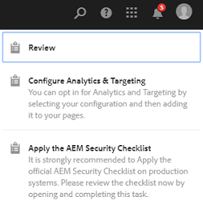
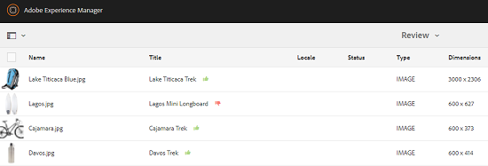

# 查看資料夾資產和集合 {#review-folder-assets-and-collections}

為資料夾或集合中的資產設定審核工作流程，並與審核者或創意合作夥伴共用，以尋求意見回饋。

Adobe Experience Manager Assets可讓您為資料夾或集合中的資產設定臨機檢閱工作流程，並與審核者或創意合作夥伴共用，以尋求意見反應。

您可以將審核工作流與項目關聯，或建立獨立的審核任務。

共用資產後，審閱者可以批准或拒絕這些資產。 在工作流程的各個階段發送通知，以通知預期的收件者完成各種任務。 例如，當您共用資料夾或集合時，審核者會收到資料夾/集合已共用以供審核的通知。

審核者完成審核（批准或拒絕資產）後，您會收到審核完成通知。

## 為資料夾建立審核任務 {#creating-a-review-task-for-folders}

1. 從「資產」使用者介面中，選取您要建立檢閱工作的資料夾。
1. 從工具列中點選/按一下「建 **[!UICONTROL 立檢閱工作]** 」圖示，以開啟「 **** 檢閱工作」頁面。如果您在工具列中看不到圖示，請點選/按一下「更 **[!UICONTROL 多]** 」，然後選取圖示。

   

1. （可選）從&#x200B;**[!UICONTROL Project]**&#x200B;清單中，選擇要與審閱任務關聯的項目。 預設情況下，選擇&#x200B;**[!UICONTROL None]**&#x200B;選項。 如果您不想將任何項目與審閱任務關聯，請保留此選擇。

   >[!NOTE]
   >
   >只有您具有編輯者層級權限（或更高）的專案會顯示在&#x200B;**[!UICONTROL Projects]**&#x200B;清單中。

1. 輸入複核任務的名稱，然後從&#x200B;**[!UICONTROL 分配到]**&#x200B;清單中選擇批准者。

   >[!NOTE]
   >
   >在&#x200B;**[!UICONTROL 分配到]**&#x200B;清單中，所選項目的成員/組可作為批准者。

1. 輸入複核任務的說明、任務優先順序和到期日。

   

1. 在「高級」頁簽中，輸入用於建立URI的標籤。

   

1. 點選/按一 **[!UICONTROL 下提交]**，然後點選/按一 **[!UICONTROL 下完成]** ，以關閉確認訊息。新任務的通知將發送給批准者。
1. 以核准者身分登入[!DNL Experience Manager]資產，並導覽至資產UI。 若要核准資產，請按一下/點選「**[!UICONTROL 通知]**」圖示，然後從清單中選取檢閱工作。

   

1. 在「復 **[!UICONTROL 查任務]** 」頁中，檢查複查任務的詳細資訊，然後點選/按一下「 **[!UICONTROL 複查」]**。
1. 在「復 **[!UICONTROL 核任務]** 」頁面中，選擇資產，並點選/按一下「核准/拒絕 **** 」圖示以視情況核准或拒絕。

   

1. 點選/按一下工具列中的&#x200B;**[!UICONTROL Complete]**&#x200B;圖示。 在對話方塊中，輸入註解，然後點選/按一下&#x200B;**[!UICONTROL Complete]**&#x200B;以確認。
1. 導覽至「資產」UI，然後開啟資料夾。 資產的核准狀態圖示會同時顯示在「卡片」和「清單」檢視中。

   **卡片檢視**

   

   **清單檢視**

   

## 為集合建立審核任務 {#creating-a-review-task-for-collections}

1. 從「集合」頁中，選擇要為其建立審閱任務的集合。
1. 從工具列中點選/按一下「建 **[!UICONTROL 立檢閱工作]** 」圖示，以開啟「 **** 檢閱工作」頁面。如果您在工具列中看不到圖示，請點選/按一下「更 **[!UICONTROL 多]** 」，然後選取圖示。

   

1. （可選）從&#x200B;**[!UICONTROL Project]**&#x200B;清單中，選擇要與審閱任務關聯的項目。 預設情況下，選擇&#x200B;**[!UICONTROL None]**&#x200B;選項。 如果您不想將任何項目與審閱任務關聯，請保留此選擇。

   >[!NOTE]
   >
   >只有您具有編輯者層級權限（或更高）的專案會顯示在&#x200B;**[!UICONTROL Projects]**&#x200B;清單中。

1. 輸入複核任務的名稱，然後從&#x200B;**[!UICONTROL 分配到]**&#x200B;清單中選擇批准者。

   >[!NOTE]
   >
   >在&#x200B;**[!UICONTROL 分配到]**&#x200B;清單中，所選項目的成員/組可作為批准者。

1. 輸入複核任務的說明、任務優先順序和到期日。

   

1. 點選/按一 **[!UICONTROL 下提交]**，然後點選/按一 **[!UICONTROL 下完成]** ，以關閉確認訊息。新任務的通知將發送給批准者。
1. 以核准者身分登入[!DNL Experience Manager]資產，並導覽至資產主控台。 若要核准資產，請點選/按一下「**[!UICONTROL 通知]**」圖示，然後從清單中選取檢閱工作。
1. 在「復 **[!UICONTROL 查任務]** 」頁中，檢查複查任務的詳細資訊，然後點選/按一下「 **[!UICONTROL 複查」]**。
1. 集合中的所有資產都會顯示在審核頁面上。 選取資產，然後點選/按一下&#x200B;**[!UICONTROL 核准/拒絕]**&#x200B;圖示，以視情況核准或拒絕資產。

   

1. 點選/按一下工具列中的&#x200B;**[!UICONTROL Complete]**&#x200B;圖示。 在對話方塊中，輸入註解，然後點選/按一下&#x200B;**[!UICONTROL Complete]**&#x200B;以確認。
1. 導覽至「集合」主控台，然後開啟集合。 資產的核准狀態圖示會同時顯示在「卡片」和「清單」檢視中。

   **卡片檢視**

   

   **清單檢視**

   
