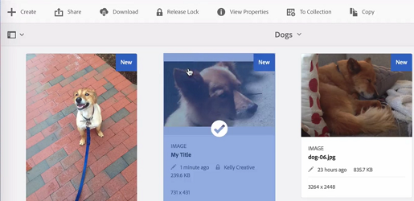

# 資產中的簽入和簽出檔案 {#check-in-and-check-out-files-in-assets}

>[!CAUTION]
>
>AEM 6.4已結束延伸支援，本檔案不再更新。 如需詳細資訊，請參閱 [技術支援期](https://helpx.adobe.com//tw/support/programs/eol-matrix.html). 尋找支援的版本 [此處](https://experienceleague.adobe.com/docs/).

Adobe Experience Manager Assets可讓您簽出資產以進行編輯，並在您完成變更後重新簽入。 結帳資產後，您只能編輯、注釋、發佈、移動或刪除資產。 簽出資產會鎖定資產。 在您將資產簽回 [!DNL Experience Manager] 資產。 不過，他們仍可以變更鎖定資產的中繼資料。

若要簽出或簽入資產，您需要這些資產的「寫入」存取權。

此功能可協助防止其他使用者覆寫作者所做的變更，讓多位使用者共同合作編輯團隊間的工作流程。

## 結帳資產 {#checking-out-assets}

1. 從資產UI中，選取您要結帳的資產。 您也可以選取多個要結帳的資產。

   

1. 在工具列中，按一下/點選 **[!UICONTROL 結帳]** 表徵圖。

   

   請注意， **[!UICONTROL 結帳]** 表徵圖切換到 **[!UICONTROL 簽入]** 表徵圖。

   

   若要確認其他使用者是否可以編輯您簽出的資產，請以其他使用者身分登入。 簽出的資產縮圖上會顯示鎖定表徵圖。

   

   選取資產。 請注意，工具列不會顯示任何選項，讓您編輯、注釋、發佈或刪除資產。

   

   不過，您可以按一下/點選 **[!UICONTROL 檢視屬性]** 圖示來編輯已鎖定資產的中繼資料。

1. 按一下/點選「編輯」圖示，以在編輯模式中開啟資產。

   

1. 編輯資產並儲存變更。 例如，裁切影像並儲存。

   

   您也可以選擇為資產加上注釋或發佈。

1. 從「資產」UI中選取已編輯的資產，然後按一下/點選工具列中的「 **[!UICONTROL 登入]** 」圖示。

   

   已修改的資產會簽入至 [!DNL Assets] 和可供其他使用者編輯。

## 強制簽入 {#forced-check-in}

管理員可以簽入其他用戶簽出的資產。

1. 登入 [!DNL Assets] 管理員。
1. 從「資產」UI中，選取一或多個已由其他使用者簽出的資產。

   

1. 在工具列中，按一下/點選 **[!UICONTROL 釋放鎖]** 表徵圖。 資產會重新簽入，供其他使用者編輯。

   
