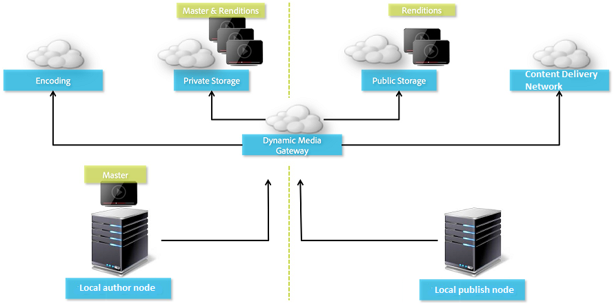

# 配置Dynamic Media — 混合模式 {#configuring-dynamic-media-hybrid-mode}

>[!CAUTION]
>
>AEM 6.4已結束延伸支援，本檔案不再更新。 如需詳細資訊，請參閱 [技術支援期](https://helpx.adobe.com//tw/support/programs/eol-matrix.html). 尋找支援的版本 [此處](https://experienceleague.adobe.com/docs/).

Dynamic Media — 需要啟用並設定混合功能，才能使用。 根據您的使用案例，Dynamic Media有數個 [支援的配置](#supported-dynamic-media-configurations).

>[!NOTE]
>
>如果您要在Scene7執行模式中設定及執行Dynamic Media，請參閱 [設定Dynamic Media - Scene7模式](config-dms7.md).
>
>如果您要以混合執行模式設定及執行Dynamic Media，請依照本頁的指示操作。

進一步了解如何使用 [影片](video.md) 在Dynamic Media。

如果您使用針對不同環境（例如開發、測試和即時生產）設定的Adobe Experience Manager，則需要為其中每個環境設定Dynamic MediaCloud Services。

如果您的Dynamic Media設定有問題，請務必查看Dynamic Media專用的記錄檔。 當您啟用動態媒體時，會自動安裝下列項目：

* `s7access.log`
* `ImageServing.log`

這些檔案記錄於 [監控和維護您的AEM例項](/help/sites-deploying/monitoring-and-maintaining.md).

混合發佈與傳送是Dynamic Media新增Adobe Experience Manager的核心功能。 混合發佈可讓您從雲端而非AEM發佈節點傳送Dynamic Media資產，例如影像、集和視訊。

AEM發佈節點會繼續提供其他內容，例如Dynamic Media檢視器、網站頁面和靜態內容。

如果您是Dynamic Media的客戶，則必須使用混合式傳送作為所有Dynamic Media內容的傳送機制。

## 影片的混合發佈架構 {#hybrid-publishing-architecture-for-videos}



## 影像混合發佈架構 {#hybrid-publishing-architecture-for-images}


## 支援的Dynamic Media設定 {#supported-dynamic-media-configurations}

後面的設定任務參考下列術語：

| **術語** | **Dynamic Media已啟用** | **說明** |
|---|---|---|
| AEM製作節點 | 綠色圓圈中的白勾號 | 您部署至On-Premise或透過Managed Services的製作節點。 |
| AEM發佈節點 | 紅方的白色X。 | 您部署至內部部署或透過Managed Services的發佈節點。 |
| 影像服務發佈節點 | 綠色圓形中的白勾號。 | 您在由Adobe管理的資料中心上執行的發佈節點。 指影像服務URL。 |

您可以選擇僅針對影像、僅限視訊，或同時針對影像和視訊實作Dynamic Media。 若要判別針對特定案例設定Dynamic Media的步驟，請參閱下表。

<table> 
 <tbody> 
  <tr> 
   <td><strong>藍本</strong></td> 
   <td><strong>運作方式</strong></td> 
   <td><strong>配置步驟</strong></td> 
  </tr> 
  <tr> 
   <td>在生產環境中僅提供映像</td> 
   <td>影像會透過Adobe全球資料中心的伺服器傳送，然後由CDN快取，以提供可擴充的效能和全球觸及率。</td> 
   <td> 
    <ol> 
     <li>在AEM <strong>作者</strong> 節點， <a href="#enabling-dynamic-media">啟用動態媒體</a>.</li> 
     <li>在中配置映像 <a href="#configuring-dynamic-media-cloud-services">Dynamic MediaCloud Services</a>.</li> 
     <li><a href="#configuring-image-replication">配置映像複製</a>.</li> 
     <li><a href="#replicating-catalog-settings">複製目錄設定</a>.</li> 
     <li><a href="#replicating-viewer-presets">複製查看器預設集</a>.</li> 
     <li><a href="#using-default-asset-filters-for-replication">對復寫使用預設資產篩選器</a>.</li> 
     <li><a href="#configuring-dynamic-media-image-server-settings">配置Dynamic Media Image Server設定</a>.</li> 
     <li><a href="#delivering-assets">傳送資產</a>.</li> 
    </ol> </td> 
  </tr> 
  <tr> 
   <td>在預製作（開發、QE、預備等）中僅提供影像。</td> 
   <td>影像會透過AEM發佈節點傳送。 在此情境中，由於流量極少，因此不需要將影像傳送至Adobe的資料中心。 另外一項好處是，這可讓生產啟動前安全地預覽內容</td> 
   <td> 
    <ol> 
     <li>在AEM <strong>作者</strong> 節點， <a href="#enabling-dynamic-media">啟用動態媒體</a>.</li> 
     <li>在AEM <strong>發佈</strong> 節點， <a href="#enabling-dynamic-media">啟用動態媒體</a>.</li> 
     <li><a href="#replicating-viewer-presets">複製查看器預設集</a>.</li> 
     <li>設定 <a href="#setting-up-asset-filters-for-imaging-in-non-production-deployments">非生產影像的資產篩選器</a>.</li> 
     <li><a href="#configuring-dynamic-media-image-server-settings">配置Dynamic Media Image Server設定。</a></li> 
     <li><a href="#delivering-assets">傳送資產。</a></li> 
    </ol> </td> 
  </tr> 
  <tr> 
   <td>在任何環境（生產、開發、QE、預備等）中只傳送視訊</td> 
   <td>CDN會傳送並快取視訊，以提升效能並觸及全域。 視訊海報影像（播放起始前顯示的視訊縮圖）將由AEM發佈例項傳送。</td> 
   <td> 
    <ol> 
     <li>在AEM <strong>作者</strong> 節點， <a href="#enabling-dynamic-media">啟用動態媒體</a>.</li> 
     <li>在AEM <strong>發佈</strong> 節點， <a href="#enabling-dynamic-media">啟用動態媒體</a> （發佈例項會提供視訊海報影像，並提供視訊播放的中繼資料）。</li> 
     <li>在中設定視訊 <a href="#configuring-dynamic-media-cloud-services">Dynamic MediaCloud Services。</a></li> 
     <li><a href="#replicating-viewer-presets">複製查看器預設集</a>.</li> 
     <li>設定 <a href="#setting-up-asset-filters-for-video-only-deployments">僅限視訊的資產篩選器</a>.</li> 
     <li><a href="#delivering-assets">傳送資產。</a></li> 
    </ol> </td> 
  </tr> 
  <tr> 
   <td>在生產中提供影像和視訊</td> 
   <td><p>CDN會傳送並快取視訊，以提升效能並觸及全域。 影像和視訊海報影像會透過Adobe全球資料中心的伺服器傳送，然後由CDN快取，以提供可擴充的效能和全球觸及率。</p> <p>請參閱前幾節，以在預製作業中設定影像或影片。 </p> </td> 
   <td> 
    <ol> 
     <li>在AEM <strong>作者</strong> 節點， <a href="#enabling-dynamic-media">啟用動態媒體</a>.</li> 
     <li>在中設定視訊 <a href="#configuring-dynamic-media-cloud-services">Dynamic MediaCloud Services。</a></li> 
     <li>在中配置映像 <a href="#configuring-dynamic-media-cloud-services">Dynamic MediaCloud Services。</a></li> 
     <li><a href="#configuring-image-replication">配置映像複製</a>.</li> 
     <li><a href="#replicating-catalog-settings">複製目錄設定</a>.</li> 
     <li><a href="#replicating-viewer-presets">複製查看器預設集</a>.</li> 
     <li><a href="#using-default-asset-filters-for-replication">對復寫使用預設資產篩選器。</a></li> 
     <li><a href="#configuring-dynamic-media-image-server-settings">配置Dynamic Media Image Server設定。</a></li> 
     <li><a href="#delivering-assets">傳送資產。</a></li> 
    </ol> </td> 
  </tr> 
 </tbody> 
</table>

## 啟用Dynamic Media {#enabling-dynamic-media}

[動態媒體](https://www.adobe.com/solutions/web-experience-management/dynamic-media.html) 預設為停用。 若要運用Dynamic Media功能，您必須使用 **[!UICONTROL dynamicmedia]** 以您為例，執行模式 **[!UICONTROL 發佈]** 運行模式。 啟用前，請務必檢閱 [技術要求](/help/sites-deploying/technical-requirements.md#requirements-for-aem-dynamic-media-add-on).

>[!NOTE]
>
>透過執行模式啟用動態媒體，會取代AEM 6.1和AEM 6.0中的功能，您可借由設定 **[!UICONTROL dynamicMediaEnabled]** 標幟為 **[!UICONTROL true]**. 此標幟在AEM 6.2和更新版本中沒有功能。 此外，您不需要重新啟動快速入門即可啟用動態媒體。

啟用Dynamic Media後，UI即可使用動態媒體功能，且每個上傳的影像資產都會收到 `cqdam.pyramid.tiff` 用於快速傳送動態影像轉譯的轉譯。 這些PTIFF具有顯著優點，包括(1)僅能管理單一主影像並即時產生無限轉譯，而無需任何額外儲存；以及(2)能使用互動式視覺效果，例如縮放、平移、回轉等。

如果您想在AEM中使用Dynamic Media Classic，則不應啟用Dynamic Media，除非您使用 [特定藍本](/help/sites-administering/scene7.md#aem-scene-integration-versus-dynamic-media). 除非您透過執行模式啟用Dynamic Media，否則Dynamic Media會停用。

要啟用動態媒體，必須從命令行或快速啟動檔案名啟用動態媒體運行模式。

**啟用動態媒體的方式**:

1. 在命令行上，啟動快速啟動時，請執行以下操作：

   * 新增 **[!UICONTROL -r dynamicmedia]** 到命令行的結尾。

   ```shell
   java -Xmx4096m -Doak.queryLimitInMemory=500000 -Doak.queryLimitReads=500000 -jar cq-quickstart-6.4.0.jar -r dynamicmedia
   ```

   如果您要發佈至s7delivery，則還需要包含下列trustStore引數：

   ```shell
   -Djavax.net.ssl.trustStore=<absoluteFilePath>/customerTrustStoreFileName>
   
    -Djavax.net.ssl.trustStorePassword=<passwordForTrustStoreFile>
   ```

1. 要求 `http://localhost:4502/is/image` 並確保Image Server正在運行。

   >[!NOTE]
   >
   >若要疑難排解Dynamic Media的問題，請參閱 **[!UICONTROL crx-quickstart/logs/]** 目錄：
   >
   >* ImageServer-&lt;portid>-&lt;yyyy>&lt;mm>&lt;dd>.log - ImageServer日誌提供用於分析內部ImageServer進程行為的統計資訊和分析資訊。

      映像伺服器日誌檔案名的示例： `ImageServer-57346-2019-07-25.log`
   * s7access-&lt;yyyy>&lt;mm>&lt;dd>.log - s7access記錄會記錄透過 `/is/image` 和 `/is/content`.
   這些記錄檔僅在啟用Dynamic Media時使用。 未包含在 **下載完整版** 從 **[!UICONTROL system/console/status-Bundlelist]** 頁面；如果您有Dynamic Media問題，在呼叫客戶支援時，請將這兩個記錄附加至問題。

### 如果您將AEM安裝至不同的連接埠或內容路徑…… {#if-you-installed-aem-to-a-different-port-or-context-path}

如果您要部署 [AEM到應用程式伺服器](/help/sites-deploying/application-server-install.md) 啟用Dynamic Media後，您必須設定 **自我** 外部化程式中的網域。 否則，動態媒體資產的資產縮圖產生將無法正常運作。

此外，如果在不同的埠或上下文路徑上運行快速啟動，則還必須更改 **自我** 網域。

啟用Dynamic Media時，會使用Dynamic Media產生影像資產的靜態縮圖轉譯。 為了讓動態媒體能正常產生縮圖，AEM必須對其本身執行URL要求，且必須知道連接埠號和內容路徑。

在AEM中：

* 此 **自我** 中的網域 [外置器](/help/sites-developing/externalizer.md) 用於檢索埠號和上下文路徑。
* 若否 **自我** 域已配置，埠號和上下文路徑將從Jetty HTTP服務中檢索。

在AEM QuickStart WAR部署中，埠號和上下文路徑無法派生，因此必須配置 **自我** 網域。 請參閱 [externalizer document（外部化程式）](/help/sites-developing/externalizer.md) 如何設定 **自我** 網域。

>[!NOTE]
在 [AEM Quickstart獨立部署](/help/sites-deploying/deploy.md), **自我** 域通常不需要配置，因為埠號和上下文路徑可以自動配置。 但是，如果所有網路介面都被關閉，則需要配置 **自我** 網域。

## 停用Dynamic Media  {#disabling-dynamic-media}

預設不會啟用動態媒體。 不過，如果您先前已啟用動態媒體，您稍後可能會想要將其關閉。

若要在啟用動態媒體後加以停用，請移除 **[!UICONTROL -r dynamicmedia]** 運行模式標誌。

**啟用Dynamic Media後停用**:

1. 在命令行中，啟動快速啟動時，可以執行以下任一操作：

   * 不添加 `-r dynamicmedia` 到命令行。

   ```shell
   java -Xmx4096m -Doak.queryLimitInMemory=500000 -Doak.queryLimitReads=500000 -jar cq-quickstart-6.4.0.jar
   ```

1. 要求 `http://localhost:4502/is/image`. 您會收到Dynamic Media已停用的訊息。

   >[!NOTE]
   停用Dynamic Media執行模式後，會產生 `qdam.pyramid.tiff` 會自動略過轉譯。 這也會停用動態轉譯支援和其他Dynamic Media功能。
   另請注意，設定AEM伺服器後，當Dynamic Media執行模式停用時，在該執行模式下上傳的所有資產現在都無效。

## （選用）將Dynamic Media預設集和設定從6.3移轉至6.4零停機時間 {#optional-migrating-dynamic-media-presets-and-configurations-from-to-zero-downtime}

如果您要將AEM Dynamic Media從6.3升級至6.4(現在包含零停機時間（也稱為「選擇加入」）部署的功能)，則需要執行下列curl命令，將您的所有預設集和設定從 `/etc` to `/conf` CRXDE Lite。

**附註**:如果您以相容模式（即安裝相容性封裝）運行AEM實例，則無需運行這些命令。

若要從移轉自訂預設集和設定， `/etc` to `/conf`，請執行下列Linux curl命令：

`curl -u admin:admin http://localhost:4502/libs/settings/dam/dm/presets.migratedmcontent.json`

對於所有升級，無論是否使用相容性包，都可以通過運行以下命令複製現成可用的查看器預設集：

`curl -u admin:admin http://localhost:4502/libs/settings/dam/dm/presets/viewer.pushviewerpresets`

## 配置映像複製 {#configuring-image-replication}

Dynamic Media影像傳送的運作方式是從AEM Author發佈影像資產（包括視訊縮圖），並將其複製至Adobe的隨選復寫服務（復寫服務URL）。 然後會透過隨需影像傳送服務（影像服務URL）來傳送資產。

您必須執行下列動作：

1. [設定驗證](#setting-up-authentication).
1. [配置複製代理](#configuring-the-replication-agent).

復寫代理會發佈Dynamic Media資產，例如影像、視訊中繼資料，並將集合發佈至Adobe托管的影像服務。 預設不啟用復寫代理。

配置複製代理後，您需要 [驗證並測試是否已成功設定](#validating-the-replication-agent-for-dynamic-media). 本節將介紹這些過程。

>[!NOTE]
建立PTIFF的預設記憶體限制為3 GB，涵蓋所有工作流程。 例如，您可以在其他工作流程暫停時處理一個需要3 GB記憶體的映像，或者並行處理10個每個需要300 MB記憶體的映像。
記憶體限制是可配置的，應符合系統資源可用性和正在處理的影像內容類型。 如果您有許多超大型資產，且系統記憶體足夠，您可以提高此限制，以確保並行處理影像。
超過最大記憶體限制的映像將被拒絕。
要更改建立PTIFF的記憶體限制，請導航至 **[!UICONTROL 「工具」>「操作」>「Web控制台」>「Adobe CQ Scene7 PTiffManager」]** 並改變 `maxMemory` 值。

### 設定驗證 {#setting-up-authentication}

您需要在作者上設定復寫驗證，才能將影像復寫至Dynamic Media影像傳送服務。 若要這麼做，請取得KeyStore，然後將其儲存在 **[!UICONTROL dynamic-media-replication]** 使用者和進行設定。 您的公司管理員應在配置過程中收到包含KeyStore檔案和必要憑據的歡迎電子郵件。 如果您未收到此訊息，請聯絡客戶支援。

**設定驗證**:

1. 如果您尚未擁有KeyStore檔案和密碼，請聯絡客戶支援。 這是布建的一部分，它會將金鑰關聯至您的帳戶。
1. 在AEM中，點選AEM標誌以存取全域導覽主控台，然後點選 **[!UICONTROL 「工具」>「安全性」>「使用者」]**.
1. 在「使用者管理」頁面上，導覽至 **[!UICONTROL dynamic-media-replication]** 使用者，然後點選以開啟。

   

1. 在「編輯動態媒體復寫的使用者設定」頁面中，點選 **[!UICONTROL 金鑰存放區]** 標籤，然後點選 **[!UICONTROL 建立KeyStore]**.

   

1. 輸入密碼並確認 **[!UICONTROL 設定KeyStore訪問密碼]** 對話框。

   >[!NOTE]
   記住您輸入的密碼。 在設定 **[!UICONTROL 復寫代理]** 稍後。

   

1. 在 **[!UICONTROL 編輯動態媒體復寫的使用者設定]** 頁面，展開 **[!UICONTROL 從KeyStore檔案新增私密金鑰]** 區域並新增下列項目（請參閱下列影像）:

   * 在 **[!UICONTROL 新別名]** 欄位中，輸入您稍後將在複製配置中使用的別名的名稱；例如， **複製**.
   * 點選 **[!UICONTROL KeyStore檔案]**. 導覽至依Adobe提供給您的KeyStore檔案，選取它，然後點選 **[!UICONTROL 開啟]**.
   * 在 **[!UICONTROL KeyStore檔案密碼]** 欄位，輸入KeyStore檔案密碼。 這是 _not_ 您在步驟5中建立的KeyStore密碼，但是是KeyStore檔案密碼Adobe，在設定期間發送給您的歡迎電子郵件中提供。 如果您未收到KeyStore檔案密碼，請聯絡Adobe客戶支援。
   * 在 **[!UICONTROL 私密金鑰密碼]** 欄位中，輸入私密金鑰密碼（可能與上一步提供的私密金鑰密碼相同）。 Adobe會在布建期間，在傳送給您的歡迎電子郵件中提供私密金鑰密碼。 如果您未收到私密金鑰密碼，請聯絡Adobe客戶支援。
   * 在 **[!UICONTROL 私鑰別名]** 欄位，輸入私鑰別名。 例如， `companyname-alias`. Adobe會在布建期間，於您收到的歡迎電子郵件中提供私密金鑰別名。 如果您未收到私密金鑰別名，請聯絡Adobe客戶支援。

   

1. 點選 **[!UICONTROL 儲存並關閉]** 以儲存您對此使用者的變更。

   接下來，你需要 [配置複製代理。](#configuring-the-replication-agent)

### 設定複寫代理 {#configuring-the-replication-agent}

1. 在AEM中，點選AEM標誌以存取全域導覽主控台，然後點選 **[!UICONTROL 「工具」>「部署」>「復寫」>「作者上的代理」]**.
1. 在作者頁面上，點選「代理」 **[!UICONTROL Dynamic Media混合影像復寫(s7delivery)]**.
1. 點選 **[!UICONTROL 編輯]**.
1. 點選 **[!UICONTROL 設定]** ，然後輸入以下內容：

   * **[!UICONTROL 已啟用]**  — 選中此複選框以啟用複製代理。
   * **[!UICONTROL 地區]**  — 設為適當地區：北美、歐洲或亞洲
   * **[!UICONTROL 租用戶ID]**  — 此值是發佈至復寫服務的公司/租用戶名稱。 此值是Adobe在布建期間傳送給您的歡迎電子郵件中提供的租用戶ID。 如果您未收到此訊息，請聯絡Adobe客戶支援。
   * **[!UICONTROL 密鑰儲存別名]**  — 此值與** New Alias**值在中產生索引鍵時設定的值相同 [設定驗證](#setting-up-authentication);例如， `replication`. (請參閱 [設定驗證](#setting-up-authentication).)
   * **[!UICONTROL 密鑰儲存密碼]**  — 這是您點選時建立的KeyStore密碼 **[!UICONTROL 建立KeyStore]**. Adobe未提供此密碼。 請參閱步驟5，共 [設定驗證](#setting-up-authentication).

   下圖顯示了包含示例資料的複製代理：

   

1. 點選 **[!UICONTROL 確定]**.

### 驗證Dynamic Media的復寫代理 {#validating-the-replication-agent-for-dynamic-media}

要驗證動態媒體的複製代理，請執行以下操作：

點選 **[!UICONTROL 測試連線]**. 輸出示例如下：

```shell
11.03.2016 10:57:55 - Transferring content for ReplicationAction{type=TEST, path[0]='/content/dam', time=1457722675402, userId='admin', revision='null'}
11.03.2016 10:57:55 - * Auth User: replication-receiver
11.03.2016 10:57:55 - * HTTP Version: 1.1
11.03.2016 10:57:55 - * Using OAuth 2.0 Authorization Grants
11.03.2016 10:57:55 - * OAuth 2.0 User: dynamic-media-replication
11.03.2016 10:57:55 - * OAuth 2.0 Token: '*****' initialized
11.03.2016 10:57:55 - Publishing: POST[https://replicate-na.assetsadobe.com:8580/is-publish/publish-receiver?Cmd=Test&RootId=xfpuu-6613]
11.03.2016 10:57:55 - Publish response: OK[]
11.03.2016 10:57:55 - Transfer succeeded in 141 ms for ReplicationAction{type=TEST, path[0]='/content/dam', time=1457722675402, userId='admin', revision='null'}
-------------------------------------------------------------------------------------------------------------------------------
Replication test succeeded
```

>[!NOTE]
您也可以執行下列其中一項操作來檢查：
* 檢查復寫記錄，確認資產已復寫。
* 發佈影像。 點選影像並選取 **[!UICONTROL 檢視器]** 的下拉式清單中。 選取檢視器預設集，然後點選 **[!UICONTROL URL]**，並將URL複製並貼到瀏覽器中，以確認您可以看到影像。


### 排解驗證疑難問題 {#troubleshooting-authentication}

在設定驗證時，以下是您在其解決方案中可能遇到的問題。 在檢查這些選項之前，請確保已設定複製。

#### 問題：HTTP狀態代碼401，帶消息 — 需要授權 {#problem-http-status-code-with-message-authorization-required}

此問題可能是因為無法為 `dynamic-media-replication` 使用者。

```shell
Replication test to s7delivery:https://s7bern.macromedia.com:8580/is-publish/
17.06.2016 18:54:43 - Transferring content for ReplicationAction{type=TEST, path[0]='/content/dam', time=1466214883309, userId='admin', revision='null'}
17.06.2016 18:54:43 - * Auth User: replication-receiver
17.06.2016 18:54:43 - * HTTP Version: 1.1
17.06.2016 18:54:43 - * Using OAuth 2.0 Authorization Grants
17.06.2016 18:54:43 - * OAuth 2.0 User: dynamic-media-replication
17.06.2016 18:54:43 - No OAuth token available. OAuth not initialized
17.06.2016 18:54:43 - * Using Client Auth SSL alias - replication-alias *
17.06.2016 18:54:43 - Publishing: POST[https://<localhost>:8580/is-publish//publish-receiver?Cmd=Test&RootId=brough]
17.06.2016 18:54:43 - Transfer failed for ReplicationAction{type=TEST, path[0]='/content/dam', time=1466214883309, userId='admin', revision='null'}. java.io.IOException: Failed to execute request
'https://<localhost>:8580/is-publish//publish-receiver?Cmd=Test&RootId=brough':
 Server returned status code 401 with message: Authorization required.
17.06.2016 18:54:43 - Error while replicating: com.day.cq.replication.ReplicationException: Transfer failed for ReplicationAction{type=TEST, path[0]='/content/dam', time=1466214883309,
 userId='admin', revision='null'}. java.io.IOException: Failed to execute request
'https://<localhost>:8580/is-publish//publish-receiver?Cmd=Test&RootId=brough':
 Server returned status code 401 with message: Authorization required.
```

**解決方案**:檢查 `KeyStore` 儲存至 **[!UICONTROL dynamic-media-replication]** 使用者，且有正確的密碼。

#### 問題：無法解密密鑰 — 無法解密資料 {#problem-could-not-decrypt-key-could-not-decrypt-data}

```xml
Replication test to s7delivery:https://<localhost>:8580/is-publish/
17.06.2016 19:00:16 - Transferring content for ReplicationAction{type=TEST, path[0]='/content/dam', time=1466215216662, userId='admin', revision='null'}
17.06.2016 19:00:16 - * Auth User: replication-receiver
17.06.2016 19:00:16 - * HTTP Version: 1.1
17.06.2016 19:00:16 - * Using OAuth 2.0 Authorization Grants
17.06.2016 19:00:16 - * OAuth 2.0 User: dynamic-media-replication
17.06.2016 19:00:16 - No OAuth token available. OAuth not initialized
17.06.2016 19:00:16 - * Using Client Auth SSL alias - replication-alias *
17.06.2016 19:00:16 - Transfer failed for ReplicationAction{type=TEST, path[0]='/content/dam', time=1466215216662, userId='admin', revision='null'}. java.lang.SecurityException: java.security.UnrecoverableKeyException: Could not decrypt key: Could not decrypt data.
```

**解決方案**:檢查密碼。 複製代理中保存的密碼與用於建立密鑰庫的密碼不同。

#### 問題：InvalidAlgorithmParameterException {#problem-invalidalgorithmparameterexception}

此問題是由AEM Author例項中的設定錯誤所造成。 作者上的java程式未取得正確 `javax.net.ssl.trustStore`. 在復寫記錄中，您會看到此錯誤：

```shell
14.04.2016 09:37:43 - Transfer failed for ReplicationAction{type=TEST, path[0]='/content/dam', time=1460651862089, userId='admin', revision='null'}. java.io.IOException: Failed to execute request 'https://<localhost>:8580/is-publish/publish-receiver?Cmd=Test&RootId=rbrough-osx2': java.lang.RuntimeException: Unexpected error: java.security.InvalidAlgorithmParameterException: the trustAnchors parameter must be non-empty
14.04.2016 09:37:43 - Error while replicating: com.day.cq.replication.ReplicationException: Transfer failed for ReplicationAction{type=TEST, path[0]='/content/dam', time=1460651862089, userId='admin', revision='null'}. java.io.IOException: Failed to execute request 'https://<localhost>:8580/is-publish/publish-receiver?Cmd=Test&RootId=rbrough-osx2': java.lang.RuntimeException: Unexpected error: java.security.InvalidAlgorithmParameterException: the trustAnchors parameter must be non-empty
```

或錯誤日誌：

```shell
07.25.2019 12:00:59.893 *ERROR* [sling-threadpool-db2763bb-bc50-4bb5-bb64-10a09f432712-(apache-sling-job-thread-pool)-90-com_day_cq_replication_job_s7delivery(com/day/cq/replication/job/s7delivery)] com.day.cq.replication.Agent.s7delivery.queue Error during processing of replication.
 
java.io.IOException: Failed to execute request 'https://replicate-na.assetsadobe.com:8580/is-publish/publish-receiver?Cmd=Test&RootId=rbrough-osx': java.lang.RuntimeException: Unexpected error: java.security.InvalidAlgorithmParameterException: the trustAnchors parameter must be non-empty
        at com.scene7.is.catalog.service.publish.atomic.PublishingServiceHttp.executePost(PublishingServiceHttp.scala:195)
```

**解決方案**:確定AEM Author上的Java程式具有system屬性 **-Djavax.net.ssl.trustStore=** 設為有效的信任存放區。

#### 問題：KeyStore未設定或未初始化 {#problem-keystore-is-either-not-set-up-or-it-is-not-initialized}

此問題可能是由Hotfix或覆寫 **[!UICONTROL dynamic-media-user]** 或 **[!UICONTROL 金鑰]** 節點。

複製日誌示例：

```shell
Replication test to s7delivery:https://replicate-na.assetsadobe.com/is-publish
02.08.2016 14:37:44 - Transferring content for ReplicationAction{type=TEST, path[0]='/content/dam', time=1470173864834, userId='admin', revision='null'}
02.08.2016 14:37:44 - * Auth User: replication-receiver
02.08.2016 14:37:44 - * HTTP Version: 1.1
02.08.2016 14:37:44 - * Using OAuth 2.0 Authorization Grants
02.08.2016 14:37:44 - * OAuth 2.0 User: dynamic-media-replication
02.08.2016 14:37:44 - Transfer failed for ReplicationAction{type=TEST, path[0]='/content/dam', time=1470173864834, userId='admin', revision='null'}. com.adobe.granite.keystore.KeyStoreNotInitialisedException: Uninitialised key store for user dynamic-media-replication
```

**解決方案**:

1. 導覽至 **[!UICONTROL 使用者管理]** 頁面：

   `localhost:4502/libs/granite/security/content/useradmin.html`
1. 在 **[!UICONTROL 使用者管理]** 頁面，導覽至 **[!UICONTROL dynamic-media-replication]** 使用者，然後點選以開啟。
1. 點選 **[!UICONTROL KeyStore]** 標籤。 若 **[!UICONTROL 建立KeyStore]** 按鈕，則需要重做 [設定驗證](#setting-up-authentication) 更早。
1. 如果你必須重做 **[!UICONTROL KeyStore]** 設定，您可能需要 [配置複製代理](config-dynamic.md#configuring-the-replication-agent) 同樣。

   重新設定s7delivery復寫代理程式。

   `localhost:4502/etc/replication/agents.author/s7delivery.html`

1. 點選 **[!UICONTROL 測試連線]** 驗證配置是否有效。

#### 問題：發佈代理程式使用SSL而非OAuth {#problem-publish-agent-is-using-ssl-instead-of-oauth}

此問題可能是由Hotfix或未正確安裝或覆寫設定的Feature Pack所造成。

複製日誌示例：

```shell
01.08.2016 18:42:59 - Transferring content for ReplicationAction{type=TEST, path[0]='/content/dam', time=1470073379634, userId='admin', revision='null'}
01.08.2016 18:42:59 - * Auth User: replication-receiver
01.08.2016 18:42:59 - * HTTP Version: 1.1
01.08.2016 18:42:59 - * Using Client Auth SSL alias - replication-receiver *
01.08.2016 18:42:59 - Publishing: POST[https://replicate-eu.assetsadobe2.com:443/is-publish/publish-receiver?Cmd=Test&RootId=altayerstaging]
01.08.2016 18:42:59 - Transfer failed for ReplicationAction{type=TEST, path[0]='/content/dam', time=1470073379634, userId='admin', revision='null'}. java.io.IOException: Failed to execute request 'https://replicate-eu.assetsadobe2.com:443/is-publish/publish-receiver?Cmd=Test&RootId=rbroughstaging': Server returned status code 401 with message: Authorization required.
01.08.2016 18:42:59 - Error while replicating: com.day.cq.replication.ReplicationException: Transfer failed for ReplicationAction{type=TEST, path[0]='/content/dam', time=1470073379634, userId='admin', revision='null'}. java.io.IOException: Failed to execute request 'https://replicate-eu.assetsadobe2.com:443/is-publish/publish-receiver?Cmd=Test&RootId=rbroughstaging': Server returned status code 401 with message: Authorization required.
```

**解決方案:**

1. 在 AEM 中，點選&#x200B;**[!UICONTROL 「工具」>「一般」>「CRXDE Lite」]**。

   `localhost:4502/crx/de/index.jsp`

1. 導覽至 **[!UICONTROL s7delivery復寫代理]** 節點。

   `localhost:4502/crx/de/index.jsp#/etc/replication/agents.author/s7delivery/jcr:content`

1. 將此設定添加到複製代理(布林值，值設定為 **[!UICONTROL True]**):

   `enableOauth=true`

1. 在頁面的左上角附近，點選 **[!UICONTROL 全部儲存]**.

### 測試您的設定 {#testing-your-configuration}

Adobe建議您對配置執行端對端測試。

開始此測試之前，請確定您已完成下列操作：

* 新增影像預設集。
* 設定 **Dynamic Media設定（6.3之前）** 在 **[!UICONTROL Cloud Services]**. 此測試需要影像服務URL

若要測試您的設定：

1. 上傳影像資產。 (在「資產」中，點選 **[!UICONTROL 建立>檔案]** 並選取檔案。)
1. 等待工作流程完成。
1. 發佈影像資產。 (選取資產並點選 **[!UICONTROL 快速發佈]**.)
1. 開啟影像並點選以導覽至該影像的轉譯 **[!UICONTROL 轉譯]**.

   

1. 選取任何動態轉譯。
1. 點選 **[!UICONTROL URL]** 取得此資產的URL。
1. 導覽至選取的URL並檢查影像是否如預期般運作。

另一種測試已傳送資產的方法，是將req=exists附加至URL。

## 設定Dynamic MediaCloud Services {#configuring-dynamic-media-cloud-services}

Dynamic Media雲端服務提供雲端服務的支援，例如混合發佈及傳送影像和視訊、視訊分析、視訊編碼等。

在設定中，您需要輸入註冊ID、視訊服務URL、影像服務URL、復寫服務URL，並設定驗證。 您應已在帳戶布建過程中收到所有這些資訊。 若您未收到此資訊，請連絡您的Adobe Experience Manager管理員或Adobe技術支援以取得此資訊。

>[!NOTE]
設定Dynamic MediaCloud Services之前，請務必先設定您的發佈執行個體。 您也必須先設定復寫，才能設定Dynamic MediaCloud Services。

**設定dynamic media雲端服務**:

1. 在AEM中，點選AEM標誌以存取全域導覽主控台，然後點選 **[!UICONTROL 工具>Cloud Services> Dynamic Media設定（6.3之前版本）]**.
1. 在 **[!UICONTROL Dynamic Media設定瀏覽器]** 頁面，在左窗格中，選取 **[!UICONTROL 全球]**，然後點選 **[!UICONTROL 建立]**.
1. 在 **[!UICONTROL 建立Dynamic Media設定]** 對話框， **[!UICONTROL 標題]** 欄位中輸入標題。
1. 如果您要為視訊設定Dynamic Media,

   * 在 **[!UICONTROL 註冊ID]** 欄位中輸入註冊ID。
   * 在 **[!UICONTROL 視訊服務URL]** 欄位，輸入Dynamic Media閘道的視訊服務URL。

1. 若您正在設定Dynamic Media以進行影像處理，請在 **[!UICONTROL 影像服務URL]** 欄位，輸入Dynamic Media閘道的影像服務URL。
1. 點選 **[!UICONTROL 儲存]** 返回「Dynamic Media配置瀏覽器」頁。
1. 點選AEM標誌以存取全域導覽主控台。

## 設定視訊報表 {#configuring-video-reporting}

您可以使用Dynamic Media — 混合模式，在AEM的多個安裝間設定視訊報表。

**使用時機：** 在您設定 **[!UICONTROL Dynamic Media設定（6.3之前）]**，包括視訊報表在內的許多功能都已開始使用。 此設定會在地區Analytics公司中建立報表套裝。 如果您設定多個製作節點，則會為每個節點分別建立報表套裝。 因此，安裝之間的報告資料不一致。 此外，如果每個製作節點參照相同的混合發佈伺服器，則上次安裝製作時會變更所有視訊報表的目標報表套裝。 此問題會使用過多的報表套裝來過度載入Analytics系統。

**開始使用：** 完成下列三個工作，以設定視訊報告。

1. 建立 [!DNL Video Analytics] 設定後的預設集套件 **[!UICONTROL Dynamic Media設定（6.3之前）]** 在第一個「作者」節點上。 此初始任務很重要，因為它允許新配置繼續使用相同的報表套裝。
1. 安裝 [!DNL Video Analytics] 預設包，任何 ***new*** 製作節點 ***befor*** 您可以設定Dynamic Media設定（6.3之前）。

1. 驗證和調試包安裝。

### 建立 [!DNL Video Analytics] 設定第一個「作者」節點後的預設集套件 {#creating-a-video-analytics-preset-package-after-configuring-the-first-author-node}

完成此任務後，您將擁有包含 [!DNL Video Analytics] 預設集。 這些預設集包含報表套裝、追蹤伺服器、追蹤命名空間，以及Marketing Cloud組織ID（若有）。

1. 如果您尚未這麼做，請設定 **[!UICONTROL Dynamic Media設定（6.3之前）]**.
1. （選用）檢視並複製 **[!UICONTROL 報表套裝ID]** （您必須擁有JCR的存取權）。 當有 **[!UICONTROL 報表套裝ID]** 不需要，可讓驗證更輕鬆。
1. 使用 **[!UICONTROL 封裝管理員]**.
1. 編輯套件以包含篩選器。

   在AEM中： `/conf/global/settings/dam/dm/presets/analytics/jcr:content/userdata`

1. 建立套件。
1. 下載或共用 [!DNL Video Analytics] 預設集套件，以便與後續的新「製作」節點共用。

### 安裝 [!DNL Video Analytics] 設定其他製作節點之前的預設集套件 {#installing-the-video-analytics-preset-package-before-you-configure-additional-author-nodes}

請務必完成此任務 _befor_ 配置 **[!UICONTROL Dynamic Media設定（6.3之前）]**. 若未這麼做，將會建立另一個未使用的報表套裝。 此外，即使視訊報表仍可正常運作，資料收集仍未最佳化。

請確定 [!DNL Video Analytics] 來自第一個「作者」節點的預設集套件可在新的「作者」節點上存取。

1. 上傳 [!DNL Video Analytics] 您建立的預設包 **[!UICONTROL 封裝管理員]**.
1. 安裝 [!DNL Video Analytics] 預設集套件。
1. 設定 **[!UICONTROL Dynamic Media設定（6.3之前）]**.

### 驗證和調試包安裝 {#verifying-and-debugging-the-package-installation}

1. 執行下列任一操作以驗證軟體包，並在必要時調試軟體包安裝：

   * **檢查 [!DNL Video Analytics] 通過JCR預設**
若要檢查 [!DNL Video Analytics] 透過JCR預設，您必須擁有 **[!UICONTROL CRXDE Lite]**.

      AEM — 輸入 **[!UICONTROL CRXDE Lite]**，導覽至 `/conf/global/settings/dam/dm/presets/analytics/jcr:content/userdata  `

      就是 `http://localhost:4502/crx/de/index.jsp#/conf/global/settings/dam/dm/presets/analytics/jcr%3Acontent/userdata`

      如果您沒有 **[!UICONTROL CRXDE Lite]** 在「製作」節點上，您可以透過「發佈」伺服器檢查預設集。

   * **檢查 [!DNL Video Analytics] 預設集（通過Image Server）**

      您可以驗證 [!DNL Video Analytics] 通過製作影像伺服器直接預設 `req=userdata` 請求。

      例如，若要查看 [!DNL Video Analytics] 預設集，您可以提出下列要求：

      `http://localhost:4502/is/image/conf/global/settings/dam/dm/presets/analytics?req=userdata`

      若要驗證發佈伺服器上的預設集，您可以向發佈伺服器發出類似的直接請求。 「製作」和「發佈」節點上的回應相同。 回應看起來類似下列：

      ```
      marketingCloudOrgId=0FC4E86B573F99CC7F000101
       reportSuite=aemaem6397618-2018-05-23
       trackingNamespace=aemvideodal
       trackingServer=aemvideodal.d2.sc.omtrdc.net
      ```

   * **檢查 [!DNL Video Analytics] 透過AEM中的視訊報表工具預設集**

      點選 **[!UICONTROL 工具>資產>視訊報表]** `http://localhost:4502/mnt/overlay/dam/gui/content/s7dam/videoreports/videoreport.html`

      如果您看見下列錯誤訊息，表示報表套裝可供使用，但未填入。 在系統收集任何資料之前，新安裝中的此錯誤是正確的，也是必要的。

      
   若要產生報表資料，請上傳並發佈一個視訊。 使用 **[!UICONTROL 複製URL]** 並至少運行一次視頻。

   請注意，從視訊檢視器使用狀況填入報表資料可能需要12小時。

   如果發生錯誤，且報表套裝未正確設定，則會顯示下列警報。

   

   如果在您設定之前執行視訊報表，也會顯示此錯誤 **[!UICONTROL Dynamic Media設定（6.3之前）]** 服務。

### 疑難排解視訊報表設定 {#troubleshooting-the-video-reporting-configuration}

* 安裝期間，有時連線至Analytics API伺服器會逾時。 安裝會重試連線20次，但仍會失敗。 發生此情況時，記錄檔會記錄多個錯誤。 搜尋 `SiteCatalystReportService`.
* 未安裝 [!DNL Video Analytics] 預設集套件會先導致建立新報表套裝。
* 從AEM 6.3升級至AEM 6.4或AEM 6.4.1，然後設定 **[!UICONTROL Dynamic Media設定（6.3之前）]**，仍會建立報表套裝。 此問題已知且已在AEM 6.4.2中修正。

### 關於 [!DNL Video Analytics] 預設集 {#about-the-video-analytics-preset}

此 [!DNL Video Analytics] 預設集（有時簡稱為analytics預設集）會儲存在Dynamic Media中的「檢視器預設集」旁。 基本上與檢視器預設集相同，但包含用來設定AppMeasurement和視訊心率報表的資訊。

預設集的屬性如下：

* **[!UICONTROL reportSuite]**
* **[!UICONTROL trackingServer]**
* **[!UICONTROL trackingNamespace]**
* **[!UICONTROL marketingCloudOrgId]** (舊版AEM不存在)

AEM 6.4及更新版本會將此預設集儲存於 `/conf/global/settings/dam/dm/presets/analytics/jcr:content/userdata`

## 複製目錄設定 {#replicating-catalog-settings}

您必須透過JCR，在設定程式中發佈自己的預設目錄設定。 要複製目錄設定：

1. 在「終端機」視窗中，執行下列動作：

   `curl -u admin:admin localhost:4502/libs/settings/dam/dm/presets/viewer.pushviewerpresets`

1. 在AEM中，導覽至 **[!UICONTROL CRXDE Lite]** （需要管理員權限）:

   `https://<server>:<port>/crx/de/index.jsp#/conf/global/settings/dam/dm/imageserver/`

1. 點選 **[!UICONTROL 復寫]** 標籤。
1. 點選 **[!UICONTROL 複製]**.

## 複製查看器預設集 {#replicating-viewer-presets}

若要使用檢視器預設集傳送資產，您必須復寫/發佈檢視器預設集。 (必須激活所有查看器預設集 _和_ 已復寫，以取得資產的URL或內嵌程式碼。) 請參閱 [發佈檢視器預設集](managing-viewer-presets.md#publishing-viewer-presets) 以取得更多資訊。

>[!NOTE]
依預設，當您選取「 」時，系統會顯示各種轉譯 **[!UICONTROL 轉譯]** 和各種檢視器預設集 **[!UICONTROL 檢視器]** 在資產的詳細資訊檢視中。 您可以增加或減少顯示的數量。 請參閱 [增加顯示的影像預設集數目](/help/assets/managing-image-presets.md#increasing-or-decreasing-the-number-of-image-presets-that-display) 或 [增加顯示的檢視器預設集數目](/help/assets/managing-viewer-presets.md#increasing-the-number-of-viewer-presets-that-display).

## 篩選復寫資產 {#filtering-assets-for-replication}

在非Dynamic Media部署中，您會復寫 _all_ 資產（影像和視訊）從AEM製作環境到AEM發佈節點。 此工作流程是必要的，因為AEM發佈伺服器也會傳送資產。

不過，在Dynamic Media部署中，由於資產是透過雲端傳送，因此不需要將這些相同的資產複製到AEM發佈節點。 這樣的「混合發佈」工作流程可避免額外的儲存成本和更長的複製資產處理時間。 AEM發佈節點會繼續提供其他內容，例如Dynamic Media檢視器、網站頁面和靜態內容。

除複製資產外，還會複製下列非資產：

* Dynamic Media傳送設定： `/conf/global/settings/dam/dm/imageserver/configuration/jcr:content/settings`
* 影像預設集: `/conf/global/settings/dam/dm/presets/macros`
* 檢視器預設集: `/conf/global/settings/dam/dm/presets/viewer`

這些篩選器可讓您 _排除_ 資產。

### 針對復寫使用預設資產篩選器 {#using-default-asset-filters-for-replication}

如果您是使用Dynamic Media for 1)生產環境中的影像處理 _或_ 2)影像和視訊，接著您就可以使用我們依現狀提供的預設篩選器。 下列篩選器預設為作用中：

<table> 
 <tbody> 
  <tr> 
   <td> </td> 
   <td><strong>篩選</strong></td> 
   <td><strong>Mime 類型</strong></td> 
   <td><strong>轉譯</strong></td> 
  </tr> 
  <tr> 
   <td>Dynamic Media影像傳送</td> 
   <td><p>濾鏡影像</p> <p>篩選集</p> <p> </p> </td> 
   <td><p>開頭為 <strong>影像/</strong></p> <p>包含 <strong>application/</strong> 結尾是 <strong>set</strong>.</p> </td> 
   <td>現成可用的「篩選影像」（套用至單一影像資產，包括互動式影像）和「篩選集」（套用至回轉集、影像集、混合媒體集和轉盤集）將： 
    <ul> 
     <li>包含PTIFF影像和復寫中繼資料(任何以 <strong>cqdam</strong>)。</li> 
     <li>從復寫中排除原始影像和靜態影像轉譯。</li> 
    </ul> </td> 
  </tr> 
  <tr> 
   <td>Dynamic Media影片傳送</td> 
   <td>filter-video</td> 
   <td>開頭為 <strong>video/</strong></td> 
   <td>現成可用的「filter-video」將： 
    <ul> 
     <li>包含復寫的代理視訊轉譯、視訊縮圖/海報影像、中繼資料（在父視訊和視訊轉譯處）(任何轉譯，開頭為 <strong>cqdam</strong>)。</li> 
     <li>排除原始視訊和靜態縮圖轉譯。<br /> <br /> <strong>注意：</strong> 代理視訊轉譯不包含二進位檔，而只是節點屬性。 因此，對發佈者存放庫大小沒有影響。</li> 
    </ul> </td> 
  </tr> 
  <tr> 
   <td>Dynamic Media Classic整合</td> 
   <td><p>濾鏡影像</p> <p>篩選集</p> <p>filter-video</p> </td> 
   <td><p>開頭為 <strong>影像/</strong></p> <p>包含 <strong>application/</strong> 結尾是 <strong>set</strong>.</p> <p>開頭為 <strong>video/</strong></p> </td> 
   <td><p>您可以配置傳輸URI以指向您的AEM發佈伺服器，而不是AdobeDynamic Media雲複製服務URL。 設定此篩選器可讓Dynamic Media Classic傳送資產，而非AEM發佈例項。</p> <p>現成可用的「filter-images」、「filter-sets」和「filter-video」將：</p> 
    <ul> 
     <li>包含PTIFF影像、代理視訊轉譯和復寫的中繼資料。 但是，由於JCR中不存在這些JCR(針對執行AEM - Dynamic Media Classic整合的使用者)，因此IT無法有效運作。</li> 
     <li>排除原始影像、靜態影像轉譯、原始視訊和靜態縮圖轉譯之外。 相反，Dynamic Media Classic將會傳送影像和視訊資產。</li> 
    </ul> </td> 
  </tr> 
 </tbody> 
</table>

>[!NOTE]
篩選器會套用至mime類型，且不能是路徑特定。

### 為僅限視訊的部署設定資產篩選器 {#setting-up-asset-filters-for-video-only-deployments}

如果您只將Dynamic Media用於視訊，請依照下列步驟設定復寫的資產篩選器：

1. 在AEM中，點選AEM標誌以存取全域導覽主控台，然後點選 **[!UICONTROL 「工具」>「部署」>「復寫」>「作者上的代理」]**.
1. 在作者頁面上，點選「代理」 **[!UICONTROL 預設代理（發佈）]**.
1. 點選 **[!UICONTROL 編輯]**.
1. 在 **[!UICONTROL 代理設定]** 對話框， [!UICONTROL 設定] 標籤，核取 **[!UICONTROL 已啟用]** 開啟探員。
1. 點選 **[!UICONTROL 確定]**.
1. 在 AEM 中，點選&#x200B;**[!UICONTROL 「工具」>「一般」>「CRXDE Lite」]**。
1. 在左側資料夾樹中，導覽至 `/etc/replication/agents.author/dynamic_media_replication/jcr:content/damRenditionFilters`
1. 找出 [!UICONTROL filter-video]，按一下右鍵並選取 **[!UICONTROL 複製]**.
1. 在左側資料夾樹中，導覽至 `/etc/replication/agents.author/publish`
1. 找出 [!UICONTROL jcr:content]，按一下右鍵並選取 **[!UICONTROL 貼上]**.

這會設定AEM發佈例項以傳送視訊海報影像以及播放所需的視訊中繼資料，而視訊本身是由Dynamic Media雲端服務傳送。 篩選器也會從復寫中排除發佈執行個體不需要的原始視訊和靜態縮圖轉譯。

### 在非生產部署中設定影像處理的資產篩選器 {#setting-up-asset-filters-for-imaging-in-non-production-deployments}

如果您在非生產部署中使用Dynamic Media進行影像處理，請依照下列步驟設定復寫的資產篩選器：

1. 在AEM中，點選AEM標誌以存取全域導覽主控台，然後點選 **[!UICONTROL 「工具」>「部署」>「復寫」>「作者上的代理」]**.
1. 在作者頁面上，點選「代理」 **[!UICONTROL 預設代理（發佈）]**.
1. 點選 **[!UICONTROL 編輯]**.
1. 在 **[!UICONTROL 代理設定]** 對話框， **[!UICONTROL 設定]** 標籤，核取 **[!UICONTROL 已啟用]** 開啟探員。
1. 點選 **[!UICONTROL 確定]**.
1. 在 AEM 中，點選&#x200B;**[!UICONTROL 「工具」>「一般」>「CRXDE Lite」]**。
1. 在左側資料夾樹中，導覽至 `/etc/replication/agents.author/dynamic_media_replication/jcr:content/damRenditionFilters`

   

1. 找出 **[!UICONTROL 濾鏡影像]**，按一下右鍵並選取 **[!UICONTROL 複製]**.
1. 在左側資料夾樹中，導覽至 `/etc/replication/agents.author/publish`
1. 找出 **[!UICONTROL jcr:content]**，按一下右鍵並選取 **[!UICONTROL 建立>建立節點]**. 輸入名稱 `damRenditionFilters` 類型 `nt:unstructured`.
1. 找出 [!UICONTROL `damRenditionFilters`]，按一下右鍵並選取 **[!UICONTROL 貼上]**.

這會設定AEM發佈例項，將影像傳送至您的非生產環境。 篩選器也會從復寫中排除原始影像和靜態轉譯，這在發佈執行個體上不需要。

>[!NOTE]
如果作者中有許多不同的篩選器，則每個代理都需要指派不同的使用者。 Granite程式碼會強制使用每個使用者一個篩選器模型。 每個篩選器設定的使用者一律不同。
如果您在伺服器上使用多個篩選器（例如，一個要發佈的復寫篩選器，另一個要s7delivery的篩選器），則您需要確保這兩個篩選器具有不同 **userId** 在 **[!UICONTROL jcr:content]** 節點。 請參閱下圖：


### 自訂復寫的資產篩選器 {#customizing-asset-filters-for-replication}

（可選）要自訂復寫的資產篩選器：

1. 在AEM中，點選AEM標誌以存取全域導覽主控台，然後點選 **[!UICONTROL 工具>一般>CRXDE Lite]**.
1. 在左側資料夾樹中，導覽至 `/etc/replication/agents.author/dynamic_media_replication/jcr:content/damRenditionFilters` 來檢閱篩選器。

   

1. 若要定義篩選器的Mime類型，可以按如下方式找到Mime類型：

   在左側邊欄中，展開 **[!UICONTROL 內容> dam > &lt;`locate_your_asset`> > jcr:content > metadata]**，然後在表格中找出 `dc:format`.

   下圖為資產之路徑的範例 `dc:format`.

   

   請注意， `dc:format` 資產 `Fiji Red.jpg` is `image/jpeg`.

   若要讓此篩選器套用至所有影像（不論其格式為何），請將值設為 `image/*` where `*` 是套用至任何格式之所有影像的規則運算式。

   若要讓篩選器只套用至類型JPEG的影像，請輸入 `image/jpeg`.

1. 定義您要包含或排除在復寫中的轉譯。

   可用於篩選複製的字元包括：

<table> 
 <tbody> 
  <tr> 
   <td><strong>要使用的字元</strong></td> 
   <td><strong>如何篩選資產以進行復寫</strong></td> 
  </tr> 
  <tr> 
   <td>*</td> 
   <td>萬用字元<br /> </td> 
  </tr> 
  <tr> 
   <td>+</td> 
   <td>包含復寫資產。</td> 
  </tr> 
  <tr> 
   <td>-</td> 
   <td>排除復寫中的資產。</td> 
  </tr> 
 </tbody> 
</table>

導覽至 `content/dam/<locate_your_asset>/jcr:content/renditions`。

下圖是資產轉譯的範例。


使用上述範例，如果您只想複製PTIFF(金字塔TIFF)，則可輸入 `+cqdam,*` 包含以開頭的所有轉譯 `cqdam`. 在範例中，該轉譯為 `cqdam.pyramid.tiff`.

如果您只想複製原稿，則可輸入 `+original`.

## 配置Dynamic Media Image Server設定 {#configuring-dynamic-media-image-server-settings}

設定Dynamic Media Image Server包括編輯Adobe CQ Scene7 ImageServer套件組合和Adobe CQ Scene7 PlatformServer套件組合。

>[!NOTE]
Dynamic Media立即可用 [啟用後](#enabling-dynamic-media). 不過，您可以選擇配置Dynamic Media Image Server以符合特定規格或需求，以微調安裝。

**先決條件**: _之前_ 配置Dynamic Media Image Server，確保Windows的VM包括Microsoft Visual C++庫的安裝。 必須有這些程式庫才能執行Dynamic Media Image Server。 您可以 [在此處下載Microsoft Visual C++ 2010可再發行套件(x64)](https://www.microsoft.com/en-us/download/details.aspx?id=26999).

**配置Dynamic Media Image Server設定**:

1. 在AEM的左上角，點選 **[!UICONTROL Adobe Experience Manager]** 若要存取全域導覽主控台，然後點選 **[!UICONTROL 「工具」>「操作」>「Web控制台」]**.
1. 在 **[!UICONTROL Adobe Experience Manager Web主控台設定]** 頁面，點選 **[!UICONTROL OSGi >設定]** 列出AEM內目前執行的所有套件組合。

   Dynamic Media傳送伺服器位於清單中的下列名稱中：

   * **[!UICONTROL Adobe CQ Scene7 ImageServer]**
   * **[!UICONTROL Adobe CQ Scene7 PlatformServer]**

1. 在套件組合清單中，位於 **[!UICONTROL Adobe CQ Scene7 ImageServer]**，點選 **[!UICONTROL 編輯]** 表徵圖。
1. 在 **[!UICONTROL Adobe CQ Scene7 ImageServer]** 對話框，請設定以下配置值：

   >[!NOTE]
   在大多數情況下，不需要變更預設值。 但是，如果您確實更改了預設值，則必須重新啟動包，更改才會生效。

<table> 
 <tbody> 
  <tr> 
   <td><strong>屬性</strong></td> 
   <td><strong>預設值</strong></td> 
   <td><strong>說明</strong></td> 
  </tr> 
  <tr> 
   <td>TcpPort.name</td> 
   <td><code><em>empty</em></code></td> 
   <td>用於與ImageServer進程通信的埠號。 預設情況下，自動檢測空閒埠。</td> 
  </tr> 
  <tr> 
   <td>AllowRemoteAccess.name</td> 
   <td><code><em>empty</em></code></td> 
   <td><p>允許或不允許遠程訪問ImageServer進程。 如果為false，則映像伺服器僅偵聽本地主機。</p> <p>指向本地主機的預設外置程式設定需要指定特定VM實例的實際域或IP地址。 原因是本地主機可能指向VM的父系統。</p> <p>VM的域或IP地址可能需要一個主機檔案條目，以便它能夠自行解析。</p> </td> 
  </tr> 
  <tr> 
   <td>MaxRenderRgnPixels</td> 
   <td>16兆帕</td> 
   <td>所呈現的最大大小（百萬像素）。</td> 
  </tr> 
  <tr> 
   <td>MaxMessageSize</td> 
   <td>16 MB</td> 
   <td>已傳送的最大消息大小(MB)。</td> 
  </tr> 
  <tr> 
   <td>RandomAccessUrlTimeout</td> 
   <td>20</td> 
   <td>逾時值，表示ImageServer將等待JCR響應範圍內的磁貼請求的時間（秒）。</td> 
  </tr> 
  <tr> 
   <td>工作線程</td> 
   <td>10</td> 
   <td>工作線程數。</td> 
  </tr> 
 </tbody> 
</table>

1. 點選 **[!UICONTROL 儲存]**.
1. 在套件組合清單中，位於 **[!UICONTROL Adobe CQ Scene7 PlatformServer]**，點選 **[!UICONTROL 編輯]** 表徵圖。
1. 在 **[!UICONTROL Adobe CQ Scene7 PlatformServer]** 對話框，請設定以下預設值選項：

   >[!NOTE]
   Dynamic Media Image Server使用其自己的磁碟快取來快取響應。 AEM HTTP快取和Dispacher無法用來快取來自Dynamic Media Image Server的回應。

   | **屬性** | **預設值** | **說明** |
   |---|---|---|
   | **[!UICONTROL 已啟用快取]** | 已核取 | 是否啟用響應快取。 |
   | **[!UICONTROL 快取根]** | cache | 回應快取資料夾的一或多個路徑。 相對路徑會針對內部s7影像處理套件資料夾進行解析。 |
   | **[!UICONTROL 快取最大大小]** | 200000000 | 響應快取的最大大小（以位元組為單位）。 |
   | **[!UICONTROL 快取最大條目數]** | 100000 | 快取中允許的最大條目數。 |

### 預設資訊清單設定 {#default-manifest-settings}

預設資訊清單可讓您設定用於產生Dynamic Media傳送回應的預設值。 您可以微調質量(JPEG質量、解析度、重採樣模式)、快取（過期），並防止渲染太大的影像(defaultpix、defaultthumbpix、maxpix)。

預設資訊清單設定的位置取自 **[!UICONTROL 目錄根]** 預設值為 **[!UICONTROL Adobe CQ Scene7 PlatformServer]** 捆綁。 預設情況下，此值位於 **[!UICONTROL 工具>一般>CRXDE Lite]**:

`/conf/global/settings/dam/dm/imageserver/`


您可以輸入新值，以變更屬性的值，如下表所述。

完成對預設資訊清單的變更後，請在頁面的左上角，點選 **[!UICONTROL 全部儲存]**.

請務必點選 **[!UICONTROL 存取控制]** 標籤(位於 **[!UICONTROL 屬性]** 頁簽)，然後將訪問控制權限設定為 `jcr:read` 適用於所有使用者和dynamic-media-replication使用者。


資訊清單設定表及其預設值：

<table> 
 <tbody> 
  <tr> 
   <td><strong>屬性</strong></td> 
   <td><strong>預設值</strong></td> 
   <td><strong>說明</strong></td> 
  </tr> 
  <tr> 
   <td>bkgcolor</td> 
   <td>FFFFFF</td> 
   <td><p>預設背景顏色. RGB值，用於填入不含實際影像資料的回覆影像的任何區域。</p> <p>另請參閱 <a href="https://experienceleague.adobe.com/docs/dynamic-media-developer-resources/image-serving-api/image-serving-api/attributes/r-bkgcolor.html">BkgColor</a> （在影像伺服API中）。</p> </td> 
  </tr> 
  <tr> 
   <td>defaultpix</td> 
   <td>300,300</td> 
   <td><p>預設檢視大小. 如果請求未使用wid=、hei=或scl=明確指定檢視大小，則伺服器會限制回覆影像不大於此寬度和高度。</p> <p>指定為兩個整數，0或更大，以逗號分隔。 寬度和高度（像素）。 可將任一值或兩個值設為0，以保持它們不受約束。 不適用於巢狀/內嵌的請求。</p> <p>另請參閱 <a href="https://experienceleague.adobe.com/docs/dynamic-media-developer-resources/image-serving-api/image-serving-api/attributes/r-defaultpix.html">DefaultPix</a> （在影像伺服API中）。</p> <p>不過，您通常是使用檢視器預設集或影像預設集來傳送資產。 Defaultpix僅適用於未使用檢視器預設集或影像預設集的資產。</p> </td> 
  </tr> 
  <tr> 
   <td>defaulthumbpix</td> 
   <td>100,100</td> 
   <td><p>預設縮圖大小. 用於縮圖請求(req=tmb)，而非屬性：:DefaultPix。</p> <p>如果縮圖請求(req=tmb)未顯式指定大小，則伺服器將答復影像限制為不大於此寬度和高度，而未顯式指定使用wid=、hei=或scl=的視圖大小。</p> <p>指定為兩個整數，0或更大，以逗號分隔。 寬度和高度（像素）。 可將任一值或兩個值設為0，以保持它們不受約束。 </p> <p>不適用於巢狀/內嵌的請求。</p> <p>另請參閱 <a href="https://experienceleague.adobe.com/docs/dynamic-media-developer-resources/image-serving-api/image-serving-api/attributes/r-defaultthumbpix.html">DefaultThumbPix</a> （在影像伺服API中）。 </p> </td> 
  </tr> 
  <tr> 
   <td>過期</td> 
   <td>36000000</td> 
   <td><p>預設的客戶端快取存留時間。 提供預設過期時間間隔，以備特定目錄記錄不包含有效的目錄：：過期值時使用。</p> <p>實數，0或更高。 自回覆資料產生以來直到過期的毫秒數。 設為0一律會立即讓回覆影像過期，這會有效停用用戶端快取。 依預設，此值會設為10小時，這表示如果發佈新影像，舊影像需要10小時才會離開使用者的快取。 如果您需要快取，請盡快清除，請聯絡客戶支援。</p> <p>另請參閱 <a href="https://experienceleague.adobe.com/docs/dynamic-media-developer-resources/image-serving-api/image-serving-api/attributes/r-expiration.html">過期</a> （在影像伺服API中）。</p> </td> 
  </tr> 
  <tr> 
   <td>jpegquality</td> 
   <td>80</td> 
   <td><p>預設JPEG編碼屬性。 指定JPEG回覆影像的預設屬性。</p> <p>整數和標幟，以逗號分隔。 第一個值在1..100範圍內，並定義品質。 對於正常行為，第二個值可以是0，或者禁用通常由JPEG編碼器使用的RGB色度下採樣。</p> <p>另請參閱 <a href="https://experienceleague.adobe.com/docs/dynamic-media-developer-resources/image-serving-api/image-serving-api/attributes/r-jpegquality.html">JpegQuality</a> （在影像伺服API中）。</p> </td> 
  </tr> 
  <tr> 
   <td>maxpix</td> 
   <td>2000,2000</td> 
   <td><p>回覆影像大小限制. 傳回給用戶端的最大回覆影像寬度和高度。</p> <p>如果請求導致寬度或高度大於屬性：:MaxPix的回覆影像，則伺服器會傳回錯誤。</p> <p>另請參閱 <a href="https://experienceleague.adobe.com/docs/dynamic-media-developer-resources/image-serving-api/image-serving-api/attributes/r-maxpix.html">MaxPix</a> （在影像伺服API中）。</p> </td> 
  </tr> 
  <tr> 
   <td>resmode</td> 
   <td>SHARP2</td> 
   <td><p>預設重新取樣模式. 指定用於縮放影像資料的預設重採樣和插值屬性。</p> <p>若要求中未指定resMode=，則使用。</p> <p>允許的值包括BILIN、BICUB或SHARP2。</p> <p>列舉。 對於bilin，設為2，對於bicub，設為3，對於sharp2插值模式，設為4。 使用sharp2可獲得最佳結果。</p> <p>另請參閱 <a href="https://experienceleague.adobe.com/docs/dynamic-media-developer-resources/image-serving-api/image-serving-api/attributes/r-is-cat-resmode.html">ResMode</a> （在影像伺服API中）。</p> </td> 
  </tr> 
  <tr> 
   <td>解析度</td> 
   <td>72</td> 
   <td><p>預設對象解析度。 提供預設對象解析，以防特定目錄記錄不包含有效的目錄：:Resolution值。</p> <p>實數，大於0。 通常以每英吋像素表示，但也可以以其他單位表示，例如每米像素。</p> <p>另請參閱 <a href="https://experienceleague.adobe.com/docs/dynamic-media-developer-resources/image-serving-api/image-serving-api/attributes/r-resolution.html">解析度</a> （在影像伺服API中）。</p> </td> 
  </tr> 
  <tr> 
   <td>thumbnaitime</td> 
   <td>1%,11%,21%,31%,41%,51%,61%,71%,81%,91%</td> 
   <td>這些值代表視訊播放時間的快照，會傳遞至 <a href="https://encoding.com/">encoding.com</a>. 請參閱 <a href="/help/assets/video.md#about-video-thumbnails">關於視訊縮圖</a> 以取得更多資訊。</td> 
  </tr> 
 </tbody> 
</table>

## 設定Dynamic Media色彩管理 {#configuring-dynamic-media-color-management}

Dynamic Media色彩管理可讓您為預覽的資產進行色彩校正。

透過色彩校正，擷取的資產可保留其色彩空間(RGB、CMYK、灰色)，以及在產生的金字塔TIFF轉譯中內嵌的色彩描述檔。 當您請求動態轉譯時，影像顏色會校正到目標顏色空間中。 您可以在JCR的Dynamic Media發佈設定中設定輸出顏色設定檔。

Adobe色彩管理使用ICC設定檔，這是由國際色彩協會(ICC)定義的格式。

您可以使用CMYK、RGB或灰色輸出來配置動態媒體色彩管理和配置影像預設集。 請參閱 [設定影像預設集](managing-image-presets.md).

進階使用案例可使用手動設定 **[!UICONTROL icc=]** 顯式選擇輸出顏色配置檔案的修飾符：

* **[!UICONTROL icc]** - [輸出顏色配置檔案。](https://experienceleague.adobe.com/docs/dynamic-media-developer-resources/image-serving-api/image-serving-api/http-protocol-reference/command-reference/r-icc.html)

* **[!UICONTROL iccEmbed]** - [內嵌顏色設定檔。](https://experienceleague.adobe.com/docs/dynamic-media-developer-resources/image-serving-api/image-serving-api/http-protocol-reference/command-reference/r-iccembed.html)

>[!NOTE]
標準的Adobe色彩描述檔集僅在您有 [Software Distribution的Feature Pack 12445](https://experience.adobe.com/#/downloads/content/software-distribution/en/aem.html?package=/content/software-distribution/en/details.html/content/dam/aem/public/adobe/packages/cq630/featurepack/cq-6.3.0-featurepack-12445) 已安裝。 所有Feature Pack和Service Pack均可在 [Software Distribution](https://experience.adobe.com/#/downloads/content/software-distribution/en/aem.html). Feature Pack 12445提供Adobe色彩設定檔。

### 安裝Feature Pack 12445 {#installing-feature-pack}

您必須安裝Feature Pack 12445，才能使用動態媒體色彩管理功能。

**安裝Feature Pack 12445**:

1. 導覽至 [Software Distribution](https://experience.adobe.com/#/downloads/content/software-distribution/en/aem.html) 下載 `cq-6.3.0-featurepack-12445`.

   請參閱 [如何使用套件](/help/sites-administering/package-manager.md) 有關使用包的詳細資訊，請參閱 [!DNL Adobe Experience Manager].

1. 安裝功能套件。

### 設定預設顏色設定檔 {#configuring-the-default-color-profiles}

安裝Feature Pack後，需要配置適當的預設顏色配置檔案，以在請求RGB或CMYK影像資料時啟用顏色校正。

**配置預設顏色配置檔案**:

1. 在 **[!UICONTROL 工具>一般>CRXDE Lite]**，導覽至 `/conf/global/settings/dam/dm/imageserver/configuration/settings` 包含預設的Adobe Color設定檔。

   

1. 通過滾動到 **[!UICONTROL 屬性]** 頁簽，並手動輸入屬性名稱、類型和值，如下表所述。 輸入值後，點選 **[!UICONTROL 新增]** 然後 **[!UICONTROL 全部儲存]** 來儲存值。

   色彩校正屬性在 **[!UICONTROL 顏色校正屬性]** 表格。 您可以指派給色彩校正屬性的值位於 **[!UICONTROL 色彩描述檔]** 表格。

   例如，在 **[!UICONTROL 名稱]**，新增 `iccprofilecmyk`，選取 **[!UICONTROL 類型]** `String`，然後新增 `WebCoated` as a **[!UICONTROL 值]**. 點選 **[!UICONTROL 新增]**，然後 **[!UICONTROL 全部儲存]** 來儲存值。

   

   **色彩校正屬性表**

   <table> 
    <tbody> 
      <tr> 
      <td><strong>屬性</strong></td> 
      <td><strong>類型</strong></td> 
      <td><strong>預設</strong></td> 
      <td><strong>說明</strong></td> 
      </tr> 
      <tr> 
      <td><a href="https://experienceleague.adobe.com/docs/dynamic-media-developer-resources/image-serving-api/image-serving-api/attributes/r-iccprofilergb.html">iccprofilergb</a></td> 
      <td>字串</td> 
      <td>&lt;empty&gt;</td> 
      <td>預設RGB顏色配置檔案的名稱。</td> 
      </tr> 
      <tr> 
      <td><a href="https://experienceleague.adobe.com/docs/dynamic-media-developer-resources/image-serving-api/image-serving-api/attributes/r-iccprofilecmyk.html">icprofilecmyk</a></td> 
      <td>字串</td> 
      <td>&lt;empty&gt;</td> 
      <td>預設CMYK顏色配置檔案的名稱。</td> 
      </tr> 
      <tr> 
      <td><a href="https://experienceleague.adobe.com/docs/dynamic-media-developer-resources/image-serving-api/image-serving-api/attributes/r-iccprofilegray.html">iccprofilegrey</a></td> 
      <td>字串</td> 
      <td>&lt;empty&gt;</td> 
      <td>預設灰色配置檔案的名稱。</td> 
      </tr> 
      <tr> 
      <td><a href="https://experienceleague.adobe.com/docs/dynamic-media-developer-resources/image-serving-api/image-serving-api/attributes/r-iccprofilesrcrgb.html">iccprofilescrgb</a></td> 
      <td>字串</td> 
      <td>&lt;empty&gt;</td> 
      <td>用於沒有嵌入顏色配置檔案的RGB影像的預設RGB顏色配置檔案的名稱</td> 
      </tr> 
      <tr> 
      <td><a href="https://experienceleague.adobe.com/docs/dynamic-media-developer-resources/image-serving-api/image-serving-api/attributes/r-iccprofilesrccmyk.html">icprofilersccmank</a></td> 
      <td>字串</td> 
      <td>&lt;empty&gt;</td> 
      <td>用於沒有嵌入顏色配置檔案的CMYK影像的預設CMYK顏色配置檔案的名稱。</td> 
      </tr> 
      <tr> 
      <td><a href="https://experienceleague.adobe.com/docs/dynamic-media-developer-resources/image-serving-api/image-serving-api/attributes/r-iccprofilesrcgray.html">iccprofilercgrey</a></td> 
      <td>字串</td> 
      <td>&lt;empty&gt;</td> 
      <td>用於沒有嵌入顏色配置檔案的CMYK影像的預設灰度顏色配置檔案的名稱。</td> 
      </tr> 
      <tr> 
      <td><a href="https://experienceleague.adobe.com/docs/dynamic-media-developer-resources/image-serving-api/image-serving-api/attributes/r-iccblackpointcompensation.html">iccblackpointcompensation</a></td> 
      <td>布林值</td> 
      <td>True</td> 
      <td>指定在顏色校正期間是否應執行黑點補償。 Adobe建議開啟此選項。</td> 
      </tr> 
      <tr> 
      <td><a href="https://experienceleague.adobe.com/docs/dynamic-media-developer-resources/image-serving-api/image-serving-api/attributes/r-iccdither.html">icdither</a></td> 
      <td>布林值</td> 
      <td>False</td> 
      <td>指定在色彩校正期間是否應進行抖動。</td> 
      </tr> 
      <tr> 
      <td><a href="https://experienceleague.adobe.com/docs/dynamic-media-developer-resources/image-serving-api/image-serving-api/attributes/r-iccrenderintent.html">icrenderintent</a></td> 
      <td>字串</td> 
      <td>相對值</td> 
      <td><p>指定渲染目的。 可接受的值為： <strong>知覺，相對，飽和度，絕對。 </strong><i></i>Adobe建議 <strong>相對 </strong><i></i>作為預設值。</p> </td> 
      </tr> 
    </tbody> 
    </table>

   >[!NOTE]
   屬性名稱區分大小寫，且必須全部為小寫。

   **色彩描述檔表格**

   已安裝下列顏色設定檔：

   <table> 
    <tbody> 
      <tr> 
      <th><p>名稱</p> </th> 
      <th><p>色彩空間</p> </th> 
      <th><p>說明</p> </th> 
      </tr> 
      <tr> 
      <td>AdobeRGB</td> 
      <td>RGB</td> 
      <td>Adobe RGB市（1998年）</td> 
      </tr> 
      <tr> 
      <td>AppleRGB</td> 
      <td>RGB</td> 
      <td>AppleRGB</td> 
      </tr> 
      <tr> 
      <td>CIERGB</td> 
      <td>RGB</td> 
      <td>CIERGB</td> 
      </tr> 
      <tr> 
      <td>CoatedFogra27</td> 
      <td>CMYK</td> 
      <td>塗層FOGRA27(ISO 12647-2:2004)</td> 
      </tr> 
      <tr> 
      <td>CoatedFogra39</td> 
      <td>CMYK</td> 
      <td>塗層FOGRA39(ISO 12647-2:2004)</td> 
      </tr> 
      <tr> 
      <td>CobatedGraCol</td> 
      <td>CMYK</td> 
      <td>塗層GRACoL 2006(ISO 12647-2:2004)</td> 
      </tr> 
      <tr> 
      <td>ColorMatchRGB</td> 
      <td>RGB</td> 
      <td>ColorMatchRGB</td> 
      </tr> 
      <tr> 
      <td>歐洲ISOC已處理</td> 
      <td>CMYK</td> 
      <td>歐洲ISO塗層FOGRA27</td> 
      </tr> 
      <tr> 
      <td>EuroscaleCobated</td> 
      <td>CMYK</td> 
      <td>塗有V2的歐洲標準</td> 
      </tr> 
      <tr> 
      <td>EuroscaleUncobated</td> 
      <td>CMYK</td> 
      <td>歐洲標準無塗層v2</td> 
      </tr> 
      <tr> 
      <td>JapanColorCobated</td> 
      <td>CMYK</td> 
      <td>2001年日本塗料</td> 
      </tr> 
      <tr> 
      <td>JapanColorSpeable</td> 
      <td>CMYK</td> 
      <td>《2002年日本彩色報》</td> 
      </tr> 
      <tr> 
      <td>JapanColorUncobated</td> 
      <td>CMYK</td> 
      <td>2001年日本顏色無塗層</td> 
      </tr> 
      <tr> 
      <td>JapanColorWebCobated</td> 
      <td>CMYK</td> 
      <td>日本彩色2003網版</td> 
      </tr> 
      <tr> 
      <td>JapanWebCobated</td> 
      <td>CMYK</td> 
      <td>Japan Web Cobated（廣告）</td> 
      </tr> 
      <tr> 
      <td>NewsprintSNAP2007</td> 
      <td>CMYK</td> 
      <td>美國新聞紙(SNAP 2007)</td> 
      </tr> 
      <tr> 
      <td>NTSC</td> 
      <td>RGB</td> 
      <td>NTSC（1953年）</td> 
      </tr> 
      <tr> 
      <td>PAL</td> 
      <td>RGB</td> 
      <td>PAL/SECAM</td> 
      </tr> 
      <tr> 
      <td>ProPhoto</td> 
      <td>RGB</td> 
      <td>ProPhotoRGB</td> 
      </tr> 
      <tr> 
      <td>PS4Default</td> 
      <td>CMYK</td> 
      <td>Photoshop 4預設CMYK</td> 
      </tr> 
      <tr> 
      <td>PS5Default</td> 
      <td>CMYK</td> 
      <td>Photoshop 5預設CMYK</td> 
      </tr> 
      <tr> 
      <td>張紙塗層</td> 
      <td>CMYK</td> 
      <td>美國鈑金件塗層v2</td> 
      </tr> 
      <tr> 
      <td>鈑金件未塗覆</td> 
      <td>CMYK</td> 
      <td>美國鈑金未塗層v2</td> 
      </tr> 
      <tr> 
      <td>SMPTE</td> 
      <td>RGB</td> 
      <td>SMPTE-C</td> 
      </tr> 
      <tr> 
      <td>sRGB</td> 
      <td>RGB</td> 
      <td>sRGB IEC61966-2.1</td> 
      </tr> 
      <tr> 
      <td>UncoatedFogra29</td> 
      <td>CMYK</td> 
      <td>無塗層FOGRA29(ISO 12647-2:2004)</td> 
      </tr> 
      <tr> 
      <td>WebCobated</td> 
      <td>CMYK</td> 
      <td>美國塗層網板(SWOP)v2</td> 
      </tr> 
      <tr> 
      <td>WebCoatedFogra28</td> 
      <td>CMYK</td> 
      <td>Web Cobated FOGRA28(ISO 12647-2:2004)</td> 
      </tr> 
      <tr> 
      <td>WebCoatedGrade3</td> 
      <td>CMYK</td> 
      <td>SWOP 2006三級紙</td> 
      </tr> 
      <tr> 
      <td>WebCoatedGrade5</td> 
      <td>CMYK</td> 
      <td>SWOP 2006五級紙</td> 
      </tr> 
      <tr> 
      <td>WebUncobated</td> 
      <td>CMYK</td> 
      <td>美國網路未塗層v2</td> 
      </tr> 
      <tr> 
      <td>寬色域RGB</td> 
      <td>RGB</td> 
      <td>寬色域RGB</td> 
      </tr> 
    </tbody> 
    </table>

1. 點選 **[!UICONTROL 全部儲存]**.

例如，您可以設定 **[!UICONTROL iccprofilergb]** to `sRGB`，和 **[!UICONTROL icprofilecmyk]** to `WebCoated`. 這麼做會執行下列動作：

* 啟用RGB和CMYK影像的顏色校正。
* 沒有顏色描述檔的RGB影像會假設在 `sRGB` 色域。
* 假定沒有顏色輪廓的CMYK影像為 `WebCoated` 色域。
* 傳回RGB輸出的動態轉譯，會在 `sRGB` 色域。
* 傳回CMYK輸出的動態轉譯，會在 `WebCoated` 色域。

## 傳遞資產 {#delivering-assets}

完成上述所有工作後，即會從影像或視訊服務提供啟動的Dynamic Media資產。 在AEM中，此功能會顯示在 **[!UICONTROL 複製影像URL]**, **[!UICONTROL 複製查看器URL]**, **[!UICONTROL 內嵌檢視器程式碼]**，以及WCM中。

請參閱 [傳送Dynamic Media資產](delivering-dynamic-media-assets.md).

<table> 
 <tbody> 
  <tr> 
   <td><strong>當你……</strong></td> 
   <td><strong>結果</strong></td> 
  </tr> 
  <tr> 
   <td>複製影像URL</td> 
   <td><p>「複製URL」對話方塊會顯示類似下列的URL（URL僅供示範之用）:</p> <p><code>https://IMAGESERVICEPUBLISHNODE/is/image/content/dam/path/to/Image.jpg?$preset$</code></p> <p>其中 <code>IMAGESERVICEPUBLISHNODE</code> 表示影像服務URL。</p> <p>另請參閱 <a href="/help/assets/delivering-dynamic-media-assets.md">傳送Dynamic Media資產</a>.</p> </td> 
  </tr> 
  <tr> 
   <td>複製檢視器URL</td> 
   <td><p>「複製URL」對話方塊會顯示類似下列的URL（URL僅供示範之用）:</p> <p><code>https://PUBLISHNODE/etc/dam/viewers/s7viewers/html5/BasicZoomViewer.html?asset=/content/dam/path/to/Image.jpg&amp;config=/conf/global/settings/dam/dm/presets/viewer/Zoom_dark&amp;serverUrl=https://IMAGESERVICEPUBLISHNODE/is/image/&amp;contentRoot=%2F</code></p> <p>其中 <code>PUBLISHNODE</code> 是指一般的AEM發佈節點，以及 <code>IMAGESERVICEPUBLISHNODE</code> 表示影像服務URL。</p> <p>另請參閱 <a href="/help/assets/delivering-dynamic-media-assets.md">傳送Dynamic Media資產</a>.</p> </td> 
  </tr> 
  <tr> 
   <td>複製檢視器的內嵌程式碼</td> 
   <td><p>「複製內嵌程式碼」對話方塊會顯示類似下列的程式碼片段（程式碼範例僅供示範之用）:</p> <p><code class="code">&lt;style type="text/css"&gt;
       #s7basiczoom_div.s7basiczoomviewer{
       width:100%;
       height:auto;
       }
       &lt;/style&gt;
       &lt;script
       type="text/javascript" src="https://PUBLISHNODE/etc/dam/viewers/s7viewers/html5/js/BasicZoomViewer.js"&gt;&lt;/script&gt;
       &lt;div id="s7basiczoom_div"&gt;&lt;/div&gt;
       &lt;script type="text/javascript"&gt;
       var s7basiczoomviewer = new s7viewers.BasicZoomViewer({
       "containerId" : "s7basiczoom_div",
       "params" : {
       "serverurl" : "https://IMAGESERVICEPUBLISHNODE/is/image/",
       "contenturl" : "https://PUBLISHNODE/",
       "config" : "/conf/global/settings/dam/dm/presets/viewer/Zoom_dark",
       "asset" : "/content/dam/path/to/Image.jpg" }
       }).init();
       &lt;/script&gt;</code></p> <p>其中 <code>PUBLISHNODE</code> 是指一般的AEM發佈節點，以及 <code>IMAGESERVICEPUBLISHNODE</code> 表示影像服務URL。</p> <p>另請參閱 <a href="/help/assets/delivering-dynamic-media-assets.md">傳送Dynamic Media資產</a>.</p> </td> 
  </tr> 
 </tbody> 
</table>

### WCM Dynamic Media和互動式媒體元件 {#wcm-dynamic-media-and-interactive-media-components}

參考Dynamic Media和互動式媒體元件的WCM頁面參考傳送服務。
