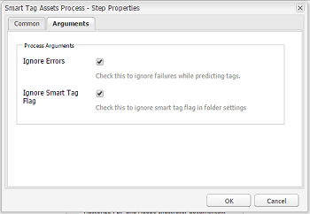

# 使用智慧型內容服務{#configure-asset-tagging-using-the-smart-content-service}設定資產標籤

您可以使用[!DNL Adobe Developer Console]將[!DNL Adobe Experience Manager]與智慧型內容服務整合。 使用此配置可從[!DNL Experience Manager]內訪問Smart Content Service。

文章詳細說明了配置Smart Content Service所需的下列主要工作。 在後端，[!DNL Experience Manager]伺服器會先使用[!DNL Adobe Developer Console]閘道驗證您的服務認證，然後再將您的要求轉送至智慧型內容服務。

1. [在中建立智](#obtain-public-certificate) 能內容服 [!DNL Experience Manager] 務配置以生成公共密鑰。[取得公開憑證](#obtain-public-certificate)以進行 OAuth 整合。

1. [在 Adobe 開發人員控制台中建立整合](#create-adobe-i-o-integration)，並上傳產生的公開金鑰。

1. [使用API金](#configure-smart-content-service) 鑰和其他來自的認證來設定您的部署 [!DNL Adobe Developer Console]。

1. [測試設定](#validate-the-configuration)。

1. （可選）[啟用資產上傳的自動標籤](#enable-smart-tagging-in-the-update-asset-workflow-optional)。

## 必備條件 {#prerequisites}

在使用Smart Content Service之前，請確定以下內容以在[!DNL Adobe Developer Console]上建立整合：

* Adobe ID 帳戶具有組織的管理員權限。

* 智慧型內容服務已為您的組織啟用。

除了上述功能外，若要啟用「增強的智慧型標籤」，請另外安裝最新的[Experience Manager Service Pack](https://helpx.adobe.com/experience-manager/aem-releases-updates.html)。

## 建立Smart Content Service配置以獲取公共證書{#obtain-public-certificate}

公共證書允許您在[!DNL Adobe Developer Console]上驗證您的配置檔案。

1. 在[!DNL Experience Manager]使用者介面中，存取&#x200B;**[!UICONTROL 工具]** > **[!UICONTROL 雲端服務]** > **[!UICONTROL 舊版雲端服務]**。

1. 在「雲端服務」頁面中，按一下「資產智慧標籤」下的「立即設定」。]****[!UICONTROL ****

1. 在&#x200B;**[!UICONTROL 建立配置]**&#x200B;對話框中，指定智慧標籤配置的標題和名稱。 按一下&#x200B;**[!UICONTROL 建立]**。

1. 在&#x200B;**[!UICONTROL AEM Smart Content Service]**&#x200B;對話方塊中，使用下列值：

   **[!UICONTROL 服務 URL]**: `https://mc.adobe.io/marketingcloud/smartcontent`

   **[!UICONTROL 授權伺服器]**: `https://ims-na1.adobelogin.com`

   現在將其他欄位留空（稍後將提供）。 按一下&#x200B;**[!UICONTROL 「確定」]**。

   

   *圖：「智慧型內容服務」對話方塊，提供內容服務URL*

   >[!NOTE]
   >
   >以[!UICONTROL 服務URL]提供的URL無法透過瀏覽器存取，並產生404錯誤。 此配置與[!UICONTROL 服務URL]參數的值相同，工作正常。 有關整體服務狀態和維護計畫，請參見[https://status.adobe.com](https://status.adobe.com)。

1. 按一下「下載OAuth整合的公用憑證&#x200B;**[!UICONTROL 」，然後下載公用憑證檔案`AEM-SmartTags.crt`。]**

   

   *圖：智慧型標籤服務的設定*

### 在證書過期時重新配置{#certrenew}

證書過期後，將不再受信任。 您無法更新已過期的憑證。若要新增憑證，請依照下列步驟操作。

1. 以管理員身分登入您的 [!DNL Experience Manager] 部署。按一 **[!UICONTROL 下「工具]** >安 **[!UICONTROL 全性]** >使 **[!UICONTROL 用者]**」。

1. 找到 **[!UICONTROL dam-update-service]** 使用者後按一下該使用者。按一下「**[!UICONTROL 密鑰庫]**」頁籤。

1. 刪除憑證已過期的現有 **[!UICONTROL similaritysearch]** 金鑰存放區。按一下&#x200B;**[!UICONTROL 「儲存並關閉」]**。

   

   *圖：刪除金鑰存放區中現有的 `similaritysearch` 項目，以新增安全性憑證。*

1. 導覽至「 **[!UICONTROL 工具]** > **[!UICONTROL 雲端服務]** >舊 **[!UICONTROL 版雲端服務」]**。按一 **[!UICONTROL 下「資產智慧標籤]** >顯 **[!UICONTROL 示設定]** >可 **[!UICONTROL 用設定」]**。按一下所需的設定。

1. 若要下載公用憑證，請按一下「下載OAuth整合的公用憑證&#x200B;]**」。**[!UICONTROL 

1. 存取[https://console.adobe.io](https://console.adobe.io)，並導覽至&#x200B;**[!UICONTROL Integrations]**&#x200B;頁面上現有的智慧型內容服務。 上傳新憑證。 如需詳細資訊，請參閱[建立Adobe Developer Console整合](#create-adobe-i-o-integration)中的指示。

## 建立Adobe Developer Console整合{#create-adobe-i-o-integration}

若要使用智慧型內容服務API，請在Adobe Developer Console中建立整合，以取得[!UICONTROL API金鑰]（產生於Adobe Developer Console整合的[!UICONTROL 用戶端ID]欄位）、[!UICONTROL 技術帳戶ID]、[!UICONTROL  ORGANIZATION&lt;A10/>&lt;A10/>&lt;A12/>中雲端組態的資產智慧標籤服務設定&lt;A11/>的ID]和[!UICONTROL 用戶端密碼]。[!DNL Experience Manager]][!UICONTROL 

1. 在瀏覽器中存取 [https://console.adobe.io](https://console.adobe.io/)。選取適當的帳戶，並確認相關聯的組織角色是系統管理員。

1. 以任何所需的名稱建立專案。按一下&#x200B;**[!UICONTROL 「新增 API」]**。

1. 在&#x200B;**[!UICONTROL 新增API]**&#x200B;頁面上，選取&#x200B;**[!UICONTROL Experience Cloud]**，然後選取&#x200B;**[!UICONTROL 智慧型內容]**。 按一下&#x200B;**[!UICONTROL 下一步]**。

1. 選取&#x200B;**[!UICONTROL 「上傳您的公開金鑰」]**。提供從 [!DNL Experience Manager] 下載的憑證檔案。畫面上會顯示[!UICONTROL 已成功上傳公開金鑰]訊息。按一下&#x200B;**[!UICONTROL 下一步]**。

   [!UICONTROL 建立新的服務帳戶(JWT) 憑證]頁面會顯示剛設定的服務帳戶的公開金鑰。

1. 按一下&#x200B;**[!UICONTROL 下一步]**。

1. 在&#x200B;**[!UICONTROL 選取產品設定檔]**&#x200B;頁面上，選取&#x200B;**[!UICONTROL 「智慧內容服務」]**。按一下&#x200B;**[!UICONTROL 「儲存已設定的 API」]**。

   此時會出現一個頁面，顯示更多關於設定的資訊。請保持此頁面的開啟，以複製並新增這些值至[!DNL Experience Manager]雲端設定的[!UICONTROL 資產智慧標籤服務設定]中，以設定智慧標籤。

   

   *圖：Adobe Developer Console中的整合詳細資訊*

## 配置Smart Content Service {#configure-smart-content-service}

若要設定整合，請使用Adobe Developer Console整合的[!UICONTROL TECHNICAL ACCOUNT ID]、[!UICONTROL ORGANIZATION ID]、[!UICONTROL CLIENT SECRET]和[!UICONTROL CLIENT ID]欄位。 建立智慧型標籤雲端設定可讓您驗證來自[!DNL Experience Manager]部署的API要求。

1. 在[!DNL Experience Manager]中，導覽至&#x200B;**[!UICONTROL 工具>雲端服務>舊版雲端服務]**&#x200B;以開啟[!UICONTROL 雲端服務]主控台。

1. 在&#x200B;**[!UICONTROL Assets Smart Tags]**&#x200B;下，開啟上述建立的組態。 在服務設定頁上，按一下&#x200B;**[!UICONTROL 編輯]**。

1. 在「 **[!UICONTROL AEM Smart Content Service]** 」對話方塊中 **[!UICONTROL ，使用「服務URL」和「授權伺服器」欄位的預先填入值]****** 。

1. 對於[!UICONTROL Api金鑰]、[!UICONTROL 技術帳戶ID]、[!UICONTROL 組織ID]和[!UICONTROL 用戶端密碼]欄位，請複製並使用[Adobe Developer Console整合](#create-adobe-i-o-integration)中產生的下列值。

   | [!UICONTROL 資產智慧標記服務設定] | [!DNL Adobe Developer Console] 整合欄位 |
   |--- |--- |
   | [!UICONTROL API 金鑰] | [!UICONTROL 用戶端ID] |
   | [!UICONTROL 技術帳戶 ID] | [!UICONTROL 技術帳戶ID] |
   | [!UICONTROL 組織 ID] | [!UICONTROL 組織 ID] |
   | [!UICONTROL 用戶端密碼] | [!UICONTROL 用戶端密碼] |

## 驗證設定 {#validate-the-configuration}

完成配置後，請使用JMX MBean來驗證配置。 若要驗證，請遵循下列步驟。

1. 在`https://[aem_server]:[port]`訪問[!DNL Experience Manager]伺服器。

1. 轉至&#x200B;**[!UICONTROL 工具>操作> Web Console]**&#x200B;以開啟OSGi控制台。 按一下&#x200B;**[!UICONTROL 主> JMX]**。

1. 按一下&#x200B;**[!UICONTROL com.day.cq.dam.similaritysearch.internal.impl]**。 它開啟&#x200B;**[!UICONTROL SimiliaritySearch雜項任務]**。

1. 按一下&#x200B;**[!UICONTROL validateConfigs()]**。 在&#x200B;**[!UICONTROL 驗證配置]**&#x200B;對話框中，按一下&#x200B;**[!UICONTROL 調用]**。

   驗證結果會顯示在相同的對話方塊中。

## 在「DAM更新資產」工作流程中啟用智慧標籤（可選）{#enable-smart-tagging-in-the-update-asset-workflow-optional}

1. 在[!DNL Experience Manager]中，轉至&#x200B;**[!UICONTROL 工具]** > **[!UICONTROL 工作流]** > **[!UICONTROL 模型]**。

1. 在「 **[!UICONTROL 工作流模型]** 」頁面上，選擇「**[!UICONTROL DAM 更新資產]** 」工作流模型。

1. 按一下工具列中的&#x200B;**[!UICONTROL 「編輯」]**。

1. 展開「側面板」以顯示步驟。拖 **[!UICONTROL 曳DAM Workflow]**  (DAM工作流程) 區段中可用的智慧型標籤資產步驟，並將其置於&#x200B;**[!UICONTROL 「處理縮 圖」]**&#x200B;步驟之後 。

   

   *圖：在「DAM 更新資產」工作流程中，在處理縮圖步驟之後新增智慧標記資產步驟。*

1. 在編輯模式中開啟步驟。在「 **[!UICONTROL 進階設定]**」下，確定已選取 **[!UICONTROL 「處理常式進階]** 」選項。

   

   *圖：設定DAM更新資產工作流程並新增智慧標籤步驟*

1. 在「參 **[!UICONTROL 數]** 」頁籤中，如果希望工作流完成，即使自動標籤步驟失敗，請選擇「忽略錯誤 **** 」。

   

   *圖：設定DAM更新資產工作流程，以新增智慧型標籤步驟並預先選取處理常式*

   若無論是否對資料夾啟用智慧標記，都要在資產上傳時標記資產，請選取&#x200B;**[!UICONTROL 「忽略智慧標記旗標」]**。

   

   *圖：設定DAM更新資產工作流程以新增智慧型標籤步驟，並選取忽略智慧型標籤標幟*

1. 按一下&#x200B;**[!UICONTROL 「確定」]**&#x200B;關閉程序步驟，然後儲存工作流程。

>[!MORELIKETHIS]
>
>* [管理智慧標籤](managing-smart-tags.md)
>* [智慧型標籤的概觀與訓練方法](enhanced-smart-tags.md)
>* [培訓智慧型內容服務的准則和規則](smart-tags-training-guidelines.md)

