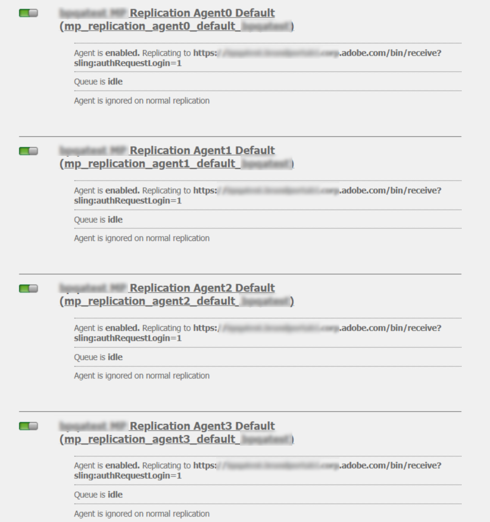
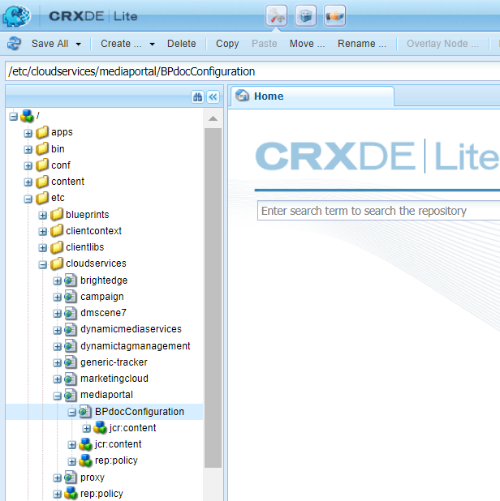

# 使用 Brand Portal 設定 AEM Assets {#configure-integration-64}

Adobe Experience Manager資產是透過[!DNL Adobe I/O]以Brand Portal設定，其中會擷取IMS代號，以便授權您的Brand Portal租用戶。

>[!NOTE]
>
>AEM 6.4.8.0及更新版本支援透過[!DNL Adobe I/O]使用Brand Portal設定AEM Assets。
>
>之前，Brand Portal是透過舊版OAuth閘道在傳統UI中設定，使用JWT權杖交換來取得IMS存取權杖以進行授權。

>[!TIP]
>
>***僅適用於現有客戶***
>
>建議您繼續使用現有的舊版OAuth閘道設定。 如果您遇到舊版OAuth閘道設定的問題，請刪除現有設定，並透過[!DNL Adobe I/O]建立新設定。

本說明說明下列兩個使用案例：

* [新配置](#configure-new-integration-64):如果您是新的Brand Portal使用者，且想使用Brand Portal設定您的AEM Assets製作例項，可以在建立新設 [!DNL Adobe I/O]定。
* [升級配置](#upgrade-integration-64):如果您是現有的Brand Portal使用者，且舊版OAuth閘道上的AEM Assets製作執行個體已使用Brand Portal進行設定，建議您刪除現有設定，並在上建立新設 [!DNL Adobe I/O]定。

提供的資訊基於以下假設：閱讀本幫助的任何人都熟悉以下技術：

* 安裝、設定和管理Adobe Experience Manager和AEM套件

* 使用Linux和Microsoft Windows作業系統

## 必備條件 {#prerequisites}

您需要下列項目才能使用 Brand Portal 設定 AEM Assets：

* 具有最新Service Pack且正在執行的AEM Assets作者例項。
* Brand Portal 租用戶 URL。
* 在 Brand Portal 租用戶的 IMS 組織具有系統管理員權限的使用者。

[下載並安裝AEM 6.4](#aemquickstart)

[下載並安裝最新的AEM Service Pack](#servicepack)

### 下載並安裝AEM 6.4 {#aemquickstart}

建議您讓AEM 6.4設定AEM製作例項。 如果您沒有AEM啟動並執行，請從下列位置下載：

* 如果您是現有AEM客戶，請從[Adobe授權網站](http://licensing.adobe.com)下載AEM 6.4。

* 如果您是Adobe合作夥伴，請使用[Adobe合作夥伴培訓計畫](https://adobe.allegiancetech.com/cgi-bin/qwebcorporate.dll?idx=82357Q)來請求AEM 6.4。

下載AEM後，如需設定AEM製作例項的指示，請參閱[部署和維護](https://helpx.adobe.com/experience-manager/6-4/sites/deploying/using/deploy.html#defaultlocalinstall)。

### 下載及安裝AEM最新Service Pack {#servicepack}

有關詳細說明，請參閱

* [AEM 6.4 Service Pack發行說明](https://helpx.adobe.com/tw/experience-manager/6-4/release-notes/sp-release-notes.html)

**如果您** 找不到最新的AEM套件或Service Pack，請聯絡客戶服務。

## 建立設定 {#configure-new-integration-64}

如果您是首次使用Brand Portal設定AEM Assets，請依所列順序執行下列步驟：

1. [取得公開憑證](#public-certificate)
1. [ [!DNL Adobe I/O] Createintegration](#createnewintegration)
1. [建立 IMS 帳戶設定](#create-ims-account-configuration)
1. [設定雲端服務](#configure-the-cloud-service)
1. [測試設定](#test-integration)

>[!NOTE]
>
>AEM Assets製作例項只能設定一個Brand Portal租用戶。

### 建立 IMS 設定 {#create-ims-configuration}

IMS 設定會以 AEM Assets 作者例項驗證您的 Brand Portal 租用戶。

IMS 設定包括兩個步驟：

* [取得公開憑證](#public-certificate)
* [建立 IMS 帳戶設定](#create-ims-account-configuration)

### 取得公開憑證 {#public-certificate}

公用證書允許您在[!DNL Adobe I/O]上驗證配置檔案。

1. 登入您的AEM Assets Author例項
預設URL:http:// localhost:4502/aem/start.html
1. 從&#x200B;**Tools** 面板，導覽至&#x200B;**[!UICONTROL Security]** >> **[!UICONTROL AdobeIMS設定]**。

   

1. Adobe IMS 設定頁面隨即開啟。

   按一下&#x200B;**[!UICONTROL 建立]**。

   這個動作會帶您前往&#x200B;**[!UICONTROL Adobe IMS 技術帳戶設定]**&#x200B;頁面。

1. 依預設，**憑證**&#x200B;標籤會開啟。

   在&#x200B;**雲端解決方案**&#x200B;中，選取 **[!UICONTROL Adobe Brand Portal]**。

1. 勾選核取方塊&#x200B;**[!UICONTROL 建立新憑證]**&#x200B;並指定憑證的&#x200B;**別名**。別名的作用是對話方塊的名稱。

1. 按一下&#x200B;**[!UICONTROL 建立憑證]**。對話方塊隨即顯示。按一下&#x200B;**[!UICONTROL 確定]**&#x200B;即可產生公開憑證。

   

1. 按一下&#x200B;**[!UICONTROL 下載公開金鑰]**，並將 *AEM-Adobe-IMS.crt* 憑證檔案儲存在電腦上。憑證檔案用於[create [!DNL Adobe I/O] integration](#createnewintegration)。

   

1. 按一下&#x200B;**[!UICONTROL 下一步]**。

   您會在&#x200B;**帳戶**&#x200B;標籤中建立 Adobe IMS 帳戶，但需要整合詳細資訊才能完成。暫時保持此頁面開啟。

   開啟新標籤並[建立 [!DNL Adobe I/O] 整合](#createnewintegration)以取得IMS帳戶設定的整合詳細資訊。

### 建立[!DNL Adobe I/O]整合 {#createnewintegration}

[!DNL Adobe I/O] 整合項目會產生 API 金鑰、用戶端密碼，以及設定 IMS 帳戶設定所需的裝載 (JWT)。

1. 以Brand Portal租用戶之IMS組織的系統管理員權限登入[!DNL Adobe I/O]主控台。

   預設 URL：[https://console.adobe.io/](https://console.adobe.io/)

1. 按一下&#x200B;**[!UICONTROL 建立整合項目]**。

1. 選取&#x200B;**[!UICONTROL 存取 API]**，然後按一下&#x200B;**[!UICONTROL 繼續]**。

   

1. 建立新整合項目的頁面隨即開啟。

   從下拉式清單中選取您的組織。

   在 **[!UICONTROL Experience Cloud]** 中選取 **[!UICONTROL AEM Brand Portal]**，然後按一下&#x200B;**[!UICONTROL 繼續]**。

   如果您已停用「Brand Portal」選項，請確認您已在 **[!UICONTROL Adobe 服務]**&#x200B;選項上方的下拉式方塊中選取正確的組織。如果您不清楚自己的組織為何，請聯絡您的管理員。

   

1. 指定整合項目的名稱和說明。按一下&#x200B;**[!UICONTROL 從電腦選取檔案]**，並上傳在[取得公開憑證](#public-certificate)區段中下載的 `AEM-Adobe-IMS.crt` 檔案 。

1. 選取組織的設定檔。

   或者，選取預設設定檔 **[!UICONTROL Assets Brand Portal]**，然後按一下&#x200B;**[!UICONTROL 建立整合項目]**。整合項目隨即建立。

1. 按一下&#x200B;**[!UICONTROL 繼續前往整合詳細資訊]**，以便檢視整合資訊。

   複製 **[!UICONTROL API 金鑰]**

   按一下&#x200B;**[!UICONTROL 擷取用戶端密碼]**&#x200B;並複製用戶端密碼金鑰。

   

1. 導覽至 **[!UICONTROL JWT]** 標籤，並複製 **[!UICONTROL JWT 裝載]**。

   API 金鑰、用戶端密碼金鑰和 JWT 裝載資訊將用來建立 IMS 帳戶設定。

### 建立 IMS 帳戶設定 {#create-ims-account-configuration}

請確認您已執行下列步驟：

* [取得公開憑證](#public-certificate)
* [建立 [!DNL Adobe I/O] 整合](#createnewintegration)

**建立 IMS 帳戶設定的步驟：**

1. 開啟 IMS 設定頁面&#x200B;**[!UICONTROL 帳戶]**&#x200B;標籤。在[取得公開憑證](#public-certificate)這一節的結尾，您已保持此頁面開啟。

1. 指定 IMS 帳戶的&#x200B;**[!UICONTROL 標題]**。

   在&#x200B;**[!UICONTROL 授權伺服器]**，輸入 URL：[https://ims-na1.adobelogin.com/](https://ims-na1.adobelogin.com/)

   貼上您在[Create [!DNL Adobe I/O] integration](#createnewintegration)結尾複製的API金鑰、用戶端密碼和JWT裝載。

   按一下&#x200B;**[!UICONTROL 建立]**。

   整合項目隨即建立。

   

1. 選取 IMS 設定，然後按一下&#x200B;**[!UICONTROL 檢查健康狀態]**。對話方塊隨即顯示。

   按一下&#x200B;**[!UICONTROL 檢查]**。成功連線時，*已成功擷取 Token* 訊息就會顯示。

   

>[!CAUTION]
>
>您只能有一個IMS設定。 請勿建立多個 IMS 組態。
>
>確認IMS設定通過健康狀況檢查。 如果配置未通過運行狀況檢查，則無效。 您必須刪除它，然後建立新的有效配置。

### 設定雲端服務 {#configure-the-cloud-service}

執行下列步驟以建立 Brand Portal 雲端服務設定：

1. 登入您的AEM Assets Author例項

   預設URL:http:// localhost:4502/aem/start.html
1. 從&#x200B;**Tools** 面板，導覽至&#x200B;**[!UICONTROL Cloud Services>>AEM Brand Portal]**。

   「Brand Portal 設定」頁面隨即開啟。

1. 按一下&#x200B;**[!UICONTROL 建立]**。

1. 指定設定的&#x200B;**[!UICONTROL 標題]**。

   選取您在[建立 IMS 帳戶設定](#create-ims-account-configuration)步驟中建立的 IMS 設定。

   在&#x200B;**[!UICONTROL 服務 URL]**&#x200B;中，輸入您的 Brand Portal 租用戶 URL。

   

1. 按一下&#x200B;**[!UICONTROL 儲存並關閉]**。雲端設定此時已建立。您的AEM Assets作者例項現在已與Brand Portal租用戶整合。

### 測試設定 {#test-integration}

1. 登入您的AEM Assets Author例項

   預設URL:http:// localhost:4502/aem/start.html

1. 從&#x200B;**Tools** 面板，導航至&#x200B;**[!UICONTROL Deployment>>Replication]**。

   

1. 復寫頁面隨即開啟。

   按一下作者&#x200B;]**上的「代理」。**[!UICONTROL 

   

1. 為每個租戶建立四個複製代理。

   找出您Brand Portal租用戶的復寫代理。

   按一下復寫代理URL。

   

   >[!NOTE]
   >
   >復寫代理並行工作，並平等共用作業分配，從而將發佈速度提高了原始速度的四倍。 設定雲端服務後，若要啟用依預設啟動的復寫代理，以啟用多個資產的平行發佈，則不需要額外設定。

1. 若要驗證AEM Assets作者與Brand Portal之間的連線，請按一下「**[!UICONTROL 測試連線]**」。

   

1. 查看測試結果底部以驗證複製是否成功。

   

1. 逐一驗證所有四個複製代理的測試結果。

   >[!NOTE]
   >
   >請避免停用任何復寫代理，因為這可能會導致某些資產的復寫失敗。
   >
   >請確定所有四個復寫代理均已設定，以避免逾時錯誤。 請參閱[疑難排解平行發佈至Brand Portal時的問題](https://docs.adobe.com/content/help/en/experience-manager-brand-portal/using/publish/troubleshoot-parallel-publishing.html#connection-timeout)。

Brand Portal已成功設定為您的AEM Assets製作例項。 您現在可以：

* [從 AEM Assets 發佈資產到 Brand Portal](../assets/brand-portal-publish-assets.md)
* [從 AEM Assets 發佈資料夾到 Brand Portal](../assets/brand-portal-publish-folder.md)
* [從 AEM Assets 發佈集合到 Brand Portal](../assets/brand-portal-publish-collection.md)
* [設定Asset ](https://docs.adobe.com/content/help/zh-Hant/experience-manager-brand-portal/using/asset-sourcing-in-brand-portal/brand-portal-asset-sourcing.html) Source ，讓Brand Portal使用者能夠貢獻資產並將資產發佈至AEM Assets。

## 升級配置 {#upgrade-integration-64}

請依所列順序執行下列步驟以升級現有設定：
1. [驗證正在運行的作業](#verify-jobs)
1. [刪除現有配置](#delete-existing-configuration)
1. [建立設定](#configure-new-integration-64)

### 驗證正在運行的作業 {#verify-jobs}

進行任何修改之前，請確定您的AEM Assets製作執行個體上未執行任何發佈工作。 為此，您可以驗證所有四個複製代理，並確保隊列是理想/空的。

1. 登入您的AEM Assets Author例項

   預設URL:http:// localhost:4502/aem/start.html

1. 從&#x200B;**Tools** 面板，導航至&#x200B;**[!UICONTROL Deployment>>Replication]**。

1. 復寫頁面隨即開啟。

   按一下作者&#x200B;]**上的「代理」。**[!UICONTROL 

   

1. 找出您Brand Portal租用戶的復寫代理。

   確保所有復寫代理的&#x200B;**Queue均為Idle**，則沒有任何發佈作業處於活動狀態。

   

### 刪除現有配置 {#delete-existing-configuration}

刪除現有配置時，必須運行以下檢查清單。
* 刪除所有四個複製代理
* 刪除雲端服務
* 刪除MAC用戶

執行下列步驟以刪除現有配置：

1. 登入您的AEM Assets製作執行個體並以管理員身分開啟CRX Lite。

   預設URL:http:// localhost:4502/crx/de/index.jsp

1. 導覽至`/etc/replications/agents.author`，並刪除您Brand Portal租用戶的所有四個復寫代理。

   

1. 導覽至`/etc/cloudservices/mediaportal`並刪除&#x200B;**Cloud Service設定**。

   

1. 導覽至`/home/users/mac`並刪除您Brand Portal租用戶的&#x200B;**MAC使用者**。

   

您現在可以在[!DNL Adobe I/O]上的AEM 6.4製作執行個體上[建立設定](#configure-new-integration-64)。

<!--
   Comment Type: draft

   <li> </li>
   -->

<!--
   Comment Type: draft

   <li>Step text</li>
   -->

復寫成功後，您可以將資產、資料夾和集合發佈至Brand Portal。 如需詳細資訊，請參閱：

* [將資產發佈至 Brand Portal](brand-portal-publish-assets.md)
* [將資產和資料夾發佈至Brand Portal](brand-portal-publish-folder.md)
* [將集合發佈至Brand Portal](brand-portal-publish-collection.md)
