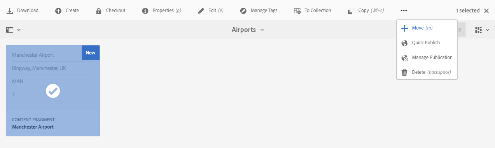

# 管理內容片段 {#managing-content-fragments}

>[!CAUTION]
>
>AEM 6.4已結束延伸支援，本檔案不再更新。 如需詳細資訊，請參閱 [技術支援期](https://helpx.adobe.com//tw/support/programs/eol-matrix.html). 尋找支援的版本 [此處](https://experienceleague.adobe.com/docs/).

>[!CAUTION]
>
>某些內容片段功能需要應用 [AEM 6.4 Service Pack 2(6.4.2.0)或更新版本](/help/release-notes/sp-release-notes.md).

內容片段會儲存為 **[!UICONTROL 資產]**，因此主要透過 **[!UICONTROL 資產]** 控制台。

>[!NOTE]
>
>內容片段隨後用於編寫頁面；請參閱 [使用內容片段進行頁面編寫](/help/sites-authoring/content-fragments.md).

## 建立內容片段 {#creating-content-fragments}

### 建立內容模型 {#creating-a-content-model}

[內容片段模型](content-fragments-models.md) 可在使用結構化內容建立內容片段之前啟用和建立。

>[!NOTE]
>
>請參閱 [開發內容片段](/help/sites-developing/customizing-content-fragments.md) 提供有關模板的進一步資訊；用於簡單內容片段。

### 建立內容片段 {#creating-a-content-fragment}

建立內容片段的方法（基本上）對於簡單和結構化片段都相同：

1. 導覽至您 **[!UICONTROL 要建立]** 片段的「資產」檔案夾。
1. 依序選 **[!UICONTROL 擇「建立]**」、「 **[!UICONTROL 內容片段]** 」以開啟精靈。
1. 嚮導的第一步要求您指定新片段的基礎。

   * 這可以是：

      * [範本](/help/sites-developing/content-fragment-templates.md)  — 例如 **[!UICONTROL 簡單片段]**
      * [模型](content-fragments-models.md)  — 用於建立需要結構化內容的片段；例如， **機場** 模型
   * 將顯示所有可用的模板和模型。

   選取後，請使用 **[!UICONTROL 下一個]** 繼續。

   

1. 在「屬 **[!UICONTROL 性]** 」步驟中指定：

   * **[!UICONTROL 基本]**

      * **[!UICONTROL 標題]**

         片段標題。

         必要.

      * **[!UICONTROL 說明]**
      * **[!UICONTROL 標記]**
   * **[!UICONTROL 進階]**

      * **[!UICONTROL 名稱]**

         名稱；將用來形成URL。

         強制；會自動從標題衍生出，但可更新。

1. 選擇 **[!UICONTROL Create]**  (建立) 以完成操作，然後選擇 **[!UICONTROL Open]** the fragment for editing (開啟片段以進行編輯) 或返回控制 **[!UICONTROL 台完成]**。

## 內容片段的動作 {#actions-for-a-content-fragment}

在 **[!UICONTROL 資產]** console一系列動作可供您的內容片段使用，包括：

* 從工具列；選取片段後，所有適當的動作皆可使用。
* As [快速動作](/help/sites-authoring/basic-handling.md#quick-actions);個別片段卡片可用的動作子集。

選取片段以顯示包含適用動作的工具列：

* **[!UICONTROL 下載]**

   * 將片段儲存為ZIP檔案；您可以定義是否要包含元素、變數、中繼資料。

* **[!UICONTROL 建立]**
* **[!UICONTROL 結帳]**
* **[!UICONTROL 屬性]**

   * 可讓您檢視和/或編輯片段的中繼資料。

* **[!UICONTROL 編輯]**

   * 可讓您 [開啟片段以編輯內容](content-fragments-variations.md) 及其元素、變數、相關內容和中繼資料。

* **[!UICONTROL 管理標記]**
* **[!UICONTROL 至集合]**

   * 新增片段至集合。
   * 當 [將集合與片段關聯](content-fragments-assoc-content.md#adding-associated-content).

* **[!UICONTROL 複製/貼上]**
* **[!UICONTROL 移動]**
* **[!UICONTROL 快速發佈]**
* **[!UICONTROL 管理發佈]**
* **[!UICONTROL 刪除]**

>[!NOTE]
>
>其中很多 [資產的標準動作](managing-assets-touch-ui.md) 和/或 [案頭應用程式](https://helpx.adobe.com/tw/experience-manager/desktop-app/aem-desktop-app.html).

## 開啟片段編輯器 {#opening-the-fragment-editor}

若要開啟片段以進行編輯：

>[!CAUTION]
>
>若要編輯您需要的內容片段 [適當的權限](/help/sites-developing/customizing-content-fragments.md#asset-permissions). 如果您遇到問題，請與系統管理員聯繫。

1. 使用 **[!UICONTROL 資產]** 主控台，導覽至內容片段的位置。
1. 開啟片段以進行編輯，方法為：

   * 按一下/點選片段或片段連結（取決於主控台檢視）。
   * 選取片段，然後 **[!UICONTROL 編輯]** 的上界。

   片段編輯器將開啟：

   

   >[!NOTE]
   >
   >1. 內容頁面上已參考片段時，會顯示訊息。
   >
   >2. 可使用 **[!UICONTROL 切換側面板]** 表徵圖。

1. 使用側面板中的圖示，導覽這三個模式：

   * 變數： [編輯內容](#editing-the-content-of-your-fragment) 和 [管理變數](#creating-and-managing-variations-within-your-fragment)
   * [註解](content-fragments-variations.md#annotating-a-content-fragment)
   * [相關聯的內容](#associating-content-with-your-fragment)
   * [中繼資料](#viewing-and-editing-the-metadata-properties-of-your-fragment)

   

1. 進行變更後，請使用 **[!UICONTROL 儲存]** 或 **[!UICONTROL 取消]** 視需要。

   >[!NOTE]
   >
   >「儲 **[!UICONTROL 存]** 」和「取 **[!UICONTROL 消」都會退出編輯器——請參閱「]** 儲存」、「取消」和「版本」，以取得有關這兩個選項如何對內容片段運作的完整資訊。

## 儲存、取消和版本 {#save-cancel-and-versions}

>[!NOTE]
>
>版本也可以是 [從時間表建立、比較和還原](https://helpx.adobe.com/experience-manager/6-3/assets/using/content-fragments-managing.html#timeline-for-content-fragments).

編輯器有兩個選項：

* **[!UICONTROL 儲存]**

   會儲存最新變更並退出編輯器。

   >[!CAUTION]
   >
   >若要編輯您需要的內容片段 [適當的權限](/help/sites-developing/customizing-content-fragments.md#asset-permissions). 如果您遇到問題，請與系統管理員聯繫。

   >[!NOTE]
   >
   >在選取之前，可以保留在編輯器中進行一系列變更 **[!UICONTROL 儲存]**.

   >[!CAUTION]
   >
   >除了僅保存更改， **[!UICONTROL 儲存]** 也會更新任何參考，並確保dispatcher會視需要被刷新。 這些變更可能需要時間處理。 因此，對於大型/複雜/重載的系統，可能會產生效能影響。
   >
   >
   >請在使用 **[!UICONTROL 儲存]** 然後快速重新輸入片段編輯器，以進行並儲存進一步的變更。

* **[!UICONTROL 取消]**

   會退出編輯器，而不儲存最新變更。

編輯內容片段時，AEM會自動建立版本，以確保在您 **[!UICONTROL 取消]** 您的變更：

1. 開啟內容片段以編輯AEM時，會檢查是否有Cookie型代號，以指出 *編輯工作階段* 存在：

   1. 如果找到代號，則會將片段視為現有編輯工作階段的一部分。
   1. 如果代號為 *not* 可用且使用者開始編輯內容，即會建立版本，並將此新編輯工作階段的Token傳送至用戶端，供用戶端儲存在Cookie中。

1. 當有 *活動* 編輯工作階段時，所編輯的內容會每600秒自動儲存一次（預設）。

   >[!NOTE]
   >
   >可使用 `/conf` 機制。
   >
   >預設值，請參閱：
   >
   >`/libs/settings/dam/cfm/jcr:content/autoSaveInterval`

1. 如果使用者選取 **[!UICONTROL 取消]** 編輯時，會還原在編輯工作階段開始時建立的版本，並移除代號以結束編輯工作階段。
1. 如果使用者選取 **[!UICONTROL 儲存]** 編輯、更新的元素/變體會持續保存，並移除代號以結束編輯工作階段。

## 編輯片段的內容 {#editing-the-content-of-your-fragment}

開啟片段後，您可以使用 [變異](content-fragments-variations.md) 標籤來製作內容。

## 在片段中建立和管理變體 {#creating-and-managing-variations-within-your-fragment}

建立主內容後，您就可以建立和管理 [變異](content-fragments-variations.md) 內容。

## 將內容與您的片段關聯 {#associating-content-with-your-fragment}

您也可以 [關聯內容](content-fragments-assoc-content.md) 片段。 這會提供連線，讓資產（即影像）在新增至內容頁面時，可（選擇性）與片段搭配使用。

## 檢視和編輯片段的中繼資料（屬性） {#viewing-and-editing-the-metadata-properties-of-your-fragment}

您可以使用 [[!UICONTROL 中繼資料]](content-fragments-metadata.md) 標籤。

## 內容片段時間軸 {#timeline-for-content-fragments}

除了標準選項外， [時間表](managing-assets-touch-ui.md#timeline) 提供內容片段專用的資訊和動作：

* 查看有關版本、注釋和注釋的資訊
* 版本動作

   * **[[!UICONTROL 回復到此版本]](#reverting-to-a-version)** （選取現有片段，然後選取特定版本）
   * **[[!UICONTROL 與目前比較]](#comparing-fragment-versions)** （選取現有片段，然後選取特定版本）
   * 新增 **[!UICONTROL 標籤]** 和/或 **[!UICONTROL 註解]** （選取現有片段，然後選取特定版本）
   * **[!UICONTROL 另存為版本]** （選取現有片段，然後是時間軸底部的向上箭頭）

* 註解動作

   * **[!UICONTROL 刪除]**

>[!NOTE]
>
>評論包括：
>
>* 所有資產的標準功能
>* 在時間軸中製作
>* 與片段資產相關
>
>註解（適用於內容片段）包括：
>
>* 在片段編輯器中輸入
>* 特定於片段內選取的文字區段

例如：

## 比較片段版本 {#comparing-fragment-versions}

此 **[!UICONTROL 與目前比較]** 動作可從 [[!UICONTROL 時間表]](https://helpx.adobe.com/experience-manager/6-3/assets/using/content-fragments-managing.html#timeline-for-content-fragments) 在您選取特定版本後。

此選項將開啟：

* the **[!UICONTROL 目前]** （最新）版本（左）

* 所選版本 **v&lt;*x.y*>** （右）

它們會並排顯示，其中：

* 會強調顯示任何差異

   * 已刪除的文本 — 紅色
   * 插入的文本 — 綠色
   * 已更換文字 — 藍色

* 全螢幕圖示可讓您自行開啟任一版本；然後切換回平行檢視
* 您可以 **[!UICONTROL 還原]** 至特定版本
* **[!UICONTROL 完成]** 會將您傳回主控台

>[!NOTE]
>
>比較片段時無法編輯片段內容。

## 回復為版本  {#reverting-to-a-version}

您可以還原為片段的特定版本：

* 直接從 [[!UICONTROL 時間表]](content-fragments-managing.md#timeline-for-content-fragments).

   選取所需的版本，然後 **[!UICONTROL 回復到此版本]** 動作。

* 同時 [將版本與目前版本比較](content-fragments-managing.md#comparing-fragment-versions) 您可以 **[!UICONTROL 還原]** 至所選版本。

## 發佈和參考片段 {#publishing-and-referencing-a-fragment}

>[!CAUTION]
>
>如果您的片段以模型為基礎，則應確定 [模型已發佈](content-fragments-models.md#publishing-a-content-fragment-model).
>
>如果您發佈的內容片段尚未發佈模型，則選取清單會指出此點，且模型將會隨片段發佈。

內容片段必須發佈以便在發佈環境中使用。 可發佈：

* 建立後；從 **[!UICONTROL 資產]** 控制台。
* 當您 [發佈使用片段的頁面](/help/sites-authoring/content-fragments.md#publishing);片段會列在頁面參考中。

>[!CAUTION]
>
>發佈和/或參考片段後，製作者開啟片段並再次編輯時AEM會顯示警告。 這將警告對片段的變更也會影響參考的頁面。

## 刪除片段 {#deleting-a-fragment}

刪除片段：

1. 在 **[!UICONTROL 資產]** 主控台導覽至內容片段的位置。
1. 選取片段。

   >[!NOTE]
   >
   >此 **[!UICONTROL 刪除]** 動作無法作為快速動作使用。

1. 選擇 **[!UICONTROL 刪除]** 的上界。
1. 確認 **[!UICONTROL 刪除]** 動作。

   >[!CAUTION]
   >
   >如果片段已在頁面中參考，您會看到警告訊息，並需要確認您要繼續執行強制刪 **[!UICONTROL 除]**。片段及其內容片段元件將會從任何內容頁面中刪除。
