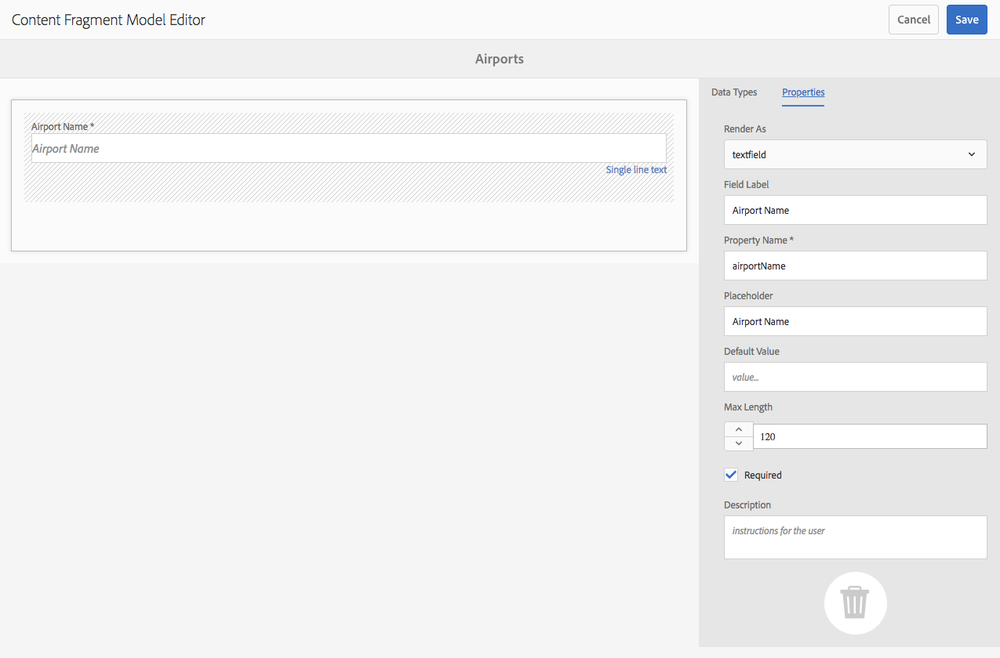

# 內容片段模型 {#content-fragment-models}

>[!CAUTION]
>
>某些內容片段功能需要應用[AEM 6.4 Service Pack 2(6.4.2.0)或更新版本](../release-notes/sp-release-notes.md)。

內容片段模型定義[內容片段](content-fragments.md)的內容結構。

## 啟用內容片段模型{#enable-content-fragment-models}

>[!CAUTION]
>
>如果未啟用&#x200B;**[!UICONTROL 內容片段模型]**，則&#x200B;**[!UICONTROL 建立]**&#x200B;選項將無法用於建立新模型。

若要啟用內容片段模型，您必須：

* 在配置管理器中啟用內容片段模型
* 將設定套用至您的「資產」檔案夾

### 在Configuration Manager {#enable-content-fragment-models-in-configuration-manager}中啟用內容片段模型

要建立新的內容片段模型[, ](#creating-a-content-fragment-model)必須&#x200B;**首先使用配置管理器啟用它們：**

1. 導覽至「 **[!UICONTROL 工具]**」、「 **[!UICONTROL 一般]**」，然後開啟「 **[!UICONTROL 設定瀏覽器]**」。
   * 如需詳細資訊，請參閱[設定瀏覽器檔案](/help/sites-administering/configurations.md)。
1. 選擇適合您網站的位置。
1. 使用&#x200B;**[!UICONTROL Create]**&#x200B;開啟對話方塊，您可在其中：

   1. 指定&#x200B;**[!UICONTROL Title]**。
   1. 選擇&#x200B;**[!UICONTROL 內容片段模型]**&#x200B;以啟用其使用。

   

1. 選擇&#x200B;**[!UICONTROL 建立]**&#x200B;以保存定義。

### 將設定套用至您的資產資料夾{#apply-the-configuration-to-your-assets-folder}

當為內容片段模型啟用配置&#x200B;**[!UICONTROL global]**&#x200B;時，使用者建立的任何模型都可用於任何「資產」檔案夾。

若要搭配可比的「資產」檔案夾使用其他設定 (例如排除全域)，您必須定義連線。這是使用適當資 **[!UICONTROL 料夾「資]** 料夾屬性 **[!UICONTROL 」的「雲端服務]** 」標籤中的「 **[!UICONTROL 設定]** 」來完成的。

## 建立內容片段模型{#creating-a-content-fragment-model}

1. 導覽至&#x200B;**[!UICONTROL 工具]**、**[!UICONTROL 資產]**，然後開啟&#x200B;**[!UICONTROL 內容片段模型]**。
1. 導覽至適合您[configuration](#enable-content-fragment-models)的資料夾。
1. 使用&#x200B;**[!UICONTROL Create]**&#x200B;開啟嚮導。

   >[!CAUTION]
   >
   >如果[未啟用內容片段模型的使用](#enable-content-fragment-models)，則&#x200B;**Create**&#x200B;選項將不可用。

1. 指定「模 **[!UICONTROL 型標題」]**。您也可以視需要 **[!UICONTROL 新增「說]** 明」。

   

1. 使用&#x200B;**[!UICONTROL Create]**&#x200B;來儲存空的模型。 一條消息將指示操作成功，您可以選擇&#x200B;**[!UICONTROL Open]**&#x200B;立即編輯模型，或選擇&#x200B;**[!UICONTROL Done]**&#x200B;返回控制台。

## 定義內容片段模型{#defining-your-content-fragment-model}

內容片段模型有效地定義了所產生內容片段的結構。 使用模型編輯器可以添加和配置必填欄位：

>[!CAUTION]
>
>編輯現有的內容片段模型可能會影響相依片段。

1. 導覽至&#x200B;**[!UICONTROL 工具]**、**[!UICONTROL 資產]**，然後開啟&#x200B;**[!UICONTROL 內容片段模型]**。

1. 導覽至包含內容片段模型的檔案夾。
1. 開啟&#x200B;**[!UICONTROL Edit]**&#x200B;所需的型號；使用快速動作，或從工具列中選取模型和動作。

   開啟模型編輯器後，會顯示：

   * 左：欄位已定義
   * 右：資 **[!UICONTROL 料類型]** ，可用於建立欄位( **[!UICONTROL 和屬性]** ，以供建立欄位後使用)

   >[!NOTE]
   >
   >當欄位為&#x200B;**Required**&#x200B;時，左側窗格中指示的&#x200B;**Label**&#x200B;將標示為星號(**&amp;ast;**)。

   

1. **要添加欄位**

   * 將必要的資料類型拖曳至欄位的必要位置：

   

   * 將欄位添加到模型後，右側面板將顯示可為該特定資料類型定義的&#x200B;**屬性**。 您可以在這裡定義該欄位的必要項目。 例如：

   

1. **刪除欄位**

   選取必要欄位，然後按一下／點選垃圾桶圖示。 系統會要求您確認動作。

   

1. 新增所有必填欄位並定義屬性後，請使用&#x200B;**[!UICONTROL Save]**&#x200B;來保存定義。 例如：

   

## 刪除內容片段模型{#deleting-a-content-fragment-model}

>[!CAUTION]
>
>刪除內容片段模型可能會影響相依片段。

要刪除內容片段模型：

1. 導覽至&#x200B;**[!UICONTROL 工具]**、**[!UICONTROL 資產]**，然後開啟&#x200B;**[!UICONTROL 內容片段模型]**。

1. 導覽至包含內容片段模型的檔案夾。
1. 從工具欄中選擇型號，然後選擇&#x200B;**[!UICONTROL Delete]**。

   >[!NOTE]
   >
   >如果模型被參照，則會發出警告。 採取適當行動。

## 發佈內容片段模型{#publishing-a-content-fragment-model}

內容片段模型必須在發佈任何相依內容片段時／之前發佈。

若要發佈內容片段模型：

1. 導覽至&#x200B;**[!UICONTROL 工具]**、**[!UICONTROL 資產]**，然後開啟&#x200B;**[!UICONTROL 內容片段模型]**。

1. 導覽至包含內容片段模型的檔案夾。
1. 從工具列中選擇您的型號，然後按&#x200B;**[!UICONTROL Publish]**。

   >[!NOTE]
   >
   >如果您發佈模型尚未發佈的內容片段，則選擇清單會指出此點，而模型將會隨片段一起發佈。

