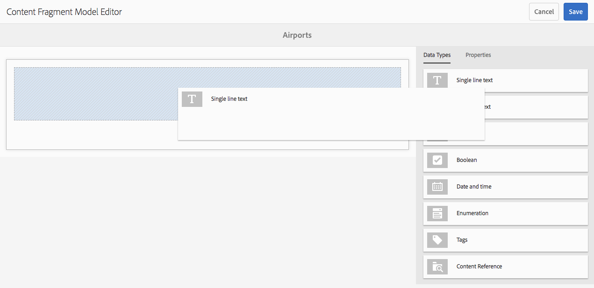

# 內容片段模型 {#content-fragment-models}

>[!CAUTION]
>
>AEM 6.4已結束延伸支援，本檔案不再更新。 如需詳細資訊，請參閱 [技術支援期](https://helpx.adobe.com//tw/support/programs/eol-matrix.html). 尋找支援的版本 [此處](https://experienceleague.adobe.com/docs/).

>[!CAUTION]
>
>某些內容片段功能需要應用 [AEM 6.4 Service Pack 2(6.4.2.0)或更新版本](../release-notes/sp-release-notes.md).

內容片段模型定義 [內容片段](content-fragments.md).

## 啟用內容片段模型 {#enable-content-fragment-models}

>[!CAUTION]
>
>如果您未啟用 **[!UICONTROL 內容片段模型]**, **[!UICONTROL 建立]** 建立新模型時將無法使用選項。

若要啟用內容片段模型，您需要：

* 在Configuration Manager中啟用內容片段模型的使用
* 將設定套用至資產資料夾

### 在Configuration Manager中啟用內容片段模型 {#enable-content-fragment-models-in-configuration-manager}

結束日期 [建立新內容片段模型](#creating-a-content-fragment-model) you **必須** 首先，使用Configuration Manager啟用它們：

1. 導覽至「 **[!UICONTROL 工具]**」、「 **[!UICONTROL 一般]**」，然後開啟「 **[!UICONTROL 設定瀏覽器]**」。
   * 請參閱 [設定瀏覽器檔案](/help/sites-administering/configurations.md) 以取得更多資訊。
1. 選取適合您網站的位置。
1. 使用 **[!UICONTROL 建立]** 開啟對話框，其中：

   1. 指定 **[!UICONTROL 標題]**.
   1. 選擇 **[!UICONTROL 內容片段模型]** 以啟用其使用。

   

1. 選擇 **[!UICONTROL 建立]** 以儲存定義。

### 套用設定到資產資料夾 {#apply-the-configuration-to-your-assets-folder}

設定時 **[!UICONTROL 全球]** 為內容片段模型啟用，則使用者建立的任何模型都可用於任何「資產」資料夾。

若要搭配可比的「資產」檔案夾使用其他設定 (例如排除全域)，您必須定義連線。這是使用適當資 **[!UICONTROL 料夾「資]** 料夾屬性 **[!UICONTROL 」的「雲端服務]** 」標籤中的「 **[!UICONTROL 設定]** 」來完成的。

## 建立內容片段模型 {#creating-a-content-fragment-model}

1. 導覽至 **[!UICONTROL 工具]**, **[!UICONTROL 資產]**，然後開啟 **[!UICONTROL 內容片段模型]**.
1. 導覽至適合您 [配置](#enable-content-fragment-models).
1. 使用 **[!UICONTROL 建立]** 來開啟嚮導。

   >[!CAUTION]
   >
   >如果[尚未啟用使用內容片段模型](#enable-content-fragment-models)，則&#x200B;**建立**&#x200B;選項將無法使用。

1. 指定「模 **[!UICONTROL 型標題」]**。您也可以視需要 **[!UICONTROL 新增「說]** 明」。

   

1. 使用 **[!UICONTROL 建立]** 以保存空模型。 訊息會指出動作的成功，您可以選取 **[!UICONTROL 開啟]** 要立即編輯模型，或 **[!UICONTROL 完成]** 返回控制台。

## 定義內容片段模型 {#defining-your-content-fragment-model}

內容片段模型有效地定義了產生的內容片段的結構。 使用模型編輯器，可以添加和配置必需欄位：

>[!CAUTION]
>
>編輯現有內容片段模型可能會影響相依片段。

1. 導覽至 **[!UICONTROL 工具]**, **[!UICONTROL 資產]**，然後開啟 **[!UICONTROL 內容片段模型]**.

1. 導覽至內容片段模型的資料夾。
1. 開啟所需的模型 **[!UICONTROL 編輯]**;使用快速操作，或從工具欄中選取模型，然後選取操作。

   開啟模型編輯器後，會顯示：

   * 左：欄位已定義
   * 右：資 **[!UICONTROL 料類型]** ，可用於建立欄位( **[!UICONTROL 和屬性]** ，以供建立欄位後使用)

   >[!NOTE]
   >
   >欄位為 **必填**, **標籤** 在左窗格中所示，會以字元(**&amp;ast;**)。

   

1. **新增欄位的方式**

   * 將必要的資料類型拖曳至欄位的必要位置：

   

   * 將欄位新增至模型後，右側面板會顯示 **屬性** 可針對該特定資料類型定義。 您可以在此定義該欄位的必要項目。 例如：

   

1. **刪除欄位**

   選取必要欄位，然後按一下/點選垃圾桶圖示。 系統會要求您確認動作。

   

1. 新增所有必填欄位並定義屬性後，請使用 **[!UICONTROL 儲存]** 以保留定義。 例如：

   

## 刪除內容片段模型 {#deleting-a-content-fragment-model}

>[!CAUTION]
>
>刪除內容片段模型可能會影響相依片段。

若要刪除內容片段模型：

1. 導覽至 **[!UICONTROL 工具]**, **[!UICONTROL 資產]**，然後開啟 **[!UICONTROL 內容片段模型]**.

1. 導覽至內容片段模型的資料夾。
1. 選取模型，隨後 **[!UICONTROL 刪除]** 的上界。

   >[!NOTE]
   >
   >如果參考模型，則會發出警告。 採取適當行動。

## 發佈內容片段模型 {#publishing-a-content-fragment-model}

內容片段模型需要在任何相關內容片段發佈時/之前發佈。

若要發佈內容片段模型：

1. 導覽至 **[!UICONTROL 工具]**, **[!UICONTROL 資產]**，然後開啟 **[!UICONTROL 內容片段模型]**.

1. 導覽至內容片段模型的資料夾。
1. 選取模型，隨後 **[!UICONTROL 發佈]** 的上界。

   >[!NOTE]
   >
   >如果您發佈的內容片段尚未發佈模型，則選取清單會指出此點，且模型將會隨片段發佈。
