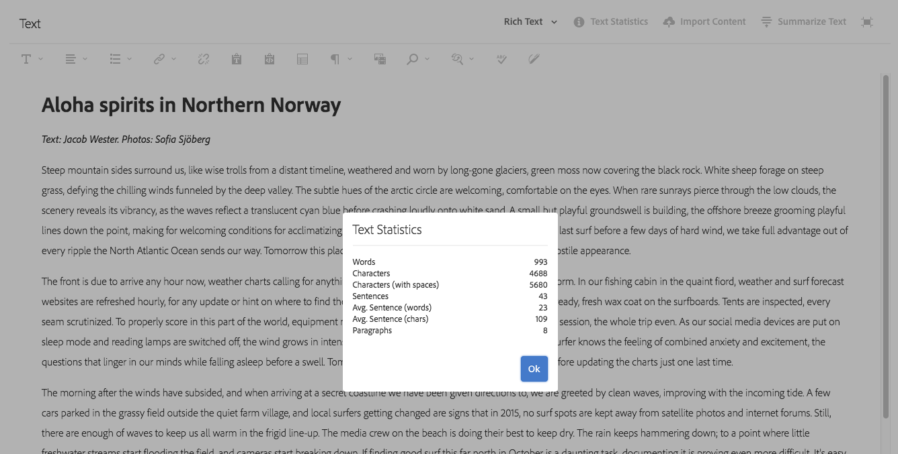
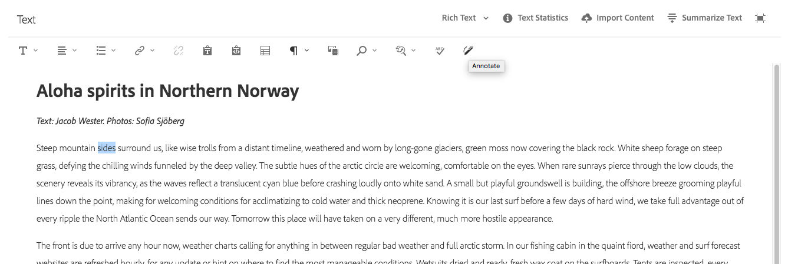

# 變化 - 編寫片段內容 {#variations-authoring-fragment-content}

>[!CAUTION]
>
>某些內容片段功能需要應用 [AEM 6.4 Service Pack 2(6.4.2.0)或更新版本](../release-notes/sp-release-notes.md).

[變異](content-fragments.md#constituent-parts-of-a-content-fragment) 是內容片段的重要功能，因為它們可讓您建立和編輯主要內容的復本，以用於特定頻道和/或案例。

從 **變異** 標籤：

* [輸入內容](#authoring-your-content) 您的片段
* [建立和管理變數](#managing-variations) 的 **主版** 內容

根據要編輯的資料類型執行一系列其他動作；例如：

* [將視覺化資產插入片段](#inserting-assets-into-your-fragment) （影像）
* 在之間選擇 [RTF](#rich-text), [純文字](#plain-text) 和 [Markdown](#markdown) 編輯

* [上傳內容](#uploading-content)

* [查看關鍵統計資訊](#viewing-key-statistics) （關於多行文本）
* [摘要文字](#summarizing-text)

* [將變數與主內容同步](#synchronizing-with-master)

>[!CAUTION]
>
>發佈和/或參考片段後，製作者開啟片段並再次編輯時AEM會顯示警告。 這將警告對片段的變更也會影響參考的頁面。

## 編寫內容 {#authoring-your-content}

當您開啟內容片段進行編輯時， **變異** 標籤預設為開啟。 您可以在此為「主版」或您擁有的任何變體製作內容。 您可以：

* 直接在中進行編輯 **變異** 標籤
* 開啟 [全螢幕編輯器](#full-screen-editor) 至：

   * 選取 [格式](#formats)
   * 查看更多編輯選項( [RTF](#rich-text) 格式)
   * 存取範圍 [動作](#actions)

例如：

* 編輯簡單片段

   簡單片段包含一個多行文字欄位（可從全螢幕編輯器新增視覺資產）。

   

* 使用結構化內容編輯片段

   結構化片段包含內容模型中定義之各種資料類型的各種欄位。 對於任何多行欄位， [全螢幕編輯器](#full-screen-editor) 的URL區段。

   

### 全螢幕編輯器 {#full-screen-editor}

編輯多行文本欄位時，可以開啟全螢幕編輯器：

全螢幕編輯器提供：

* 存取各種 [動作](#actions)
* 視 [格式](#formats)，其他格式選項([RTF](#rich-text))

### 動作 {#actions}

下列動作也可供使用(適用於 [格式](#formats))，當全螢幕編輯器（即多行文字）開啟時：

* 選取 [格式](#formats) ([RTF](#rich-text), [純文字](#plain-text), [Markdown](#markdown))
* [顯示文本統計資訊](#viewing-key-statistics)
* [上傳內容](#uploading-content)
* [與主版同步](#synchronizing-with-master) （編輯變數時）
* [摘要文字](#summarizing-text)
* [注釋](content-fragments-variations.md#annotating-a-content-fragment) 您的文字

* [將視覺化資產插入片段](#inserting-assets-into-your-fragment) （影像）

### 格式 {#formats}

用於編輯多行文本的選項取決於所選的格式：

* [RTF](#rich-text)
* [純文字](#plain-text)
* [Markdown](#markdown)

全螢幕編輯器時可選取格式。

### RTF {#rich-text}

RTF編輯可讓您設定格式：

* 粗體
* 斜體
* 底線
* 對齊方式：左，中，右
* 項目符號清單
* 編號清單
* 縮排：增加，減少
* 建立/中斷超連結
* 開啟全螢幕編輯器，其中提供下列格式選項：

   * 貼上文字/來自字詞
   * 插入表格
   * 段落樣式：第1/2/3段
   * [插入視覺資產](#inserting-assets-into-your-fragment)
   * 搜尋
   * 尋找/取代
   * 拼字檢查程式
   * [註解](content-fragments-variations.md#annotating-a-content-fragment)

此 [動作](#actions) 也可從全螢幕編輯器存取。

### 純文字 {#plain-text}

純文字檔案允許快速輸入內容，而不需格式設定或標籤資訊。 您也可以開啟全螢幕編輯器以進一步 [動作](#actions).

>[!CAUTION]
>
>如果您選取「純 **文字** 」 **，可能會遺失您已插入「豐富文字」或「標籤文字」的任何格式、標籤和/或資產******。

### Markdown {#markdown}

>[!NOTE]
>
>如需完整資訊，請參閱 [Markdown](content-fragments-markdown.md) 檔案。

這可讓您使用Markdown來設定文字格式。 您可以定義：

* 標題
* 段落和分行
* 連結
* 影像
* 塊引號
* 清單
* 強調
* 程式碼區塊
* 反斜線逸出

您也可以開啟全螢幕編輯器以進一步 [動作](#actions).

>[!CAUTION]
>
>如果您在 **Rich Text** 和 **** Markdown之間切換，可能會在區塊引號和程式碼區塊中遇到意外的效果，因為這兩種格式在處理方式上可能會有差異。

### 查看關鍵統計資訊 {#viewing-key-statistics}

當全螢幕編輯器開啟時，「文字統計 **資料** 」動作會顯示一系列有關文字的資訊。例如：

### 上傳內容 {#uploading-content}

若要簡化製作內容片段的程式，您可以上傳在外部編輯器中準備的文字，並直接將其新增至片段。

### 摘要文字 {#summarizing-text}

摘要文字旨在協助使用者將文字長度縮短為預先定義的字數，同時保留關鍵點和整體意義。

>[!NOTE]
>
>在更技術性的層面上，系統會保留其評分為提供的句子 *資訊密度和唯一性的最佳比* 根據具體算法。

>[!CAUTION]
>
>內容片段必須具備有效的語言資料夾作為上階；這可用來決定要使用的語言模型。
>
>例如， `en/` 如下列路徑所示：
>
>`/content/dam/my-brand/en/path-down/my-content-fragment`

>[!CAUTION]
>
>英文是現成可用的。
>
>其他語言則可作為Software Distribution的語言模型套件：
>
>* [Software Distribution的法文(fr)](https://experience.adobe.com/#/downloads/content/software-distribution/en/aem.html?package=/content/software-distribution/en/details.html/content/dam/aem/public/adobe/packages/cq630/product/smartcontent-model-fr)
>* [德文(de)來自Software Distribution](https://experience.adobe.com/#/downloads/content/software-distribution/en/aem.html?package=/content/software-distribution/en/details.html/content/dam/aem/public/adobe/packages/cq630/product/smartcontent-model-de)
>* [Software Distribution的義大利文(it)](https://experience.adobe.com/#/downloads/content/software-distribution/en/aem.html?package=/content/software-distribution/en/details.html/content/dam/aem/public/adobe/packages/cq630/product/smartcontent-model-it)
>* [Software Distribution的西班牙文(es)](https://experience.adobe.com/#/downloads/content/software-distribution/en/aem.html?package=/content/software-distribution/en/details.html/content/dam/aem/public/adobe/packages/cq630/product/smartcontent-model-es)
>

1. 選擇 **[!UICONTROL 主版]** 或所需的變數。
1. 開啟全螢幕編輯器。

1. 選擇 **[!UICONTROL 摘要文字]** 的上界。

   

1. 指定目標字數並選取 **[!UICONTROL 開始]**:
1. 原始文本與建議的總結並排顯示：

   * 任何要刪除的句子都以紅色突出顯示，並帶有字串。
   * 按一下任何醒目提示的句子，將其保留在摘要內容中。
   * 按一下任何未加亮的句子以將其刪除。

   

1. 選擇 **[!UICONTROL 摘要]** 以確認變更。

### 為內容片段加上註解 {#annotating-a-content-fragment}

若要注釋片段：

1. 選擇 **[!UICONTROL 主版]** 或所需的變數。
1. 開啟全螢幕編輯器。
1. 選取一些文字。 此 **[!UICONTROL 注釋]** 圖示即可使用。

   

1. 對話方塊將會開啟。 您可以在此輸入注釋。

1. 關閉全螢幕編輯器，並 **[!UICONTROL 儲存]** 片段。

### 查看、編輯、刪除注釋 {#viewing-editing-deleting-annotations}

註解:

* 在編輯器的全螢幕和一般模式中，以文字上的醒目提示指示。 然後，可通過按一下突出顯示的文本來查看、編輯和/或刪除注釋的完整詳細資訊，這將重新開啟對話框。

   >[!NOTE]
   >
   >如果已將多個註解套用至一個文字，則提供下拉式選取器。

* 刪除應用了注釋的整個文本時，注釋也會被刪除。

* 您可以選取 **[!UICONTROL 註解]** 頁簽。

   

* 可在 [時間表](https://helpx.adobe.com/experience-manager/6-3/assets/using/content-fragments-managing.html#timeline-for-content-fragments) ，針對所選片段。

### 在片段中插入資產 {#inserting-assets-into-your-fragment}

若要簡化編寫內容片段的程式，您可以新增 [資產](managing-assets-touch-ui.md) （影像）直接傳至片段。

這些檔案將添加到片段的段落序列中，而無需任何格式；若 [頁面上使用/參考片段](/help/sites-authoring/content-fragments.md).

>[!CAUTION]
>
>無法在參考頁面上移動或刪除這些資產，必須在片段編輯器中完成此操作。
>
>不過，必須在 [頁面編輯器](/help/sites-authoring/content-fragments.md). 片段編輯器中資產的表示純粹是為了編寫內容流程。

>[!NOTE]
>
>有多種方法可新增 [影像](content-fragments.md#fragments-with-visual-assets) 至片段和/或頁面。

1. 將游標置於要添加影像的位置。
1. 使用「插 **[!UICONTROL 入資產]** 」圖示開啟搜尋對話方塊。

   

1. 在對話方塊中，您可以：

   * 導覽至DAM中的必要資產
   * 在DAM中搜尋資產

   找到後，按一下縮圖以選取所需的資產。

1. 使用 **[!UICONTROL 「選取]** 」將資產新增至目前位置之內容片段的段落系統。

   >[!CAUTION]
   >
   >如果新增資產後，您將格式變更為：
   >
   >* **純文字檔案**:資產將完全從碎片中丟失。
   >* **Markdown**:資產將不可見，但當您返回 **Rich Text時，資產仍會存在**。

## 管理變數 {#managing-variations}

### 建立變異 {#creating-a-variation}

變數可讓您 **主版** 內容，並視需要加以變更。

要建立新變數：

1. 開啟您的片段，並確認側面板可見。
1. 選擇 **[!UICONTROL 變異]** 從側面板的表徵圖欄中。
1. 選擇 **[!UICONTROL 建立變異]**.
1. 將會開啟對話方塊，指定新變 **[!UICONTROL 數的]****[!UICONTROL 「標題」(Title)和「說明」(Description]** )。
1. 選擇 **[!UICONTROL 添加]**;片段 **[!UICONTROL Master]** 將會複製到新的變數，現在會開啟供編 [輯](#editing-a-variation)。

   >[!NOTE]
   >
   >建立新變異時，一律 **主版** 會複製，而非目前開啟的變數。

### 編輯變異 {#editing-a-variation}

您可以在下列任一項之後，變更變異內容：

* [建立變異](#creating-a-variation).
* 開啟現有片段，然後從側面板選取所需的變數。

### 更名變數 {#renaming-a-variation}

要更名現有變數：

1. 開啟您的片段並選取 **[!UICONTROL 變異]** 從側面板。
1. 選取所需的變數。
1. 選擇 **[!UICONTROL 重新命名]** 從 **[!UICONTROL 動作]** 下拉。

1. 在產生的對 **[!UICONTROL 話方塊中]** ，輸入新的「 **** 標題」和/或「說明」。

1. 確認 **[!UICONTROL 重新命名]** 動作。

>[!NOTE]
>
>這只會影響變數 **標題**.

### 刪除變數 {#deleting-a-variation}

要刪除現有變數：

1. 開啟您的片段並選取 **[!UICONTROL 變異]** 從側面板。
1. 選取所需的變數。
1. 選擇 **[!UICONTROL 刪除]** 從 **[!UICONTROL 動作]** 下拉。

1. 確認 **[!UICONTROL 刪除]** 動作。

>[!NOTE]
>
>無法刪除 **主版**.

### 與主伺服器同步 {#synchronizing-with-master}

**主版** 是內容片段的必要部分，並且根據定義，它保留內容的主副本，而變化保留該內容的個別更新和定製版本。 更新主版時，這些變更也可能與變更相關，因此需要傳播至變更。

編輯變體時，您可以存取動作，將變體的目前元素與主版同步。 這可讓您自動將對Master所做的變更複製到所需的變數。

>[!CAUTION]
>
>同步僅可用於將更改從 *主&#x200B;**版複製**到變化*。
>
>只會同步變數的目前元素。
>
>同步只適用於多 **行文本** -資料類型。
>
>將變 *更從變更傳輸&#x200B;**至Master*** ，不提供選項。

1. 在片段編輯器中開啟內容片段。 確保 **主版** 已編輯。
2. 選擇特定變數，然後從以下任一項選擇適當的同步操作：

   * the **動作** 下拉式選取器 —  **與主版同步目前元素**
   * 全螢幕編輯器的工具列 —  **與主版同步**

3. 主版和變異會並排顯示：

   * 綠色表示已新增的內容（至變數）
   * 紅色表示內容已移除（從變數中）

   

4. 選擇 **[!UICONTROL 同步]**，變數會更新並顯示。
