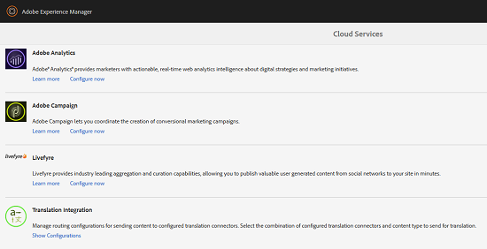

# 建立內容片段的翻譯專案 {#creating-translation-projects-for-content-fragments}

除了資產外，Adobe Experience Manager(AEM)Assets還支援內容片段(包括變 [數](content-fragments.md) )的語言複製工作流程。 在內容片段上執行語言複製工作流程不需要其他最佳化。 在每個工作流程中，都會傳送整個內容片段以供翻譯。

您可以在內容片段上執行的工作流程類型與您為資產執行的工作流程類型完全相同。 此外，每個工作流類型中可用的選項都與資產的相應工作流類型下可用的選項相匹配。

您可以針對內容片段執行下列語言複製工作流程類型：

**建立和翻譯**

在此工作流程中，要翻譯的內容片段會複製到您要翻譯的語言的語言根目錄。 此外，根據您選擇的選項，將為「項目」控制台中的內容片段建立一個翻譯項目。 根據設定，翻譯項目可以手動啟動，或者允許在建立翻譯項目後立即自動運行。

**更新語言副本**

當更新或修改源內容片段時，相應的地區／語言特定內容片段需要重新編譯。 更新語言副本工作流將翻譯另外一組內容片段並將其包含在特定地區的語言副本中。 在這種情況下，已翻譯的內容片段會新增至已包含先前已翻譯內容片段的目標資料夾。

## 建立和翻譯工作流程 {#create-and-translate-workflow}

「建立和翻譯」工作流程包含下列選項。 與每個選項相關聯的程式步驟類似於與資產的相應選項相關聯的步驟。

* 僅建立結構：如需程式步驟，請參 [閱「僅建立資產結構」](translation-projects.md#create-structure-only)。
* 建立新的翻譯專案：有關過程步驟，請參 [閱為資產建立新的翻譯項目](translation-projects.md#create-a-new-translation-project)。
* 添加到現有翻譯項目：有關過程步驟，請參 [閱添加到現有資產的翻譯項目](translation-projects.md#add-to-existing-translation-project)。

## 更新語言副本工作流程 {#update-language-copies-workflow}

「更新語言副本」工作流程包含下列選項。 與每個選項相關聯的程式步驟類似於與資產的相應選項相關聯的步驟。

* 建立新的翻譯專案：如需程式步驟，請參 [閱為資產建立新的翻譯專案](translation-projects.md#create-a-new-translation-project) （更新工作流程）。
* 添加到現有翻譯項目：如需程式步驟，請參 [閱「新增至資產的現有轉譯專案](translation-projects.md#add-to-existing-translation-project) （更新工作流程）」。

您也可以建立片段的暫時語言復本，就像建立資產的暫時復本一樣。 如需詳細資訊，請 [參閱建立資產的暫存語言副本](translation-projects.md#creating-temporary-language-copies)。

## 轉換混合媒體片段 {#translating-mixed-media-fragments}

AEM可讓您翻譯包含各種類型媒體資產和系列的內容片段。 如果您翻譯包含內嵌資產的內容片段，則這些資產的翻譯副本會儲存在目標語言根目錄下。

如果內容片段包含系列，則系列中的資產會與內容片段一起翻譯。 資產的翻譯副本會儲存在適當的目標語言根目錄中，位於符合來源語言根目錄下之來源資產實體位置的位置。

若要能夠轉譯包含混合媒體的內容片段，請先編輯預設的轉譯架構，以便轉譯與內容片段關聯的內嵌資產和系列。

1. 按一下／點選AEM標誌，然後導覽至「工 **[!UICONTROL 具>部署>雲端服務」]**。
1. 在 **[!UICONTROL Adobe Marketing cloud下方找]** 到翻譯整合 **[!UICONTROL ，然後按一下／點選「]**&#x200B;顯示設定 ****」。

   

1. 從可用配置清單中，按一下／點選「預設配置」( **[!UICONTROL Translation Integration configuration)]** ，開啟「 **** 預設配置」頁。

   

1. 按一下工 **[!UICONTROL 具欄中的]** 「編輯」(Edit)，以顯示「轉 **[!UICONTROL 換配置」(Translation Config]** )對話框。

   

1. 導覽至「資 **[!UICONTROL 產」標籤]** ，然後從「轉譯內容片段資產」清單中選 **[!UICONTROL 擇「內嵌媒體資產」和]** 「相 **** 關的系列」。 Click/tap **[!UICONTROL OK]** to save the changes.

   

1. 從英文根資料夾中開啟內容片段。

   

1. 按一下／點選「 **[!UICONTROL 插入資產]** 」圖示。

   

1. 將資產插入內容片段。

   

1. 按一下／點選「關 **[!UICONTROL 聯內容]** 」圖示。

   

1. 按一下／點選「 **[!UICONTROL 關聯內容」]**。

   

1. 選取系列並將它加入內容片段中。 按一下／點選「 **[!UICONTROL 儲存]**」。

   

1. 選取內容片段，然後按一下／點選 **[!UICONTROL GlobalNav]** 圖示。
1. 從菜 **[!UICONTROL 單中選擇]** 「參照」(References **[!UICONTROL )以顯示「]** 參照」(References)窗格。

   

1. 按一下／點選「 **[!UICONTROL 復本]** 」下的「語 **[!UICONTROL 言復本」]** ，以顯示語言復本。

   

1. 按一下／點 **[!UICONTROL 選面板底部的「建立與轉譯]** 」，以顯示「建立與轉 **[!UICONTROL 譯」對話方塊]** 。

   

1. 從「目標語言」清單中選 **[!UICONTROL 取目標語言]** 。

   

1. 從「項目」( **[!UICONTROL Project]** )清單中選擇翻譯項目類型。

   

1. 在「專案標題」方塊中指定專案的 **[!UICONTROL 標題]** ，然後按一下／點選「 **建立」**。

   

1. 導覽至「 **[!UICONTROL 專案]** 」主控台，並開啟您建立之轉譯專案的專案資料夾。

   

1. 按一下／點選專案圖格以開啟專案詳細資訊頁面。

   

1. 從「翻譯工作」方塊中，確認要翻譯的資產數。
1. 從「翻 **[!UICONTROL 譯作業]** 」表徵圖啟動翻譯作業。

   

1. 按一下「翻譯作業」表徵圖底部的橢圓以顯示翻譯作業的狀態。

   

1. 按一下／點選內容片段，以檢查已轉譯的相關資產路徑。

   

1. 在「系列」主控台中檢閱系列的語言復本。

   

   請注意，只有系列的內容會翻譯。 系列本身不會翻譯。

1. 導覽至已轉譯之相關資產的路徑。 請注意，已翻譯的資產會儲存在目標語言根目錄下。

   

1. 導覽至系列中與內容片段一起翻譯的資產。 請注意，資產的翻譯副本會儲存在適當的目標語言根目錄。

   

   >[!NOTE]
   >
   >將內容片段新增至現有專案或執行更新工作流程的程式與資產的對應程式類似。 有關這些程式的指導，請參閱資產的程式。

