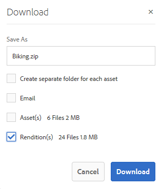

# 從 AEM 下載資產 {#download-assets-from-aem}

您可以下載資產，包括靜態和動態轉譯。 或者，您也可以直接從AEM Assets傳送包含資產連結的電子郵件。 已下載的資產會整合在ZIP檔案中。 壓縮的ZIP檔案對於匯出工作的檔案大小上限為1 GB。 每個匯出工作最多可獲得500個資產。

>[!NOTE]
>
>電子郵件的收件者必須是群組的 `dam-users` 成員，才能存取電子郵件訊息中的ZIP下載連結。 若要下載資產，成員必須擁有啟動觸發資產下載的工作流程的權限。

若要下載資產，請導覽至資產、選取資產，然後點選／按一下工具列中的「 **[!UICONTROL 下載]** 」圖示。 在產生的對話方塊中，指定您的下載選項。

無法下載資產類型影像集、回轉集、混合媒體集和轉盤集。



以下是「匯出／下載」選項。 動態轉譯是Dynamic media獨有的，可讓您除了選取的資產外，即時產生轉譯——只有在您啟用「動態媒體」時，這個選項才可用。

| 匯出或下載選項 | 說明 |
|---|---|
| [!UICONTROL 資產] | 選取此選項，以原始格式下載資產，而不需任何轉譯。 |
| [!UICONTROL 轉譯] | 轉譯是資產的二進位表示法。資產具有主要表示法——已上傳檔案的主要表示法。 它們可以有任意數量的表示。 <br> 使用這個選項，您可以選取您要下載的轉譯。 可用的轉譯取決於您選擇的資產。 |
| [!UICONTROL 動態轉譯] | 動態轉譯會即時產生其他轉譯。 當您選取此選項時，也可以從「影像預設集」清單中選取您要動態建立的轉 [譯](image-presets.md) 。 <br>此外，您還可以選取尺寸和單位、格式、色域、解析度和任何影像修飾元（例如反轉影像） |
| [!UICONTROL 電子郵件] | 系統會傳送電子郵件通知給使用者。 標準電子郵件範本可在下列位置取得：<ul><li>`/libs/settings/dam/workflow/notification/email/downloadasset`</li><li>`/libs/settings/dam/workflow/notification/email/transientworkflowcompleted`</li></ul> 您在部署期間自訂的範本應位於下列位置： <ul><li>`/apps/settings/dam/workflow/notification/email/downloadasset`</li><li>`/apps/settings/dam/workflow/notification/email/transientworkflowcompleted`</li></ul>您可以在下列位置儲存租用戶特定的自訂範本：<ul><li>`/conf/<tenant_specific_config_root>/settings/dam/workflow/notification/email/downloadasset`</li><li>`/conf/<tenant_specific_config_root>/settings/dam/workflow/notification/email/transientworkflowcompleted`</li></ul> |
| [!UICONTROL 為每一個資產建立個別的資料夾] | 選取此選項，可在下載資產時保留資料夾階層。 依預設，檔案夾階層會被忽略，而所有資產都會下載到您本機系統的一個檔案夾中。 |

如果資產有任何轉譯，則可使用選項轉譯選項。 如果資產包含子資產，則可使用子資產選項。

當您選擇要下載的檔案夾時，會下載該檔案夾下的完整資產階層。 若要將您下載的每個資產（包括父資料夾下巢狀內嵌的子資料夾中的資產）納入個別資料夾，請選取「為每個資 **[!UICONTROL 產建立個別資料夾」]**。

## 啟用資產下載servlet {#enable-asset-download-servlet}

AEM中的預設servlet可讓已驗證的使用者發出任意大型的並行下載請求，以建立可見資產的ZIP檔案，讓伺服器和網路過載。 為了降低此功能造成的潛在DoS風險， `AssetDownloadServlet` OSGi元件預設會停用於發佈例項。

若要允許從DAM下載資產，例如，當使用資產共用共用共用或其他類似入口網站的實施時，請透過OSGi組態手動啟用servlet。 Adobe建議盡可能將允許的下載大小設定得盡可能低，而不會影響日常下載需求。 高價值可能會影響效能。

1. 使用命名慣例建立資料夾，以發佈執行模式為目標，即 `config.publish`:
   `/apps/<your-app-name>/config.publish`
要定義運行模式的配置屬性，請參 [閱運行模式](/help/sites-deploying/configure-runmodes.md#defining-configuration-properties-for-a-run-mode) 。
1. 在config資料夾中，建立名為的新文 `nt:file` 件 `com.day.cq.dam.core.impl.servlet.AssetDownloadServlet.config`。
1. 填 `com.day.cq.dam.core.impl.servlet.AssetDownloadServlet.config` 入下列。 將下載的最大大小（以位元組為單位）設定為值 `asset.download.prezip.maxcontentsize`。 下面的示例將ZIP下載的最大大小配置為不超過100 kB。

```
enabled=B"true"
asset.download.prezip.maxcontentsize=I"102400"
```

## 停用資產下載servlet {#disable-asset-download-servlet}

您可 `Asset Download Servlet` 以在AEM Publish例項上停用此功能，方法是更新分派器組態以封鎖任何資產下載請求。 也可以通過OSGi控制台手動禁用servlet。

1. 若要透過分派器設定封鎖資產下載請求，請編 `dispatcher.any` 輯設定，並新增規則至篩 [選區段](https://docs.adobe.com/content/help/en/experience-manager-dispatcher/using/configuring/dispatcher-configuration.html#defining-a-filter)。

   ```/0100 { /type "deny" /url "*.assetdownload.zip/assets.zip*" }```

1. 您可以在Publish實例上手動禁用OSGi元件，方法是導航到位於的OSGi控制台 `<aem-host>/system/console/components`。 找到並 `com.day.cq.dam.core.impl.servlet.AssetDownloadServlet` 按一下「 **[!UICONTROL Disable]**（禁用）」。

>[!MORELIKETHIS]
>
>* [下載受DRM保護的資產](drm.md)
>* [在Win或Mac案頭上使用AEM案頭應用程式下載資產](https://helpx.adobe.com/experience-manager/desktop-app/aem-desktop-app.html)
>* [從支援的Adobe Creative cloud應用程式使用Adobe Assets Link下載資產](https://helpx.adobe.com/enterprise/using/manage-assets-using-adobe-asset-link.html)

