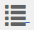

# AEM {#enhanced-sorting-of-assets-in-aem}中資產的增強排序

瞭解AEM Assets如何部署伺服器端排序功能，以一次性排序資料夾資產或搜尋查詢，而不是在用戶端以批次排序。

Adobe Experience Manager(AEM)Assets的搜尋功能已增強，可在資料夾清單檢視和搜尋結果頁面中有效率地排序大量資產。 您也可以排序時間軸項目。

AEM Assets會部署伺服器端排序，以一次性排序資料夾或搜尋查詢中的整組資產（無論大小），而不是在用戶端進行批次排序。 這樣，預取的結果可以快速顯示在使用者介面上，使排序操作更靈敏快速。

## 在清單檢視{#sorting-assets-in-list-view}中排序資產

AEM Assets可讓您根據下列欄位來排序檔案夾資產：

* 地區設定
* 狀態
* 類型
* 大小
* 評等
* 修改日期
* 發佈日期
* 使用狀況
* 點按數
* 印象
* 已簽出

1. 導覽至包含大量資產的資料夾。
1. 按一下／點選「版面」圖示，並切換至清單檢視。

   

1. 按一下／點選資產清單中任何欄標題旁的「排序」圖示。

   

   資產清單會根據欄位值排序。

   

>[!NOTE]
>
>若要對`Name`或`Title`欄中的值進行排序，請覆蓋`/libs/dam/gui/content/commons/availablecolumns`並將`sortable`的值更改為`True`。

## 在搜尋結果{#sorting-assets-in-search-results}中排序資產

您可以根據下列欄位來排序搜尋結果：

* 標題
* 狀態
* 類型
* 大小
* 修改日期
* 發佈日期

1. 從OmniSearch方塊中，根據所需的條件搜尋資產。

   

1. 按一下／點選「版面」圖示，並切換至清單檢視。 如果搜索結果已顯示在清單視圖中，請跳過此步驟。
1. 按一下／點選資產清單中任何欄標題旁的「排序」圖示。 資產清單會根據欄位值排序。

   

## 在時間軸{#sorting-assets-in-timeline}中排序資產

AEM Assets可讓您按時間順序排序時間軸項目，例如註解、版本、工作流程和活動。

1. 從「資產」使用者介面中，選取您要顯示時間軸的資產。
1. 按一下／點選「GolbalNav」圖示，然後選取「時間軸」**[!UICONTROL 。]**

   

1. 在時間軸中，從清單中選擇一個條目。 例如，選擇&#x200B;**[!UICONTROL Comments]**&#x200B;以顯示與資產關聯的注釋清單。

   

1. 按一下／點選&#x200B;**[!UICONTROL 日期]**&#x200B;標籤旁的&#x200B;**[!UICONTROL 排序]**&#x200B;表徵圖。 根據您的選擇，註解會依時間順序／反向時間順序列出，並依此順序新增至資產。

   

