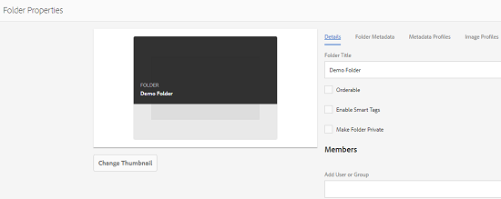

# 資料夾中繼資料結構 {#folder-metadata-schema}

>[!CAUTION]
>
>AEM 6.4已結束延伸支援，本檔案不再更新。 如需詳細資訊，請參閱 [技術支援期](https://helpx.adobe.com//tw/support/programs/eol-matrix.html). 尋找支援的版本 [此處](https://experienceleague.adobe.com/docs/).

本文說明如何為中的資產資料夾建立中繼資料結構 [!DNL Experience Manager] 資產。

Adobe Experience Manager Assets可讓您建立資產資料夾的中繼資料結構，定義資料夾屬性頁面中顯示的配置和中繼資料。

>[!NOTE]
>
>此功能需要 [!DNL Experience Manager] 6.4，至少部署了Service Pack 2。 針對 [!DNL Experience Manager] 6.4 service pack詳細資訊，請參閱下列 [發行說明](/help/release-notes/sp-release-notes.md).

## 新增資料夾中繼資料結構表單 {#add-a-folder-metadata-schema-form}

使用資料夾中繼資料結構Forms編輯器，建立和編輯資料夾的中繼資料結構。

1. 點選/按一下 [!DNL Experience Manager] 標誌，然後 **[!UICONTROL 工具]** > **[!UICONTROL 資產]**> **[!UICONTROL 資料夾中繼資料結構]**.
1. 在「資料夾中繼資料結構Forms 」頁面中，點選/按一下 **[!UICONTROL 建立]**.
1. 指定表單的名稱，然後點選/按一下 **[!UICONTROL 建立]**. 新架構表單會列在「架構Forms」頁面中。

## 編輯資料夾中繼資料結構表單 {#edit-folder-metadata-schema-forms}

您可以編輯新增或現有的中繼資料結構表單，其中包括：

* 索引標籤
* 標籤內的表單項目。

您可以將這些表單項目對應/設定至CRX存放庫中中繼資料節點內的欄位。 您可以將新索引標籤或表單項目新增至中繼資料結構表單。

1. 在「結構Forms」頁面中，選取您建立的表單，然後點選/按一下 **[!UICONTROL 編輯]** 圖示。
1. 在「資料夾中繼資料結構編輯器」頁面中，點選/按一下 **[!UICONTROL +]** 圖示將索引標籤新增至表單。 若要重新命名標籤，請點選/按一下預設名稱，並在下方指定新名稱 **[!UICONTROL 設定]**.

   

   若要新增更多標籤，請點選/按一下 **[!UICONTROL +]** 表徵圖。 點選/按一下 **[!UICONTROL X]** 刪除頁簽。

1. 在作用中標籤中，從 **[!UICONTROL 建置表單]** 標籤。

   

   如果您建立多個標籤，請點選/按一下特定標籤以新增元件。

1. 若要設定元件，請選取元件，並修改其屬性，位於 **[!UICONTROL 設定]** 標籤。

   如有需要，請從 **[!UICONTROL 設定]** 標籤。

   

1. 點選/按一下 **[!UICONTROL 儲存]** ，以儲存變更。

### 建立表單的元件 {#components-to-build-forms}

此 **[!UICONTROL 建置表單]** 索引標籤會列出您在資料夾中繼資料結構表單中使用的表單項目。 此 **[!UICONTROL 設定]** 索引標籤會顯示您在 **[!UICONTROL 建置表單]** 標籤。 以下是 **[!UICONTROL 建置表單]** 標籤：

| 元件名稱 | 說明 |
|---|---|
| [!UICONTROL 區段標題] | 新增區段標題，以取得通用元件清單。 |
| [!UICONTROL 單行文字] | 新增單行文字屬性。 會儲存為字串。 |
| [!UICONTROL 多值文字] | 新增多值文字屬性。 會儲存為字串陣列。 |
| [!UICONTROL 數字] | 新增數字元件。 |
| [!UICONTROL 日期] | 新增日期元件。 |
| [!UICONTROL 下拉式] | 新增下拉式清單。 |
| [!UICONTROL 標準標記] | 新增標記. |
| [!UICONTROL 隱藏欄位] | 新增隱藏欄位。 資產儲存時會以POST參數的形式傳送。 |

### 編輯表單項目 {#editing-form-items}

若要編輯表單項目的屬性，請點選/按一下元件，然後在 **[!UICONTROL 設定]** 標籤。

**[!UICONTROL 欄位標籤]**:顯示在資料夾屬性頁面上的元資料屬性的名稱。

**[!UICONTROL 對應至屬性]**:此屬性指定儲存CRX儲存庫中資料夾節點的相對路徑。 開頭為「**./**&quot; ，表示路徑位於資料夾節點下。

以下是此屬性的有效值：

* `./jcr:content/metadata/dc:title`:將值儲存在資料夾的中繼資料節點，作為屬性 `dc:title`.

* `./jcr:created`:在資料夾的節點顯示JCR屬性。 如果您在CRXDE中設定這些屬性，Contaign建議您將它們標示為「停用編輯」，因為這些屬性受到保護。 否則，錯誤&#39; `Asset(s) failed to modify`「 」會在您儲存資產的屬性時發生。

若要確保元件在中繼資料結構表單中正確顯示，請勿在屬性路徑中包含空格。

**[!UICONTROL JSON路徑]**:使用它來指定JSON檔案的路徑，您可在此指定選項的索引鍵值配對。

**[!UICONTROL 預留位置]**:使用此屬性可指定與中繼資料屬性相關的預留位置文字。

**[!UICONTROL 選擇]**:使用此屬性可指定清單中的選擇。

**[!UICONTROL 說明]**:使用此屬性可為中繼資料元件新增簡短說明。

**[!UICONTROL 類別]**:屬性關聯的對象類。

## 刪除資料夾元資料結構表單 {#delete-folder-metadata-schema-forms}

您可以從「資料夾元資料結構」「Forms」頁中刪除資料夾元資料結構表單。 若要刪除表單，請選取表單，然後點選/按一下工具列中的「刪除」圖示。

## 指派資料夾中繼資料結構 {#assign-a-folder-metadata-schema}

您可以從「資料夾元資料結構」Forms頁或建立資料夾時，將資料夾元資料結構分配給資料夾。

如果為資料夾配置元資料架構，架構表單的路徑將儲存在 `folderMetadataSchema` 下資料夾節點的屬性。*/jcr:content*.

### 從「資料夾元資料結構」頁指定到結構 {#assign-to-a-schema-from-the-folder-metadata-schema-page}

1. 點選/按一下 [!DNL Experience Manager] 標誌，然後 **[!UICONTROL 工具]** > **[!UICONTROL 資產]** > **[!UICONTROL 資料夾中繼資料結構]**.
1. 從「資料夾元資料結構Forms」頁中，選擇要應用於資料夾的結構表單。
1. 從工具列，點選/按一下 **[!UICONTROL 應用於資料夾]**.

1. 選取要套用結構的資料夾，然後按一下/點選 **[!UICONTROL 套用]**. 如果資料夾上已套用中繼資料結構，警告訊息會通知您即將覆寫現有的中繼資料結構。 點選/按一下 **[!UICONTROL 覆寫]**.
1. 開啟您套用中繼資料結構的資料夾的中繼資料屬性。

   

   若要檢視資料夾中繼資料欄位，請點選/按一下「資料夾中 **[!UICONTROL 繼資料]** 」標籤。

   

### 建立資料夾時指派結構 {#assign-a-schema-when-creating-a-folder}

建立資料夾時，您可以指派資料夾中繼資料結構。 如果系統中至少存在一個資料夾元資料架構，則會在 **[!UICONTROL 建立資料夾]** 對話框。 您可以選取所需的結構。 預設情況下，不選擇任何架構。

1. 從 [!DNL Assets] 使用者介面，點選/按一下 **[!UICONTROL 建立]** 的上界。
1. 指定資料夾的標題和名稱。
1. 從「資料夾元資料結構」清單中，選擇所需的結構。 然後，點選/按一下 **[!UICONTROL 建立]**.

   

1. 開啟您套用中繼資料結構的資料夾的中繼資料屬性。
1. 若要檢視資料夾中繼資料欄位，請點選/按一下「資料夾中 **[!UICONTROL 繼資料]** 」標籤。

## 使用資料夾中繼資料結構 {#use-the-folder-metadata-schema}

開啟配置了資料夾元資料架構的資料夾的屬性。「文 **[!UICONTROL 件夾元資料]** 」頁籤顯示在資料夾屬性頁中。要查看資料夾元資料結構表單，請選擇此頁籤。

在各種欄位中輸入中繼資料值，然後點選/按一下 **[!UICONTROL 儲存]** 來儲存值。 您指定的值會儲存在CRX存放庫的資料夾節點中。

