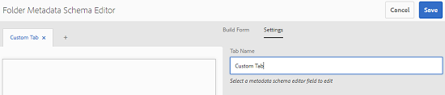

# 資料夾中繼資料結構 {#folder-metadata-schema}

本文說明如何在AEM Assets中建立資產檔案夾的中繼資料結構。

Adobe Experience Manager(AEM)Assets可讓您為資產資料夾建立中繼資料結構，以定義資料夾屬性頁面中顯示的版面和中繼資料。

>[!NOTE]
>
>此功能需要AEM 6.4並至少部署Service Pack 2。 如需AEM 6.4 Service Pack的詳細資訊，請參閱這些[發行說明](/help/release-notes/sp-release-notes.md)。

## 從{#add-a-folder-metadata-schema-form}中添加資料夾元資料架構

使用資料夾元資料結構表單編輯器可建立和編輯資料夾的元資料結構。

1. 點選/按一下 AEM 標誌，然後前往&#x200B;**[!UICONTROL 「工具」]**>**[!UICONTROL 「資產」]**>**[!UICONTROL 「資料夾中繼資料結構描述」]**。
1. 在「資料夾元資料結構表單」頁中，點選／按一下&#x200B;**[!UICONTROL 建立]**。
1. 指定表單的名稱，然後點選／按一下「建立&#x200B;**[!UICONTROL 」。]**&#x200B;新的架構表單列在「架構表單」頁中。

## 編輯資料夾元資料結構表單{#edit-folder-metadata-schema-forms}

您可以編輯新增或現有的中繼資料結構表單，其中包含：

* 索引標籤
* 標籤內的表單項目。

您可以將這些表單項目映射／配置到CRX儲存庫中元資料節點中的欄位。 您可以將新標籤或表單項目新增至中繼資料結構表單。

1. 在「方案表單」頁中，選擇您建立的表單，然後從工具欄中點選／按一下「編輯」表徵圖。****
1. 在「資料夾元資料結構編輯器」頁中，點選／按一下&#x200B;**[!UICONTROL +]**&#x200B;表徵圖以向表單添加頁籤。 若要重新命名標籤，請點選／按一下預設名稱，並在&#x200B;**[!UICONTROL Settings]**&#x200B;下指定新名稱。

   

   若要新增更多標籤，請點選／按一下&#x200B;**[!UICONTROL +]**&#x200B;圖示。 點選／按一下&#x200B;**[!UICONTROL X]**&#x200B;以刪除標籤。

1. 在活動頁籤中，從&#x200B;**[!UICONTROL 構建表單]**&#x200B;頁籤添加一個或多個元件。

   

   如果您建立多個標籤，請點選／按一下特定標籤以新增元件。

1. 要配置元件，請選擇該元件並在&#x200B;**[!UICONTROL Settings]**&#x200B;頁籤中修改其屬性。

   如果需要，請從&#x200B;**[!UICONTROL Settings]**&#x200B;標籤中刪除元件。

   

1. 從工具列點選／按一下「儲存&#x200B;****」以儲存變更。

### 建立表單的元件{#components-to-build-forms}

**[!UICONTROL 建立表單]**&#x200B;標籤列出您在資料夾中繼資料結構表單中使用的表單項目。 **[!UICONTROL Settings]**&#x200B;標籤顯示您在&#x200B;**[!UICONTROL Build Form]**&#x200B;標籤中選擇的每個項目的屬性。 以下列出&#x200B;**[!UICONTROL Build Form]**&#x200B;標籤中可用的表單項：

| 元件名稱 | 說明 |
|---|---|
| [!UICONTROL 區段標題] | 新增共用元件清單的區段標題。 |
| [!UICONTROL 單行文字] | 新增單行文字屬性。 它儲存為字串。 |
| [!UICONTROL 多值文字] | 新增多值文字屬性。 它儲存為字串陣列。 |
| [!UICONTROL 數量] | 添加數字元件。 |
| [!UICONTROL 日期] | 新增日期元件。 |
| [!UICONTROL 下拉式] | 新增下拉式清單。 |
| [!UICONTROL 標準標記] | 新增標記. |
| [!UICONTROL 隱藏欄位] | 新增隱藏欄位。 儲存資產時，會以POST參數傳送。 |

### 編輯表單項目{#editing-form-items}

若要編輯表單項目的屬性，請點選／按一下元件，然後在&#x200B;**[!UICONTROL Settings]**&#x200B;標籤中編輯下列屬性的全部或子集。

**[!UICONTROL 欄位標籤]**:顯示在資料夾屬性頁面上的元資料屬性的名稱。

**[!UICONTROL 對應至屬性]**:此屬性指定保存資料夾節點的CRX儲存庫中資料夾節點的相對路徑。開頭為&quot;**。/**&quot;，表示路徑位於資料夾節點下。

以下是此屬性的有效值：

* `./jcr:content/metadata/dc:title`:將值儲存在資料夾的元資料節點中作為屬性 `dc:title`。

* `./jcr:created`:在資料夾的節點顯示JCR屬性。如果您在CRXDE中設定這些屬性，Adobe建議您將它們標示為「停用編輯」，因為這些屬性受到保護。 否則，在保存資產屬性時，將發生錯誤「 `Asset(s) failed to modify`」。

要確保元資料架構表單中元件正確顯示，請勿在屬性路徑中包含空格。

**[!UICONTROL JSON路徑]**:使用它來指定JSON檔案的路徑，您可在此指定選項的索引鍵值配對。

**[!UICONTROL 預留位置]**:使用此屬性可指定與中繼資料屬性相關的預留位置文字。

**[!UICONTROL 選擇]**:使用此屬性可指定清單中的選擇。

**[!UICONTROL 說明]**:使用此屬性可為中繼資料元件新增簡短說明。

**[!UICONTROL 類別]**:屬性與關聯的對象類。

## 刪除資料夾元資料架構表單{#delete-folder-metadata-schema-forms}

可以從「資料夾元資料結構表單」頁刪除資料夾元資料結構表單。 若要刪除表單，請選取表單並點選／按一下工具列中的「刪除」圖示。

## 指派資料夾中繼資料結構{#assign-a-folder-metadata-schema}

您可以從「資料夾元資料結構表單」頁或建立資料夾時，將資料夾元資料結構分配給資料夾。

如果為資料夾配置元資料模式，則模式表單的路徑將儲存在資料夾節點的`folderMetadataSchema`屬性中。*/jcr:content*.

### 從「資料夾元資料結構」頁{#assign-to-a-schema-from-the-folder-metadata-schema-page}分配到結構

1. 點選/按一下 AEM 標誌，然後前往&#x200B;**[!UICONTROL 「工具」]**>**[!UICONTROL 「資產」]**>**[!UICONTROL 「資料夾中繼資料結構描述」]**。
1. 從「資料夾元資料結構表單」頁中，選擇要應用於資料夾的結構結構表單。
1. 從工具列點選／按一下「套用至資料夾」**[!UICONTROL 。]**

1. 選擇要應用模式的資料夾，然後按一下／點選&#x200B;**[!UICONTROL 應用]**。 如果資料夾上已套用中繼資料結構，會出現警告訊息通知您即將覆寫現有的中繼資料結構。 點選／按一下「覆寫&#x200B;**[!UICONTROL 」。]**
1. 開啟您套用中繼資料結構之資料夾的中繼資料屬性。

   

   若要檢視資料夾中繼資料欄位，請點選/按一下「資料夾中 **[!UICONTROL 繼資料]** 」標籤。

   

### 建立資料夾{#assign-a-schema-when-creating-a-folder}時分配模式

建立資料夾時，可以指定資料夾元資料方案。 如果系統中至少存在一個資料夾元資料模式，則在&#x200B;**[!UICONTROL 建立資料夾]**&#x200B;對話框中會顯示一個額外清單。 您可以選擇所需的架構。 預設情況下，未選擇任何模式。

1. 從AEM Assets使用者介面，從工具列點選／按一下「建立&#x200B;**[!UICONTROL 」。]**
1. 指定資料夾的標題和名稱。
1. 從「資料夾元資料方案」清單中，選擇所需的方案。 然後點選／按一下&#x200B;**[!UICONTROL Create]**。

   

1. 開啟您套用中繼資料結構之資料夾的中繼資料屬性。
1. 若要檢視資料夾中繼資料欄位，請點選/按一下「資料夾中 **[!UICONTROL 繼資料]** 」標籤。

## 使用資料夾元資料架構{#use-the-folder-metadata-schema}

開啟配置了資料夾元資料架構的資料夾的屬性。「文 **[!UICONTROL 件夾元資料]** 」頁籤顯示在資料夾屬性頁中。要查看資料夾元資料結構表單，請選擇此頁籤。

在各種欄位中輸入中繼資料值，並點選／按一下「儲存&#x200B;**[!UICONTROL 」以儲存值。]**&#x200B;您指定的值儲存在CRX儲存庫的資料夾節點中。

