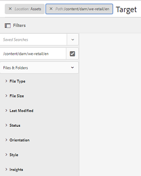
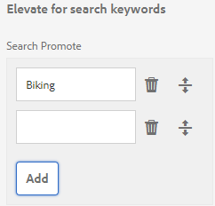

# GQL全文搜索{#gql-full-text-search}

探索AEM Assets中的GQL全文搜尋功能。 使用它可根據特定中繼資料來搜尋資產，例如標題、說明和作者名稱。

GQL全文搜尋功能可讓您根據特定中繼資料來搜尋資產，例如標題、說明、作者等。

若要根據資產的中繼資料（例如標題）來搜尋資產，請在搜尋面板中指定中繼資料關鍵字，後面接著其值。 GQL全文搜索功能將只提取那些元資料與您輸入的相應值完全匹配的資產。

例如，若要搜尋標題為「Target」的資產，請執行下列步驟：

## 搜尋資產{#searching-assets}

1. 在「資產」使用者介面的工具列中，按一下或點選「搜尋&#x200B;****」圖示以顯示「Omnisearch」方塊。

   

1. 在Omnisearch框中，按Enter鍵。
1. 按一下或點選GlobalNav圖示以顯示&#x200B;**[!UICONTROL Filters]**&#x200B;面板。
1. 在「全方位搜尋」方塊中，指定值「Target」。 若要將搜尋限制在特定資料夾，請按一下或點選「篩選」面板中的「瀏覽」圖示，然後選取資料夾。 在這種情況下，只會在資料夾及其下方的子資料夾中搜尋相符項目。

   >[!NOTE]
   >
   >您也可以對資料夾執行全文搜尋。 在這種情況下，您必須指定非空白的全文搜尋詞。

   

1. 按&#x200B;**[!UICONTROL Enter]**&#x200B;鍵。 AEM Assets使用者介面只會顯示標題完全符合「Target」的資產。

GQL全文搜尋功能可讓您根據下列項目搜尋資產：

* 透過And運算組合您為多個中繼資料欄位（屬性）指定的值，建立複雜查詢
* 單一中繼資料欄位的多個值
* 子字串符合

GQL全文搜尋功能可讓您根據下列中繼資料屬性來搜尋資產。 屬性的名稱（例如作者、標題等）和值區分大小寫。

>[!NOTE]
>
>GQL全文搜索僅適用於全文謂語。

| 屬性 | 搜尋格式（Facet值） |
|---|---|
| [!UICONTROL 標題] | 標題：John |
| [!UICONTROL 產生器] | 建立者：John |
| [!UICONTROL 參與者] | 投稿人：John |
| [!UICONTROL 位置] | 位置：印度 |
| [!UICONTROL 說明] | 說明：「範例影像」 |
| [!UICONTROL 製作工具] | 創作工具：「Adobe Photoshop 7.0」 |
| [!UICONTROL 版權擁有者] | copyrightowner:「Adobe Systems」 |
| [!UICONTROL 參與者] | 投稿人：John |
| [!UICONTROL 使用條款] | 使用條款：「保留CopyRights」 |
| [!UICONTROL 已建立] | created:YYYY-MM-DDTHH:MM:SS.000+05:30.YYYY-MM-DDTHH:MM:SS.000+05:30 |
| [!UICONTROL 到期日] | expires:YYYY-MM-DDTHH:MM:SS.000+05:30..YYYY-MM-DDTHH:MM:SS.000+05:30 |
| [!UICONTROL 準時] | ontime:YYYY-MM-DDTHH:MM:SS.000+05:30.YYYY-MM-DDTHH:MM:SS.000+05:30 |
| [!UICONTROL 關閉時間] | offtime:YYYY-MM-DDTHH:MM:SS.000+05:30.YYYY-MM-DDTHH:MM:SS.000+05:30 |
| [!UICONTROL 時間範圍] （過期的dateontime,offtime） | facet欄位：下限……上界 |
| [!UICONTROL 路徑] | /content/dam/&lt;資料夾名稱> |
| [!UICONTROL PDF 標題] | pdftitle:「Adobe檔案」 |
| [!UICONTROL 主旨] | 主旨：「訓練」 |
| [!UICONTROL 標記] | 標籤：「位置與旅行」 |
| [!UICONTROL 類型] | 類型：&quot;image\png&quot; |
| [!UICONTROL 影像寬度] | width:lowberbound..上界 |
| [!UICONTROL 影像高度] | 高度：下限。上界 |
| [!UICONTROL 人員] | 人：John |

以下是複雜查詢的搜尋格式範例：

* 若要顯示具有多個刻面欄位的所有資產(例如：title=John Doe and creator tool = Adobe Photoshop):

Tiltle:&quot;John Doe&quot;製作工具：Adobe&amp;ast;

* 若要在Facet值不是單字而是句子時顯示所有資產(例如：title=Scott Reynolds)

標題：「Scott Reynolds」

* 若要顯示具有單一屬性多個值的資產(例如：title=Scott Reynolds或John Doe)

標題：「Scott Reynolds」或「John Doe」

* 若要顯示屬性值以特定字串開頭的資產(例如：標題是Scott Reynolds)

標題：「Scott」

* 若要顯示屬性值以特定字串結尾的資產(例如：標題是Scott Reynolds)

標題：「Reynolds」

* 若要顯示包含特定字串的屬性值的資產(例如：標題=巴塞爾會議室)

標題：「會議」;

* 若要顯示包含特定字串且具有特定屬性值的資產(例如：在具有title=John Doe的資產中搜尋字串Adobe)

&amp;ast;Adobe&amp;ast;title:&quot;John Doe &quot;OR title:&quot;John Doe&quot; &amp;ast;Adobe&amp;ast;

>[!NOTE]
>
>屬性路徑、限制、大小和orderby不能與任何其他屬性一起使用。
>
>使用者產生屬性的關鍵字是屬性編輯器中的小寫欄位標籤，並移除空格。

>[!NOTE]
>
>如果您撰寫JCR查詢以僅搜尋子資產，則也會顯示相符的參考資產以及相符的子資產。

全文搜尋也支援運算子，例如-、^等。 要將這些字母作為字串文本搜索，請用雙引號將搜索表達式括起來。 例如，使用「筆記型電腦——美容」而非「筆記型電腦——美容」。

## 提升搜尋{#boosting-search}

您可以改善特定資產的關鍵字關聯性，以協助根據關鍵字提高搜尋效率。 換言之，當您根據這些關鍵字進行搜尋時，您促銷特定關鍵字的影像會出現在搜尋結果的頂端。

1. 從「資產」UI中，開啟您要提升關鍵字之資產的屬性頁面。
1. 切換至&#x200B;**[!UICONTROL Advanced]**&#x200B;標籤，然後按一下／點選&#x200B;**[!UICONTROL Elevate for search keywords]**&#x200B;下的&#x200B;**[!UICONTROL Add]**。

   

1. 在&#x200B;**[!UICONTROL 搜尋促銷]**&#x200B;方塊中，指定您要加大影像搜尋的關鍵字，然後按一下／點選&#x200B;**[!UICONTROL 新增]**。 在必要時，請以相同的方式指定多個關鍵字。

   

1. 按一下／點選&#x200B;**[!UICONTROL 儲存並關閉]**。
1. 使用Omnisearch方塊搜尋關鍵字。 您促銷此關鍵字的資產會出現在排名最前的搜尋結果中。