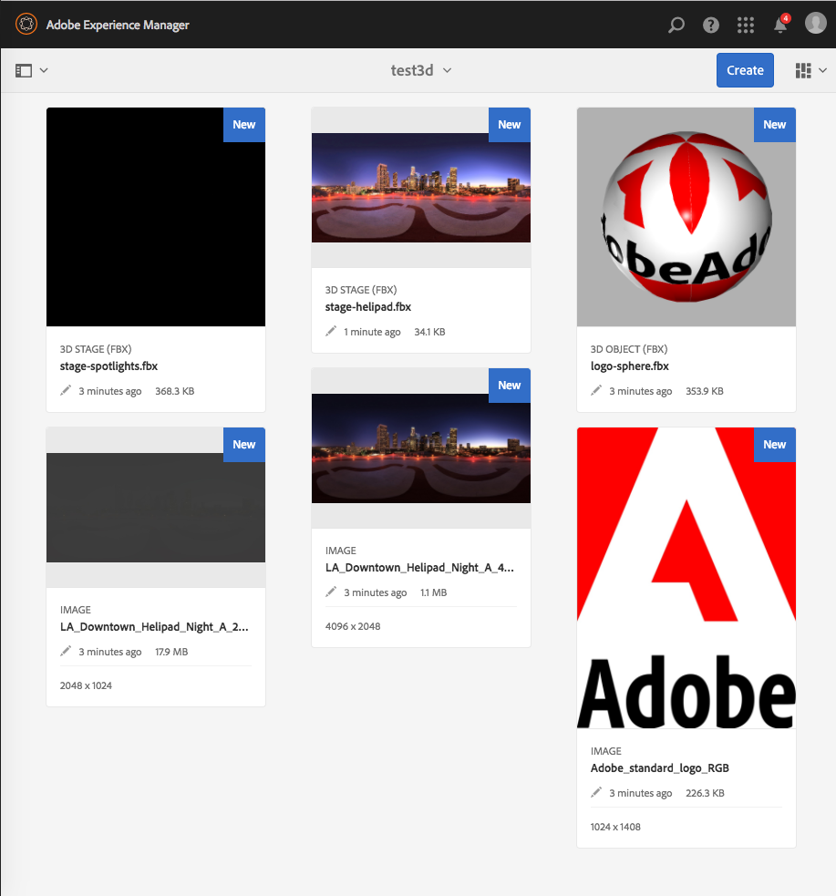
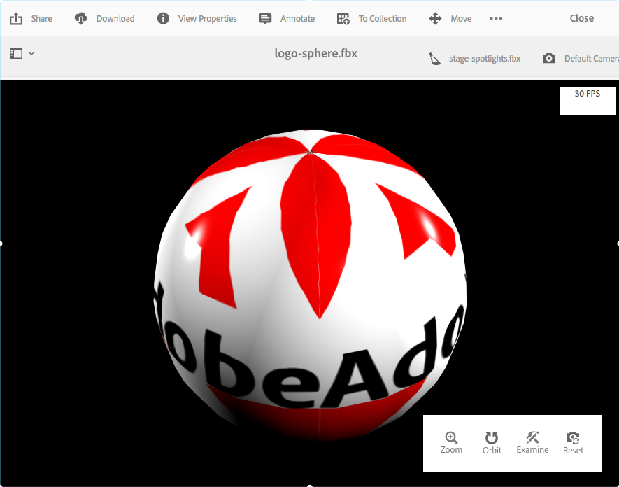
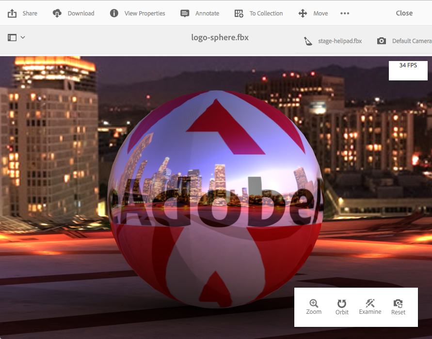

# 安裝和設定AEM 3D {#installing-and-configuring-aem-d}

>[!IMPORTANT]
>
>不再支援AEM 6.4中的AEM 3D。 Adobe建議您將 [AEM中的3D資產功能當做雲端服務](https://docs.adobe.com/content/help/en/experience-manager-cloud-service/assets/dynamicmedia/assets-3d.html)[或AEM 6.5.3或更新版本使用。](https://docs.adobe.com/content/help/en/experience-manager-65/assets/dynamic/assets-3d.html)

AEM 3D（3.0版）的安裝與設定涉及下列事項：

1. 安裝Autodesk® FBX® SDK程式庫。
1. 下載並安裝原生3D程式碼套件。
1. 設定3D資產擷取工作流程並重新啟動AEM。
1. 驗證AEM 3D的設定。

另請參閱 [使用3D資產](assets-3d.md)。

另請參閱 [AEM 3D Assets版本注意事項](/help/release-notes/aem3d-release-notes.md) ，以取得必要條件、支援的瀏覽器和其他重要的版本資訊。

另請參 [閱使用3D Sites元件](using-the-3d-sites-component.md)。

>[!NOTE]
>
>在下載並安裝3D套件之前，請確定您已成功安裝所有必備的AEM套件。 請參閱 [AEM 3D發行說明。](install-config-3d.md)

## 安裝Autodesk FBX SDK程式庫 {#installing-the-autodesk-fbx-sdk-library}

原生AEM 3D程式碼需要Autodesk FBX程式庫才能支援FBX檔案格式。 （Adobe目前無法轉散發此資料庫。）

另請參閱 [高級配置設定](advanced-config-3d.md)。

1. 登入安裝AEM的主機。

   * 如果這是Windows Server部署，請以管理員身份登錄到伺服器。
   * 如果這是MAC或Windows案頭，請確定您擁有管理員權限。

1. 使用適合您作業系統的連結下載 **FBX SDK 2016.1.2版**

   * **Windows**

      [https://download.autodesk.com/us/fbx_release_older/2016.1.2/fbx20161_2_fbxsdk_vs2010_win.exe](https://download.autodesk.com/us/fbx_release_older/2016.1.2/fbx20161_2_fbxsdk_vs2010_win.exe)

   * **OS X**

      [https://download.autodesk.com/us/fbx_release_older/2016.1.2/fbx20161_2_fbxsdk_clang_mac.pkg.tgz](https://download.autodesk.com/us/fbx_release_older/2016.1.2/fbx20161_2_fbxsdk_clang_mac.pkg.tgz)

   * **Linux**

      [https://download.autodesk.com/us/fbx_release_older/2016.1.2/fbx20161_2_fbxsdk_linux.tar.gz](https://download.autodesk.com/us/fbx_release_older/2016.1.2/fbx20161_2_fbxsdk_linux.tar.gz)

1. 安裝FBX SDK:

   * Windows. 安裝至AEM所在的相同磁碟機。
   * 麥克。 安裝至AEM所在的相同分區。
   * Linux. 解壓下載的套件，並依照中的指示進行 `<yourFBXSDKpath>/Install_FbxFileSdk.txt`。 將SDK安裝至 `/usr`。

## 下載並安裝原生3D程式碼套件 {#downloading-and-installing-the-native-d-code-package}

>[!NOTE]
>
>在您繼續安裝和設定AEM 3D之前，Adobe建議您部署任何適用的Service Pack和其他相關功能套件。 請參 [閱AEM 3D發行說明](/help/release-notes/aem3d-release-notes.md)。

另請參閱 [進階組態設定](advanced-config-3d.md)。

**若要安裝原生3D程式碼套件**:

1. 執行下列任一項作業：

   * 如果這是Windows Server部署，請以管理員身份登錄到伺服器。
   * 如果這是Mac或Windows案頭，請確定您具有管理員權限。

1. 請確定您有可存取AEM的支援瀏覽器。

   請參閱 [系統需求](/help/release-notes/aem3d-release-notes.md#system-requirements)。

1. 存取 [軟體散發入口網站](https://experience.adobe.com/#/downloads/content/software-distribution/en/aem.html)。 找到3.0.1版的功 `AEM-6.4-DynamicMedia-3D` 能套件並下載。

1. 在AEM中，按一下「 **[!UICONTROL 工具>管理>部署>封裝管理器]**」。

1. 將下載的功能套件上傳至AEM。 找到它，然後按一下「 **[!UICONTROL 安裝]**」。

1. 在「安裝 **[!UICONTROL 套件]** 」對話方塊中，展開「 **進階設定**」，然後將「存取控制處理」設 **[!UICONTROL 定為「]****** Merge」。
1. 按一下 **[!UICONTROL 安裝]** ，開始安裝軟體包。

   檔案會 `sample-3D-content.zip` 放在「資產」 **[!UICONTROL 根資料夾]** 。 如需 [詳細資訊，請參閱驗證AEM 3D的設定](#validating-the-setup-of-aem-d) 。

## 設定3D資產擷取工作流程並重新啟動AEM {#configuring-the-d-asset-ingestion-workflow-and-restarting-aem}

**若要設定3D資產擷取工作流程**:

1. 在AEM中，按一下AEM標誌以存取全域導覽主控台，然後按一下「工具」圖示並導覽至「工作流程 **[!UICONTROL >模型」]******。
1. 在「工 **[!UICONTROL 作流程模型]** 」頁面上，將滑鼠指標暫留在 **** DAM更新資產工作流程上，當出現核取標籤時，選取它。

1. 在工具列上，按一下「 **[!UICONTROL 編輯]**」。
1. 在「 **[!UICONTROL DAM更新資產]** 」畫面的AEM浮動面板中，按一下「工作流程」右邊的「 **[!UICONTROL Plus]** 」圖示以展開清單。 在列 **[!UICONTROL 表中選擇]** 「流程步驟」。
1. 將 **[!UICONTROL 「流程步驟]** 」拖曳至工作流程結束前的 **** DAM更新資產工作流程完成元件。

   

1. 按兩下新添加的進程步驟。
1. 在「步 **[!UICONTROL 驟屬性]** 」對話框的「公用 **[!UICONTROL 」頁籤下的「標題]** 」欄位中，輸入適合的流程說明，如 ****`Process 3D content`。
1. 按一下「 **[!UICONTROL Process]** （流程）」頁籤。

1. 從「處 **[!UICONTROL 理]** 」( **[!UICONTROL Process]**)下拉菜單中，選擇「幾何3D對象服務」( **[!UICONTROL Geometric 3D Object Service)]** ，然後選擇「處理程式高級」(Handler Advance)複選框。

   

1. 在對話框的右上角附近，按一下複選標籤表徵圖以返回「DAM更新資產」頁。
1. 在「 **[!UICONTROL DAM更新資產」頁面的右上角]** ，按一下「同步」 **** ，儲存編輯的工作流程模型。
1. 重新啟動AEM。

   重新啟動後，您就可以上傳3D內容，並讓AEM處理它。

   繼續 [驗證AEM 3D的設定](#validating-the-setup-of-aem-d)。

## 驗證AEM 3D的設定 {#validating-the-setup-of-aem-d}

1. 在AEM中，按一下「 **[!UICONTROL 工具>資產]**」，然 `sample-3D-content.zip`後下載並展開下載的檔案。 (您現在可以在AEM `sample-3D-content.zip` 中刪除。)

   請確定您位於「卡片檢 **[!UICONTROL 視」中]** ，以在剩餘的步驟中檢視上傳和處理意見回應。

1. 建立名為的檔案 `test3d` 夾以接收測試內容。
1. 將所有檔案從資 `sample-3D-content/images` 料夾上 `test3d` 傳。
1. 等待上傳和處理完成。 您可能需要重新整理瀏覽器。

   將三個檔 `.fbx` 案從上 `sample-3D-content/` 傳至資 `test3d` 料夾。

   尚未上傳。ma模型檔案。

1. 在「資訊卡檢視」中，觀察3D資產資訊卡上顯示的訊息橫幅。

   每個資產會透過數個處理步驟進行。 當「創 **[!UICONTROL 建預覽……」]** 處理步驟完成，卡片會以縮圖影像更新。 完成最終處理後，橫幅會以「新增」指示 **[!UICONTROL 器取代]** 。

   >[!NOTE]
   >
   >在3D處理進行中時，預期CPU的使用率會非常高。 視可用的CPU容量而定，完成所有處理可能需要相當長的時間。

   

1. 您現在將學習如何解決檔案相依性。

   在卡片的「 **[!UICONTROL 未解決的相依性]** 」橫幅 `stage-helipad.fbx` 上，按一下「驚嘆號」圖示，以導覽至資產的屬性並開啟「相依性 ******** 」標籤。

   

1. 按一下 **[!UICONTROL 檔案名稱右側的「資料夾／放大鏡]** 」圖示，以開啟資產瀏覽器並解析依賴項，如下所示：

   

1. 按一 **[!UICONTROL 下「儲存]** 」和「 **[!UICONTROL 關閉]** 」，分別完成資產處理並返回 **[!UICONTROL 「卡片檢視]**」。
1. 處理完成時，您會在卡片檢視中看 **[!UICONTROL 到下列]**:

   

1. 在test3d頁面上，按一下卡片 `logo-sphere.fbx` 以在詳細資料檢視中開 **[!UICONTROL 啟模型]**。

   在logo-sphere.fbx頁面的右上角，按一下「舞台精選」圖示以展開下拉式選單，然後選取 `stage-spotlights.fbx`。

   

1. 從「舞 **[!UICONTROL 台精選]** 」下拉式清單中選取 `stage-helipad.fbx`。

   使用滑鼠左鍵調整視圖。 背景和模型光源會改變以反映新舞台選取。

   

## 設定對Adobe Dimension資產的支援 {#configuring-support-for-adobe-dimension-assets}

>[!NOTE]
>
>此配置任務是可選的。

您可以選擇在AEM 3D中設定Adobe Dimension資產的支援。

您必須設定外部轉換服務，以允許在AEM中擷取、預覽和發佈Adobe Dimension 3D資產。 服務會從專屬的Adobe Dimension(`.dn`)格式轉換為glTF(格式化為檔案 `.glb` )的變體，並與Dn資產一起儲存為轉譯。 此轉 `.glb` 譯可用於在AEM Assets、Sites和Screens中以網路為基礎檢視3D資產，也可供下載，以便與協力廠商應用程式搭配使用。

>[!NOTE]
>
>轉換服務由Adobe在Amazon AWS中代管。 在正確設定服務後， `.dn` 上傳至AEM的檔案會透過Amazon S3中的暫儲存存，安全地複製至轉換服務。 轉換結果會透過暫存S3儲存傳回至AEM。 所有傳輸和儲存都受到保護。 此外，內容在S3中持續存在，轉換服務只會短暫（通常不超過幾分鐘）。

**若要設定Adobe Dimension資產的支援**:

1. 請洽詢您的Adobe AEM客戶經理、布建專家或支援代表，以申請 **AEM3D服務的認證**。

   >[!NOTE]
   >
   >每個組織只需要一組認證，不論其上安裝認證的AEM例項數為何。

1. 確認您收到下列資訊：

   * accountId
   * customerId
   * 密碼
   * identityPoolId
   * userPoolId
   * clientId

1. 以管理員身分，登入您要安裝認證的AEM作者例項，然後開啟 **[!UICONTROL CRXDE Lite]**。
1. 在CRXDE Lite中執行下列動作，以設定新認證資訊：

   1. 導覽至 `/libs/settings/dam/v3D/services/dncr` 並將屬 `clientId` 性設為新值。
   1. 導覽至 `/libs/settings/dam/v3D/services/aws` 並將 `accountId`、、 `customerId`和屬 `identityPoolId`性設 `userPoolId` 為新值。
   1. 將新密碼值載入屬 `encryptedPassword` 性。 當您點選「全部儲存」時，此值會自 **[!UICONTROL 動加密]**。
   1. 點選「 **[!UICONTROL 全部儲存]**」，重新載入頁面，然後確認屬 `encryptedPassword` 性顯示不同的大括弧字串。 此外觀表示密碼已正確加密且安全。

1. 在 `.glb` CRXDE Lite **[!UICONTROL 中執行下列動作，指定轉換轉譯的]**&#x200B;格式：

   1. 導覽至 `/libs/settings/dam/v3D/services/dncr` CRXDE **[!UICONTROL Lite中]**。
   1. 將屬 `outputFormat` 性設定為 `Dn` 或 `generic`。

      設為時， `Dn`轉換會包 `.glb` 含Adobe專用的擴充功能，例如IBL光源，以便在AEM中檢視Dn資產時提供最佳品質。 不過，轉換的。glb轉譯可能無法在協力廠商應用程式中正常顯示。

      設為時，轉 `generic`譯會是一 `.glb` 般的，而不需具備Adobe特定的擴充功能。 此設定可讓它用於協力廠商應用程式，而使用AEM 3D檢視器進行檢視的視覺效果將會不佳。

1. 在 **[!UICONTROL CRXDE Lite中執行下列動作，以啟用Dn檔案格式]**:

   1. 導航到 `/libs/settings/dam/v3D/assetTypes/Dn`.
   1. 將屬性 `Enabled` 設為true。

1. 通過執行以下操作來驗證配置：

   1. 開啟AEM資產。
   1. 上傳 `logo_sphere.dn` 至資料 `test3d` 夾。 檔案位於 `sample-3D-content/models`。

      請注意， `sample-3D-content.zip` 先前已下載用於驗證基本3D功能。
   1. 返回「卡 **[!UICONTROL 片檢視]** 」，並觀察已上傳資產上顯示的訊息橫幅。 轉換 **[!UICONTROL 格式……]** 橫幅會在轉換程式進行中時顯示。
   1. 完成所有處理後，請在「詳細資料檢視」中開啟資產 **** ，以確認已轉換的資產已正確顯示，且檢視器的導覽控制項可用。

   

   如果10-15分鐘後卡片檢視的Dn資產上顯示「處 **[!UICONTROL 理錯誤]** 」，轉換失敗。

   如果出現這種情況，您可以執行下列動作來疑難排解轉換問題：

   * 刪除資產，然後再次上傳它。
   * 請確定您已正確設定 **[!UICONTROL CRXDE Lite中的所有設定參數]**。
   * 驗證沒有防火牆阻止對轉換服務和AWS端點的訪問。
