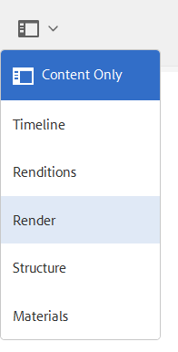

# 將AEM 3D與Autodesk Maya整合 {#integrating-aem-d-with-autodesk-maya}

>[!NOTE]
>
>此任務是可選的，僅與Windows相關。

您可選擇將AEM 3D與Autodesk® Maya®軟體整合，以啟用對原生Maya檔案(`.MA` 和 `.MB`)的支援，並讓您使用任何可用的Maya轉譯器，在AEM中轉譯3D資產。

*此整合僅適用於Windows*。

在與Autodesk Maya整合時，必須安裝和配置Autodesk Maya，將路徑添加到Maya執行檔資料夾，使Maya能夠接收和渲染，並測試整合。

請參閱 [進階組態設定](advanced-config-3d.md)。

另請參 [閱「整合AEM 3D與AutoDesk 3ds Max」](integrating-aem-3d-with-autodesk-3ds-max.md)。

**若要將AEM 3D與Autodesk Maya整合**:

1. 在AEM所在的相同伺服器上安裝Autodesk Maya 2016軟體。

   在安裝後，請確認您可以開啟和使用Maya，且沒有授權問題。

   >[!NOTE]
   >
   >AEM僅使用Maya命令列轉換工具(`render.exe`)。 單一Maya網路授權最多可讓5部伺服器同時處理或轉譯Maya內容。

1. 在Maya中，啟用Autodesk FBX®增效模組。
1. 安裝MentalRay演算增效模組或其他所需的演算程式。

   安裝後，驗證Maya中是否提供MentalRay。

1. 將Maya執行檔資料夾的路徑添加到Windows PATH環境變數中。

   例如，在Windows Server 2012上， **[!UICONTROL Start][!UICONTROL Control Control]System[!UICONTROL > SecuritySetem]> System設定> Advanced Tap Windows Server 2012上，StartControl Control System**>Advanced面板。 將資料夾的完整路徑 `Maya2016\bin` 附加至系統 `Path`變數。

   

1. 若要啟用Maya擷取和轉譯，請開啟 **[!UICONTROL CRXDE Lite]** ，並導覽至 `/libs/settings/dam/v3D/assetTypes/maya` Enabled屬性，並將 **[!UICONTROL Enabled]** 屬性設為 `true`。

   

1. 要啟用JT(Siemens PLM Open CAD)檔案格式，請導航到並 `/libs/settings/dam/v3D/assetTypes/jt` 將 **[!UICONTROL Enabled]** 屬性設定為 `true`。
1. 在AEM中，啟用Maya做為轉譯者。 首先，導覽至「 **[!UICONTROL 工具>一般> CRXDE Lite]**」。
1. 從左 **[!UICONTROL 側面板的CRXDE]** Lite頁面，導覽至下列：

   `/libs/settings/dam/v3D/renderers/maya`

   

1. 將「啟 **[!UICONTROL 用]** 」屬性設 `true`為。

1. 在 **[!UICONTROL CRXDE Lite頁面的左上角附近]** ，點選「全 **[!UICONTROL 部儲存」]**。

   Maya現在可以做為轉譯者。

## AEM 3D與Autodesk Maya的整合測試 {#testing-the-integration-of-aem-d-with-autodesk-maya}

1. 開啟「AEM資產」，然後將位 `.MA` 於檔案夾的 `sample-3D-content/models` 檔案上 `test3d` 傳。

   請注意， `sample-3D-content.zip` 先前已下載用於驗證基本3D功能。

1. 返回卡片 **[!UICONTROL 檢視]** ，並觀察已上傳資產上顯示的訊息橫幅。

   當Maya將原生格式轉換為時，將顯示「轉換格 `.MA` 式」橫幅 `.FBX`。

1. 完成所有處理後，請開啟資 `logo-sphere.ma` 產並選取階 `stage-helipad.ma` 段。

   「預覽」體驗與「與」相同 `logo_sphere.fbx``stage-helipad.fbx`。

1. 在頁面的左上角附近，點選或按一下下拉式清單，然後選取「 **[!UICONTROL CRender]**」。

   

1. 在「 **[!UICONTROL Renderer]** 」下拉式清單中，選取「 **[!UICONTROL Autodesk Maya]**」，然後點選「 **[!UICONTROL Start Render]**」。
1. 在頁面的右上角附近，點選或按一下「 **[!UICONTROL Close]** 」（關閉）以返回 **[!UICONTROL 「Card]** 」（卡片）檢視。

   觀察正在呈現的影像資產上的訊息橫幅(`logo-sphere`除非已指定其他影像名稱)。 橫幅上的進度列會顯示轉譯進度。

   >[!NOTE]
   >
   >演算需耗用大量CPU資源，而且可能需要幾分鐘的時間才能完成

1. 演算完成後，開啟演算後的影像資產。

   檢查已轉譯的影像是否與您按一下「立即轉譯」時所檢視的影像 **[!UICONTROL 相符]**。

## 啟用Maya支援的其他格式 {#enabling-additional-formats-supported-by-maya}

（選用）Maya支援多種3D輸入格式，其中任何格式都可啟用，讓AEM可辨識檔案類型。 啟用後，AEM會將檔案傳送至Maya，將其轉換為可由AEM直接擷取的中介格式。

根據格式，特徵支援可以受到限制（例如，材料可以不通過），質量／保真度可以限制（例如，反面）。 Adobe僅支援一般機制，但不支援任何特定格式轉換。

請參閱 [支援的資料匯入格式 | Maya](https://knowledge.autodesk.com/support/maya/learn-explore/caas/CloudHelp/cloudhelp/2016/ENU/Maya/files/GUID-69BC066D-D4D8-4B12-900C-CF42E798A5D6-htm.html) ，以取得Maya支援的格式資訊。

**若要啟用AEM支援的其他格式**:

1. 使用 **[!UICONTROL CRXDE Lite]**，導覽至 `/libs/settings/dam/v3D/assetTypes`。
1. 複製jt節 **[!UICONTROL 點]** 。 按一下右鍵 **[!UICONTROL jt]** 節點，然後選擇 **[!UICONTROL Copy]**，然後按一下右鍵 **[!UICONTROL assetTypes]** 資料夾並選 ****&#x200B;擇PasteLaste。 這應會產生新節點 `/apps/cq-scene7-v3D/config/assetTypes/Copy of jt`。
1. 重新命名新節點，為其指定唯一名稱，該名稱表示要添加的檔案類型。 可使用檔案尾碼或任何其他唯一識別碼。

1. 將新節 **[!UICONTROL 點的]** 「啟用」屬性設定為 `true`。

1. 將新注 **[!UICONTROL 釋的Extension]** 屬性設定為要添加的格式的檔案尾碼／副檔名。
1. 將 **[!UICONTROL MimeType]** 屬性設為適當值。 `application/x-` 後面跟著 **[!UICONTROL Extension]** 屬性的值應適用於大部分的檔案類型。
1. 請確定「轉 **[!UICONTROL 換]** 」屬性已設 `fbx` 為，而「 **[!UICONTROL 收錄機制]** 」為 `Maya`。
1. 按一 **[!UICONTROL 下頁面左上]** 角附近的「全部儲存」。

以下螢幕抓圖以COLLADA DAE為例說明了添加的檔案格式：

