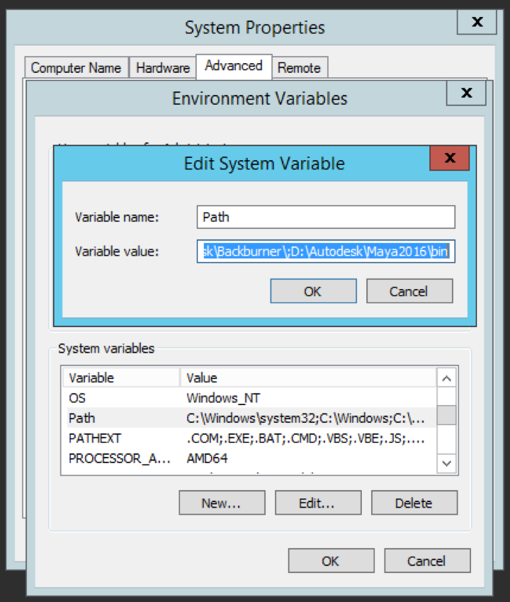

# 將AEM3D與Autodesk Maya {#integrating-aem-d-with-autodesk-maya}整合

>[!NOTE]
>
>此任務是可選的，僅與Windows相關。

您可選擇將AEM3D與Autodesk® Maya®軟體整合，以支援原生Maya檔案（`.MA`和`.MB`），並讓您使用任何可用的Maya轉譯程式來轉譯AEM3D資產。

*此整合僅適用於Windows*。

在與Autodesk Maya整合時，必須安裝和配置Autodesk Maya，將路徑添加到Maya執行檔資料夾，使Maya能夠接收和渲染，並測試整合。

請參閱[進階組態設定](advanced-config-3d.md)。

另請參閱[將AEM3D與AutoDesk 3ds Max](integrating-aem-3d-with-autodesk-3ds-max.md)整合。

**若要將AEM3D與Autodesk Maya整合**:

1. 將Autodesk Maya 2016軟體安裝在托管的同一台服AEM務器上。

   在安裝後，請確認您可以開啟和使用Maya，且沒有授權問題。

   >[!NOTE]
   >
   >僅AEM使用Maya命令行渲染工具(`render.exe`)。 單一Maya網路授權最多可讓5部伺服器同時處理或轉譯Maya內容。

1. 在Maya中，啟用Autodesk FBX®增效模組。
1. 安裝MentalRay演算增效模組或其他所需的演算程式。

   安裝後，驗證Maya中是否提供MentalRay。

1. 將Maya執行檔資料夾的路徑添加到Windows PATH環境變數中。

   例如，在Windows Server 2012上，點選「Start ** > [!UICONTROL Control Panel] > [!UICONTROL System and Security] > [!UICONTROL System] > [!UICONTROL Advanced System Settings] > [!UICONTROL 」環境變數]**。 將`Maya2016\bin`資料夾的完整路徑附加至`Path`系統變數。

   

1. 要啟用Maya進行接收和渲染，請開啟&#x200B;**[!UICONTROL CRXDE Lite]**&#x200B;並導航至`/libs/settings/dam/v3D/assetTypes/maya`，並將&#x200B;**[!UICONTROL Enabled]**&#x200B;屬性設定為`true`。

   

1. 要啟用JT(Siemens PLM Open CAD)檔案格式，請導航至`/libs/settings/dam/v3D/assetTypes/jt`並將&#x200B;**[!UICONTROL Enabled]**&#x200B;屬性設定為`true`。
1. 在AEM中，讓Maya成為轉譯者。 首先，導覽至&#x200B;**[!UICONTROL 工具>一般>CRXDE Lite]**。
1. 從&#x200B;**[!UICONTROL CRXDE Lite]**&#x200B;頁面的左側面板，導覽至下列：

   `/libs/settings/dam/v3D/renderers/maya`

   

1. 將&#x200B;**[!UICONTROL Enabled]**&#x200B;屬性設為`true`。

1. 在&#x200B;**[!UICONTROL CRXDE Lite]**&#x200B;頁面的左上角附近，點選&#x200B;**[!UICONTROL 全部儲存]**。

   Maya現在可以做為轉譯者。

## 測試3D與AEMAutodesk Maya {#testing-the-integration-of-aem-d-with-autodesk-maya}的整合

1. 開啟AEM Assets，然後將位於`sample-3D-content/models`的`.MA`檔案上傳至`test3d`檔案夾。

   請注意，`sample-3D-content.zip`之前是為了驗證基本3D功能而下載的。

1. 返回&#x200B;**[!UICONTROL Card]**&#x200B;檢視並觀察已上傳資產上顯示的訊息橫幅。

   當Maya將原生`.MA`格式轉換為`.FBX`時，會顯示「轉換格式」橫幅。

1. 完成所有處理後，開啟`logo-sphere.ma`資產並選擇`stage-helipad.ma`階段。

   「預覽」體驗與`logo_sphere.fbx`和`stage-helipad.fbx`相同。

1. 在頁面左上角附近，點選或按一下下拉式清單，然後選取&#x200B;**[!UICONTROL CRender]**。

   

1. 在&#x200B;**[!UICONTROL Renderer]**&#x200B;下拉式清單中，選擇&#x200B;**[!UICONTROL Autodesk Maya]**，然後點選&#x200B;**[!UICONTROL Start Render]**。
1. 在頁面的右上角附近，點選或按一下「關閉」以返回「卡片」檢視。********

   觀察正在呈現的影像資產上的訊息橫幅（`logo-sphere`，除非已指定其他影像名稱）。 橫幅上的進度列會顯示轉譯進度。

   >[!NOTE]
   >
   >演算需耗用大量CPU資源，而且可能需要幾分鐘的時間才能完成

1. 演算完成後，開啟演算後的影像資產。

   檢查轉譯的影像是否與您按一下&#x200B;**[!UICONTROL Render Now]**&#x200B;時檢視的影像相符。

## 啟用Maya {#enabling-additional-formats-supported-by-maya}支援的其他格式

（可選）Maya支援多種3D輸入格式，其中任何一種都可啟用，以識AEM別檔案類型。 啟用後，AEM會將檔案傳送至Maya，以轉換為中介格式，並直接由Maya接收AEM。

根據格式，特徵支援可以受到限制（例如，材料可以不通過），質量／保真度可以限制（例如，反面）。 Adobe僅支援一般機制，但不支援任何特定格式轉換。

請參閱[支援的資料匯入格式 | Maya](https://knowledge.autodesk.com/support/maya/learn-explore/caas/CloudHelp/cloudhelp/2016/ENU/Maya/files/GUID-69BC066D-D4D8-4B12-900C-CF42E798A5D6-htm.html)，以取得Maya支援的格式資訊。

**若要啟用其他格式，請執行以下操AEM作**:

1. 使用&#x200B;**[!UICONTROL CRXDE Lite]**&#x200B;導覽至`/libs/settings/dam/v3D/assetTypes`。
1. 複製&#x200B;**[!UICONTROL jt]**&#x200B;節點。 按一下右鍵&#x200B;**[!UICONTROL jt]**&#x200B;節點並選擇&#x200B;**[!UICONTROL 複製]** ，然後按一下右鍵&#x200B;**[!UICONTROL assetTypes]**&#x200B;資料夾並選擇&#x200B;**[!UICONTROL 貼上]**。 這應會產生新節點`/apps/cq-scene7-v3D/config/assetTypes/Copy of jt`。
1. 重新命名新節點，為其指定唯一名稱，該名稱表示要添加的檔案類型。 可使用檔案尾碼或任何其他唯一識別碼。

1. 將新節點的&#x200B;**[!UICONTROL Enabled]**&#x200B;屬性設定為`true`。

1. 將新注釋的&#x200B;**[!UICONTROL Extension]**&#x200B;屬性設定為要添加的格式的檔案尾碼／副檔名。
1. 將&#x200B;**[!UICONTROL MimeType]**&#x200B;屬性設為適當的值。 `application/x-` 後面跟著Extension屬性的 **** 值應適用於大部分的檔案類型。
1. 請確定&#x200B;**[!UICONTROL Conversion]**&#x200B;屬性已設為`fbx`和&#x200B;**[!UICONTROL IngestScrive]**&#x200B;至`Maya`。
1. 按一下頁面左上角附近的&#x200B;**[!UICONTROL 「全部保存」。]**

以下螢幕抓圖以COLLADA DAE為例說明了添加的檔案格式：

