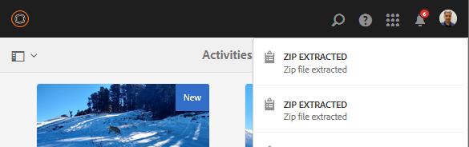
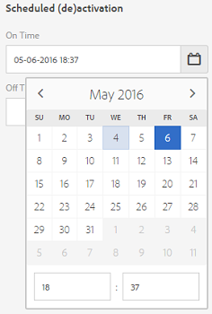
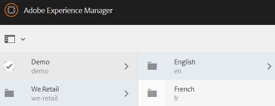
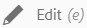
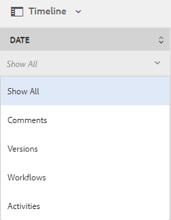
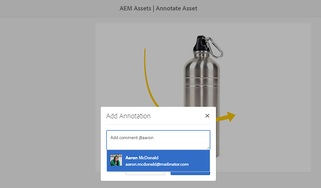

# 管理您的數位資產 {#managing-assets-with-the-touch-optimized-ui}

瞭解各種資產管理和編輯工作，您可使用AEM Assets的觸控最佳化使用者介面來執行這些工作。

本文說明如何使用Adobe Experience Manager(AEM)Assets Touch-optimized使用者介面來管理和編輯資產。 如需使用者介面的基本知識，請參閱 [Touch UI的基本處理](/help/sites-authoring/basic-handling.md)。 若要管理內容片段，請參 [閱管理內容片段](content-fragments-managing.md) 。

## 建立資料夾 {#create-folders}

組織資產集合（例如，所有影像）時， `Nature` 您可以建立資料夾以將資產保持在一起。 您可以使用資料夾來分類和組織您的資產。 AEM Assets不需要您在檔案夾中組織資產，以提高工作效率。

>[!NOTE]
>
>* 共用至Marketing Cloud時，不 `sling:OrderedFolder` 支援共用類型的「資產」檔案夾。 如果要共用資料夾，請不要在建立資料夾時選擇「已排序」。
>* Experience Manager不允許將 `subassets` Word用作資料夾的名稱。 它是為節點保留的關鍵字，其中包含複合資產的子資產。

1. 導覽至您要建立新資料夾的數位資產檔案夾。
1. 在功能表中，按一下「 **[!UICONTROL 建立]**」。 選擇「 **[!UICONTROL 新建資料夾]**」。
1. 在「標 **[!UICONTROL 題]** 」欄位中，提供檔案夾名稱。 依預設，DAM會使用您提供的標題作為檔案夾名稱。 建立資料夾後，您可以覆寫預設資料夾，並指定另一個資料夾名稱。
1. 按一下&#x200B;**[!UICONTROL 建立]**。您的資料夾會顯示在數位資產資料夾中。

不支援下列（以空格分隔的）字元清單：

* 資產檔案名稱不可包含  `* / : [ \ \ ] | # % { } ? &`
* 資產資料夾名稱不可包含  `* / : [ \ \ ] | # % { } ? \" . ^ ; + & \t`

## Upload assets {#uploading-assets}

您可以從本機資料夾或網路磁碟機上傳各種類型的資產（包括影像、PDF檔案、RAW檔案等）至AEM Assets。

>[!NOTE]
>
>在動態媒體- Scene7模式中，您只能上傳檔案大小為2 GB或以下的資產。

您可以選擇將資產上傳至資料夾，不論資料夾是否已指派處理設定檔。

對於已指派處理設定檔的檔案夾，描述檔名稱會出現在卡片檢視的縮圖上。 在清單視圖中，配置檔案名稱將顯示在「處 **[!UICONTROL 理配置檔案]** 」列中。 請參閱 [處理描述檔](processing-profiles.md)。

上傳資產之前，請確定其格式 [受支援](assets-formats.md)。

**若要上傳資產**:

1. 在「資產」網頁介面中，導覽至您要新增數位資產的位置。
1. 若要上傳資產，請執行下列其中一項作業：

   * 在工具列上，點選「建 **[!UICONTROL 立]** 」圖示。 然後，在功能表上，點選「 **[!UICONTROL 檔案」]**。 如有需要，可在顯示的對話框中更名檔案。
   * 在支援HTML5的瀏覽器中，直接將資產拖曳至介面。 不會顯示要更名檔案的對話框。

   

   要選擇多個檔案，請按Ctrl/Command鍵，然後在檔案選擇器對話框中選擇資產。 在iPad中，您一次只能選取一個檔案。

   您可以暫停上傳大型資產（大於500 MB），稍後從同一頁繼續。 點選上 **[!UICONTROL 傳開始]** 時，進度列旁邊的「暫停」圖示。

   

   資產被視為大型資產的大小可以設定。 例如，您可以設定系統，將超過1000 MB（而非500 MB）的資產視為大型資產。 在這種情況下，當上 **[!UICONTROL 傳大於]** 1000 MB的資產時，進度列中的「暫停」按鈕會出現。

   如果上 **[!UICONTROL 傳的檔案大於1000 MB，且檔案小於1000 MB，則「暫停]** 」按鈕不會顯示。 不過，如果您取消少於1000 MB的檔案上傳，則會顯示「暫 **[!UICONTROL 停]** 」按鈕。

   要修改大小限制，請在CRX存 `chunkUploadMinFileSize` 儲庫中配 `fileupload`置節點的屬性。

   當您按一下「暫 **[!UICONTROL 停]** 」圖示時，會切換為「 **** 播放」圖示。 若要繼續上傳，請按一下「播 **[!UICONTROL 放]** 」圖示。

   

   若要取消進行中的上傳，請按一 `X` 下進度列旁的按鈕。 當您取消上傳作業時，AEM Assets會刪除部分上傳的資產。

   在低頻寬情況和網路故障中，恢復上傳的功能特別有用，因為上傳大型資產需要很長時間。 您可以暫停上傳作業，等到情況改善後再繼續。 繼續時，從您暫停的點開始上傳。

   在上傳作業期間，AEM會將上傳的資產部分儲存為CRX儲存庫中的資料區塊。 上傳完成時，AEM會將這些區塊整合到儲存庫中的單一資料區塊。

   要為未完成的區塊上載作業配置清除任務，請轉至 `https://[aem_server]:[port]/system/console/configMgr/org.apache.sling.servlets.post.impl.helper.ChunkCleanUpTask`。

   如果您上傳的資產名稱與資產名稱相同，且資產已在上傳資產的位置使用，則會顯示警告對話方塊。

   您可以選擇取代現有資產、建立其他版本，或借由重新命名已上傳的新資產來保留兩者。 如果您取代現有資產，資產的中繼資料以及任何先前的修改和歷史記錄（例如註解、裁切等）都會被刪除。 如果您選擇保留這兩個資產，新資產會重新命名。

   

   >[!NOTE]
   >
   >在「名稱衝 **[!UICONTROL 突」(Name]** Conflict **** )對話框中選擇「替換」(Replace)時，會為新資產重新生成資產ID。 此ID與先前資產的ID不同。
   >
   >如果 **[!UICONTROL Adobe Analytics啟用「資產分析]** 」來追蹤曝光數／點按數，則此重新產生的資產ID會使Adobe Analytics上資產所擷取的資料無效。

   如果您上傳的資產存在於AEM Assets中，「偵測到重複項目 **** 」對話方塊會警告您您嘗試上傳重複的資產。 僅當現有資產的二進位值的SHA 1校驗和值與您上傳的資產的校驗和值匹配時，才會顯示該對話框。 在這種情況下，資產名稱並不重要。 換言之，如果資產的二進位檔的SHA 1值相同，該對話方塊甚至會針對名稱不同的資產顯示。

   >[!NOTE]
   >
   >只有 **[!UICONTROL 啟用「重複檢測]** 」功能時，才會顯示「 **[!UICONTROL 檢測到重複資料]** 」對話框。 要啟用「重複 **[!UICONTROL 檢測」功能]** ，請參 [閱啟用重複檢測](duplicate-detection.md)。

   

   點選 **[!UICONTROL 「保留]** 」以保留AEM Assets中的重複資產。 點選「 **[!UICONTROL 刪除]** 」可刪除您上傳的重複資產。

   AEM Assets可防止您上傳檔案名稱中包含禁止字元的資產。 如果您嘗試上傳包含不允許字元的資產，AEM Assets會顯示有關檔案名稱中有禁止字元的警告訊息，並停止上傳，直到您移除這些字元或以允許的名稱上傳為止。

   為符合貴組織的特定檔案命名慣例，「上 **[!UICONTROL 傳資產]** 」對話方塊可讓您指定上傳之檔案的長名稱。

   

   但是，不支援下列（以空格分隔的）字元清單：
   * 資產檔案名稱不可包含  `* / : [ \ \ ] | # % { } ? &`
   * 資產資料夾名稱不可包含  `* / : [ \ \ ] | # % { } ? \" . ^ ; + & \t`

   此外，「資產」介面會顯示您上傳的最新資產，或您在所有檢視(「卡片檢視」、「清單檢視」和「**[!UICONTROL 欄檢視」]****[!UICONTROL )中先建立的]**&#x200B;資料夾 ****。

   通常，在同時上傳大型資產或多個資產時，視覺指標可讓您評估進度。 「上 **[!UICONTROL 傳進度]** 」對話方塊會顯示成功上傳檔案的計數，以及無法上傳的檔案。

   

   如果您在上傳檔案之前取消上傳作業，AEM Assets會停止上傳目前的檔案並重新整理內容。 不過，已上傳的檔案不會刪除。

### 串列上傳 {#serial-uploads}

大量上傳大量資產會耗用大量系統資源，這可能會對AEM部署的效能造成負面影響。 潛在的瓶頸可能是您的網際網路連線、磁碟上的讀寫作業、網頁瀏覽器對並行資產上傳時的POST要求數量的限制。 批量上載操作可能會失敗或提前終止。 換言之，AEM資產可能會在擷取大量檔案時遺失某些檔案，或完全無法擷取任何檔案。

為克服此情況，AEM Assets會在大量上傳作業期間一次收錄一個資產（串列上傳），而非同時擷取所有資產。

預設會啟用資產的串列上傳。 若要停用功能並允許並行上傳，請覆 `fileupload` 蓋CRXDe中的節點，並將屬性的 `parallelUploads` 值設為 `true`。

### 使用FTP上傳資產 {#uploading-assets-using-ftp}

動態媒體可透過FTP伺服器批次上傳資產。 如果您要上傳大型資產(>1 GB)或上傳整個檔案夾和子檔案夾，則應使用FTP。 您甚至可以設定FTP上傳，以定期執行。

>[!NOTE]
>
>在動態媒體- Scene7模式中，您只能上傳檔案大小為2 GB或以下的資產。

>[!NOTE]
>
>若要透過FTP在Dynamic Media中上傳資產——在AEM作者上傳Scene7模式安裝功能套件(FP)18912。 請聯絡Adobe客戶服務以取得FP-18912的存取權，並完成FTP帳戶的設定。 如需 [大量資產移轉，請參閱安裝功能套件18912](/help/assets/bulk-ingest-migrate.md)。
如果您使用FTP來上傳資產，則會忽略AEM中指定的上傳設定。 而是使用Dynamic Media Classic中定義的檔案處理規則。

**若要使用FTP上傳資產**

1. 使用您選擇的FTP用戶端，使用您從布建電子郵件收到的FTP使用者名稱和密碼登入FTP伺服器。 在FTP用戶端中，將檔案或資料夾上傳至FTP伺服器。
1. [使用從布建電子郵件收到的憑證](https://www.adobe.com/marketing-cloud/experience-manager/scene7-login.html) ，登入Dynamic Media Classic。 在全域導覽列上，點選「上 **[!UICONTROL 傳」]**。

1. 在左 **[!UICONTROL 上角]** ，點選「透過FTP **[!UICONTROL 」標籤]** 。
1. 在頁面的左側，選擇FTP資料夾，從中上傳檔案；在頁面的右側，選擇目標資料夾。
1. 在頁面的右下角，點選「 **[!UICONTROL Job Options]** 」（作業選項），然後根據您選取之資料夾中的資產來設定所要的選項。

   請參 [閱上傳工作選項](#upload-job-options)。

   >[!NOTE]
   >
   >當您透過FTP上傳資產時，您在Dynamic Media Classic(Scene7)中設定的上傳工作選項會取代在AEM中設定的資產處理參數。

1. 在「上傳工作選項」對話方塊的 **[!UICONTROL 右下角]** ，點選「 **[!UICONTROL 儲存」]**。
1. 在「上傳」頁面的右下角，點 **[!UICONTROL 選「送出]****[!UICONTROL 上傳」]**。

   若要檢視上傳的進度，請在全域導覽列上點選「工 **[!UICONTROL 作」]**。 「作 **[!UICONTROL 業]** 」頁顯示上載進度。 您可以繼續在AEM中工作，並隨時返回Dynamic Media Classic中的「工作」頁面，以檢視進行中的工作。

   若要取消正在進行中的上載作業，請點選「 **[!UICONTROL 持續時間]** 」旁的 **[!UICONTROL 「取消]** 」。

#### 上傳工作選項 {#upload-job-options}

| 上傳選項 | 子選項 | 說明 |
|---|---|---|
| 工作名稱 |  | 預先填入文字欄位的預設名稱包括名稱的使用者輸入部分以及日期和時間戳記。 您可以使用預設名稱，或輸入您自己為此上傳工作建立的名稱。  作業和其他上載和發佈作業記錄在「作業」頁面上，您可以在此處檢查作業的狀態。 |
| 上傳後發佈 |  | 自動發佈您上傳的資產。 |
| 在任何資料夾中覆寫相同的基本資產名稱，不論副檔名為何 |  | 如果希望上載的檔案用相同的名稱替換現有檔案，請選擇此選項。 此選項的名稱可能不同，具體取決於「應用程式設定 **[!UICONTROL >一般設定]** >上傳至應用程式 **[!UICONTROL >覆寫影像」中]**********&#x200B;的設定。 |
| 上載時解壓縮ZIP或TAR檔案 |  |  |
| 工作選項 |  | 點選／按一 **[!UICONTROL 下「工作選項]** 」以開啟「上傳工  作選項」對話方塊，並選擇影響整個上傳工作的選項。 這些選項對於所有檔案類型都是相同的。 您可以從「應用程式一般設定」頁面開始，選擇上傳檔案的預設選項。 要開啟此頁，請選擇「 **[!UICONTROL 設定]** >應 **[!UICONTROL 用程式設定]**」。 點選「預 **[!UICONTROL 設上傳選項]** 」按鈕，以開啟「  上傳工作選項」對話方塊。 |
|  | 時間 | 選擇「一次性」或「循環」。 若要設定循環作業，請選擇「重複」選項（每日、每週、每月或自訂），以指定何時要重複執行FTP上傳作業。 然後視需要指定排程選項。 |
|  | 包含子檔案夾 | 上傳您要上傳之資料夾內的所有子資料夾。 您上傳的檔案夾及其子檔案夾名稱會自動輸入到AEM Assets中。 |
|  | 裁切選項 | 若要從影像的兩側手動裁切，請選取「裁切」功能表，然後選擇「手動」。 然後輸入要從影像的任一側或每一側裁切的像素數。 影像被裁切的程度取決於影像檔案中的ppi（像素／英吋）設定。 例如，如果影像顯示150 ppi，而您在「頂端」、「右側」、「底部」和「左側」文字方塊中輸入75，則會從每側裁切半英吋。  若要自動裁切影像中的空白像素，請開啟「裁切」功能表，選擇「手動」，然後在「頂端」、「右側」、「底部」和「左側」欄位中輸入像素測量值，以便從兩側裁切。 您也可以在「裁切」選單中選擇「修剪」，然後選擇下列選項：  **根據** <ul><li>**顏色** -選擇顏色選項。 然後選取「角」選單，並選擇影像的角，其顏色最能代表您要裁切的空白顏色。</li><li>**透明度** -選擇「透明度」選項。  **容差** -拖曳滑桿以指定0到1的容差。若要根據顏色進行修剪，請指定0以裁切像素，前提是像素完全符合您在影像角落選取的顏色。 接近1的數字允許更多顏色差異。 若要根據透明度進行修剪，請指定0以僅在像素為透明時裁切像素。 接近1的數字可以增加透明度。</li></ul> 請注意，這些裁切選項不具破壞性。 |
|  | 色彩描述檔選項 | 當您建立用於傳送的最佳化檔案時，請選擇顏色轉換：<ul><li>預設色彩保留：當影像包含色域資訊時，保持原始影像顏色；沒有顏色轉換。 現今幾乎所有的影像都已內嵌適當的色彩描述檔。 不過，如果CMYK來源影像不包含內嵌的色彩描述檔，這些色彩會轉換為sRGB（標準紅綠藍）色域。 sRGB是建議在網頁上顯示影像的色域。</li><li>保留原始色域：保留原始顏色，點上不進行任何顏色轉換。 對於沒有內嵌色彩描述檔的影像，任何色彩轉換都會使用「發佈」設定中設定的預設色彩描述檔來完成。 顏色配置檔案可能與使用此選項建立的檔案中的顏色不對齊。 因此，建議您使用「預設色彩保留」選項。</li><li>「自訂自」>「至  」開啟功能表，您可以選擇「轉換自」和「轉換至顏色空間」。 此進階選項會覆寫內嵌在來源檔案中的任何色彩資訊。 當您要送出的所有影像都包含不正確或遺失的色彩描述檔資料時，請選取此選項。</li></ul> |
|  | 影像編輯選項 | 您可以保留影像中的剪裁遮色片，並選擇色彩描述檔。  請參 [閱上傳時的設定影像編輯選項](#setting-image-editing-options-at-upload)。 |
|  | Postscript選項 | 您可以點陣化PostScript®檔案、裁切檔案、維護透明背景、選擇解析度，以及選擇色域。  請參 [閱設定PostScript和Illustrator上傳選項](#setting-postscript-and-illustrator-upload-options)。 |
|  | Photoshop選項 | 您可以從Adobe® Photoshop®檔案建立範本、維護圖層、指定圖層的命名方式、擷取文字，以及指定影像錨定至範本的方式。  請注意，AEM不支援範本。  請參 [閱「設定Photoshop上傳選項](#setting-photoshop-upload-options)」。 |
|  | PDF選項 | 您可以點陣化檔案、擷取搜尋字詞和連結、自動產生eCatalog、設定解析度，以及選擇色域。  請注意，AEM不支援eCatalogs。   請參閱 [設定PDF上傳選項](#setting-pdf-upload-options)。 |
|  | Illustrator選項 | 您可以點陣化Adobe Illustrator®檔案、維護透明背景、選擇解析度，以及選擇色域。  請參 [閱設定PostScript和Illustrator上傳選項](#setting-postscript-and-illustrator-upload-options)。 |
|  | 視訊選項 | 您可以選擇「視訊預設集」來轉碼視訊檔案。  請參 [閱設定eVideo上傳選項](#setting-evideo-upload-options)。 |
|  | 批次集預設集 | 若要從上傳的檔案建立影像集或回轉集，請按一下您要使用之預設集的作用中欄。 您可以選取多個預設集。 您可以在Dynamic Media Classic的「應用程式設定／批次設定預設集」頁面中建立預設集。  請參 [閱將批次集預設集設定為自動產生影像集和回轉集](config-dms7.md#creating-batch-set-presets-to-auto-generate-image-sets-and-spin-sets) ，以進一步瞭解如何建立批次集預設集。  請參閱 [在上傳時設定批次集預設集](#setting-batch-set-presets-at-upload)。 |

#### 在上傳時設定影像編輯選項 {#setting-image-editing-options-at-upload}

上傳影像檔案（包括AI、EPS和PSD檔案）時，您可以在「上傳工作選項」對話方塊中執 **[!UICONTROL 行下列編輯動作]** :

* 從影像邊緣裁切空白字元（請參閱上表的說明）。
* 從影像側手動裁切（請參閱上表的說明）。
* 選擇顏色描述檔（請參閱上表中的選項說明）。
* 從剪裁路徑建立遮色片。
* 使用銳利化遮色片選項銳利化影像
* 挖空背景

| 選項 | 子選項 | 說明 |
|---|---|---|
| 從剪裁路徑建立遮色片 |  | 根據影像的剪裁路徑資訊建立影像的遮色片。 此選項適用於使用已建立剪裁路徑的影像編輯應用程式所建立的影像。 |
| 遮色片銳利化 |  | 可讓您微調最終縮減取樣影像的銳利化濾鏡效果，控制效果的強度、效果半徑（以像素計量），以及忽略的對比度臨界值。  這種效果使用的選項與Photoshop的「遮色片銳利化」濾鏡相同。 與名稱相反，「遮色片銳利化」是銳利化濾鏡。 在「遮色片銳利化」下方，設定您想要的選項。 設定選項的說明如下： |
|  | 數量 | 控制套用至邊緣像素的對比度。  把它想成效果的強度。 動態媒體中「遮色片銳利化」的量值與Adobe Photoshop中的量值之間的主要差異，是Photoshop的量值範圍介於1%到500%之間。 而在動態媒體中，值範圍是0.0到5.0。值5.0大致相當於Photoshop的500%;值0.9等於90%，依此類推。 |
|  | 半徑 | 控制效果的半徑。 值範圍為0-250。  此效果會在影像的所有像素上執行，並從所有方向的所有像素放射出來。 半徑以像素為單位測量。 例如，若要對2000 x 2000像素影像和500 x 500像素影像產生類似的銳利化效果，您可在2000 x 2000像素影像上設定兩個像素的半徑，並在500 x 500像素影像上設定一個像素的半徑值。 較大的值會用於具有更多像素的影像。 |
|  | 臨界值 | 臨界值是套用「遮色片銳利化」濾鏡時會忽略的對比度範圍。 請務必避免在使用此濾鏡時對影像引入「雜訊」。 值範圍是0-255，這是灰階影像中的亮度步驟數。 0=black, 128=50%灰色， 255=white。  例如，閾值為12會忽略膚色的輕微變化，即膚色亮度會避免增加雜訊，但仍會為對比區域增加邊緣對比，例如睫毛與膚色的交集處。  例如，如果您有某人臉的像片，「非銳利遮色片」會影響影像的對比部分，例如睫毛和皮膚會聚，以建立明顯的對比區域，以及平滑的皮膚本身。 即使是最平滑的外觀，亮度值也會有細微的變化。 如果您未使用臨界值，濾鏡會強調外觀像素的這些細微變化。 接著，產生雜音和不想要的效果，同時增加對睫毛的對比度，增強銳利度。  為避免此問題，會引入臨界值，讓濾鏡忽略未大幅改變對比度的像素，例如平滑面板。  在前面顯示的拉鍊圖中，請注意拉鍊旁的紋理。 由於閾值過低，不能抑制雜訊，因此出現了影像雜訊。 |
|  | 單色 | 選取以取消遮色片影像亮度（強度）的銳利化。  取消選取，可個別對每個顏色元件取消遮色片銳利化。 |
| 挖空背景 |  | 上傳影像時，會自動移除該影像的背景。 此技巧有助於吸引對特定物件的注意，並使其在繁忙的背景中脫穎而出。 選擇以啟用或「開啟」「挖空背景」功能和以下子選項： |
|  | Corner | 必要.  用於定義要挖空的背景顏色的影像的角。  您可以選擇 **左上**、左 **下**、右 **上**&#x200B;或右 ****&#x200B;下。 |
|  | 填充方法 | 必要.  從您設定的「轉角」位置控制像素透明度。  您可從下列填色方法中選擇： <ul><li>**泛洪填滿** -將所有像素變成透明，這些像素與您指定並連接到的「角」相符。</li><li>**比對像素** -將所有匹配的像素變為透明，而不論其在影像上的位置。</li></ul> |
|  | 公差 | 選填。  根據您設定的「轉角」位置，控制像素色彩比對的允許變化量。  使用0.0值來精確比對像素顏色，或使用1.0值來允許最大變化。 |

#### 設定PostScript和Illustrator上傳選項 {#setting-postscript-and-illustrator-upload-options}

當您上傳PostScript(EPS)或Illustrator(AI)影像檔時，可以以各種方式設定檔案格式。 您可以點陣化檔案、維持透明背景、選擇解析度，以及選擇色域。 在「PostScript選項」和「Illustrator選項」下的「上傳工作選項」對話方塊中，可使用格式化PostScript和Illustrator檔案的選項。

| 選項 | 子選項 | 說明 |
|---|---|---|
| 處理 |  | 選擇「 **[!UICONTROL 點陣化]** 」，將檔案中的向量圖形轉換為點陣圖格式。 |
| 在轉譯的影像中維持透明背景 |  | 維持檔案的背景透明度。 |
| 解析度 |  | 決定解析度設定。 此設定會決定檔案中每英吋顯示多少像素。 |
| 色彩空間 |  | 選取「色域」選單，然後從下列色域選項中選擇： |
|  | 自動偵測 | 保留檔案的顏色空間。 |
|  | 強制為RGB | 轉換為RGB色域。 |
|  | 強制為CMYK | 轉換為CMYK色域。 |
|  | 強制為灰階 | 轉換為灰階色域。 |

#### 設定Photoshop上傳選項 {#setting-photoshop-upload-options}

PSD（Photoshop檔案）檔案最常用於建立影像範本。 上傳PSD檔案時，您可以從檔案自動建立影像範本（選取「上傳」畫面上的「建立範本」選項）。

如果您使用PSD檔案建立範本，Dynamic Media會從含圖層的PSD檔案建立多張影像；它會為每個圖層建立一個影像。

使用上 **[!UICONTROL 述的「裁切選]** 項 **[!UICONTROL 」和「色彩描述檔選項]**」以及Photoshop上傳選項。

>[!NOTE]
>
>AEM不支援範本。

| 選項 | 子選項 | 說明 |
|---|---|---|
| 維護圖層 |  | 將PSD中的圖層（如果有的話）分割為個別資產。 資產圖層仍與PSD相關聯。 您可以在「細節」視圖中開啟PSD檔案並選擇圖層面板來查看它們。 |
| 建立範本 |  | 從PSD檔案中的圖層建立範本。 |
| 擷取文字 |  | 擷取文字，讓使用者可在檢視器中搜尋文字。 |
| 將圖層延伸至背景大小 |  | 將撕開的影像圖層大小延伸至背景圖層的大小。 |
| 圖層命名 |  | PSD檔案中的圖層會上傳為個別影像。 |
|  | 圖層名稱 | 在PSD檔案中，將影像命名為圖層名稱之後。 例如，原始PSD檔案中名為「價格標籤」的圖層會變成名為「價格標籤」的影像。 但是，如果PSD檔案中的圖層名稱是預設的Photoshop圖層名稱（背景、圖層1、圖層2等），則影像會以其PSD檔案中的圖層編號命名，而非預設圖層名稱。 |
|  | Photoshop和圖層編號 | 在PSD檔案中將影像命名為圖層編號之後，忽略原始圖層名稱。 影像會以Photoshop檔案名稱和附加的圖層編號命名。 例如，檔案Spring Ad.psd的第二層名為Spring Ad_2，即使它在Photoshop中具有非預設名稱亦然。 |
|  | Photoshop和圖層名稱 | 在PSD檔案後面加上圖層名稱或圖層編號的影像名稱。 如果PSD檔案中的圖層名稱是預設的Photoshop圖層名稱，則會使用圖層編號。 例如，在名為SpringAd的PSD檔案中，名為Price Tag的圖層名為Spring Ad_Price Tag。 預設名為Layer 2的層稱為Spring Ad_2。 |
| 錨點 |  | 指定如何將影像錨定在範本中，範本是由PSD檔案產生的圖層構圖所產生。 依預設，錨點是中心。 中心錨點可讓取代影像最好填滿相同的空間，不論取代影像的長寬比為何。 當參考範本並使用參數替代時，以不同方式取代此影像的影像會有效佔據相同的空間。 如果您的應用程式需要取代影像來填滿範本中已分配的空間，請變更為不同的設定。 |

#### 設定PDF上傳選項 {#setting-pdf-upload-options}

當您上傳PDF檔案時，可以以多種方式格式化它。 您可以裁切其頁面、擷取搜尋字詞、輸入每英吋像素的解析度，並選擇色域。 PDF檔案通常包含修剪邊界、裁切標籤、註冊標籤和其他印表機標籤。 當您上傳PDF檔案時，可以從頁面兩側裁切這些標籤。

>[!NOTE]
>
>AEM不支援eCatalogs。

從下列選項中選擇：

| 選項 | 子選項 | 說明 |
|---|---|---|
| 處理 | 點陣化 | （預設值）將PDF檔案中的頁面分割，並將向量圖形轉換為點陣圖影像。 選擇此選項可建立eCatalog。 |
| 提取 | 搜尋字詞 | 從PDF檔案擷取字詞，以便在eCatalog檢視器中依關鍵字搜尋檔案。 |
|  | 連結 | 從PDF檔案擷取連結，並將其轉換為eCatalog檢視器中使用的影像地圖。 |
| 從多頁PDF自動產生eCatalog |  | 自動從PDF檔案建立eCatalog。 eCatalog是以您上傳的PDF檔案命名。 （只有當您上傳PDF檔案時點陣化時，此選項才可用。） |
| 解析度 |  | 決定解析度設定。 此設定會決定PDF檔案中每英吋顯示的像素數。 預設值為150。 |
| 色彩空間 |  | 選取「色域」選單，然後為PDF檔案選擇色域。 大部分的PDF檔案都有RGB和CMYK色彩影像。 RGB色域最適合線上檢視。 |
|  | 自動偵測 | 保留PDF檔案的色域。 |
|  | 強制為RGB | 轉換為RGB色域。 |
|  | 強制為CMYK | 轉換為CMYK色域。 |
|  | 強制為灰階 | 轉換為灰階色域。 |

#### 設定eVideo上傳選項 {#setting-evideo-upload-options}

您可以從各種視訊預設集中選擇，來轉換視訊檔案。

| 選項 | 子選項 | 說明 |
|---|---|---|
| 適應性影片 |  | 單一編碼預設集，可搭配任何外觀比例建立視訊，以便發佈至行動裝置、平板電腦和桌上型電腦。 使用此預設集編碼的已上傳來源影片會以固定高度設定。 不過，寬度會自動縮放，以保留視訊的外觀比例。  最佳實務是使用最適化視訊編碼。 |
| 單一編碼預設集 | 排序編碼預設集 | 選取「名稱」或「大小」，依名稱或解析度大小來排序「案頭」、「行動裝置」和「平板電腦」下方所列的編碼預設集。 |
|  | 桌面 | 建立MP4檔案，以提供串流或漸進式視訊體驗至桌上型電腦。選擇一或多個外觀比例，以符合您所需的解析度大小和目標資料速率。 |
|  | 行動 | 建立MP4檔案，以便在iPhone或Android行動裝置上傳送。選取一或多個寬高比，以符合您所需的解析度大小和目標資料速率。 |
|  | 平板電腦 | 建立MP4檔案，以便在iPad或Android平板裝置上發佈。選取一或多個外觀比例，以符合您所需的解析度大小和目標資料速率。 |

#### 在上傳時設定批次集預設集 {#setting-batch-set-presets-at-upload}

如果您想從上傳的影像自動建立影像集或回轉集，請按一下您要使用之預設集的「 **[!UICONTROL Active]** 」欄。 您可以選取多個預設集。

請參 [閱將批次集預設集設定為自動產生影像集和回轉集](config-dms7.md#creating-batch-set-presets-to-auto-generate-image-sets-and-spin-sets) ，以進一步瞭解如何建立批次集預設集。

### 串流上傳 {#streamed-uploads}

如果您上傳許多資產，AEM伺服器的I/O呼叫會大幅增加，這會降低上傳效率，甚至會導致逾時。 AEM Assets支援串流上傳資產。 串流上傳可避免在將磁碟複製到儲存庫之前，先在伺服器上的臨時資料夾中儲存資產，從而減少上傳操作期間的磁碟I/O。 而是直接將資料傳輸到儲存庫。 這樣，上傳大型資產的時間和逾時的可能性就會減少。 AEM Assets預設會啟用串流上傳。

在JEE伺服器上執行且Servlet-api版本低於3.1的AEM，會停用串流上傳。

### 解壓縮包含資產的ZIP封存 {#extract-zip-archive-containing-assets}

您可以像上傳任何其他支援的資產一樣，上傳ZIP封存。 相同的檔案名稱規則適用於ZIP檔案。 AEM可讓您將ZIP封存解壓縮至DAM位置。

一次選擇一個ZIP存檔，按一下「解 **[!UICONTROL 壓存檔]**」，然後選擇目標資料夾。 選擇一個選項來處理衝突（如果有）。 如果ZIP檔案中的資產已存在於目標檔案夾中，您可以選取下列其中一個選項：略過擷取、取代現有檔案、透過重新命名保留兩個資產，或建立新版本。

摘取完成後，AEM會在通知區中通知您。 當AEM擷取ZIP時，您可以回到您的工作中，而不會中斷擷取。

此功能的一些限制包括：

* 如果目的地存在同名的資料夾，ZIP檔案中的資產會解壓縮在現有資料夾中。

* 如果您取消擷取，則不會刪除已擷取的資產。

* 您不能同時選擇兩個ZIP檔案並解壓縮它們。 一次只能解壓縮一個ZIP檔案。

## 預覽資產 {#previewing-assets}

**若要預覽資產**:

1. 從「資產」使用者介面，導覽至您要預覽的資產所在的位置。
1. 點選所要的資產以將其開啟。

1. 在預覽模式中，支援的影像類型(使用互 [動式編輯](assets-formats.md#supported-raster-image-formats) )可使用縮放選項。

   若要縮放資產，請點選 **[!UICONTROL +]** （或點選資產上的放大鏡）。 要縮小，點 **[!UICONTROL 選]**。 當您放大時，可以透過平移來仔細檢視影像的任何區域。 「重 **[!UICONTROL 設縮放]** 」箭頭會將您帶回原始檢視。

   

   點選「 **[!UICONTROL 重設]** 」按鈕，將檢視重設為原始大小。

   

>[!MORELIKETHIS]
>
>* [預覽動態媒體資產](/help/assets/previewing-assets.md)。
>* [檢視子資產](managing-linked-subassets.md#viewing-subassets)。

## 編輯屬性 {#editing-properties}

1. 導覽至您要編輯其中繼資料的資產所在位置。

1. 選取資產，然後從工具列 **[!UICONTROL 點選]** 「屬性」以檢視資產屬性。 或者，選擇資 **[!UICONTROL 產卡上]** 「屬性」的快速動作。

   

1. 在「屬 **[!UICONTROL 性]** 」頁面中，編輯各標籤下的中繼資料屬性。 例如，在「基 **[!UICONTROL 本]** 」標籤下，編輯標題、說明等。

   「屬性」頁面 **[!UICONTROL 的版面配置]** ，以及可用的中繼資料屬性，取決於基礎的中繼資料結構。 要瞭解如何修改「屬性」頁的 **[!UICONTROL 佈局]** ，請參 [閱元資料結構](metadata-schemas.md)。

1. 若要排程啟動資產的特定日期/時間，請使用「準時」欄位旁的日 **[!UICONTROL 期選擇器]** 。

   

1. 若要在特定持續時間後停用資產，請從「關閉時間」欄位旁的日期選取器選擇停用 **[!UICONTROL 日期和時間]** 。

   停用日期應晚於資產的啟用日期。 在「關 [!UICONTROL 閉時間]」後，資產及其轉譯無法透過「資產」網頁介面或HTTP API使用。

   

1. 在「標 **[!UICONTROL 記]** 」欄位中，選取一或多個標籤。 若要新增自訂標籤，請在方塊中輸入標籤名稱，然後按 **[!UICONTROL Enter]**。 新標籤會儲存在AEM中。

   YouTube需要標籤才能發佈，並有YouTube的連結（如果找到適當的連結）。
要建立標籤，需要在CRX儲存庫中 `/content/cq:tags/default` 具有寫權限。

1. To provide a rating to the asset, tap the **[!UICONTROL Advanced]** tab and then tap the star at the appropriate position to assign the desired rating.

   

   您指派給資產的評分分數會顯示在「您的評 **[!UICONTROL 分」下]**。 從對資產評分的使用者收到的資產平均評分，會顯示在「評 **[!UICONTROL 分」下]**。 此外，「分級劃分」下方會顯示對平均分級分數貢獻的分 **[!UICONTROL 級分數]**。 您可以根據平均評分分數來搜尋資產。

1. 若要檢視資產的使用情況統計資料，請點選「 **[!UICONTROL 前瞻分析]** 」標籤。

   使用統計資料包括：

   * 檢視或下載資產的次數。
   * 使用資產的通道／裝置。
   * 最近使用資產的創意解決方案。

   如需詳細資訊，請參 [閱資產分析](touch-ui-asset-insights.md)。

1. 點選「 **[!UICONTROL 儲存並關閉]**」。
1. 導覽至「資產」UI。 編輯的中繼資料屬性，包括標題、說明、評分等，會顯示在資產卡片檢視的資產卡片上，以及清單檢視的相關欄下。

## 複製資產 {#copying-assets}

複製資產或資料夾時，會複製整個資產或資料夾及其內容結構。 複製的資產或資料夾會在目標位置複製。 來源位置的資產不會變更。

不會結轉資產特定副本的少數屬性。 例如：

* 資產ID、建立日期和時間，以及版本和版本記錄。 有些屬性由屬性、 `jcr:uuid`和 `jcr:created`指示 `cq:name`。

* 每個資產及其每個轉譯的建立時間和參考路徑都是唯一的。

保留其他屬性和元資料資訊。 複製資產時不會建立部分復本。

1. 從「資產」UI中，選取一或多個資產，然後點選工具列 **[!UICONTROL 中的「復]** 」圖示。 或者，從資 **[!UICONTROL 產卡選擇]** 「複製」快速動作。

   

   >[!NOTE]
   >
   >如果您使用「復 **[!UICONTROL 制]** 」快速動作，一次只能複製一個資產。

1. 導覽至您要複製資產的位置。

   >[!NOTE]
   >
   >如果您在相同位置複製資產，AEM會自動產生名稱的變更。 例如，如果您複製名為Square的資產，AEM會自動產生其復本的標題為Square1。

1. 從工具 **[!UICONTROL 列點選]** 「貼上資產」圖示：

   

   資產會複製到此位置。

   >[!NOTE]
   >
   >「貼 **[!UICONTROL 上]** 」圖示可在工具列中使用，直到貼上作業完成為止。

### 移動或重新命名資產 {#moving-or-renaming-assets}

1. 導覽至您要移動的資產所在的位置。

1. Select the asset, and tap the **[!UICONTROL Move]** icon from the toolbar.

   

1. 在「移 **[!UICONTROL 動資產]** 」精靈中，執行下列任一項作業：

   * 指定資產移動後的名稱。 然後點選「 **[!UICONTROL Next]** （下一步）」繼續。
   * 點選「 **[!UICONTROL 取消]** 」以停止程式。

   >[!NOTE]
   >
   >如果新位置沒有同名的資產，您可以指定該資產的相同名稱。 但是，如果您將資產移至同名資產所在的位置，則應使用不同的名稱。 如果您使用相同的名稱，系統會自動產生名稱的變化。 例如，如果您的資產名稱為Square，系統會為其副本產生名稱Square1。

   >[!NOTE]
   >
   >不支援下列（以空格分隔的）字元清單：
   >* 資產檔案名稱不可包含  `* / : [ \ \ ] | # % { } ? &`
   >* 資產資料夾名稱不可包含  `* / : [ \ \ ] | # % { } ? \" . ^ ; + & \t`

1. 在「選 **[!UICONTROL 擇目標]** 」頁上，執行下列操作之一：

   * 導覽至資產的新位置，然後點選「下 **[!UICONTROL 一]** 」繼續。
   * 點選「 **[!UICONTROL 上一步]** 」可返回「重新 **[!UICONTROL 命名]** 」頁面。

1. 如果要移動的資產有任何參照頁面、資產或系列，則「選擇目標」標籤旁 **[!UICONTROL 會顯示]** 「調整參 **[!UICONTROL 考」標籤]** 。

   在「調整參照」( **[!UICONTROL Adjust References]** )頁面上執行下列任一操作：

   * 指定要根據新詳細資料調整的參照，然後點選「移 **[!UICONTROL 動]** 」繼續。
   * 從「調 **[!UICONTROL 整」欄]** ，選取或取消選取資產的參考。
   * 點選「 **[!UICONTROL 上一步]** 」可返回「選 **[!UICONTROL 擇目標]** 」頁面。
   * 點選「 **[!UICONTROL 取消]** 」以停止移動操作。

   如果您不更新參照，則參照會繼續指向資產的先前路徑。 如果您調整參照，它們會更新為新資產路徑。

## 管理轉譯 {#managing-renditions}

1. 您可以新增或移除資產的轉譯，但原始的轉譯除外。 導覽至您要新增或移除轉譯的資產位置。

1. 點選資產以開啟其資產頁面。

   

1. 點選「 **[!UICONTROL 全域導覽]** 」圖示，然後從清 **[!UICONTROL 單中選取「轉譯]** 」。

   

1. 在「轉 **[!UICONTROL 譯]** 」面板中，檢視為資產產生的轉譯清單。

   

   >[!NOTE]
   >
   >依預設，AEM Assets不會在預覽模式中顯示資產的原始轉譯。 如果您是管理員，可以使用覆蓋來設定AEM Assets，以在預覽模式中顯示原始轉譯。

1. 選取要檢視或刪除轉譯的轉譯。

   **刪除轉譯**

   從「轉譯」面板選取轉 **[!UICONTROL 譯]** ，然後從工具列點選「 **[!UICONTROL 刪除轉譯]** 」圖 [示](/help/sites-authoring/basic-handling.md)。 資產處理完成後，無法大量刪除轉譯。 對於個別資產，您可以從使用者介面手動移除轉譯。 對於多個資產，您可以自訂Experience Manager以刪除特定轉譯或刪除資產，然後重新上傳已刪除的資產。

   

   **上傳新轉譯**

   Navigate to the asset details page for the asset, and tap the **[!UICONTROL Add Rendition]** icon in the toolbar to upload a new rendition for the asset.

   

   >[!NOTE]
   >
   >如果您從「轉譯」面板選取轉譯 **** ，工具列會變更上下文，並僅顯示與轉譯相關的動作。Options, such as the **[!UICONTROL Upload Rendition]** icon is not displayed. 若要在工具列中檢視這些選項，請導覽至資產的詳細資訊頁面。

   您可以設定要顯示在影像或視訊資產詳細資料頁面的轉譯尺寸。 AEM Assets會根據您指定的維度，顯示具有精確或最接近的維度的轉譯。

   To configure rendition dimensions of an image at the asset detail level, overlay the **[!UICONTROL renditionpicker]** node `libs/dam/gui/content/assets/assetpage/jcr:content/body/content/content/items/assetdetail/items/col1/items/assetview/renditionpicker` and configure the value of the width property. 設定屬性大 **[!UICONTROL 小 (長) (KB]** )以取代寬度，以根據影像大小自訂資產詳細資料頁面上的轉譯。For size-based customization, the property **[!UICONTROL preferOriginal]** assigns preference to the original if the size of the matched rendition is greater than the original.

   同樣地，您也可以透過覆 **[!UICONTROL 蓋]** ，自訂「註解」頁面影像 `libs/dam/gui/content/assets/annotate/jcr:content/body/content/content/items/content/renditionpicker`。

   

   若要設定視訊資產的轉譯維度，請導覽至位於CRX存放庫中的 **[!UICONTROL videopicker]** 節點 `/libs/dam/gui/content/assets/assetpage/jcr:content/body/content/content/items/assetdetail/items/col1/items/assetview/videopicker`，覆蓋節點，然後編輯適當的屬性。

   >[!NOTE]
   >
   >只有採用HTML5相容視訊格式的瀏覽器才支援視訊註解。 此外，視瀏覽器而定，支援不同的視訊格式。

如需子資產的詳細資訊，請參 [閱「管理子資產](managing-linked-subassets.md)」。

## Delete assets {#deleting-assets}

若要解析或移除其他頁面的傳入參照，請先更新相關參照，再刪除資產。

此外，使用覆蓋停用強制刪除按鈕，以禁止使用者刪除參照的資產並留下中斷的連結。

您需要dam/asset的刪除權限才能刪除資產。 如果您只有修改權限，則只能編輯資產中繼資料並新增附註至資產。 不過，您無法刪除資產或其中繼資料。

**若要刪除資產**:

1. 導覽至您要刪除的資產所在的位置。

1. Select the asset, and tap the **[!UICONTROL Delete]** icon from the toolbar.

   

1. 在確認對話方塊中，點選：

   * **[!UICONTROL 取消]** ，停止動作
   * **[!UICONTROL 刪除]** ，以根據下列條件確認動作：

      * 如果資產沒有參考，則會刪除資產。
      * 如果資產有參考，則會出現錯誤訊息通知您 **[!UICONTROL 已參考一或多個資產]**。 您可以選取&#x200B;**[!UICONTROL 強制刪除]**&#x200B;或&#x200B;**[!UICONTROL 取消]**。

   >[!NOTE]
   >
   >若要解析或移除其他頁面的傳入參照，請先更新相關參照，再刪除資產。
   >
   >此外，使用覆蓋 **[!UICONTROL 停用「強制刪除]** 」按鈕，禁止使用者刪除參照的資產並留下中斷的連結。

## 下載資產 {#downloading-assets}

See [Download assets from AEM](download-assets-from-aem.md)

## Publish assets {#publishing-assets}

如果您發佈正在處理的資產，則只會發佈原始內容。 缺少轉譯。 等待處理完成，然後在處理完成後發佈或重新發佈資產。

如果您要發佈的檔案夾包含空白檔案夾，則不會發佈空白檔案夾。

如需動態媒體的詳細資訊，請參閱發 [布動態媒體資產](publishing-dynamicmedia-assets.md)。

**若要發佈資產**:

1. 導覽至您要發佈的資產／資料夾的位置

1. Either select the **[!UICONTROL Publish]** quick action from the asset card, or select the asset and tap the **[!UICONTROL Quick Publish]** icon from the toolbar.
1. 如果資產引用其他資產，其引用將列在嚮導中。 只會顯示自上次發佈或未發佈後未發佈或修改的參照。 選擇要發佈的參照。

   

1. 點選 **[!UICONTROL 「發佈]** 」以確認資產的啟動。

## 取消發佈資產 {#unpublishing-assets}

解除發佈複雜資產時，僅解除發佈資產。 請避免取消發佈參照，因為其他已發佈資產可能會參照這些參照。

**若要解除發佈資產**:

1. 導覽至您要從發佈環境（解除發佈）移除的資產或資產檔案夾的位置。

1. 選取要解除發佈的資產或檔案夾，然後從工具列點選「 **[!UICONTROL 管理出版物]** 」圖示。

   

1. 從清單 **[!UICONTROL 中選取]** 「取消發佈」動作。

   

1. 若要稍後解除發佈資產，請選取「 **[!UICONTROL 稍後解除發佈]**」，然後選取要解除發佈資產的日期。
1. 排程資產在發佈環境中無法使用的日期。
1. 如果資產參考其他資產，請選擇您要取消發佈的參考。 點選「 **[!UICONTROL 解除發佈]**」。
1. 在確認對話方塊中，執行下列其中一項作業：

   * 點選「 **[!UICONTROL 取消]** 」以停止動作
   * 點選「 **[!UICONTROL 解除發佈]** 」以確認資產在指定日期未發佈（在發佈環境中不再提供）。

## 建立已關閉的使用者群組 {#closed-user-group}

CUG（關閉的使用者群組）可用來限制對從AEM發佈的特定資產資料夾的存取。 如果為資料夾建立CUG，則對資料夾（包括資料夾資產和子資料夾）的訪問僅限分配的成員或組。 若要存取資料夾，他們必須使用其安全憑證登入。

CUG是限制存取您資產的額外方式。 您也可以設定資料夾的登入頁面。

**要建立已關閉的用戶組**:

1. 從「資產」UI中選取資料夾，然後點選工具列中的「 **[!UICONTROL 屬性]** 」圖示以顯示屬性頁面。
1. 在「權 **[!UICONTROL 限]** 」標籤中，在「已關閉的使用者群組」 **[!UICONTROL 下新增成員或群組]**。

   

1. 若要在使用者存取資料夾時顯示登入畫面，請選取「啟 **[!UICONTROL 用]** 」選項。 然後，在AEM中選取登入頁面的路徑，並儲存變更。

   

   如果您未指定登入頁面的路徑，AEM會在發佈例項中顯示預設登入頁面。

1. 發佈資料夾，然後嘗試從發佈例項存取資料夾。 隨即顯示登入畫面。
1. 如果您是CUG成員，請輸入您的安全憑據。 資料夾會在AEM驗證您後顯示。

## 搜尋資產 {#searching-assets}

「搜尋與篩選」區段會詳 [細說明基本搜尋](/help/sites-authoring/search.md#search-and-filter) 。 使用「 **[!UICONTROL 搜尋]** 」面板來搜尋資產、標籤和中繼資料。 您可以使用通配符星號搜索字串的部分。 此外，您也可以使用「搜尋 **[!UICONTROL Facet]** 」自訂「 [搜尋」面板](search-facets.md)。

對於最近上傳的資產，在您在Omnisearch方塊中輸入時，其中繼資料（包括標題、標籤等）不會立即出現在建議清單中。

這是因為AEM Assets會等到逾時期間（預設為1小時）到期後，再執行背景工作，為所有新上傳／更新的資產建立中繼資料索引，並將其新增至建議清單。

## 使用快速動作 {#quick-actions}

一次只有一個資產的快速動作圖示可用。視您的裝置而定，執行下列動作以顯示快速動作圖示：

* 觸控裝置：輕觸並按住。 例如，在iPad上，您可以點選並按住資產，以便顯示快速動作。
* 非觸控裝置：暫留指標。 例如，在案頭裝置上，如果您將指標暫留在資產縮圖上，就會顯示快速動作列。

### 導覽至並選取資產 {#navigating-and-selecting-assets}

您可以使用「選取」圖示，檢視、導覽及選取任何可用檢視（卡片、欄、清單）的 **[!UICONTROL 資產]** 。 **[!UICONTROL 選取]** 「」會在卡片檢視中顯示為快速動作。

在清單檢視中， **** 當您將滑鼠圖示暫留在縮圖上方，而清單中資產／資料夾的名稱之前時，會顯示「選取」。

與清單檢視類似， **[!UICONTROL 當您將滑鼠圖示暫留在縮圖上方（在欄檢視中的資產或資料夾名稱之前）時，會顯示「選取(Select]** )」。

如需詳細資訊，請參 [閱檢視和選取資源](/help/sites-authoring/basic-handling.md#viewing-and-selecting-resources)。

## 編輯影像 {#editing-images}

AEM Assets介面中的編輯工具可讓您對影像資產執行小型編輯工作。 您可以裁切、旋轉、翻轉和執行其他影像編輯工作。 您也可以將影像地圖新增至資產。

具有下列格式的檔案支援影像編輯：

* BMP
* GIF
* PNG
* JPEG

對於某些元件， **[!UICONTROL 全屏模式]** 有其他可用選項。

要編輯TXT檔案，請在「配 **[!UICONTROL 置管理器」中設定Day CQ Link Externalizer]** 。

您也可以使用影像編輯器新增影像地圖。 如需詳細資訊，請參 [閱新增影像地圖](image-maps.md)。

**若要編輯影像**:

1. 執行下列任一項作業，以在編輯模式中開啟資產：

   * 選取資產，然後按一下工具 **[!UICONTROL 列中的]** 「編輯」圖示。
   * 點選 **[!UICONTROL 卡片檢視]** 中資產上顯示的「編輯」選項。
   * 在資產頁面中，點選工 **[!UICONTROL 具列中的]** 「編輯」圖示。

   

1. 若要裁切影像，請點選「 **[!UICONTROL 裁切」]**。

   

1. 從清單中選取所需的選項。裁切區域會根據您選擇的選項出現在影像上。「自 **[!UICONTROL 由手形]** 」選項可讓您裁切影像，而不受任何外觀比例限制。

   

1. 選取要裁切的區域，並在影像上調整大小或重新定位。
1. 使用右 **[!UICONTROL 上角]** 的「完成」選項裁切影像。 點選「 **[!UICONTROL 完成]** 」也會觸發轉譯的重新產生。

   

1. Use the **[!UICONTROL Undo]** and **[!UICONTROL Redo]** icons on the top right to revert to the un-cropped image or retain the cropped image, respectively.

   

1. 點選適當的 **[!UICONTROL 「旋轉]** 」圖示，以順時針或逆時針旋轉影像。

   

1. 點選適當的「 **[!UICONTROL 反向]** 」圖示，以水準或垂直反向影像。

   

1. 點選「完 **[!UICONTROL 成]** 」圖示以儲存變更。

   

## 使用時間軸 {#timeline}

「時 **[!UICONTROL 間軸]** 」可讓您檢視所選項目的各種事件，例如資產的作用中工作流程、註解、註解、活動記錄檔和版本。

在「系 [列」控制台](managing-collections-touch-ui.md#navigating-the-collections-console),「全 **[!UICONTROL 部顯示]** 」清單提供僅檢視注釋和工作流程的選項。 此外，時間軸只會針對控制台中列出的頂層系列顯示。 如果您在任何系列中導覽，則不會顯示它。

**[!UICONTROL 時間軸]** 包含多 [種內容片段的特定選項](content-fragments-managing.md#timeline-for-content-fragments);此功能需 [要AEM 6.4 Service Pack 2(6.4.2.0)](/help/release-notes/sp-release-notes.md) 或更新版本。

**要使用時間軸**:

1. 開啟資產的資產頁面，或在資產UI中選取它。
1. 點選「 **[!UICONTROL 全域導覽]** 」圖示，並從清單 **[中選擇「時間軸]** 」。

   

1. 在顯示的清單中，使用「全 **[!UICONTROL 部顯示]** 」清單以根據注釋、版本、工作流程和活動來篩選結果。

   

## 新增註解 {#annotating}

註解是影像或視訊中新增的註解或說明註解。 註解可讓行銷人員協作並留下有關資產的意見回應。

只有採用HTML5相容視訊格式的瀏覽器才支援視訊註解。 AEM Assets支援的視訊格式取決於瀏覽器。

對於內容片段， [在編輯器中建立註解](content-fragments-variations.md#annotating-a-content-fragment);此功能需 [要AEM 6.4 Service Pack 2(6.4.2.0)](/help/release-notes/sp-release-notes.md) 或更新版本。

您可以在儲存多個註解之前，先加入這些註解。

您可以新增附註至視訊資產。 在為視訊加上註解時，播放器會暫停，讓您在影格上加上註解。 如需詳細資訊，請參 [閱「管理視訊資產](managing-video-assets.md)」。

您也可以新增註解至系列。 不過，如果系列包含子系列，您只能將註解或註解新增至父系列。 「注 **[!UICONTROL 解]** 」選項不適用於子系列。

**要添加註釋**:

1. 導覽至您要新增附註的資產位置。
1. 從下列任 **[!UICONTROL 一欄點選]** 「註解」圖示：

   * [快速動作](managing-assets-touch-ui.md#quick-actions)
   * 在選取資產或導覽至資產頁面後，從工具列

   

1. 在時間軸底部的 **[!UICONTROL 「注釋]** 」方塊中新增注釋。Alternatively, mark up an area on the image and add an annotation in the **[!UICONTROL Add Annotation]** dialog box.

   

1. 若要通知使用者註解的相關資訊，請指定使用者的電子郵件地址並新增註解。 例如，若要通知Aaron McDonald有關註解的資訊，請輸入@aa。 所有相符使用者的提示會顯示在清單中。 從清單中選取Aaron的電子郵件地址，以便用注釋標籤他。 同樣地，您可以在注釋內或注釋之前或之後的任何地方標籤更多用戶。

   >[!NOTE]
   >
   >對於非管理員使用者，只有當使用者具有CRXDE中的「讀取」權限時，才會顯 `/home` 示建議。

   

1. 新增註解後，點選「 **[!UICONTROL 新增]** 」以儲存它。 註解通知會傳送給Aaron。

   

1. 點選「 **[!UICONTROL 關閉]** 」以退 **[!UICONTROL 出「注釋]** 」模式。
1. 若要檢視通知，請使用Aaron MacDonald的認證登入AEM Assets，並點選「 **[!UICONTROL Notifications]** 」圖示以檢視通知。

1. 若要選擇不同的顏色以便區分使用者，請點選「描述檔」 **[!UICONTROL 圖示]** ，然後點選「我的 **[!UICONTROL 偏好設定」]**。

   

1. Specify the desired color in the **[!UICONTROL Annotation Color]** box, then tap **[!UICONTROL Accept]**.

   

### 查看保存的注釋 {#viewing-saved-annotations}

1. 要查看資產的已保存批注，請定位至資產的位置並開啟資產的資產頁。

1. 點選「 **[!UICONTROL 全域導覽]** 」圖示，並從清單中點 **[!UICONTROL 選「時間軸]** 」。

   

1. 從時間軸 **[!UICONTROL 的「顯示全部]** 」清單中，選取「注 **[!UICONTROL 釋]** 」以根據註解來篩選結果。

   

1. 在「時間軸」面板中點 **[!UICONTROL 選注釋]** ，以檢視影像上的對應註解。

   

1. 點選「 **[!UICONTROL 刪除]** 」以移除特定留言。

### 列印註解 {#printing-annotations}

如果資產有註解或已經受審核工作流程，您可以將資產連同註解列印為PDF檔案，以便離線審核。

您也可以選擇僅打印注釋或查看狀態。

冗長的註解可能無法在PDF檔案中正確呈現。 為獲得最佳演算效果，Adobe建議您將註解限制在50字以內。

若要列印註解和檢閱狀態，請點選「列 **[!UICONTROL 印]** 」圖示，然後依照精靈中的指示進行。 只有當資 **[!UICONTROL 產至少指派了一個註解或審閱狀態時，「列印]** 」圖示才會出現在工具列中。

1. 從「資產」使用者介面，開啟資產的預覽頁面。
1. 執行下列任一項作業：

   * 要打印所有注釋和審閱狀態，請轉至步驟4。
   * 若要列印特定的註解和檢閱狀態，請開啟 [時間軸](managing-assets-touch-ui.md#timeline) ，然後繼續步驟3。

1. 要打印特定注釋，請從時間軸中選擇 **[!UICONTROL 注釋]**。

   

   要僅打印審閱狀態，請從時間軸中選 **[!UICONTROL 擇它]**。

   

1. 在工具列上，點選「列 **[!UICONTROL 印]** 」圖示。

   

1. 從「列 **[!UICONTROL 印]** 」對話方塊中，選擇您要在PDF上顯示註解或審閱狀態的位置。 例如，如果您希望註解或狀態列印在包含已列印影像之頁面的右上角，請使用左上角 **** （預設）設定。

   

   您可以根據要注釋或狀態顯示在打印的PDF中的位置選擇其他設定。 If you want the annotations or status to appear in a page that is separate from the printed asset, choose **[!UICONTROL Next Page]**.

1. 點選「 **[!UICONTROL 列印]**」。 根據您在步驟2中選擇的選項，產生的PDF會在指定位置顯示註解或狀態。 例如，如果您選擇使用左上角設定打印注釋和審閱狀態 **** ，則生成的輸出類似於此處所示的PDF檔案。

   

1. 使用右上角的選項下載或列印PDF。

   

   >[!NOTE]
   >
   >如果資產有子資產，您可以列印所有子資產及其特定頁面註解。

   若要修改轉譯的PDF檔案外觀，例如注釋和狀態的字型顏色、大小和樣式、背景顏色，請從 **[!UICONTROL Configuration Manager]******，開啟「註解PDF」設定，並修改所要的選項。 例如，要更改批准狀態的顯示顏色，請修改相應欄位中的顏色代碼。 有關更改批注的字型顏色的資訊，請參 [閱注釋](managing-assets-touch-ui.md#annotating)。

   

   返回轉譯的PDF檔案並重新整理它。 重新整理的PDF會反映您所做的變更。

**要以外語打印注釋**:如果資產包含外語（尤其是非拉丁語言）的註解，您必須先在AEM伺服器上設定CQ-DAM-Handler-Gibson Font Manager Service，才能列印這些註解。 在設定CQ-DAM-Handler-Gibson Font Manager服務時，請提供所需語言字型所在的路徑。

1. 從URL **[!UICONTROL https://&lt;server>:&lt;port>/system/console/configMgr/com.day.cq.dam.handler.gibson.fontmanager.impl.FontManagerServiceImpl開啟]** CQ-DAM-Handler-Gibson FontManagerServiceImpl Service Configuration頁面。
1. 要配 **[!UICONTROL 置CQ-DAM-Handler-Gibson Font Manager Service]**，請執行下列操作之一：

   * 在「 **[!UICONTROL System Fonts]** 」目錄選項中，指定系統上字型目錄的完整路徑。 例如，如果您是Mac使用者，可以在「系統字型」目錄選項中 `/Library/Fonts` 指定 **[!UICONTROL 路徑]** 。 AEM會從此目錄擷取字型。
   * 在crx-quickstart資料 **夾中** ，建立名 **[!UICONTROL 為fonts的目錄]** 。 **[!UICONTROL CQ-DAM-Handler-Gibson Font Manager Service]** 會自動擷取位置的字型 `crx-quickstart/fonts`。 您可以從 **[!UICONTROL Adobe Server Fonts目錄選項中覆寫此預設路徑]** 。
   * 在您的系統中為字型建立新的檔案夾，並將所要的字型儲存在檔案夾中。 然後，在「客戶字型」目錄選項中指定該資 **[!UICONTROL 料夾的完整路]** 徑。

1. 從URL **[!UICONTROL https://&lt;server>:&lt;port>存取「註解PDF]** 」設定 。
1. 使用 **[!UICONTROL 正確的字型系列設定「注釋PDF]** 」，如下所示：

   * 在font-family選 `<font_family_name_of_custom_font, sans-serif>` 項中包含字串。 例如，如果要在CJK（中文、日文和韓文）中打印注釋，請在font-family選 `Arial Unicode MS, Noto Sans, Noto Sans CJK JP, sans-serif` 項中包括字串。 如果要用印地文打印注釋，請下載相應的字型並將該字型系列配置為Arial Unicode MS、Noto Sans、Noto Sans CJK JP、Noto Sans Devanagari、sans-serif。

1. 重新啟動AEM例項。

以下是如何設定AEM以列印CJK（中文、日文和韓文）註解的範例：

1. 從下列連結下載Google Noto CJK字型，並將其儲存在Font Manager Service中設定的字型目錄中。

   * 全部整合在一個超級CJK字型中： [https://www.google.com/get/noto/help/cjk/](https://www.google.com/get/noto/help/cjk/)
   * Noto Sans（歐洲語言版）: [https://www.google.com/get/noto/](https://www.google.com/get/noto/)
   * 您所選語言的Noto字型： [https://www.google.com/get/noto/](https://www.google.com/get/noto/)

1. 將font-family參數設定為，以配置注釋PDF檔案 `Arial Unicode MS, Noto Sans, Noto Sans CJK JP, sans-serif`。 此配置預設可用，適用於所有歐洲語言和CJK語言。
1. 如果您選擇的語言與步驟2中提及的語言不同，請在預設的字型系列中附加適當（以逗號分隔）的項目。

## 建立資產版本 {#asset-versioning}

版本設定會建立數位資產在特定時間點的快照。版本修訂功能有助於將資產還原為先前的狀態。 例如，如果您想要還原對資產所做的變更，請還原未編輯的資產版本。

以下是您建立版本的案例：

* 您可以修改不同應用程式中的影像，並上傳至AEM Assets。 會建立影像版本，以免覆寫原始影像。
* 您可以編輯資產的中繼資料。
* 您使用AEM案頭應用程式來結帳現有資產並儲存變更。 每次儲存資產時，都會建立新版本。

您也可以透過工作流程啟用自動版本修訂。 當您為資產建立版本時，中繼資料和轉譯會與版本一起儲存。 轉譯是相同影像的替代格式，例如已上傳JPEG檔案的PNG轉譯。

版本控制功能可讓您執行下列動作：

* 建立資產版本。
* 檢視資產的目前修訂。
* 將資產還原為舊版。

**要建立資產版本控制**:

1. 導覽至您要為其建立版本的資產所在位置，然後按一下以開啟其資產頁面。

1. 按一下「 **[!UICONTROL 全域導覽]** 」圖示，並從選單 **[!UICONTROL 選擇「時間軸]** 」。

   

1. 按一 **[!UICONTROL 下底部的]** 「動作」，以檢視您可對資產執行的可用動作。

1. 按一 **[!UICONTROL 下「另存為版本]** 」，為資產建立版本。

   

1. 新增標籤和註解，然後按一下「 **[!UICONTROL 建立]** 」以建立版本。 或者，點選「 **[!UICONTROL 取消]** 」以退出操作。

   

1. To view the new version, open the **[!UICONTROL Show All]** list in the timeline from the asset details page or the [!DNL Assets] interface, and choose **[!UICONTROL Versions]**.

   

1. 為資產選取特定版本以進行預覽，或讓資產顯示在資產UI中。

   

   >[!NOTE]
   >
   >您也可以從「清單」檢視或「 [欄」檢視](/help/sites-authoring/basic-handling.md#viewing-and-selecting-resources) ，選 [取資產](/help/sites-authoring/basic-handling.md#viewing-and-selecting-resources)。

1. 新增版本的標籤和註解，以回復至資產UI中的特定版本。

   

1. To generate a preview for the version, click **[!UICONTROL Preview Version]**.
1. 若要在資產UI中顯示此版本，請選取「 **[!UICONTROL 回復至此版本」]**。
1. 若要比較兩個版本，請前往資產的資產頁面，然後按一下您要與目前版本比較的版本。

   

1. 從時間軸中，選取您要比較的版本，並將滑桿拖曳至左側，將此版本重疊在目前版本上並進行比較。

   

### 在資產上啟動工作流程 {#starting-a-workflow-on-an-asset}

請參閱 [將工作流程套用至AEM資產](/help/assets/assets-workflow.md#apply-a-workflow-to-an-aem-asset)。

## 關於系列 {#collections}

系列是一組已訂購的資產。 使用系列在使用者之間共用資產。

* 系列可以包含不同位置的資產，因為它們只包含這些資產的參考。 每個系列都會維護資產的參考完整性。
* 您可以與擁有不同權限層級的多位使用者共用系列，包括編輯、檢視等。

使用者可以存取多個系列。 系列是以下類型，依據其收集資產的方式：

* 包含資產、檔 **案夾和其他系列** 之靜態參考清單的系列。

* 使用搜尋准則 **並根據准則** 動態填入資產的系列。 這稱為「智 **慧型系列」**。

如需系列 [管理的詳細資訊](managing-collections-touch-ui.md) ，請參閱「管理系列」。

>[!NOTE]
>
>您需要帳戶適當的存取權限才能建立或編輯資產。
