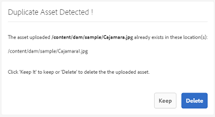
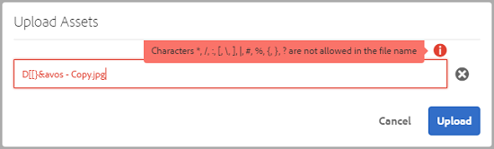
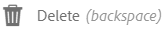
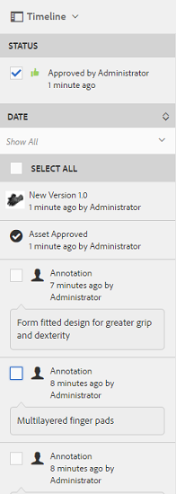

# 管理您的數位資產 {#managing-assets-with-the-touch-optimized-ui}

>[!CAUTION]
>
>AEM 6.4已結束延伸支援，本檔案不再更新。 如需詳細資訊，請參閱 [技術支援期](https://helpx.adobe.com//tw/support/programs/eol-matrix.html). 尋找支援的版本 [此處](https://experienceleague.adobe.com/docs/).

了解各種資產管理和編輯工作，您可以透過 [!DNL Experience Manager] 資產。

本文說明如何使用Adobe Experience Manager Assets觸控最佳化使用者介面來管理和編輯資產。 如需使用者介面的基本知識，請參閱 [觸控式UI的基本處理](/help/sites-authoring/basic-handling.md). 若要管理內容片段，請參閱 [管理內容片段](content-fragments-managing.md) 資產。

## 建立檔案夾 {#create-folders}

組織資產集合時(例如，全部 `Nature` 影像，您可以建立資料夾以將它們保持在一起。 您可以使用資料夾來分類及組織資產。 [!DNL Experience Manager] 資產不需要您整理資料夾中的資產，就能更妥善地運作。

>[!NOTE]
>
>* 共用類型的「資產」資料夾 `sling:OrderedFolder` 共用至Marketing Cloud時不支援。 如果要共用資料夾，建立資料夾時不要選擇「已排序」。
>* Experience Manager不允許使用 `subassets` word作為資料夾的名稱。 這是為包含複合資產子資產之節點保留的關鍵字。

1. 導覽至您要建立新資料夾的數位資產資料夾中的位置。
1. 在功能表中，按一下 **[!UICONTROL 建立]**. 選擇 **[!UICONTROL 新資料夾]**.
1. 在 **[!UICONTROL 標題]** 欄位，提供資料夾名稱。 依預設，DAM會使用您提供的標題作為資料夾名稱。 建立資料夾後，您可以覆寫預設值並指定其他資料夾名稱。
1. 按一下&#x200B;**[!UICONTROL 建立]**。您的資料夾會顯示在數位資產資料夾中。

不支援下列（以空格分隔的）字元清單：

* 資產檔案名稱不得包含  `* / : [ \ \ ] | # % { } ? &`
* 資產資料夾名稱不得包含  `* / : [ \ \ ] | # % { } ? \" . ^ ; + & \t`

## 上傳資產 {#uploading-assets}

您可以從本機資料夾或網路磁碟上傳各種類型的資產(包括影像、PDF檔案、RAW檔案等)至 [!DNL Experience Manager] 資產。

>[!NOTE]
>
>在Dynamic Media - Scene7模式中，您只能上傳檔案大小為2 GB或更小的資產。

您可以選擇將資產上傳至資料夾，且無論資料夾是否已指派處理設定檔。

若資料夾已指派處理設定檔，設定檔名稱會顯示在卡片檢視的縮圖上。 在清單檢視中，描述檔名稱會出現在 **[!UICONTROL 處理設定檔]** 欄。 請參閱 [處理設定檔](processing-profiles.md).

上傳資產之前，請確定資產位於 [支援的格式](assets-formats.md).

**上傳資產**:

1. 在「資產」網頁介面中，導覽至您要新增數位資產的位置。
1. 若要上傳資產，請執行下列其中一項操作：

   * 在工具列上，點選 **[!UICONTROL 建立]** 表徵圖。 然後，在功能表上，點選 **[!UICONTROL 檔案]**. 您可以視需要重新命名顯示對話方塊中的檔案。
   * 在支援HTML5的瀏覽器中，直接將資產拖曳至介面上。 不會顯示要更名檔案的對話框。

   

   若要選取多個檔案，請按Ctrl/Command鍵，然後在檔案選取器對話方塊中選取資產。 從iPad中，一次只能選取一個檔案。

   您可以暫停上傳大型資產（大於500 MB），稍後從同一頁繼續。 點選 **[!UICONTROL 暫停]** 表徵圖，此表徵圖在上載開始時顯示。

   

   資產視為大型資產的大小可設定。 例如，您可以將系統設為將大於1000 MB（而非500 MB）的資產視為大型資產。 在此情況下， **[!UICONTROL 暫停]** 上傳大於1000 MB的資產時，進度列中的按鈕隨即顯示。

   此 **[!UICONTROL 暫停]** 按鈕不會顯示是否上傳了大於1000 MB的檔案且檔案小於1000 MB。 不過，如果取消少於1000 MB的檔案上傳，則 **[!UICONTROL 暫停]** 按鈕。

   若要修改大小限制，請設定 `chunkUploadMinFileSize` 屬性 `fileupload`節點。

   當您按一下 **[!UICONTROL 暫停]** 表徵圖，它切換為 **[!UICONTROL 播放]** 表徵圖。 若要繼續上傳，請按一下 **[!UICONTROL 播放]** 表徵圖。

   

   若要取消持續上傳，請按一下 `X` 按鈕。 取消上傳操作時， [!DNL Experience Manager] 資產會刪除資產部分上傳的部分。

   能夠繼續上傳在低頻寬情況和網路故障中特別有用，因為上傳大型資產需要很長時間。 您可以暫停上傳操作，並在情況改善時稍後繼續。 繼續時，上傳會從您暫停的點開始。

   在上傳作業期間， [!DNL Experience Manager] 會將要上傳的資產部分儲存為CRX存放庫中的資料區塊。 上傳完成時， [!DNL Experience Manager] 將這些區塊整合至存放庫中的單一資料區塊中。

   要配置未完成的區塊上載作業的清除任務，請轉至 `https://[aem_server]:[port]/system/console/configMgr/org.apache.sling.servlets.post.impl.helper.ChunkCleanUpTask`.

   如果您上傳的資產名稱與上傳資產的位置已提供的資產名稱相同，則會顯示警告對話方塊。

   您可以選取重新命名已上傳的新資產，以取代現有資產、建立其他版本，或保留兩者。 如果您取代現有資產，資產的中繼資料以及任何先前的修改和歷史記錄（例如註解、裁切等）都會遭刪除。 如果您選擇保留兩個資產，則會重新命名新資產。

   

   >[!NOTE]
   >
   >選取 **[!UICONTROL 取代]** 在 **[!UICONTROL 名稱衝突]** 對話框中，將為新資產重新生成資產ID。 此ID與先前資產的ID不同。
   >
   >若 **[!UICONTROL 資產分析]** 已啟用以追蹤Adobe Analytics的曝光次數/點按次數，這個重新產生的資產ID會讓Adobe Analytics上為資產擷取的資料失效。

   如果您上傳的資產存在於 [!DNL Experience Manager] 資產、 **[!UICONTROL 檢測到重複項]** 對話方塊會警告您嘗試上傳重複資產。 只有現有資產二進位的SHA 1檢查加總值符合您上傳之資產的檢查加總值時，才會顯示對話方塊。 在這種情況下，資產的名稱並不重要。 換言之，如果資產的二進位檔的SHA 1值相同，則對話方塊甚至可能會針對名稱不同的資產顯示。

   >[!NOTE]
   >
   >此 **[!UICONTROL 檢測到重複項]** 對話方塊僅在 **[!UICONTROL 重複偵測]** 功能。 若要啟用 **[!UICONTROL 重複偵測]** 功能，請參閱 [啟用重複檢測](duplicate-detection.md).

   

   點選 **[!UICONTROL 保留]** 若要將重複資產保留在 [!DNL Experience Manager] 資產。 點選  **[!UICONTROL 刪除]** 刪除您上傳的重複資產。

   [!DNL Experience Manager] 資產可防止您上傳檔案名稱中含有禁止字元的資產。 如果您嘗試上傳包含不允許的字元的資產， [!DNL Experience Manager] 資產會顯示有關檔案名稱中是否有禁止字元的警告訊息，並停止上傳，直到您移除這些字元或上傳並加上允許的名稱為止。

   若要符合貴組織的特定檔案命名慣例，請 **[!UICONTROL 上傳資產]** 對話框用於為上載的檔案指定長名稱。

   

   不過，不支援下列（以空格分隔的）字元清單：
   * 資產檔案名稱不得包含  `* / : [ \ \ ] | # % { } ? &`
   * 資產資料夾名稱不得包含  `* / : [ \ \ ] | # % { } ? \" . ^ ; + & \t`

   此外，「資產」介面會顯示您上傳的最新資產，或您在所有檢視中先建立的資料夾(**[!UICONTROL 卡片檢視]**, **[!UICONTROL 清單檢視]**，和 **[!UICONTROL 欄檢視]**)。

   通常，在同時上傳大型資產或多個資產時，視覺指標可讓您評估進度。 此 **[!UICONTROL 上傳進度]** 對話框顯示成功上載檔案的計數以及無法上載的檔案。

   

   如果您在檔案上傳前取消上傳操作， [!DNL Experience Manager] 資產會停止上傳目前的檔案並重新整理內容。 不過，不會刪除已上傳的檔案。

### 串列上傳 {#serial-uploads}

大量上傳大量資產會耗用大量系統資源，這可能會對您的 [!DNL Experience Manager] 部署。 潛在的瓶頸可能是您的網際網路連線、磁碟的讀寫操作、網頁瀏覽器對同時上傳資產時的POST請求數量的限制。 大量上傳操作可能會過早失敗或終止。 換句話說， [!DNL Experience Manager] 資產可能會在擷取大量檔案時遺失某些檔案，或完全無法擷取任何檔案。

為了克服這種情況， [!DNL Experience Manager] 在大量上傳作業期間，資產會一次內嵌一個資產（串列上傳），而非同時內嵌所有資產。

資產的串列上傳預設為啟用。 若要停用功能並允許同時上傳，請覆蓋 `fileupload` 節點，並設定 `parallelUploads` 屬性 `true`.

### 使用FTP上傳資產 {#uploading-assets-using-ftp}

Dynamic Media可透過FTP伺服器批次上傳資產。 如果您要上傳大型資產(>1 GB)或上傳整個資料夾和子資料夾，應使用FTP。 您甚至可以設定FTP上傳，以定期執行。

>[!NOTE]
>
>在Dynamic Media - Scene7模式中，您只能上傳檔案大小為2 GB或更小的資產。

>[!NOTE]
>
>若要透過Dynamic Media - Scene7模式安裝Feature Pack(FP)18912，請於 [!DNL Experience Manager] 作者。 請連絡Adobe客戶支援以存取FP-18912，並完成FTP帳戶的設定。 請參閱 [安裝Feature Pack 18912以大量移轉資產](/help/assets/bulk-ingest-migrate.md).
>
>如果您使用FTP來上傳資產，則 [!DNL Experience Manager] 會被忽略。 系統會改用Dynamic Media Classic中定義的檔案處理規則。

**使用FTP上傳資產**

1. 使用您選擇的FTP用戶端，使用您從布建電子郵件收到的FTP使用者名稱和密碼登入FTP伺服器。 在FTP用戶端中，將檔案或資料夾上傳至FTP伺服器。
1. 開啟 [Dynamic Media Classic案頭應用程式](https://experienceleague.adobe.com/docs/dynamic-media-classic/using/getting-started/signing-out.html#getting-started)，然後使用從布建電子郵件接收的憑證登入您的帳戶。
1. 在全域導覽列上，點選 **[!UICONTROL 上傳]**.
1. 在 **[!UICONTROL 上傳]** 頁面，在左上角附近，點選 **[!UICONTROL 透過FTP]** 標籤。
1. 在頁面左側，選擇要上傳檔案的FTP資料夾；在頁面的右側，選擇目標資料夾。
1. 在頁面的右下角附近，點選 **[!UICONTROL 作業選項]** 然後，根據您選取之資料夾中的資產，設定您想要的選項。

   請參閱 [上傳作業選項](#upload-job-options).

   >[!NOTE]
   >
   >當您透過FTP上傳資產時，您在Dynamic Media Classic中設定的上傳工作選項會取代AEM中設定的資產處理參數。

1. 在 **[!UICONTROL 上傳作業選項]** 對話框，點選 **[!UICONTROL 儲存]**.
1. 在 **[!UICONTROL 上傳]** 頁面，點選 **[!UICONTROL 提交上傳]**.

   若要檢視上傳進度，請在全域導覽列上，點選 **[!UICONTROL 工作]**. 此 **[!UICONTROL 工作]** 頁面會顯示上傳進度。 您可以繼續在 [!DNL Experience Manager] 並隨時返回Dynamic Media Classic中的「工作」頁面，以檢閱進行中的工作。

   若要取消正在進行的上傳作業，請點選 **[!UICONTROL 取消]** 旁邊 **[!UICONTROL 持續時間]** 時間。

#### 上傳作業選項 {#upload-job-options}

| 上傳選項 | 子選項 | 說明 |
|---|---|---|
| 工作名稱 |  | 在文本欄位中預填的預設名稱包括用戶輸入的名稱部分和日期和時間戳。 您可以使用預設名稱，或輸入您為此上傳作業建立的名稱。  作業以及其他上傳和發佈作業會記錄在「作業」頁面上，您可在此檢查作業的狀態。 |
| 上傳後發佈 |  | 自動發佈您上傳的資產。 |
| 任何檔案夾內若有基本資產名稱相同者 (無論副檔名為何)，將予以覆寫 |  | 如果您希望上傳的檔案以相同名稱取代現有檔案，請選取此選項。 此選項的名稱可能不同，具體取決於 **[!UICONTROL 應用程式設定]** > **[!UICONTROL 一般設定]** > **[!UICONTROL 上傳至應用程式]** > **[!UICONTROL 覆寫影像]**. |
| 上傳時解壓縮ZIP或TAR檔案 |  |  |
| 作業選項 |  | 點選/按一下 **[!UICONTROL 作業選項]** 開啟 [!UICONTROL 上傳作業選項] 對話框，然後選擇影響整個上載作業的選項。 所有檔案類型的這些選項都相同。 您可以從「應用程式一般設定」頁面開始，選擇上傳檔案的預設選項。 要開啟此頁，請選擇 **[!UICONTROL 設定]** > **[!UICONTROL 應用程式設定]**. 點選 **[!UICONTROL 預設上傳選項]** 按鈕以開啟 [!UICONTROL 上傳作業選項] 對話框。 |
|  | 時間 | 選取一次性或循環。 若要設定循環作業，請選擇「重複」選項（每日、每週、每月或自訂），以指定何時要重複執行FTP上傳作業。 然後視需要指定排程選項。 |
|  | 包含子資料夾 | 上傳要上傳之資料夾內的所有子資料夾。 上傳的資料夾及其子資料夾的名稱會自動輸入 [!DNL Experience Manager] 資產。 |
|  | 裁切選項 | 要從影像的側面手動裁切，請選擇「裁切」菜單，然後選擇「手動」。 然後輸入要從影像的任何一側或每一側裁切的像素數。 影像被裁切的程度取決於影像檔案中的ppi設定（每英吋像素）。 例如，如果影像顯示150 ppi，而您在「上」、「右」、「下」和「左」文字方塊中輸入75，則會從每側裁切半英吋。  要自動從影像中裁切空白像素，請開啟「裁切」菜單，選擇「手動」，然後在「頂部」、「右」、「底部」和「左側」欄位中輸入像素測量，以便從側面裁切。 您也可以在「裁切」(Crop)菜單中選擇「修剪」(Trim)，然後選擇以下選項：  **根據** <ul><li>**顏色**  — 選擇顏色選項。 然後選取「角」菜單，選擇影像的角，該角的顏色最能代表要裁切的空白顏色。</li><li>**透明度**  — 選擇透明度選項。  **容許度**  — 拖動滑塊以指定0到1的公差。對於基於顏色的修剪，指定0以僅在像素與在影像的角中選定的顏色完全匹配時裁剪像素。 接近1的數字會產生更多的顏色差異。 要根據透明度進行修剪，請指定0隻在像素為透明時裁剪像素。 接近1的數字使透明度更高。</li></ul> 請注意，這些裁切選項不具破壞性。 |
|  | 色彩描述檔選項 | 建立用於傳送的最佳化檔案時，請選擇色彩轉換：<ul><li>預設顏色保留：當影像包含顏色空間資訊時，保持源影像的顏色；沒有顏色轉換。 目前幾乎所有的影像都已內嵌適當的色彩設定檔。 但是，如果CMYK源影像不包含嵌入的顏色配置檔案，則這些顏色將轉換為sRGB（標準紅綠藍）顏色空間。 sRGB是在網頁上顯示影像的建議色域。</li><li>保留原始顏色空間：保留原始顏色，點上不進行任何顏色轉換。 對於沒有內嵌顏色描述檔的影像，任何顏色轉換都使用在「發佈」設定中設定的預設顏色描述檔來完成。 顏色配置檔案可能與使用此選項建立的檔案中的顏色不一致。 因此，建議您使用「預設顏色保留」選項。</li><li>自訂從>到  開啟菜單，以便選擇「轉換自」和「轉換至」顏色空間。 此高級選項將覆蓋嵌入源檔案中的任何顏色資訊。 當您提交的所有影像都包含不正確或遺失的色彩設定檔資料時，請選取此選項。</li></ul> |
|  | 影像編輯選項 | 可以保留影像中的剪裁蒙版，並選擇顏色輪廓。  請參閱 [在上傳時設定影像編輯選項](#setting-image-editing-options-at-upload). |
|  | Postscript選項 | 您可以柵格化PostScript®檔案、裁切檔案、維護透明背景、選擇解析度，以及選擇顏色空間。  請參閱 [設定PostScript和Illustrator上傳選項](#setting-postscript-and-illustrator-upload-options). |
|  | Photoshop選項 | 您可以從Adobe® Photoshop®檔案建立範本、維護圖層、指定圖層的命名方式、擷取文字，以及指定如何將影像錨定到範本中。  請注意，AEM不支援範本。  請參閱 [設定Photoshop上傳選項](#setting-photoshop-upload-options). |
|  | PDF選項 | 您可以柵格化檔案、提取搜索詞和連結、自動生成eCatalog、設定解析度，以及選擇顏色空間。  請注意，AEM不支援eCatalog。   請參閱 [設定PDF上傳選項&#x200B;](#setting-pdf-upload-options) **附註**:新上傳的PDF在提取時最多要考慮5000頁。 此限制將於2022年12月31日變更為100頁(所有PDF皆適用)。 另請參閱 [Dynamic Media限制](/help/assets/limitations.md). |
|  | Illustrator選項 | 您可以柵格化Adobe Illustrator®檔案、維護透明背景、選擇解析度，以及選擇顏色空間。  請參閱 [設定PostScript和Illustrator上傳選項](#setting-postscript-and-illustrator-upload-options). |
|  | 視訊選項 | 您可以選擇「視訊預設集」來轉換視訊檔案的程式碼。  請參閱 [設定eVideo上傳選項](#setting-evideo-upload-options). |
|  | 批次集預設集 | 若要從上傳的檔案建立影像集或回轉集，請按一下您要使用之預設集的「作用中」欄。 您可以選取多個預設集。 在Dynamic Media Classic的「應用程式設定/批集預設集」頁面中建立預設集。  請參閱 [配置批集預設集以自動生成影像集和回轉集](config-dms7.md#creating-batch-set-presets-to-auto-generate-image-sets-and-spin-sets) 若要進一步了解如何建立批次集預設集。  請參閱 [在上傳時設定批次集預設集](#setting-batch-set-presets-at-upload). |

#### 在上傳時設定影像編輯選項 {#setting-image-editing-options-at-upload}

上傳影像檔案(包括AI、EPS和PSD檔案)時，您可以在 **[!UICONTROL 上傳作業選項]** 對話框：

* 從影像邊緣裁切空白字元（請參閱上表說明）。
* 從影像的側面手動裁切（請參閱上表中的說明）。
* 選擇顏色配置檔案（請參閱上表中的選項說明）。
* 從剪裁路徑建立遮色片。
* 使用非銳利化遮色片選項銳利化影像
* 挖空背景

| 選項 | 子選項 | 說明 |
|---|---|---|
| 從剪裁路徑建立遮色片 |  | 根據影像的剪裁路徑資訊建立影像的遮色片。 此選項適用於使用已建立剪裁路徑的影像編輯應用程式建立的影像。 |
| 不銳利化遮色片 |  | 可讓您微調最終縮減取樣影像的銳利化濾鏡效果，控制效果的強度、效果半徑（如像素所測），以及忽略的對比度閾值。  此效果使用的選項與Photoshop的遮色片銳利化濾鏡相同。 與名稱相反，「遮色片銳利化」是銳利化濾鏡。 在「銳利化遮色片」(Unsharp Masking)下，設定所需的選項。 以下說明設定選項： |
|  | 數量 | 控制套用至邊緣像素的對比度。  把它想成效果的強度。 Dynamic Media中「遮色片銳利化」的量值與Adobe Photoshop中的量值之間的主要差異，是Photoshop的量範圍介於1%到500%之間。 而在Dynamic Media中，值範圍是0.0到5.0。在Photoshop中，5.0的值大致等於500%;值0.9等於90%，以此類推。 |
|  | 半徑 | 控制效果的半徑。 值範圍是0-250。  此效果在影像中的所有像素上運行，並從所有方向的所有像素輻射出來。 半徑以像素計量。 例如，要獲得類似於2000 x 2000像素影像和500 x 500像素影像的銳利化效果，可以在2000 x 2000像素影像上設定兩個像素的半徑，在500 x 500像素影像上設定一個像素的半徑值。 較大的值用於具有較多像素的影像。 |
|  | 臨界值 | 臨界值是套用遮色片銳利化濾鏡時會忽略的對比範圍。 請務必避免在使用此濾波器時對影像引入「雜訊」。 值範圍為0-255，即灰度影像中的亮度階數。 0=黑色，128=50%灰色，255=白色。  例如，閾值為12會忽略輕微的變化是膚色亮度以避免加上雜訊，但仍會加上邊緣對比度至對比區域，例如睫毛與皮膚相遇的區域。  例如，如果您有某人臉的照片，「不銳利化遮色片」會影響影像的對比部分，例如睫毛和皮膚相遇以建立明顯的對比區域，以及平滑的皮膚本身。 即使最平滑的皮膚也表現出亮度值的細微變化。 如果您未使用臨界值，濾鏡會強調外觀像素中的這些細微變化。 然後，產生噪音和不期望的效果，同時增加對睫毛的對比度，增強銳度。  為避免此問題，會引入臨界值，告知篩選器忽略不會大幅改變對比度的像素，例如平滑外觀。  在前面顯示的拉鍊圖中，注意拉鍊旁邊的紋理。 由於閾值太低，無法抑制雜訊，因此會產生影像雜訊。 |
|  | 單色 | 選擇以取消銳利化遮色片影像亮度（強度）。  取消選取「 」，將每個顏色元件分別遮色片銳利化。 |
| 挖空背景 |  | 上傳影像時，會自動移除該影像的背景。 此技術有助於吸引對特定對象的注意，並使其從繁忙的背景中脫穎而出。 選擇以啟用或「開啟」「挖空背景」功能和以下子選項： |
|  | 角 | 必要.  用於定義要挖空的背景顏色的影像的角。  您可以選擇 **左上角**, **左下角**, **右上**，或 **右下角**. |
|  | 填充方法 | 必要.  從您設定的角位置控制像素透明度。  您可以從下列填充方法中選擇： <ul><li>**Flood Fill**  — 使所有像素透明，這些像素與已指定的拐角匹配並連接到該拐角。</li><li>**匹配像素**  — 將所有匹配的像素都透明，無論其在影像上的位置如何。</li></ul> |
|  | 容許度 | 選用.  根據您設定的「角」位置控制像素顏色匹配中允許的變化量。  使用0.0值來完全匹配像素顏色，或使用1.0值來允許最大的變化。 |

#### 設定PostScript和Illustrator上傳選項 {#setting-postscript-and-illustrator-upload-options}

上傳PostScript(EPS)或Illustrator(AI)影像檔案時，可以以多種方式格式化它們。 您可以柵格化檔案、維護透明背景、選擇解析度和選擇顏色空間。 在「PostScript選項」和「Illustrator選項」下的「上載作業選項」對話框中，可以找到格式化PostScript和Illustrator檔案的選項。

| 選項 | 子選項 | 說明 |
|---|---|---|
| 處理 |  | 選擇 **[!UICONTROL 光柵化]** 將檔案中的向量圖形轉換為點陣圖格式。 |
| 在渲染的影像中保持透明背景 |  | 保持檔案的背景透明度。 |
| 解析度 |  | 確定解析度設定。 此設定決定檔案中每英吋顯示的像素數。 |
| 色彩空間 |  | 選擇「顏色空間」菜單，然後從以下顏色空間選項中選擇： |
|  | 自動檢測 | 保留檔案的顏色空間。 |
|  | 強制為RGB | 轉換為RGB顏色空間。 |
|  | 強制為CMYK | 轉換為CMYK顏色空間。 |
|  | 強制為灰度 | 轉換為灰度顏色空間。 |

#### 設定Photoshop上傳選項 {#setting-photoshop-upload-options}

PSD(Photoshop檔案)檔案最常用於建立影像範本。 上傳PSD檔案時，可以從檔案自動建立影像範本（在「上傳」畫面上選取「建立範本」選項）。

如果您使用檔案建立範本，Dynamic Media會從含圖層的PSD檔案建立多個影像；它會為每個圖層建立一個影像。

使用 **[!UICONTROL 裁切選項]** 和 **[!UICONTROL 色彩描述檔選項]**，如上所述，並搭配Photoshop上傳選項。

>[!NOTE]
>
>AEM不支援範本。

| 選項 | 子選項 | 說明 |
|---|---|---|
| 維護圖層 |  | 將PSD中的圖層（如果有的話）分割為個別資產。 資產層仍與PSD相關聯。 您可以在「詳細資訊」視圖中開啟PSD檔案並選取圖層面板來查看它們。 |
| 建立範本 |  | 從PSD檔案中的圖層建立模板。 |
| 擷取文字 |  | 擷取文字，讓使用者能在檢視器中搜尋文字。 |
| 延伸圖層以符合背景大小 |  | 將撕開的影像層的大小擴展到背景層的大小。 |
| 圖層命名 |  | PSD檔案中的圖層會上傳為個別影像。 |
|  | 圖層名稱 | 在影像的圖層名稱后面命名PSD檔案。 例如，原始PSD檔案中名為「價格標籤」的圖層會變成名為「價格標籤」的影像。 但是，如果PSD檔案中的圖層名稱是預設的Photoshop圖層名稱（背景、第1層、第2層等），則影像的名稱將以其PSD檔案中的圖層編號而非預設圖層名稱命名。 |
|  | Photoshop和圖層編號 | 在PSD檔案中的圖層編號後命名影像，忽略原始圖層名稱。 影像的名稱為Photoshop檔案名稱及附加的圖層編號。 例如，名為Spring Ad.psd的檔案的第二層名為Spring Ad_2，即使它在Photoshop中具有非預設名稱亦然。 |
|  | Photoshop和圖層名稱 | 在PSD檔案後面命名影像，後面跟圖層名稱或圖層編號。 如果PSD檔案中的圖層名稱是預設的Photoshop圖層名稱，則使用圖層號。 例如，在名為SpringAd的PSD檔案中，名為Price Tag的層名為Spring Ad_Price Tag。 預設名為Layer 2的層稱為Spring Ad_2。 |
| 錨點 |  | 指定如何將影像錨定在從PSD檔案生成的分層合成生成的模板中。 預設情況下，錨點為中心。 中心錨點允許替換影像最好地填充相同的空間，而不管替換影像的長寬比如何。 當參考範本並使用參數替代時，具有替代此影像的不同方面的影像會有效佔據相同的空間。 如果您的應用程式需要替換影像以填充模板中已分配的空間，請更改為其他設定。 |

#### 設定PDF上傳選項 {#setting-pdf-upload-options}

上傳PDF檔案時，可以以多種方式格式化該檔案。 您可以裁切其頁面、擷取搜尋字詞、輸入每英吋像素的解析度，然後選擇顏色空間。 PDF檔案通常包含修剪邊界、裁切標籤、註冊標籤和其他打印機標籤。 上傳PDF檔案時，您可以從頁面的兩側裁切這些標籤。

新上傳的PDF在提取時最多要考慮5000頁。 此限制將於2022年12月31日變更為100頁(所有PDF皆適用)。 另請參閱 [Dynamic Media限制](/help/assets/limitations.md).

>[!NOTE]
>
>AEM不支援eCatalog。

從下列選項中選擇：

| 選項 | 子選項 | 說明 |
|---|---|---|
| 處理 | 點陣化 | （預設）拆分PDF檔案中的頁面，並將向量圖形轉換為點陣圖影像。 選擇此選項可建立eCatalog。 |
| 提取 | 搜尋字詞 | 從PDF檔案中擷取字詞，以便在eCatalog檢視器中依關鍵字搜尋檔案。 |
|  | 連結 | 從PDF檔案中擷取連結，並將其轉換為eCatalog檢視器中使用的影像地圖。 |
| 從多個頁面自動產生eCatalogPDF |  | 從PDF檔案自動建立eCatalog。 eCatalog會以您上傳的PDF檔案命名。 (只有在上傳PDF檔案時柵格化該檔案時，才可使用此選項。) |
| 解析度 |  | 確定解析度設定。 此設定決定每英吋顯示的PDF檔案像素數。 預設為150。 |
| 色彩空間 |  | 選擇「顏色空間」菜單，然後為PDF檔案選擇顏色空間。 大多數PDF檔案都有RGB和CMYK顏色影像。 線上檢視較偏好RGB色域。 |
|  | 自動偵測 | 保留PDF檔案的色域。 |
|  | 強制為 RGB | 轉換為RGB顏色空間。 |
|  | 強制為 CMYK | 轉換為CMYK顏色空間。 |
|  | 強制為灰階 | 轉換為灰度顏色空間。 |

#### 設定eVideo上傳選項 {#setting-evideo-upload-options}

您可以從各種視訊預設集中選擇，以轉碼視訊檔案。

| 選項 | 子選項 | 說明 |
|---|---|---|
| 適應性影片 |  | 單一編碼預設集可搭配任何外觀比例來建立視訊，以傳送至行動裝置、平板電腦和桌上型電腦。 使用此預設集編碼的已上傳來源影片會以固定高度設定。 不過，寬度會自動縮放以保留視訊的外觀比例。  最佳實務是使用最適化視訊編碼。 |
| 單一編碼預設集 | 排序編碼預設集 | 選取「名稱」或「大小」 ，依名稱或解析度大小，排序「案頭」、「行動裝置」和「平板電腦」底下列出的編碼預設集。 |
|  | 桌面 | 建立MP4檔案，以向台式電腦提供流式或漸進式視頻體驗。選擇一個或多個寬高比，其解析度大小和目標資料速率符合您的要求。 |
|  | 行動 | 建立MP4檔案，以便在iPhone或Android行動裝置上傳送。選取一或多個長寬比，其中包含您想要的解析度大小和目標資料速率。 |
|  | 平板電腦 | 建立MP4檔案，以便在iPad或Android平板電腦裝置上傳送。選取一或多個外觀比例，其中包含所需的解析度大小和目標資料速率。 |

#### 在上傳時設定批次集預設集 {#setting-batch-set-presets-at-upload}

如果您想從上傳的影像自動建立影像集或回轉集，請按一下 **[!UICONTROL 作用中]** 欄。 您可以選取多個預設集。

請參閱 [配置批集預設集以自動生成影像集和回轉集](config-dms7.md#creating-batch-set-presets-to-auto-generate-image-sets-and-spin-sets) 若要進一步了解如何建立批次集預設集。

### 串流上傳 {#streamed-uploads}

如果您上傳許多資產，會向 [!DNL Experience Manager] 伺服器會大幅增加，進而降低上傳效率，甚至導致逾時。 [!DNL Experience Manager] Assets支援串流上傳資產。 串流上傳可避免將資產儲存在伺服器上的臨時資料夾中，然後再複製到存放庫，以減少上傳作業期間的磁碟I/O。 資料會直接傳輸至存放庫。 如此一來，上傳大型資產的時間和逾時的可能性就會降低。 依預設會在 [!DNL Experience Manager] 資產。

已停用串流上傳 [!DNL Experience Manager] 在JEE伺服器上執行，且servlet-api版本小於3.1。

### 解壓縮包含資產的ZIP封存 {#extract-zip-archive-containing-assets}

您可以像上傳任何其他支援的資產一樣上傳ZIP封存檔。 相同的檔案名規則適用於ZIP檔案。 [!DNL Experience Manager] 可讓您將ZIP封存解壓縮至DAM位置。

一次選取一個ZIP封存，按一下 **[!UICONTROL 解壓縮封存]**，然後選取目標資料夾。 選擇一個選項以處理衝突（如果有）。 如果ZIP檔案中的資產已存在於目的地資料夾中，您可以選取下列其中一個選項：略過擷取、取代現有檔案、透過重新命名來保留兩個資產，或建立新版本。

提取完成後， [!DNL Experience Manager] 通知您。 同時 [!DNL Experience Manager] 解壓縮郵遞區號，您就可以繼續工作而不中斷解壓縮。

功能的部分限制包括：

* 如果目的地存在同名的資料夾，系統會從ZIP檔案擷取現有資料夾中的資產。

* 如果您取消提取，系統不會刪除已提取的資產。

* 您無法同時選取兩個ZIP檔案並解壓縮。 一次只能解壓縮一個ZIP封存。

## 預覽資產 {#previewing-assets}

**若要預覽資產**:

1. 從資產UI，導覽至您要預覽的資產位置。
1. 點選所需的資產以開啟它。

1. 在預覽模式中，縮放選項可用於 [支援的影像類型](assets-formats.md#supported-raster-image-formats) （使用互動式編輯）。

   若要放大資產，請點選 **[!UICONTROL +]** （或點選資產上的放大鏡）。 若要縮小顯示，請點選 **[!UICONTROL -]**. 放大時，可通過平移來密切查看影像的任何區域。 此 **[!UICONTROL 重設縮放]** 箭頭會將您帶回原始檢視。

   

   點選 **[!UICONTROL 重設]** 按鈕將視圖重置為原始大小。

   

>[!MORELIKETHIS]
>
>* [預覽Dynamic Media Assets](/help/assets/previewing-assets.md).
>* [檢視子資產](managing-linked-subassets.md#viewing-subassets).

## 編輯屬性 {#editing-properties}

1. 導覽至您要編輯其中繼資料的資產位置。

1. 選取資產，然後點選 **[!UICONTROL 屬性]** 來檢視資產屬性。 或者，選擇 **[!UICONTROL 屬性]** 在資產卡上快速執行動作。

   

1. 在 **[!UICONTROL 屬性]** 頁面中，編輯各種標籤下的中繼資料屬性。 例如，在 **[!UICONTROL 基本]** 頁簽，編輯標題、說明等。

   版面 **[!UICONTROL 屬性]** 頁面和可用的中繼資料屬性取決於基礎的中繼資料結構。 了解如何修改 **[!UICONTROL 屬性]** 頁面，請參閱 [中繼資料結構](metadata-schemas.md).

1. 若要排程啟動資產的特定日期/時間，請使用「準時」欄位旁的日 **[!UICONTROL 期選擇器]** 。

   

1. 若要在特定持續時間後停用資產，請從旁邊的日期選擇器選擇停用日期和時間 **[!UICONTROL 關閉時間]** 欄位。

   停用日期應晚於資產的啟用日期。 在 [!UICONTROL 關閉時間]，資產及其轉譯無法透過Assets網頁介面或HTTP API使用。

   

1. 在 **[!UICONTROL 標籤]** 欄位，選取一或多個標籤。 若要新增自訂標籤，請在方塊中輸入標籤名稱，然後按 **[!UICONTROL 輸入]**. 新標籤會儲存在AEM中。

   YouTube需要要標籤才能發佈，且有YouTube的連結（如果找到合適的連結）。
若要建立標籤，您需要的寫入權限 `/content/cq:tags/default` 在CRX存放庫中。

1. 若要提供資產評等，請點選 **[!UICONTROL 進階]** 頁簽，然後點選適當位置的星號以指派所需的評等。

   

   您指派給資產的評等分數會顯示在 **[!UICONTROL 您的評等]**. 從對資產進行評級的使用者收到的資產平均評級分數顯示在下方 **[!UICONTROL 評等]**. 此外，對平均評等分數有貢獻的評等分數分割，會顯示在 **[!UICONTROL 評等劃分]**. 您可以根據平均評等分數來搜尋資產。

1. 若要檢視資產的使用量統計資料，請點選 **[!UICONTROL 前瞻分析]** 標籤。

   使用情況統計資料包括：

   * 檢視或下載資產的次數。
   * 使用資產的管道/裝置。
   * 最近使用資產的創意解決方案。

   如需詳細資訊，請參閱 [Assets Insights](touch-ui-asset-insights.md).

1. 點選 **[!UICONTROL 儲存並關閉]**.
1. 導覽至「資產」UI。 編輯的中繼資料屬性（包括標題、說明、評等等）會顯示在卡片檢視中的資產卡片上，以及清單檢視中的相關欄下。

## 複製資產 {#copying-assets}

複製資產或資料夾時，會複製整個資產或資料夾，及其內容結構。 複製的資產或資料夾會在目標位置複製。 來源位置的資產未變更。

資產特定復本的少數屬性不會結轉。 例如：

* 資產ID、建立日期和時間，以及版本和版本記錄。 這些屬性中有些由屬性表示 `jcr:uuid`, `jcr:created`，和 `cq:name`.

* 每個資產及其每個轉譯的建立時間和參考路徑都是唯一的。

保留其他屬性和中繼資料資訊。 複製資產時不會建立部分復本。

1. 從「資產」UI中，選取一或多個資產，然後點選 **[!UICONTROL 複製]** 圖示。 或者，選擇 **[!UICONTROL 複製]** 從資產卡執行快速動作。

   

   >[!NOTE]
   >
   >如果您使用 **[!UICONTROL 複製]** 快速動作時，一次只能複製一個資產。

1. 導覽至您要複製資產的位置。

   >[!NOTE]
   >
   >如果您複製相同位置的資產， [!DNL Experience Manager] 自動產生名稱的變數。 例如，如果您複製標題為Square的資產， [!DNL Experience Manager] 自動將副本的標題生成為Square1。

1. 點選 **[!UICONTROL 貼上]** 工具列中的資產圖示：

   

   資產會複製到此位置。

   >[!NOTE]
   >
   >此 **[!UICONTROL 貼上]** 表徵圖在貼上操作完成之前可在工具欄中使用。

## 移動和重新命名資產 {#moving-or-renaming-assets}

當您將資產（或資料夾）移至其他位置時，資產（或資料夾）不會重複，這與複製資產時不同。 資產（或資料夾）會放置在目標位置，並從來源位置移除。 您也可以在將資產移至新位置時重新命名資產。 如果您將已發佈的資產移至其他位置，則可選擇重新發佈資產。 依預設，已發佈資產的移動操作會自動取消發佈。 如果作者選取 [!UICONTROL 重新發佈] 選項。

若要移動資產或資料夾：

1. 導覽至您要移動的資產位置。

若要移動資產或資料夾：

1. 導覽至您要移動的資產位置。

1. 選取資產，然後按一下 **[!UICONTROL 移動]** 選項。
   

1. 在 [!UICONTROL 移動資產] 嚮導中，執行下列操作之一：

   * 指定資產移動後的名稱。 然後按一下 **[!UICONTROL 下一個]** 繼續。

   * 按一下 **[!UICONTROL 取消]** 來停止程式。
   >[!NOTE]
   >
   >* 如果新位置沒有具有該名稱的資產，您可以為資產指定相同的名稱。 不過，如果將資產移至資產名稱相同的位置，則應使用不同的名稱。 如果您使用相同的名稱，系統會自動產生名稱的變數。 例如，如果資產的名稱為Square，則系統會為其副本產生名稱Square1。
   >* 重新命名時，檔案名稱中不允許使用空格。

1. 在 **[!UICONTROL 選擇目標]** 對話框，執行下列操作之一：

   * 導覽至資產的新位置，然後按一下 **[!UICONTROL 下一個]** 繼續。

   * 按一下 **[!UICONTROL 返回]** 返回 **[!UICONTROL 重新命名]** 螢幕。

1. 如果要移動的資產有任何參考頁面、資產或集合，則 **[!UICONTROL 調整參照]** 標籤旁 **[!UICONTROL 選擇目標]** 標籤。

   在 **[!UICONTROL 調整參照]** 畫面：

   * 指定要根據新詳細資訊調整的參考，然後按一下 **[!UICONTROL 移動]** 繼續。

   * 從 **[!UICONTROL 調整]** 欄，選取/取消選取資產的參考。
   * 按一下 **[!UICONTROL 返回]** 返回 **[!UICONTROL 選擇目標]** 螢幕。

   * 按一下 **[!UICONTROL 取消]** 以停止移動操作。

   如果您未更新參考，它們會繼續指向資產的先前路徑。 如果調整參照，參照會更新為新資產路徑。

### 使用拖曳作業移動資產 {#move-using-drag}

您可以將資產（或資料夾）拖曳至目標位置，而非使用 [!UICONTROL 移動] 選項。 不過，只有在清單檢視中才能執行此操作。

拖曳資產以移動資產時不會開啟 [!UICONTROL 移動資產] 精靈，因此您在移動時無法取得重新命名資產的選項。 此外，已發佈的資產會在拖曳後重新發佈，而無須尋求使用者的重新發佈核准。

## 管理轉譯 {#managing-renditions}

1. 您可以新增或移除資產的轉譯，但原始資產除外。 導覽至您要新增或移除轉譯的資產位置。

1. 點選資產以開啟其資產頁面。

   

1. 點選 **[!UICONTROL 全域導覽]** ，然後選取 **[!UICONTROL 轉譯]** 從清單中。

   

1. 在 **[!UICONTROL 轉譯]** 面板中，檢視為資產產生的轉譯清單。

   

   >[!NOTE]
   >
   >依預設， [!DNL Experience Manager] 資產不會以預覽模式顯示資產的原始轉譯。 如果您是管理員，則可使用覆蓋來設定 [!DNL Experience Manager] 在預覽模式中顯示原始轉譯的資產。

1. 選取轉譯以檢視或刪除轉譯。

   **刪除轉譯**

   從 **[!UICONTROL 轉譯]** 面板，然後點選 **[!UICONTROL 刪除轉譯]** 圖示 [工具列](/help/sites-authoring/basic-handling.md). 資產處理完成後，無法大量刪除轉譯。 對於個別資產，您可以從使用者介面手動移除轉譯。 對於多個資產，您可以自訂Experience Manager以刪除特定轉譯或刪除資產，然後重新上傳已刪除的資產。

   

   **上傳新的轉譯**

   導覽至資產的資產詳細資訊頁面，然後點選 **[!UICONTROL 新增轉譯]** 圖示來上傳資產的新轉譯。

   

   >[!NOTE]
   >
   >如果您從「轉譯」面板選取轉譯 **** ，工具列會變更上下文，並僅顯示與轉譯相關的動作。選項，例如 **[!UICONTROL 上傳轉譯]** 圖示。 若要在工具列中檢視這些選項，請導覽至資產的詳細資訊頁面。

   您可以為要顯示在影像或視訊資產詳細資訊頁面中的轉譯設定維度。 根據您指定的維度， [!DNL Experience Manager] Assets會以完全或最接近的維度顯示轉譯。

   若要在資產詳細資料層級設定影像的轉譯尺寸，請覆蓋 **[!UICONTROL rendipicker]** 節點 `libs/dam/gui/content/assets/assetpage/jcr:content/body/content/content/items/assetdetail/items/col1/items/assetview/renditionpicker` 和設定width屬性的值。 設定屬性大 **[!UICONTROL 小 (長) (KB]** )以取代寬度，以根據影像大小自訂資產詳細資料頁面上的轉譯。針對以大小為基礎的自訂，屬性 **[!UICONTROL preferOriginal]** 如果匹配的格式副本的大小大於原始格式副本的大小，則為原始格式副本指定首選項。

   同樣地，您也可以自訂 **[!UICONTROL 註解]** 覆蓋頁面影像 `libs/dam/gui/content/assets/annotate/jcr:content/body/content/content/items/content/renditionpicker`.

   

   若要設定視訊資產的轉譯維度，請導覽至 **[!UICONTROL videopicker]** 節點(位於 `/libs/dam/gui/content/assets/assetpage/jcr:content/body/content/content/items/assetdetail/items/col1/items/assetview/videopicker`，覆蓋節點，然後編輯適當的屬性。

   >[!NOTE]
   >
   >只有具有HTML5相容視訊格式的瀏覽器才支援視訊註解。 此外，根據瀏覽器，支援不同的視訊格式。

如需子資產的相關資訊，請參閱 [管理子資產](managing-linked-subassets.md).

## 刪除資產 {#deleting-assets}

若要解析或移除其他頁面中傳入的參照，請先更新相關的參照，再刪除資產。

此外，停用使用覆蓋圖的強制刪除按鈕，以禁止使用者刪除參考的資產並留下中斷的連結。

您需要dam/asset的刪除權限才能刪除資產。 如果您只有修改權限，則只能編輯資產中繼資料和新增註解至資產。 不過，您無法刪除資產或其中繼資料。

**刪除資產**:

1. 導覽至您要刪除的資產所在位置。

1. 選取資產，然後點選 **[!UICONTROL 刪除]** 圖示。

   

1. 在確認對話方塊中，點選：

   * **[!UICONTROL 取消]** 來停止動作
   * **[!UICONTROL 刪除]** 若要根據下列項目確認動作：

      * 如果資產沒有參考，則會刪除資產。
      * 如果資產有參考，則會出現錯誤訊息通知您 **[!UICONTROL 參考一或多個資產]**. 您可以選取 **[!UICONTROL 強制刪除]** 或 **[!UICONTROL 取消]**.

   >[!NOTE]
   >
   >若要解析或移除其他頁面中傳入的參照，請先更新相關的參照，再刪除資產。
   >
   >此外，停用 **[!UICONTROL 強制刪除]** 按鈕，禁止使用者刪除參考的資產並留下中斷的連結。

## 下載資產 {#downloading-assets}

請參閱 [從AEM下載資產](download-assets-from-aem.md)

## 發佈和取消發佈資產 {#publish-assets}

在上傳、處理或編輯您的資產後 [!DNL Experience Manager] 製作時，您會將資產發佈至發佈伺服器。 發佈可讓資產公開使用。 取消發佈動作會將資產從發佈伺服器中移除，但不會從編寫伺服器移除。

以取得 [!DNL Dynamic Media]，請參閱 [發佈 [!DNL Dynamic Media] 資產](publishing-dynamicmedia-assets.md).

1. 導覽至您要發佈或要從發佈環境中移除的資產或資產資料夾位置（取消發佈）。

1. 選取要取消發佈的資產或資料夾，然後按一下 **[!UICONTROL 管理出版物]**  選項。 或者，若要快速發佈，請選取 **[!UICONTROL 快速發佈]** 選項。 如果要發佈的資料夾包含空資料夾，則不會發佈空資料夾。

1. 選取 **[!UICONTROL 發佈]** 或 **[!UICONTROL 取消發佈]** 選項。

   
   *圖：發佈和取消發佈選項及排程選項。*

1. 選擇 **[!UICONTROL 現在]** 立即對資產採取行動或選擇 **[!UICONTROL 稍後]** 來排程動作。 選擇日期和時間 **[!UICONTROL 稍後]** 選項。 按一下&#x200B;**[!UICONTROL 下一步]**。

1. 發佈時，如果資產參考其他資產，其參考會列在精靈中。 系統只會顯示自上次發佈後取消發佈或修改的參照。 選擇要發佈的參照。

1. 取消發佈時，如果資產參考其他資產，請選擇您要取消發佈的參考。 點擊&#x200B;**[!UICONTROL 取消發佈]**。在確認對話方塊中，按一下 **[!UICONTROL 取消]** 若要停止動作，或按一下 **[!UICONTROL 取消發佈]** 確認在指定日期取消發佈資產。

了解發佈或取消發佈資產或資料夾的相關下列限制和秘訣：

* 選項為 [!UICONTROL 管理出版物] 僅適用於具有復寫權限的使用者帳戶。
* 取消發佈複雜資產時，僅取消發佈資產。 請避免取消發佈參考，因為其他已發佈的資產可能會參照這些參考。
* 未發佈空資料夾。
* 如果您發佈正在處理的資產，則只會發佈原始內容。 遺失轉譯。 等待處理完成，然後處理完成後發佈或重新發佈資產。

## 建立封閉的使用者群組 {#closed-user-group}

CUG（封閉使用者群組）可用來限制存取從AEM發佈的特定資產資料夾。 如果為資料夾建立CUG，則對資料夾（包括資料夾資產和子資料夾）的訪問權限僅限於分配的成員或組。 若要存取資料夾，使用者必須使用其安全憑證登入。

CUG是限制存取資產的額外方式。 您也可以為資料夾設定登入頁面。

**要建立封閉用戶組**:

1. 從「資產」UI選取資料夾，然後點選 **[!UICONTROL 屬性]** 圖示來顯示屬性頁面。
1. 從 **[!UICONTROL 權限]** 頁簽，添加成員或組 **[!UICONTROL 封閉用戶組]**.

   

1. 若要在使用者存取資料夾時顯示登入畫面，請選取 **[!UICONTROL 啟用]** 選項。 然後，選取AEM中登入頁面的路徑，並儲存變更。

   

   如果您未指定登入頁面的路徑， [!DNL Experience Manager] 顯示發佈例項中的預設登入頁面。

1. 發佈資料夾，然後嘗試從發佈執行個體存取資料夾。 隨即顯示登入畫面。
1. 如果您是CUG成員，請輸入您的安全憑據。 資料夾會顯示在 [!DNL Experience Manager] 驗證您。

## 搜尋資產 {#searching-assets}

基本搜尋在 [搜尋和篩選](/help/sites-authoring/search.md#search-and-filter) 區段。 使用 **[!UICONTROL 搜尋]** 面板來搜尋資產、標籤和中繼資料。 您可以使用萬用字元星號來搜尋字串的部分。 此外，您可以自訂 **[!UICONTROL 搜尋]** 使用面板 [搜尋Facet](search-facets.md).

對於最近上傳的資產，在您於Omnisearch方塊中輸入時，系統不會立即在顯示的建議清單中顯示其中繼資料（包括標題、標籤等）。

這是因為 [!DNL Experience Manager] 資產會等到逾時期間到期（預設為1小時），再執行背景工作，為所有新上傳/更新的資產建立中繼資料索引，並將其新增至建議清單。

## 使用快速動作 {#quick-actions}

一次只有一個資產可使用快速動作圖示。 視您的裝置而定，執行下列動作以顯示快速動作圖示：

* 觸摸設備：觸摸並按住。 例如，在iPad上，您可以點選並按住資產，以顯示快速動作。
* 非接觸裝置：暫留指針。 例如，在案頭裝置上，如果將指標暫留在資產縮圖上，則會顯示快速動作列。

### 導覽至並選取資產 {#navigating-and-selecting-assets}

您可以使用 **[!UICONTROL 選擇]** 表徵圖。 **[!UICONTROL 選擇]** 在卡片檢視中顯示為快速動作。

在清單檢視中， **[!UICONTROL 選擇]** 將滑鼠圖示暫留在縮圖上方的清單中「資產/資料夾」名稱之前時，就會顯示。

類似清單檢視， **[!UICONTROL 選擇]** 在欄檢視中，將滑鼠圖示暫留在縮圖上「資產」或「資料夾」名稱之前時，就會顯示。

如需詳細資訊，請參閱 [檢視及選取資源](/help/sites-authoring/basic-handling.md#viewing-and-selecting-resources).

## 編輯影像 {#editing-images}

中的編輯工具 [!DNL Experience Manager] Assets介面可讓您對影像資產執行小型編輯工作。 您可以裁切、旋轉、翻轉和對影像執行其他編輯工作。 您也可以將影像地圖新增至資產。

具有下列格式的檔案支援影像編輯：

* BMP
* GIF
* PNG
* JPEG

對於某些元件， **[!UICONTROL 全螢幕]** 模式有其他可用選項。

要編輯TXT檔案，請設定 **[!UICONTROL Day CQ Link Externalizer]** 從Configuration Manager中。

您也可以使用影像編輯器新增影像地圖。 如需詳細資訊，請參閱 [新增影像地圖](image-maps.md).

**若要編輯影像**:

1. 執行下列其中一項操作，以在編輯模式中開啟資產：

   * 選取資產，然後按一下 **[!UICONTROL 編輯]** 圖示。
   * 點選 **[!UICONTROL 編輯]** 選項（顯示在卡片檢視中的資產上）。
   * 在資產頁面中，點選 **[!UICONTROL 編輯]** 圖示。

   

1. 若要裁切影像，請點選 **[!UICONTROL 裁切]**.

   

1. 從清單中選取所需的選項。裁切區域會根據您選擇的選項出現在影像上。「自 **[!UICONTROL 由手形]** 」選項可讓您裁切影像，而不受任何外觀比例限制。

   

1. 選取要裁切的區域，並在影像上調整其大小或重新定位。
1. 使用 **[!UICONTROL 完成]** 選項來裁切影像。 點選 **[!UICONTROL 完成]** 也會觸發重新產生轉譯。

   

1. 使用 **[!UICONTROL 還原]** 和 **[!UICONTROL 取消復原]** 圖示，分別回復至未裁切的影像或保留已裁切的影像。

   

1. 點選適當的 **[!UICONTROL 旋轉]** 表徵圖可順時針或逆時針旋轉影像。

   

1. 點選適當的 **[!UICONTROL 翻轉]** 圖示來水準或垂直翻轉影像。

   

1. 點選 **[!UICONTROL 完成]** 圖示以儲存變更。

   

## 使用時間軸 {#timeline}

此 **[!UICONTROL 時間表]** 可讓您檢視所選項目的各種事件，例如資產的作用中工作流程、留言、註解、活動記錄和版本。

在 [集合主控台](managing-collections-touch-ui.md#navigating-the-collections-console), **[!UICONTROL 全部顯示]** 清單提供僅檢視註解和工作流程的選項。 此外，時間軸只會針對控制台中列出的頂層集合顯示。 如果您導覽至任何系列內，畫面不會顯示。

**[!UICONTROL 時間表]** 包含數個 [內容片段的特定選項](content-fragments-managing.md#timeline-for-content-fragments);此功能需要 [[!DNL Experience Manager] 6.4 Service Pack 2(6.4.2.0)](/help/release-notes/sp-release-notes.md) 或更新版本。

**使用時間軸**:

1. 開啟資產的資產頁面，或在資產UI中選取資產。
1. 點選 **[!UICONTROL 全域導覽]** 表徵圖，然後選擇 **[時間表]** 從清單中。

   

1. 在顯示的清單中，使用 **[!UICONTROL 全部顯示]** 清單，以根據註解、版本、工作流程和活動來篩選結果。

   

## 新增註解 {#annotating}

註解是在影像或影片中新增的註解或說明性附註。 註解可讓行銷人員共同作業，並提供資產的相關意見。

只有HTML5相容視訊格式的瀏覽器才支援視訊註解。 視訊格式 [!DNL Experience Manager] 資產支援視瀏覽器而定。

針對內容片段， [註解會在編輯器中建立](content-fragments-variations.md#annotating-a-content-fragment);此功能需要 [[!DNL Experience Manager] 6.4 Service Pack 2(6.4.2.0)](/help/release-notes/sp-release-notes.md) 或更新版本。

您可以先新增多個註解，再儲存。

您可以新增註解至視訊資產。 為視訊加上註解時，播放器會暫停，讓您在影格上加上註解。 如需詳細資訊，請參閱 [管理視訊資產](managing-video-assets.md).

您也可以將註解新增至集合。 不過，如果集合包含子集合，則只能向父集合添加註釋或注釋。 此 **[!UICONTROL 注釋]** 選項不適用於子集合。

**添加註釋**:

1. 導覽至您要新增註解的資產位置。
1. 點選 **[!UICONTROL 注釋]** 表徵圖，其中一項為：

   * [快速動作](managing-assets-touch-ui.md#quick-actions)
   * 選取資產或導覽至資產頁面後，從工具列

   

1. 在時間軸底部的 **[!UICONTROL 「注釋]** 」方塊中新增注釋。或者，在影像上標籤一個區域，並在 **[!UICONTROL 添加註釋]** 對話框。

   

1. 要通知用戶注釋，請指定用戶的電子郵件地址並添加註釋。 例如，要通知Aaron McDonald注釋，請輸入@aa。 清單中顯示所有匹配用戶的提示。 從清單中選擇Aaron的電子郵件地址以用該評論標籤他。 同樣地，您可以在批注內或批注前後的任意位置標籤更多用戶。

   >[!NOTE]
   >
   >若為非管理員使用者，只有當使用者具有下列的讀取權限時，才會顯示建議： `/home` 在CRXDE。

   

1. 添加註釋後，點選 **[!UICONTROL 新增]** 來保存它。 向Aaron發送注釋通知。

   

1. 點選 **[!UICONTROL 關閉]** 退出 **[!UICONTROL 註解]** 模式。
1. 若要檢視通知，請登入 [!DNL Experience Manager] 擁有Aaron MacDonald認證的資產，點選 **[!UICONTROL 通知]** 圖示來檢視通知。

1. 若要選擇不同的顏色，以便區分使用者，請點選 **[!UICONTROL 設定檔]** 圖示和點選 **[!UICONTROL 我的偏好設定]**.

   

1. 在 **[!UICONTROL 註解顏色]** 框，然後點選 **[!UICONTROL 接受]**.

   

### 查看保存的注釋 {#viewing-saved-annotations}

一次只能查看一個批注。

>[!NOTE]
>
>如果選擇多個注釋，則最新的注釋將顯示在用戶介面上。
>
>僅支援多選，以便將註解的資產列印為PDF。

1. 若要檢視資產的已儲存註解，請導覽至資產位置，並開啟資產的資產頁面。

1. 點選 **[!UICONTROL 全域導覽]** 圖示，然後點選 **[!UICONTROL 時間表]** 從清單中。

   

1. 從時間軸 **[!UICONTROL 的「顯示全部]** 」清單中，選取「注 **[!UICONTROL 釋]** 」以根據註解來篩選結果。

   

1. 點選 **[!UICONTROL 時間表]** 面板，查看影像上的相應注釋。

   

1. 點選 **[!UICONTROL 刪除]** 刪除特定注釋。

### 打印注釋 {#printing-annotations}

如果資產有註解，或已經受審核工作流，則您可以將資產連同注釋和審核狀態打印為PDF檔案，以便離線審核。

您也可以選擇僅打印注釋或查看狀態。

>[!NOTE]
>
>您可以在將已註解的資產列印為PDF時選取多個註解。

長注釋可能無法在PDF檔案中正確呈現。 為獲得最佳的轉譯效果，Adobe建議您將註解限制為50個字。

要打印注釋和審閱狀態，請點選 **[!UICONTROL 列印]** 圖示，並依照精靈中的指示操作。 此 **[!UICONTROL 列印]** 僅當資產至少為其分配了一個批注或審閱狀態時，表徵圖才會顯示在工具欄中。

1. 從資產UI中，開啟資產的預覽頁面。
1. 執行下列任一項作業：

   * 要打印所有注釋和審閱狀態，請轉到步驟4。
   * 要打印特定注釋和審閱狀態，請開啟 [時間表](managing-assets-touch-ui.md#timeline) 然後繼續執行步驟3。

1. 要打印特定注釋，請從 **[!UICONTROL 時間表]**.

   

   要僅打印審閱狀態，請從 **[!UICONTROL 時間表]**.

   

1. 在工具列上，點選 **[!UICONTROL 列印]** 表徵圖。

   

1. 從 **[!UICONTROL 列印]** 對話框，選擇要在PDF上顯示注釋或審閱狀態的位置。 例如，如果希望在包含已打印影像的頁面的右上角打印注釋或狀態，請使用 **[!UICONTROL 左上角]** （預設）設定。

   

   您可以根據要在打印PDF中顯示注釋或狀態的位置選擇其他設定。 如果希望注釋或狀態顯示在與打印資產不同的頁面中，請選擇 **[!UICONTROL 下一頁]**.

1. 點選 **[!UICONTROL 列印]**. 根據您在步驟2中選擇的選項，產生的PDF會在指定位置顯示註解或狀態。 例如，如果您選擇使用左上角設定打印注釋和審閱狀態 **** ，則生成的輸出類似於此處所示的PDF檔案。

   

1. 使用右上角的選項下載或列印PDF。

   

   >[!NOTE]
   >
   >如果資產有子資產，您可以列印所有子資產及其特定的頁面註解。

   要修改呈現的PDF檔案的外觀，例如注釋和狀態的字型顏色、大小和樣式、背景顏色，請開啟 **[!UICONTROL 注釋PDF配置]** 從 **[!UICONTROL Configuration Manager]**，並修改所需選項。 例如，若要變更已核准狀態的顯示顏色，請修改對應欄位中的顏色代碼。 有關更改注釋字型顏色的資訊，請參見 [註解](managing-assets-touch-ui.md#annotating).

   

   返回呈現的PDF檔案並重新整理。 重新整理的PDF會反映您所做的變更。

**要打印外文注釋**:如果資產包含外文（尤其是非拉丁語）的註解，您必須先在 [!DNL Experience Manager] 來打印這些注釋。 在配置CQ-DAM-Handler-Gibson字型管理器服務時，提供所需語言字型的位置路徑。

1. 開啟 **[!UICONTROL CQ-DAM-Handler-Gibson字型管理器服務]** 設定頁面 [https://&lt;server>:&lt;port>/system/console/configMgr/com.day.cq.dam.handler.gibson.fontmanager.impl.FontManagerServiceImpl](http://localhost:4502/system/console/configMgr/com.day.cq.dam.handler.gibson.fontmanager.impl.FontManagerServiceImpl).
1. 配置 **[!UICONTROL CQ-DAM-Handler-Gibson字型管理器服務]**，執行下列其中一項操作：

   * 在 **[!UICONTROL 系統字型]** 目錄選項，指定系統上fonts目錄的完整路徑。 例如，如果您是Mac使用者，可將路徑指定為 `/Library/Fonts` 在 **[!UICONTROL 系統字型]** 目錄選項。 [!DNL Experience Manager] 從此目錄中讀取字型。
   * 建立名為的目錄 **字型** 內 **[!UICONTROL crx-quickstart]** 檔案夾。 **[!UICONTROL CQ-DAM-Handler-Gibson字型管理器服務]** 自動在位置擷取字型 `crx-quickstart/fonts`. 您可以從 **[!UICONTROL Adobe伺服器字型]** 目錄選項。
   * 在系統中為字型建立新資料夾，並將所需的字型儲存在資料夾中。 然後，在 **[!UICONTROL 客戶字型]** 目錄選項。

1. 存取 **[!UICONTROL 註解PDF]** 從URL進行設定 [https://&lt;server>:&lt;port>/system/console/configMgr/com.day.cq.dam.core.impl.annotation.pdf.AnnotationPdfConfig](http://localhost:4502/system/console/configMgr/com.day.cq.dam.core.impl.annotation.pdf.AnnotationPdfConfig).
1. 設定 **[!UICONTROL 註解PDF]** 字型系列的正確集，如下所示：

   * 納入字串 `<font_family_name_of_custom_font, sans-serif>` 在「字型系列」選項中。 例如，如果要以CJK（中文、日文和韓文）打印注釋，請包括字串 `Arial Unicode MS, Noto Sans, Noto Sans CJK JP, sans-serif` （在「字型系列」選項中）。 如果要以印地語打印注釋，請下載相應的字型，並將字型系列配置為Arial Unicode MS、Noto Sans、Noto Sans CJK JP、Noto Sans Devanagari、sans-serif。

1. 重新啟動 [!DNL Experience Manager] 例項。

以下是如何設定的範例 [!DNL Experience Manager] 要在CJK（中文、日文和韓文）中打印注釋，請執行以下操作：

1. 從以下連結下載Google Noto CJK字型，並將其儲存在字型管理器服務中配置的字型目錄中。

   * 全部以一個超CJK字型顯示： [https://www.google.com/get/noto/help/cjk/](https://www.google.com/get/noto/help/cjk/)
   * Noto Sans（適用於歐洲語言）: [https://www.google.com/get/noto/](https://www.google.com/get/noto/)
   * 您所選擇的語言的無字型： [https://www.google.com/get/noto/](https://www.google.com/get/noto/)

1. 通過將font-family參數設定為 `Arial Unicode MS, Noto Sans, Noto Sans CJK JP, sans-serif`. 此配置預設可用，適用於所有歐洲和中日韓語言。
1. 如果您選擇的語言與步驟2中提到的語言不同，請在預設字型系列中附加適當（以逗號分隔）的項。

## 建立資產版本設定 {#asset-versioning}

版本設定會在特定時間點建立數位資產的快照。 版本設定有助於在稍後將資產還原為先前狀態。 例如，如果您想要還原對資產所做的變更，請還原未編輯的資產版本。

以下是您建立版本的案例：

* 您可以修改不同應用程式中的影像，並上傳至 [!DNL Experience Manager] 資產。 會建立影像版本，以免覆寫原始影像。
* 您可以編輯資產的中繼資料。
* 您使用 [!DNL Experience Manager] 案頭應用程式來結帳現有資產並儲存您的變更。 每次儲存資產時都會建立新版本。

您也可以透過工作流程啟用自動版本設定。 當您建立資產的版本時，中繼資料和轉譯會與版本一併儲存。 轉譯是相同影像的替代項目，例如上傳之JPEG檔案的PNG轉譯。

版本設定功能可讓您執行下列動作：

* 建立資產版本。
* 檢視資產的目前修訂。
* 將資產還原為舊版。

**若要建立資產版本設定**:

1. 導覽至您要建立版本的資產位置，然後按一下以開啟其資產頁面。

1. 按一下 **[!UICONTROL 全域導覽]** ，然後選擇 **[!UICONTROL 時間表]** 的上界。

   

1. 按一下 **[!UICONTROL 動作]** ，檢視您可對資產執行的可用動作。

1. 按一下 **[!UICONTROL 另存為版本]** ，為資產建立版本。

   

1. 添加標籤和注釋，然後按一下 **[!UICONTROL 建立]** 來建立版本。 或者，點選 **[!UICONTROL 取消]** 退出操作。

   

1. 若要檢視新版本，請開啟 **[!UICONTROL 全部顯示]** 從資產詳細資訊頁面或 [!DNL Assets] 介面，然後選擇 **[!UICONTROL 版本]**.

   

1. 選取資產的特定版本以預覽資產，或讓資產顯示在資產UI中。

   

   >[!NOTE]
   >
   >您也可以從 [清單檢視](/help/sites-authoring/basic-handling.md#viewing-and-selecting-resources) 或 [欄檢視](/help/sites-authoring/basic-handling.md#viewing-and-selecting-resources).

1. 為要回復至資產UI中特定版本的版本新增標籤和註解。

   

1. 若要產生版本的預覽，請按一下 **[!UICONTROL 預覽版本]**.
1. 若要在資產UI中顯示此版本，請選取 **[!UICONTROL 回復到此版本]**.
1. 若要比較兩個版本，請前往資產的資產頁面，然後按一下您要與目前版本比較的版本。

   

1. 從時間軸中，選取您要比較的版本，並將滑桿拖曳至左側，將此版本疊加在目前版本上並進行比較。

   

### 啟動資產的工作流程 {#starting-a-workflow-on-an-asset}

請參閱 [將工作流程套用至 [!DNL Experience Manager] 資產](/help/assets/assets-workflow.md#apply-a-workflow-to-an-aem-asset).

## 關於集合 {#collections}

集合是一組已排序的資產。 使用收藏集在使用者之間共用資產。

* 集合可以包含不同位置的資產，因為它們只包含這些資產的參考。 每個集合會維護資產的參考完整性。
* 您可以與具有不同權限層級的多個使用者共用集合，包括編輯、檢視等。

使用者可以存取多個集合。 集合的收集方式會根據資產的收集方式，分為下列類型：

* 包含 **靜態參考清單** 資產、資料夾和其他集合。

* 使用 **搜尋條件** 及根據條件動態填入資產。 這稱為 **智慧型集合**.

請參閱 [管理集合](managing-collections-touch-ui.md) 以取得集合管理的詳細資訊。

>[!NOTE]
>
>您的帳戶需要適當的存取權限才能建立或編輯資產。
