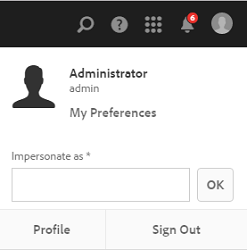
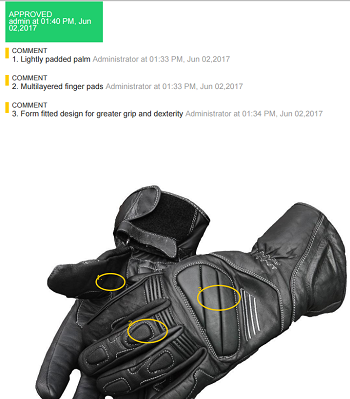

# 管理您的數位資產 {#managing-assets-with-the-touch-optimized-ui}

瞭解各種資產管理和編輯任務，這些任務可以使用的觸控式優化用戶介面執行 [!DNL Experience Manager] 資產。

本文介紹如何使用Adobe Experience Manager資產觸控優化用戶介面管理和編輯資產。 有關用戶介面的基本知識，請參見 [Touch UI的基本處理](/help/sites-authoring/basic-handling.md)。 要管理內容片段，請參見 [管理內容片段](content-fragments-managing.md) 資產。

## 建立檔案夾 {#create-folders}

組織資產集合時，例如， `Nature` 影像，您可以建立資料夾以將它們保持在一起。 您可以使用資料夾對資產進行分類和組織。 [!DNL Experience Manager] 資產不要求您組織資料夾中的資產以更好地工作。

>[!NOTE]
>
>* 共用類型的Assets資料夾 `sling:OrderedFolder` 共用到Marketing Cloud時不受支援。 如果要共用資料夾，請在建立資料夾時不要選擇「已訂購」。
>* Experience Manager不允許使用 `subassets` word作為資料夾的名稱。 它是為包含複合資產子集的節點保留的關鍵字。

1. 導航到要建立新資料夾的數字資產資料夾中的位置。
1. 在菜單中，按一下 **[!UICONTROL 建立]**。 選擇 **[!UICONTROL 新建資料夾]**。
1. 在 **[!UICONTROL 標題]** 欄位，提供資料夾名稱。 預設情況下，DAM使用您提供的標題作為資料夾名稱。 建立資料夾後，可以覆蓋預設資料夾並指定另一個資料夾名稱。
1. 按一下&#x200B;**[!UICONTROL 建立]**。您的資料夾顯示在數字資產資料夾中。

不支援以下（以空格分隔的）字元清單：

* 資產檔案名不能包含  `* / : [ \ \ ] | # % { } ? &`
* 資產資料夾名稱不包含  `* / : [ \ \ ] | # % { } ? \" . ^ ; + & \t`

## 上傳資產 {#uploading-assets}

您可以從本地資料夾或網路驅動器上載各種類型的資產(包括影像、PDF檔案、RAW檔案等)到 [!DNL Experience Manager] 資產。

>[!NOTE]
>
>在Dynamic Media-Scene7模式下，您只能上載檔案大小為2 GB或更少的資產。

您可以選擇將資產上載到具有或不具有分配給它們的處理配置檔案的資料夾。

對於已分配了處理配置檔案的資料夾，配置檔案名稱將顯示在卡視圖中的縮略圖上。 在清單視圖中，配置檔案名稱將出現在 **[!UICONTROL 處理配置檔案]** 的雙曲餘切值。 請參閱 [處理配置檔案](processing-profiles.md)。

在上載資產之前，請確保它位於 [支援的格式](assets-formats.md)。

**上載資產**:

1. 在「資產」Web介面中，導航到要添加數字資產的位置。
1. 要上載資產，請執行以下操作之一：

   * 在工具欄上，按一下 **[!UICONTROL 建立]** 表徵圖 然後，在菜單上，點擊 **[!UICONTROL 檔案]**。 如果需要，可在顯示的對話框中更名檔案。
   * 在支援HTML5的瀏覽器中，直接將資產拖動到介面上。 不顯示要更名檔案的對話框。

   

   要選擇多個檔案，請按Ctrl/Command鍵，然後在檔案選取器對話框中選擇資源。 在iPad中，一次只能選擇一個檔案。

   您可以暫停上載大型資產（大於500 MB），稍後從同一頁恢復。 點擊 **[!UICONTROL 暫停]** 表徵圖，位於上載開始時顯示的進度欄旁。

   

   資產被視為大型資產的大小可以配置。 例如，可以將系統配置為將1000 MB以上（而不是500 MB）的資產視為大資產。 在這個例子中， **[!UICONTROL 暫停]** 上載大小大於1000 MB的資產時，將顯示進度欄中的按鈕。

   的 **[!UICONTROL 暫停]** 按鈕不顯示是否上載的檔案大於1000 MB且檔案小於1000 MB。 但是，如果取消少於1000 MB的檔案上載， **[!UICONTROL 暫停]** 按鈕

   要修改大小限制，請配置 `chunkUploadMinFileSize` 屬性 `fileupload`的子目錄。

   按一下 **[!UICONTROL 暫停]** 表徵圖，它切換為 **[!UICONTROL 播放]** 表徵圖 要繼續上載，請按一下 **[!UICONTROL 播放]** 表徵圖

   

   要取消正在進行的上載，請按一下 `X` 按鈕。 取消上載操作後， [!DNL Experience Manager] 資產將刪除資產的部分上載部分。

   在低頻寬情況和網路故障中，恢復上載功能尤其有用，在這些情況下，上載大型資產需要很長時間。 您可以暫停上載操作，並在情況好轉後繼續。 恢復時，上載從暫停時開始。

   在上載操作期間， [!DNL Experience Manager] 將上載的資產部分作為資料塊保存在CRX儲存庫中。 上載完成後， [!DNL Experience Manager] 將這些塊合併到儲存庫中的單個資料塊中。

   要為未完成的區塊上載作業配置清除任務，請轉到 `https://[aem_server]:[port]/system/console/configMgr/org.apache.sling.servlets.post.impl.helper.ChunkCleanUpTask`。

   如果上載的資產名稱與上載資產所在位置已可用的資產名稱相同，則會顯示警告對話框。

   您可以選擇替換現有資產、建立其他版本或通過更名已上載的新資產來保留兩者。 如果替換現有資產，則資產的元資料以及任何先前的修改和歷史記錄（例如注釋、作物等）都將被刪除。 如果選擇保留這兩個資產，則將更名新資產。

   

   >[!NOTE]
   >
   >選擇時 **[!UICONTROL 替換]** 的 **[!UICONTROL 名稱衝突]** 對話框，將為新資產重新生成資產ID。 此ID與上一個資產的ID不同。
   >
   >如果 **[!UICONTROL 資產透視]** 啟用以跟蹤Adobe Analytics的印象/按一下，此重新生成的資產ID將使為Adobe Analytics上的資產捕獲的資料無效。

   如果上載的資產存在於 [!DNL Experience Manager] 資產， **[!UICONTROL 檢測到重複項]** 對話框警告您嘗試上載重複的資產。 僅當現有資產的二進位檔案的SHA 1校驗和值與您上載的資產的校驗和值匹配時，才會顯示此對話框。 在這種情況下，資產名稱並不重要。 換句話說，如果二進位檔案的SHA 1值相同，則對話框甚至會出現在名稱不同的資產上。

   >[!NOTE]
   >
   >的 **[!UICONTROL 檢測到重複項]** 對話框僅在 **[!UICONTROL 重複檢測]** 功能已啟用。 啟用 **[!UICONTROL 重複檢測]** 功能，請參閱 [啟用重複檢測](duplicate-detection.md)。

   

   點擊 **[!UICONTROL 保留]** 將重複資產保留在 [!DNL Experience Manager] 資產。 點擊  **[!UICONTROL 刪除]** 刪除您上載的重複資產。

   [!DNL Experience Manager] Assets禁止在其檔案名中上載禁用字元的資產。 如果嘗試上載包含不允許的字元的資產， [!DNL Experience Manager] 資產顯示有關檔案名中存在禁止字元的警告消息，並停止上載，直到您刪除這些字元或使用允許的名稱上載。

   要適合組織的特定檔案命名約定， **[!UICONTROL 上載資產]** 對話框，用於為上載的檔案指定長名稱。

   

   但是，不支援以下（以空格分隔的）字元清單：
   * 資產檔案名不能包含  `* / : [ \ \ ] | # % { } ? &`
   * 資產資料夾名稱不包含  `* / : [ \ \ ] | # % { } ? \" . ^ ; + & \t`

   此外，「資產」介面還顯示您上載的最近資產或您首先在所有視圖中建立的資料夾(**[!UICONTROL 卡視圖]**。 **[!UICONTROL 清單視圖]**, **[!UICONTROL 列視圖]**)。

   通常，在同時上載大型資產或多個資產時，視覺指標可讓您評估進度。 的 **[!UICONTROL 上載進度]** 對話框顯示成功上載的檔案計數和無法上載的檔案。

   

   如果在上載檔案之前取消上載操作， [!DNL Experience Manager] 資產停止上載當前檔案並刷新內容。 但是，不會刪除已上載的檔案。

### 串列上載 {#serial-uploads}

批量上載大量資產會佔用大量系統資源，這可能會對您的效能產生負面影響 [!DNL Experience Manager] 部署。 潛在的瓶頸可能是您的Internet連接、磁碟上的讀寫操作、Web瀏覽器對併發資產上載POST請求數的限制。 批量上載操作可能失敗或提前終止。 換句話說， [!DNL Experience Manager] 資產在接收大量檔案時可能會丟失某些檔案，或者完全無法接收任何檔案。

為了克服這種局面， [!DNL Experience Manager] 在批量上載操作期間，資產一次接收一個資產（串列上載），而不是同時接收所有資產。

預設情況下啟用資產的串列上載。 要禁用功能並允許併發上載，請覆蓋 `fileupload` 中的節點，並設定 `parallelUploads` 屬性 `true`。

### 使用FTP上載資產 {#uploading-assets-using-ftp}

Dynamic Media支援通過FTP伺服器批量上傳資產。 如果要上載大資產(>1 GB)或上載整個資料夾和子資料夾，則應使用FTP。 您甚至可以設定FTP上載，以定期執行。

>[!NOTE]
>
>在Dynamic Media-Scene7模式下，您只能上載檔案大小為2 GB或更少的資產。

>[!NOTE]
>
>通過FTP在Dynamic Media上傳資產 — Scene7模式安裝功能包(FP)18912 [!DNL Experience Manager] 作者。 與Adobe客戶支援聯繫以訪問FP-18912並完成FTP帳戶的設定。 請參閱 [安裝功能包18912以進行批量資產遷移](/help/assets/bulk-ingest-migrate.md)。
>
>如果使用FTP上載資產，請在 [!DNL Experience Manager] 忽略。 而是使用在Dynamic Media Classic中定義的檔案處理規則。

**使用FTP上載資產**

1. 使用您選擇的FTP客戶端，使用您從預配電子郵件收到的FTP用戶名和密碼登錄到FTP伺服器。 在FTP客戶端中，將檔案或資料夾上載到FTP伺服器。
1. 開啟 [Dynamic Media Classic台式機應用](https://experienceleague.adobe.com/docs/dynamic-media-classic/using/getting-started/signing-out.html#getting-started)，然後使用從預配電子郵件接收的憑據登錄到您的帳戶。
1. 在全局導航欄上，點擊 **[!UICONTROL 上載]**。
1. 在 **[!UICONTROL 上載]** 頁面，靠近左上角，點擊 **[!UICONTROL 通過FTP]** 頁籤。
1. 在頁面左側，選擇要上載檔案的FTP資料夾；在頁面的右側，選擇目標資料夾。
1. 在頁面右下角附近，點擊 **[!UICONTROL 作業選項]** 然後根據所選資料夾中的資產設定所需選項。

   請參閱 [上載作業選項](#upload-job-options)。

   >[!NOTE]
   >
   >通過FTP上傳資產時，您在Dynamic Media Classic設定的上載作業選項將取代在中設定的資產處理參數AEM。

1. 在右下角 **[!UICONTROL 上載作業選項]** 對話框，按一下 **[!UICONTROL 保存]**。
1. 在右下角 **[!UICONTROL 上載]** 頁面，點擊 **[!UICONTROL 提交上載]**。

   要查看上載的進度，請在全局導航欄上點擊 **[!UICONTROL 作業]**。 的 **[!UICONTROL 作業]** 頁顯示上載的進度。 您可以繼續工作 [!DNL Experience Manager] 並隨時返回Dynamic Media Classic的「工作」頁面，以查看正在執行的工作。

   要取消正在執行的上載作業，請點擊 **[!UICONTROL 取消]** 的 **[!UICONTROL 持續時間]** 時間。

#### 上載作業選項 {#upload-job-options}

| 上載選項 | 子選項 | 說明 |
|---|---|---|
| 工作名稱 |  | 預填充在文本欄位中的預設名稱包括用戶輸入的名稱部分和日期和時間戳。 您可以使用預設名稱，或為此上載作業輸入自己建立的名稱。  作業以及其他上載和發佈作業將記錄在「作業」頁面中，您可以在該頁面中檢查作業的狀態。 |
| 上載後發佈 |  | 自動發佈您上傳的資產。 |
| 任何檔案夾內若有基本資產名稱相同者 (無論副檔名為何)，將予以覆寫 |  | 如果希望上載的檔案替換具有相同名稱的現有檔案，請選擇此選項。 此選項的名稱可能不同，具體取決於 **[!UICONTROL 應用程式設定]** > **[!UICONTROL 常規設定]** > **[!UICONTROL 上載到應用程式]** > **[!UICONTROL 覆蓋影像]**。 |
| 上載時解壓縮ZIP或TAR檔案 |  |  |
| 作業選項 |  | 點擊/按一下 **[!UICONTROL 作業選項]** 開啟 [!UICONTROL 上載作業選項] 對話框，然後選擇影響整個上載作業的選項。 這些選項對於所有檔案類型都相同。 您可以選擇從「應用程式一般設定」頁開始上載檔案的預設選項。 要開啟此頁，請選擇 **[!UICONTROL 設定]** > **[!UICONTROL 應用程式設定]**。 點擊 **[!UICONTROL 預設上載選項]** 按鈕 [!UICONTROL 上載作業選項] 對話框。 |
|  | 時間 | 選擇一次性或循環。 要設定循環作業，請選擇「重複」選項（每日、每週、每月或自定義），以指定FTP上載作業重複的時間。 然後根據需要指定計畫選項。 |
|  | 包括子資料夾 | 上載要上載的資料夾中的所有子資料夾。 您上載的資料夾及其子資料夾的名稱將自動輸入到 [!DNL Experience Manager] 資產。 |
|  | 裁切選項 | 要從影像的側面手動裁剪，請選擇「裁剪」菜單，然後選擇「手動」。 然後輸入要從影像的任何一側或每一側裁剪的像素數。 剪切的影像量取決於影像檔案中的ppi（像素/英吋）設定。 例如，如果影像顯示150 ppi，而您在「頂部」、「右側」、「底部」和「左側」文本框中輸入75，則從每側裁剪半英吋。  要自動從影像中裁剪空白像素，請開啟「裁剪」菜單，選擇「手動」，然後在「頂部」、「右部」、「底部」和「左部」欄位中輸入像素測量值以從側面裁剪。 您也可以在「裁剪」菜單上選擇「裁切」，然後選擇以下選項：  **基於** <ul><li>**顏色**  — 選擇「顏色」選項。 然後選擇「角」菜單，然後選擇影像的角，該角的顏色最能代表要裁剪的白色空間顏色。</li><li>**透明度**  — 選擇「透明度」選項。  **容差**  — 拖動滑塊以指定0到1的公差。對於基於顏色的修剪，僅當像素與在影像角部選擇的顏色完全匹配時，才指定0來裁剪像素。 接近1的數字允許更多顏色差異。 對於基於透明度的修剪，請指定0以僅在像素為透明時裁剪像素。 接近1的數字允許更透明。</li></ul> 請注意，這些裁剪選項是無損的。 |
|  | 顏色配置檔案選項 | 在建立用於傳遞的優化檔案時選擇顏色轉換：<ul><li>預設顏色保留：當影像包含顏色空間資訊時，維護源影像顏色；沒有顏色轉換。 目前幾乎所有影像都已嵌入適當的顏色配置檔案。 但是，如果CMYK源影像不包含嵌入的顏色配置檔案，這些顏色將轉換為sRGB（標準紅綠藍）顏色空間。 sRGB是建議的用於在網頁上顯示影像的顏色空間。</li><li>保留原始顏色空間：保留原始顏色，點處不進行任何顏色轉換。 對於沒有嵌入顏色配置檔案的影像，任何顏色轉換都使用在「發佈」設定中配置的預設顏色配置檔案完成。 顏色配置檔案可能與使用此選項建立的檔案中的顏色不對齊。 因此，建議您使用「預設顏色保留」選項。</li><li>自定義自>自  開啟菜單，以便選擇「轉換自」和「轉換至」顏色空間。 此高級選項將覆蓋源檔案中嵌入的任何顏色資訊。 當您提交的所有影像包含不正確或缺少顏色配置檔案資料時，選擇此選項。</li></ul> |
|  | 影像編輯選項 | 可以保留影像中的剪貼蒙版，並選擇顏色配置檔案。  請參閱 [在上載時設定影像編輯選項](#setting-image-editing-options-at-upload)。 |
|  | Postscript選項 | 您可以柵格化PostScript®檔案、裁剪檔案、維護透明背景、選擇解析度和選擇顏色空間。  請參閱 [設定PostScript和Illustrator上載選項](#setting-postscript-and-illustrator-upload-options)。 |
|  | Photoshop選項 | 您可以從Adobe®Photoshop®檔案建立模板，維護圖層，指定圖層的命名方式，提取文本，並指定如何將影像定位到模板中。  請注意，中不支援模AEM板。  請參閱 [設定Photoshop上載選項](#setting-photoshop-upload-options)。 |
|  | PDF選項 | 您可以柵格化檔案、提取搜索詞和連結、自動生成eCatalog、設定解析度並選擇顏色空間。  請注意，中不支援eCatalogAEM。   請參閱 [設定PDF上載選項&#x200B;](#setting-pdf-upload-options) **注釋**:要考慮提取的PDF的最大頁數為5000，用於新上載。 此限制將於2022年12月31日改為100頁(所有PDF)。 另請參閱 [Dynamic Media限制](/help/assets/limitations.md)。 |
|  | Illustrator選項 | 您可以柵格化Adobe Illustrator®檔案、維護透明背景、選擇解析度和選擇顏色空間。  請參閱 [設定PostScript和Illustrator上載選項](#setting-postscript-and-illustrator-upload-options)。 |
|  | EVideo選項 | 通過選擇「視頻預設」，可以對視頻檔案進行代碼轉換。  請參閱 [設定eVideo上載選項](#setting-evideo-upload-options)。 |
|  | 批次集預設集 | 要從上載的檔案建立「影像集」或「旋轉集」，請按一下要使用的預設的「活動」列。 可以選擇多個預設。 您可以在Dynamic Media Classic的「應用程式設定/批集預設」頁中建立預設。  請參閱 [將批集預設配置為自動生成影像集和旋轉集](config-dms7.md#creating-batch-set-presets-to-auto-generate-image-sets-and-spin-sets) 以瞭解有關建立批集預設的詳細資訊。  請參閱 [在上載時設定批集預設](#setting-batch-set-presets-at-upload)。 |

#### 在上載時設定影像編輯選項 {#setting-image-editing-options-at-upload}

上載影像檔案(包括AI、EPS和PSD檔案)時，可在 **[!UICONTROL 上載作業選項]** 對話框：

* 從影像邊緣裁剪空白（請參閱上表中的說明）。
* 從影像的側面手動裁剪（請參閱上表中的說明）。
* 選擇顏色配置檔案（請參閱上表中的選項說明）。
* 從剪切路徑建立蒙版。
* 使用反銳化掩碼選項銳化影像
* 挖空背景

| 選項 | 子選項 | 說明 |
|---|---|---|
| 從剪切路徑建立蒙版 |  | 根據影像的剪切路徑資訊為影像建立蒙版。 此選項適用於使用建立剪切路徑的影像編輯應用程式建立的影像。 |
| 不銳利化遮色片 |  | 允許對最終下採樣影像微調銳化濾鏡效果，控制效果的強度、效果半徑（以像素為單位）和忽略的對比度閾值。  此效果使用的選項與Photoshop的「非銳化蒙版」濾鏡相同。 與名稱相反，「非銳化蒙版」是銳化濾鏡。 在「取消銳化掩碼」(Unsharp Masking)下，設定所需的選項。 設定選項在以下部分中介紹： |
|  | 數量 | 控制應用於邊緣像素的對比度量。  把它看成效果的強度。 Dynamic Media的Unsharp Mask值與Adobe Photoshop的Unsharp值之間的主要區別是，Photoshop的金額範圍在1%至500%之間。 而在Dynamic Media，值範圍是0.0到5.0。5.0是Photoshop的500%;0.9等於90%，依此類推。 |
|  | 半徑 | 控制效果的半徑。 值範圍為0-250。  該效果在影像中的所有像素上運行，並從所有方向的所有像素輻射出來。 半徑以像素計量。 例如，要對2000 x 2000像素影像和500 x 500像素影像獲得類似的銳化效果，應在2000 x 2000像素影像上設定兩個像素的半徑，在500 x 500像素影像上設定一個像素的半徑值。 對於具有更多像素的影像，使用較大的值。 |
|  | 臨界值 | 閾值是應用「非銳化蒙版」濾鏡時忽略的對比度範圍。 在使用此濾波器時，必須不將「雜訊」引入影像。 值範圍為0-255，即灰度影像中的亮度步長數。 0=黑色，128=50%灰色，255=白色。  例如，閾值12忽略細微的變化是膚色亮度以避免增加噪音，但仍會與對比區域（如睫毛與膚色之間）添加邊緣對比度。  例如，如果您有某人的臉部照片，「非銳化面具」會影響影像的對比部分，例如睫毛和皮膚會聚，形成明顯的對比區域，以及平滑的皮膚本身。 即使最光滑的皮膚也在亮度值上表現出微妙的變化。 如果不使用閾值，濾鏡會突出皮膚像素中的這些細微變化。 反之，在增加睫毛對比度的同時產生雜訊和不希望的效果，增強銳度。  為避免此問題，引入了閾值，該閾值指示濾波器忽略不會顯著改變對比度的像素，如平滑皮膚。  在前面顯示的拉鍊圖形中，注意拉鍊旁邊的紋理。 由於閾值過低，無法抑制雜訊，因此出現了影像雜訊。 |
|  | 單色 | 選擇以取消銳化蒙版影像亮度（強度）。  取消選擇以單獨取消對每個顏色分量進行銳化。 |
| 挖空背景 |  | 上載影像時自動刪除影像的背景。 此技術有助於吸引對特定對象的注意並使其從繁忙的背景中脫穎而出。 選擇以啟用或「開啟」「挖空背景」功能和以下子選項： |
|  | 角 | 必要.  用於定義要挖空的背景顏色的影像的角。  您可以從 **左上角**。 **左下**。 **右上**&#x200B;或 **右下**。 |
|  | 填充方法 | 必要.  從您設定的「拐角」位置控制像素透明度。  可以從以下填充方法中進行選擇： <ul><li>**Flood填充**  — 將所有與指定並連接到的「角」匹配的像素變為透明。</li><li>**匹配像素**  — 將所有匹配像素都變為透明，而不管其在影像上的位置如何。</li></ul> |
|  | 容差 | 選填。  根據您設定的「角」位置控制像素顏色匹配中允許的變化量。  使用值0.0精確匹配像素顏色，或使用值1.0允許最大變化。 |

#### 設定PostScript和Illustrator上載選項 {#setting-postscript-and-illustrator-upload-options}

上載PostScript(EPS)或Illustrator(AI)映像檔案時，可以採用各種格式設定它們。 您可以柵格化檔案、維護透明背景、選擇解析度和選擇顏色空間。 PostScript選項和Illustrator選項下的「上載作業選項」對話框中提供了用於格式化PostScript和Illustrator檔案的選項。

| 選項 | 子選項 | 說明 |
|---|---|---|
| 處理 |  | 選擇 **[!UICONTROL 光柵化]** 將檔案中的向量圖形轉換為點陣圖格式。 |
| 在渲染的影像中維護透明背景 |  | 維護檔案的背景透明度。 |
| 解析度 |  | 確定解析度設定。 此設定確定檔案中每英吋顯示的像素數。 |
| 色彩空間 |  | 選擇「顏色空間」菜單，然後從以下顏色空間選項中進行選擇： |
|  | 自動檢測 | 保留檔案的顏色空間。 |
|  | 強制為RGB | 轉換為RGB顏色空間。 |
|  | 強制為CMYK | 轉換為CMYK顏色空間。 |
|  | 強制為灰度 | 轉換為灰度色空間。 |

#### 設定Photoshop上載選項 {#setting-photoshop-upload-options}

PSD(Photoshop文檔)檔案最常用於建立影像模板。 上載PSD檔案時，可以自動從檔案建立影像模板（選擇「上載」螢幕上的「建立模板」選項）。

Dynamic Media會使用檔案建立模板，從包含圖層的PSD檔案建立多個影像；它為每個圖層建立一個影像。

使用 **[!UICONTROL 裁剪選項]** 和 **[!UICONTROL 顏色配置檔案選項]**，上述，帶有Photoshop上載選項。

>[!NOTE]
>
>中不支援模AEM板。

| 選項 | 子選項 | 說明 |
|---|---|---|
| 維護層 |  | 將PSD中的層（如果有）拆分為單個資產。 資產層仍與PSD關聯。 可通過在「詳細資訊」視圖中開啟PSD檔案並選擇層面板來查看它們。 |
| 建立範本 |  | 從PSD檔案中的層建立模板。 |
| 提取文本 |  | 提取文本，以便用戶可以在查看器中搜索文本。 |
| 延伸圖層以符合背景大小 |  | 將撕裂影像圖層的大小擴展到背景圖層的大小。 |
| 層命名 |  | PSD檔案中的圖層將作為單獨的影像上載。 |
|  | 層名稱 | 在PSD檔案中將影像命名為其圖層名稱。 例如，原始PSD檔案中名為「價格標籤」的圖層將變成名為「價格標籤」的影像。 但是，如果PSD檔案中的圖層名稱是預設的Photoshop圖層名稱（背景、第1層、第2層等），則影像將以其在PSD檔案中的圖層編號命名，而不是以其預設圖層名稱命名。 |
|  | Photoshop和層號 | 在PSD檔案中將影像命名為其圖層編號，而忽略原始圖層名稱。 影像以Photoshop檔案名和附加的圖層號命名。 例如，名為Spring Ad.psd的檔案的第二層命名為Spring Ad_2，即使它在Photoshop具有非預設名稱。 |
|  | Photoshop和層名稱 | 將影像命名為PSD檔案後面的圖層名稱或圖層編號。 如果PSD檔案中的層名是預設的Photoshop層名，則使用層號。 例如，在名為SpringAd的PSD檔案中，名為Price Tag的層名為Spring Ad_Price Tag。 預設名稱為「層2」的層稱為「彈簧Ad_2」。 |
| 錨點 |  | 指定如何將影像定位到從PSD檔案生成的分層合成生成的模板中。 預設情況下，錨點為中心。 中心錨點允許替換影像最好地填充相同的空間，而不管替換影像的長寬比。 當引用模板並使用參數替換時，具有不同方面的影像可替換此影像，有效地佔用了相同的空間。 如果應用程式需要替換影像來填充模板中分配的空間，請更改為其他設定。 |

#### 設定PDF上載選項 {#setting-pdf-upload-options}

上載PDF檔案時，可以採用各種格式設定該檔案。 您可以裁剪其頁面、提取搜索詞、輸入每英吋像素的解析度並選擇顏色空間。 PDF檔案通常包含裁切邊距、裁切標籤、註冊標籤和其他打印機標籤。 在上載PDF檔案時，可以從頁面的側面裁剪這些標籤。

要考慮提取的PDF的最大頁數為5000，用於新上載。 此限制將於2022年12月31日改為100頁(所有PDF)。 另請參閱 [Dynamic Media限制](/help/assets/limitations.md)。

>[!NOTE]
>
>中不支援eCatalogAEM。

從以下選項中選擇：

| 選項 | 子選項 | 說明 |
|---|---|---|
| 處理 | 點陣化 | （預設）拆除PDF檔案中的頁面，並將向量圖形轉換為點陣圖影像。 選擇此選項可建立eCatalog。 |
| 提取 | 搜尋字詞 | 從PDF檔案中提取單詞，以便在eCatalog Viewer中按關鍵字搜索檔案。 |
|  | 連結 | 從PDF檔案中提取連結，並將其轉換為在eCatalog Viewer中使用的影像映射。 |
| 自動從多頁生成eCatalogPDF |  | 自動從PDF檔案建立eCatalog。 eCatalog以您上載的PDF檔案命名。 (此選項僅在上載PDF檔案時柵格化時才可用。) |
| 解析度 |  | 確定解析度設定。 此設定確定PDF檔案中每英吋顯示的像素數。 預設值為150。 |
| 色彩空間 |  | 選擇「顏色空間」菜單，然後為PDF檔案選擇顏色空間。 大多數PDF檔案都有RGB和CMYK彩色影像。 RGB色空間優選用於線上觀看。 |
|  | 自動偵測 | 保留PDF檔案的顏色空間。 |
|  | 強制為 RGB | 轉換為RGB顏色空間。 |
|  | 強制為 CMYK | 轉換為CMYK顏色空間。 |
|  | 強制為灰階 | 轉換為灰度色空間。 |

#### 設定eVideo上載選項 {#setting-evideo-upload-options}

可以通過從各種視頻預設中進行選擇來對視頻檔案進行代碼轉換。

| 選項 | 子選項 | 說明 |
|---|---|---|
| 適應性影片 |  | 單個編碼預設，可與任意縱橫比配合工作，用於建立視頻，以交付到移動、平板和案頭。 使用此預設編碼的上載源視頻設定為固定高度。 但是，寬度會自動縮放以保留視頻的寬高比。  最佳做法是使用自適應視頻編碼。 |
| 單個編碼預設 | 對編碼預設進行排序 | 選擇「名稱」或「大小」，按名稱或解析度大小對「案頭」、「移動」和「平板」下列出的編碼預設進行排序。 |
|  | 桌面 | 建立MP4檔案，以便向台式電腦提供流式或漸進式視頻體驗。選擇符合您所需解析度大小和目標資料速率的一個或多個縱橫比。 |
|  | 行動 | 建立MP4檔案，以便在iPhone或Android移動設備上交付。選擇一個或多個具有所需解析度大小和目標資料速率的縱橫比。 |
|  | 平板電腦 | 建立MP4檔案，以便在iPad或Android平板電腦設備上交付。選擇一個或多個具有所需解析度大小和目標資料速率的縱橫比。 |

#### 在上載時設定批集預設 {#setting-batch-set-presets-at-upload}

如果要從上載的映像自動建立映像集或旋轉集，請按一下 **[!UICONTROL 活動]** 列中的值。 可以選擇多個預設。

請參閱 [將批集預設配置為自動生成影像集和旋轉集](config-dms7.md#creating-batch-set-presets-to-auto-generate-image-sets-and-spin-sets) 以瞭解有關建立批集預設的詳細資訊。

### 流式上傳 {#streamed-uploads}

如果上載大量資產，則I/O呼叫 [!DNL Experience Manager] 伺服器數量急劇增加，這會降低上傳效率，甚至導致超時。 [!DNL Experience Manager] 資產支援流式上傳資產。 流式上載通過在將磁碟複製到儲存庫之前避免將資產儲存在伺服器上的臨時資料夾中，減少了上載操作期間的磁碟I/O。 相反，資料會直接傳輸到儲存庫。 這樣，上載大型資產的時間和超時的可能性就會減少。 預設情況下，在 [!DNL Experience Manager] 資產。

流上載已禁用 [!DNL Experience Manager] 在Servlet-api版本低於3.1的JEE伺服器上運行。

### 提取包含資產的ZIP存檔 {#extract-zip-archive-containing-assets}

您可以像其他任何受支援的資產一樣上載ZIP存檔。 同一檔案名規則適用於ZIP檔案。 [!DNL Experience Manager] 允許您將ZIP存檔解壓到DAM位置。

一次選擇一個ZIP存檔，按一下 **[!UICONTROL 提取存檔]**，然後選擇目標資料夾。 選擇一個選項來處理衝突（如果有）。 如果ZIP檔案中的資產已存在於目標資料夾中，則可以選擇以下選項之一：跳過提取、替換現有檔案、通過更名保留兩個資產或建立新版本。

提取完成後， [!DNL Experience Manager] 通知您。 同時 [!DNL Experience Manager] 提取ZIP，你可以回到你的工作，而不中斷提取。

該功能的一些限制是：

* 如果目標上存在同名的資料夾，則ZIP檔案中的資產將提取到現有資料夾中。

* 如果取消提取，則不會刪除已提取的資產。

* 不能同時選擇兩個ZIP檔案並解壓它們。 一次只能提取一個ZIP存檔。

## 預覽資產 {#previewing-assets}

**預覽資產**:

1. 從「資產」UI定位至要預覽的資產的位置。
1. 點擊所需的資產以開啟它。

1. 在預覽模式下，縮放選項可用於 [支援的映像類型](assets-formats.md#supported-raster-image-formats) （使用互動式編輯）。

   要放大資產，請點擊 **[!UICONTROL +]** （或者點擊資產上的放大鏡）。 要縮小，請點擊 **[!UICONTROL -]**。 放大時，可以通過平移來仔細查看影像的任何區域。 的 **[!UICONTROL 重置縮放]** 箭頭將您返回到原始視圖。

   

   點擊 **[!UICONTROL 重置]** 按鈕將視圖重置為原始大小。

   

>[!MORELIKETHIS]
>
>* [預覽Dynamic Media資產](/help/assets/previewing-assets.md)。
>* [查看子組](managing-linked-subassets.md#viewing-subassets)。

## 編輯屬性 {#editing-properties}

1. 導航到要編輯其元資料的資產的位置。

1. 選擇資產，然後點擊 **[!UICONTROL 屬性]** 的子菜單。 或者，選擇 **[!UICONTROL 屬性]** 對資產卡執行快速操作。

   

1. 在 **[!UICONTROL 屬性]** 頁，編輯各個頁籤下的元資料屬性。 例如，在 **[!UICONTROL 基本]** 頁籤，編輯標題、說明等。

   佈局 **[!UICONTROL 屬性]** 頁和可用的元資料屬性取決於基礎元資料架構。 瞭解如何修改佈局 **[!UICONTROL 屬性]** 頁面，請參閱 [元資料架構](metadata-schemas.md)。

1. 若要排程啟動資產的特定日期/時間，請使用「準時」欄位旁的日 **[!UICONTROL 期選擇器]** 。

   

1. 要在特定持續時間後停用資產，請從位於 **[!UICONTROL 關機時間]** 的子菜單。

   停用日期應晚於資產的激活日期。 在 [!UICONTROL 關機時間]，資產及其格式副本不能通過Assets Web介面或通過HTTP API訪問。

   

1. 在 **[!UICONTROL 標籤]** 的子菜單。 要添加自定義標籤，請在框中鍵入標籤的名稱，然後按 **[!UICONTROL 輸入]**。 新標籤將保存在AEM中。

   YouTube需要發佈標籤，並且有到YouTube的連結（如果找到合適的連結）。
要建立標籤，您需要對 `/content/cq:tags/default` 的下界。

1. 要為資產提供評級，請點擊 **[!UICONTROL 高級]** 頁籤，然後在適當位置點擊星號以指定所需的評級。

   

   您分配給資產的評級分數顯示在 **[!UICONTROL 您的評級]**。 從對資產進行評級的用戶接收的資產的平均評級分數顯示在 **[!UICONTROL 評級]**。 此外，在下面顯示有助於平均評級得分的評級得分的分解 **[!UICONTROL 評級細分]**。 您可以根據平均評級得分搜索資產。

1. 要查看資產的使用情況統計資訊，請點擊 **[!UICONTROL 洞察力]** 頁籤。

   使用情況統計資訊包括：

   * 查看或下載資產的次數。
   * 使用資產的通道/設備。
   * 最近使用該資產的創造性解決方案。

   有關詳細資訊，請參閱 [資產透視](touch-ui-asset-insights.md)。

1. 點擊 **[!UICONTROL 保存並關閉]**。
1. 導航到「資產」UI。 已編輯的元資料屬性（包括標題、說明、評級等）顯示在卡視圖中的資產卡上以及清單視圖中相關列下。

## 複製資產 {#copying-assets}

複製資產或資料夾時，將複製整個資產或資料夾及其內容結構。 複製的資產或資料夾在目標位置重複。 源位置的資產不會更改。

不會結轉資產特定副本所特有的幾個屬性。 有些示例包括：

* 資產ID、建立日期和時間以及版本和版本歷史記錄。 這些屬性中的某些屬性由 `jcr:uuid`。 `jcr:created`, `cq:name`。

* 建立時間和引用的路徑對於每個資產及其每個格式副本都是唯一的。

保留其他屬性和元資料資訊。 複製資產時不建立部分副本。

1. 從「資產」UI中，選擇一個或多個資產，然後點擊 **[!UICONTROL 複製]** 的子菜單。 或者，選擇 **[!UICONTROL 複製]** 資產卡中的快速操作。

   

   >[!NOTE]
   >
   >如果使用 **[!UICONTROL 複製]** 快速操作，一次只能複製一個資產。

1. 定位至要複製資產的位置。

   >[!NOTE]
   >
   >如果複製同一地點的資產， [!DNL Experience Manager] 自動生成名稱的變體。 例如，如果複製名為Square的資產， [!DNL Experience Manager] 自動生成其副本的標題(Square1)。

1. 點擊 **[!UICONTROL 貼上]** 表徵圖：

   

   資產將複製到此位置。

   >[!NOTE]
   >
   >的 **[!UICONTROL 貼上]** 表徵圖在貼上操作完成之前在工具欄中可用。

## 移動和更名資產 {#moving-or-renaming-assets}

將資產（或資料夾）移到另一個位置時，與複製資產時不會複製資產（或資料夾）。 資產（或資料夾）被放置在目標位置，並從源位置刪除。 也可以在將資產移動到新位置時更名該資產。 如果要將已發佈的資產移動到其他位置，則您可以選擇重新發佈該資產。 預設情況下，已發佈資產的移動操作會自動取消發佈該資產。 如果作者選擇 [!UICONTROL 重新發佈] 選項。

移動資產或資料夾：

1. 定位至要移動的資產的位置。

移動資產或資料夾：

1. 定位至要移動的資產的位置。

1. 選擇資產，然後按一下 **[!UICONTROL 移動]** 的子菜單。
   

1. 在 [!UICONTROL 移動資產] 嚮導，執行下列操作之一：

   * 指定移動資產後的資產名稱。 然後按一下 **[!UICONTROL 下一個]** 繼續。

   * 按一下 **[!UICONTROL 取消]** 來停止進程。
   >[!NOTE]
   >
   >* 如果在新位置沒有具有該名稱的資產，則可以為該資產指定相同的名稱。 但是，如果將資產移動到存在同名資產的位置，則應使用其他名稱。 如果使用相同的名稱，系統將自動生成名稱的變體。 例如，如果資產的名稱為Square，則系統會為其副本生成名稱Square1。
   >* 更名時，檔案名中不允許有空格。

1. 在 **[!UICONTROL 選擇目標]** 對話框，執行下列操作之一：

   * 導航到資產的新位置，然後按一下 **[!UICONTROL 下一個]** 繼續。

   * 按一下 **[!UICONTROL 後退]** 返回 **[!UICONTROL 更名]** 的上界。

1. 如果要移動的資產具有任何引用頁、資產或集合，則 **[!UICONTROL 調整參照]** 頁籤 **[!UICONTROL 選擇目標]** 頁籤。

   在 **[!UICONTROL 調整參照]** 螢幕：

   * 指定要根據新詳細資訊調整的參照，然後按一下 **[!UICONTROL 移動]** 繼續。

   * 從 **[!UICONTROL 調整]** 列，選擇/取消選擇對資產的引用。
   * 按一下 **[!UICONTROL 後退]** 返回 **[!UICONTROL 選擇目標]** 的上界。

   * 按一下 **[!UICONTROL 取消]** 來停止移動操作。

   如果不更新引用，則它們會繼續指向資產的上一路徑。 如果調整參照，則參照將更新為新資產路徑。

### 使用拖動操作移動資產 {#move-using-drag}

通過將資產（或資料夾）拖動到目標位置，而不是使用 [!UICONTROL 移動] 的子菜單。 但是，此操作只能在清單視圖中執行。

通過拖動來移動資產不會開啟 [!UICONTROL 移動資產] 嚮導，因此您在移動時無法獲得更名資產的選項。 此外，已發佈的資產在移動時通過拖動重新發佈，而不需要獲得用戶的重新發佈批准。

## 管理格式副本 {#managing-renditions}

1. 您可以添加或刪除資產的格式副本，但原始格式副本除外。 導航到要為其添加或刪除格式副本的資產的位置。

1. 按一下資產以開啟其資產頁。

   

1. 點擊 **[!UICONTROL 全局導航]** 表徵圖，然後選擇 **[!UICONTROL 格式副本]** 清單中。

   

1. 在 **[!UICONTROL 格式副本]** 面板，查看為資產生成的格式副本清單。

   

   >[!NOTE]
   >
   >預設情況下， [!DNL Experience Manager] 在預覽模式下，資產不顯示資產的原始格式副本。 如果您是管理員，則可以使用疊加來配置 [!DNL Experience Manager] 在預覽模式下顯示原始格式副本的資產。

1. 選擇要查看或刪除格式副本的格式副本。

   **刪除格式副本**

   從 **[!UICONTROL 格式副本]** ，然後點擊 **[!UICONTROL 刪除格式副本]** 表徵圖 [工具欄](/help/sites-authoring/basic-handling.md)。 資產處理完成後，無法批量刪除格式副本。 對於單個資產，您可以從用戶介面手動刪除格式副本。 對於多個資產，您可以自定義Experience Manager以刪除特定格式副本或刪除資產並重新上載已刪除的資產。

   

   **上載新格式副本**

   定位至資產的資產詳細資訊頁，然後點擊 **[!UICONTROL 添加格式副本]** 表徵圖以上載資產的新格式副本。

   

   >[!NOTE]
   >
   >如果您從「轉譯」面板選取轉譯 **** ，工具列會變更上下文，並僅顯示與轉譯相關的動作。選項，如 **[!UICONTROL 上載格式副本]** 表徵圖。 若要在工具列中檢視這些選項，請導覽至資產的詳細資訊頁面。

   您可以配置要顯示在影像或視頻資產詳細資訊頁面中的格式副本的尺寸。 根據您指定的尺寸， [!DNL Experience Manager] 資產顯示具有精確或最接近的維度的格式副本。

   要在資產詳細資訊級別配置影像的格式副本尺寸，請覆蓋 **[!UICONTROL 任意選取器]** 節點 `libs/dam/gui/content/assets/assetpage/jcr:content/body/content/content/items/assetdetail/items/col1/items/assetview/renditionpicker` 並配置width屬性的值。 設定屬性大 **[!UICONTROL 小 (長) (KB]** )以取代寬度，以根據影像大小自訂資產詳細資料頁面上的轉譯。對於基於大小的自定義，屬性 **[!UICONTROL 首選原始]** 如果匹配的格式副本的大小大於原始格式副本的大小，則為原始格式副本指定首選項。

   同樣，您可以自定義 **[!UICONTROL 注釋]** 重疊頁面影像 `libs/dam/gui/content/assets/annotate/jcr:content/body/content/content/items/content/renditionpicker`。

   

   要為視頻資產配置格式副本維，請導航到 **[!UICONTROL 錄影機]** CRX儲存庫中的節點 `/libs/dam/gui/content/assets/assetpage/jcr:content/body/content/content/items/assetdetail/items/col1/items/assetview/videopicker`，覆蓋節點，然後編輯相應的屬性。

   >[!NOTE]
   >
   >只有HTML5相容視頻格式的瀏覽器才支援視頻批注。 此外，根據瀏覽器的不同，支援不同的視頻格式。

有關子集的資訊，請參見 [管理子集](managing-linked-subassets.md)。

## 刪除資產 {#deleting-assets}

要解析或刪除來自其他頁面的傳入引用，請在刪除資產之前更新相關引用。

此外，使用覆蓋禁用強制刪除按鈕，以禁止用戶刪除引用的資產和保留斷開的連結。

要刪除資產，需要刪除大壩/資產的權限。 如果您僅具有修改權限，則只能編輯資產元資料並向資產添加註釋。 但是，不能刪除資產或其元資料。

**刪除資產**:

1. 定位至要刪除的資產的位置。

1. 選擇資產，然後點擊 **[!UICONTROL 刪除]** 的子菜單。

   

1. 在確認對話框中，點擊：

   * **[!UICONTROL 取消]** 停止操作
   * **[!UICONTROL 刪除]** 根據以下內容確認操作：

      * 如果資產沒有參考，則資產將被刪除。
      * 如果資產有引用，則會出現一條錯誤消息通知您 **[!UICONTROL 引用一個或多個資產]**。 您可以選取&#x200B;**[!UICONTROL 強制刪除]**&#x200B;或&#x200B;**[!UICONTROL 取消]**。

   >[!NOTE]
   >
   >要解析或刪除來自其他頁面的傳入引用，請在刪除資產之前更新相關引用。
   >
   >另外，禁用 **[!UICONTROL 強制刪除]** 的子菜單。

## 下載資產 {#downloading-assets}

請參閱 [從下載資AEM產](download-assets-from-aem.md)

## 發佈和取消發佈資產 {#publish-assets}

在上載、處理或編輯您的資產後 [!DNL Experience Manager] 作者，將資產發佈到發佈伺服器。 發佈使資產公開可用。 取消發佈操作已從發佈伺服器中刪除資產，但未從創作伺服器中刪除資產。

有關特定於 [!DNL Dynamic Media]，請參閱 [發佈 [!DNL Dynamic Media] 資產](publishing-dynamicmedia-assets.md)。

1. 導航到要發佈或要從發佈環境中刪除的資產或資產資料夾的位置（取消發佈）。

1. 選擇要取消發佈的資產或資料夾，然後按一下 **[!UICONTROL 管理發布]**  的子菜單。 或者，要快速發佈，請選擇 **[!UICONTROL 快速發佈]** 的子菜單。 如果要發佈的資料夾包含空資料夾，則不會發佈空資料夾。

1. 選擇 **[!UICONTROL 發佈]** 或 **[!UICONTROL 取消發佈]** 按鈕。

   
   *圖：發佈和取消發佈選項以及計畫選項。*

1. 選擇 **[!UICONTROL 現在]** 立即對資產採取行動或選擇 **[!UICONTROL 稍後]** 以安排操作。 如果選擇 **[!UICONTROL 稍後]** 的雙曲餘切值。 按一下&#x200B;**[!UICONTROL 下一步]**。

1. 發佈時，如果資產引用了其他資產，則其引用將在嚮導中列出。 只顯示自上次發佈後未發佈或修改的那些引用。 選擇要發佈的引用。

1. 取消發佈時，如果資產引用了其他資產，請選擇要取消發佈的引用。 按一下 **[!UICONTROL 取消發佈]**。 在確認對話框中，按一下 **[!UICONTROL 取消]** 停止操作或按一下 **[!UICONTROL 取消發佈]** 確認在指定日期將取消發佈資產。

瞭解與發佈或取消發佈資產或資料夾相關的以下限制和提示：

* 選擇 [!UICONTROL 管理發布] 僅對具有複製權限的用戶帳戶可用。
* 取消發佈複雜資產時，只取消發佈該資產。 避免取消發佈引用，因為這些引用可能被其他已發佈資產引用。
* 未發佈空資料夾。
* 如果發佈正在處理的資產，則只發佈原始內容。 缺少格式副本。 等待處理完成，然後在處理完成後發佈或重新發佈資產。

## 建立關閉的用戶組 {#closed-user-group}

CUG（關閉的用戶組）用於限制對從中發佈的特定資產資料夾的訪AEM問。 如果為資料夾建立CUG，則對資料夾（包括資料夾資產和子資料夾）的訪問將僅限於分配的成員或組。 要訪問資料夾，他們必須使用其安全憑據登錄。

CUG是限制訪問您資產的額外方法。 您還可以為資料夾配置登錄頁。

**建立關閉的用戶組**:

1. 從「資產」UI中選擇一個資料夾，然後點擊 **[!UICONTROL 屬性]** 的子菜單。
1. 從 **[!UICONTROL 權限]** 頁籤，在 **[!UICONTROL 已關閉用戶組]**。

   

1. 要在用戶訪問資料夾時顯示登錄螢幕，請選擇 **[!UICONTROL 啟用]** 的雙曲餘切值。 然後，選擇登錄頁的路徑AEM，並保存更改。

   

   如果未指定登錄頁的路徑， [!DNL Experience Manager] 顯示發佈實例中的預設登錄頁。

1. 發佈資料夾，然後嘗試從發佈實例訪問該資料夾。 將顯示登錄螢幕。
1. 如果您是CUG成員，請輸入您的安全憑據。 資料夾顯示在 [!DNL Experience Manager] 驗證你的身份。

## 搜尋資產 {#searching-assets}

基本搜索在 [搜索和篩選](/help/sites-authoring/search.md#search-and-filter) 的子菜單。 使用 **[!UICONTROL 搜索]** 用於搜索資產、標籤和元資料的面板。 可以使用通配符星號搜索字串的部分。 此外，您還可以 **[!UICONTROL 搜索]** 面板使用 [搜索小平面](search-facets.md)。

對於最近上載的資產，在鍵入Omnisearch框時顯示的建議清單中不會立即提供其元資料（包括標題、標籤等）。

這是因為 [!DNL Experience Manager] 資產等待到超時期（預設為1小時），然後運行後台作業為所有新上載/更新的資產的元資料編製索引並將它們添加到建議清單。

## 使用快速操作 {#quick-actions}

一次只有一個資產的快速動作圖示可用。根據您的設備，執行以下操作以顯示快速操作表徵圖：

* 觸摸設備：摸摸摸。 例如，在iPad上，您可以點擊並保留一個資產，以便顯示快速操作。
* 非接觸設備：懸停指針。 例如，在案頭設備上，如果將指針懸停在資產縮略圖上，則會顯示快速操作欄。

### 導航到並選擇資產 {#navigating-and-selecting-assets}

您可以使用以下任何可用視圖（卡、列、清單）查看、瀏覽和選擇資產： **[!UICONTROL 選擇]** 表徵圖 **[!UICONTROL 選擇]** 顯示為卡視圖中的快速操作。

在清單視圖中， **[!UICONTROL 選擇]** 將滑鼠表徵圖懸停在縮略圖上方後，在清單中的assets/folder名稱前顯示。

與清單視圖類似， **[!UICONTROL 選擇]** 將滑鼠表徵圖懸停在縮略圖上列視圖中資產或資料夾的名稱之前時顯示。

有關詳細資訊，請參見 [查看和選擇資源](/help/sites-authoring/basic-handling.md#viewing-and-selecting-resources)。

## 編輯影像 {#editing-images}

中的編輯工具 [!DNL Experience Manager] 資產介面允許您對影像資產執行小型編輯作業。 您可以裁剪、旋轉、翻轉和對影像執行其他編輯作業。 您還可以將影像映射添加到資產中。

支援以下格式的檔案進行影像編輯：

* BMP
* GIF
* PNG
* JPEG

對於某些元件， **[!UICONTROL 全屏]** 模式具有其他可用選項。

要編輯TXT檔案，請設定 **[!UICONTROL 第CQ天連結外部化程式]** 從Configuration Manager中。

也可以使用影像編輯器添加影像映射。 有關詳細資訊，請參閱 [添加影像映射](image-maps.md)。

**編輯影像**:

1. 執行下列操作之一以在編輯模式下開啟資產：

   * 選擇資產，然後按一下 **[!UICONTROL 編輯]** 的子菜單。
   * 點擊 **[!UICONTROL 編輯]** 的子菜單。
   * 在資產頁面中，按一下 **[!UICONTROL 編輯]** 的子菜單。

   

1. 要裁剪影像，請點擊 **[!UICONTROL 裁剪]**。

   

1. 從清單中選取所需的選項。裁切區域會根據您選擇的選項出現在影像上。「自 **[!UICONTROL 由手形]** 」選項可讓您裁切影像，而不受任何外觀比例限制。

   

1. 選擇要裁剪的區域，並在影像上調整其大小或重新定位。
1. 使用 **[!UICONTROL 完成]** 框（右上角）中選擇相應的選項。 敲擊 **[!UICONTROL 完成]** 還會觸發格式副本的再生。

   

1. 使用 **[!UICONTROL 撤消]** 和 **[!UICONTROL 重做]** 表徵圖，用於分別恢復為未裁切的影像或保留已裁切的影像。

   

1. 點擊相應的 **[!UICONTROL 旋轉]** 表徵圖以順時針或逆時針旋轉影像。

   

1. 點擊相應的 **[!UICONTROL 翻轉]** 表徵圖，可以水準或垂直翻轉影像。

   

1. 點擊 **[!UICONTROL 完成]** 表徵圖。

   

## 使用時間線 {#timeline}

的 **[!UICONTROL 時間軸]** 允許您查看選定項的各種事件，如資產的活動工作流、注釋、注釋、活動日誌和版本。

在 [集合控制台](managing-collections-touch-ui.md#navigating-the-collections-console)，也請參見Wiki頁。 **[!UICONTROL 全部顯示]** 清單提供了僅查看注釋和工作流的選項。 此外，時間線僅顯示在控制台中列出的頂級集合。 如果在任何集合內部導航，則不顯示它。

**[!UICONTROL 時間軸]** 包含 [特定於內容片段的選項](content-fragments-managing.md#timeline-for-content-fragments);此功能需要 [[!DNL Experience Manager] 6.4 Service Pack 2(6.4.2.0)](/help/release-notes/sp-release-notes.md) 或稍後。

**使用時間軸**:

1. 開啟資產的資產頁，或在資產UI中選擇它。
1. 點擊 **[!UICONTROL 全局導航]** 表徵圖，然後選擇 **[時間軸]** 清單中。

   

1. 在顯示的清單中，使用 **[!UICONTROL 全部顯示]** 清單以根據注釋、版本、工作流和活動篩選結果。

   

## 添加註釋 {#annotating}

注釋是添加到影像或視頻中的注釋或解釋性注釋。 注釋使營銷人員能夠協作並保留有關資產的反饋。

只有相容HTML5的視頻格式的瀏覽器才支援視頻注釋。 視頻格式 [!DNL Experience Manager] 資產支援取決於瀏覽器。

對於內容片段， [在編輯器中建立注釋](content-fragments-variations.md#annotating-a-content-fragment);此功能需要 [[!DNL Experience Manager] 6.4 Service Pack 2(6.4.2.0)](/help/release-notes/sp-release-notes.md) 或稍後。

在保存多個注釋之前，可以添加它們。

您可以向視頻資產添加註釋。 在注釋視頻時，播放器會暫停以允許您在框架上進行注釋。 有關詳細資訊，請參閱 [管理視頻資產](managing-video-assets.md)。

也可向集合添加註釋。 但是，如果集合包含子集合，則只能向父集合添加註釋或注釋。 的 **[!UICONTROL 注釋]** 的子集合。

**添加註釋**:

1. 導航到要添加註釋的資產的位置。
1. 點擊 **[!UICONTROL 注釋]** 表徵圖：

   * [快速操作](managing-assets-touch-ui.md#quick-actions)
   * 在選擇資產或導航到資產頁後從工具欄

   

1. 在時間軸底部的 **[!UICONTROL 「注釋]** 」方塊中新增注釋。或者，標籤影像上的區域，並在 **[!UICONTROL 添加註釋]** 對話框。

   

1. 要通知用戶注釋，請指定用戶的電子郵件地址並添加註釋。 例如，要通知Aaron McDonald有關批注，請輸入@aa。 所有匹配用戶的提示都顯示在清單中。 從清單中選擇Aaron的電子郵件地址以用注釋標籤他。 同樣，可以在注釋內的任何位置或注釋之前或之後為更多用戶添加標籤。

   >[!NOTE]
   >
   >對於非管理員用戶，僅當用戶具有以下位置的讀取權限時才會顯示建議 `/home` 在CRXDE中。

   

1. 添加註釋後，點擊 **[!UICONTROL 添加]** 來拯救它。 注釋的通知將發送給Aaron。

   

1. 點擊 **[!UICONTROL 關閉]** 退出 **[!UICONTROL 注釋]** 的子菜單。
1. 要查看通知，請登錄至 [!DNL Experience Manager] 具有Aaron MacDonald證書的資產，並點擊 **[!UICONTROL 通知]** 表徵圖。

1. 要選擇不同的顏色以便能夠區分用戶，請點擊 **[!UICONTROL 配置檔案]** 表徵圖和點擊 **[!UICONTROL 我的首選項]**。

   

1. 在 **[!UICONTROL 注釋顏色]** 按住 **[!UICONTROL 接受]**。

   

### 查看保存的注釋 {#viewing-saved-annotations}

一次只能查看一個批注。

>[!NOTE]
>
>如果要選擇多個注釋，則最新注釋將在用戶介面上可見。
>
>只支援將注釋的資產打印為PDF。

1. 要查看資產的已保存注釋，請定位至資產的位置並開啟資產的資產頁。

1. 點擊 **[!UICONTROL 全局導航]** 表徵圖，然後點擊 **[!UICONTROL 時間軸]** 清單中。

   

1. 從時間軸 **[!UICONTROL 的「顯示全部]** 」清單中，選取「注 **[!UICONTROL 釋]** 」以根據註解來篩選結果。

   

1. 點擊 **[!UICONTROL 時間軸]** 的子菜單。

   

1. 點擊 **[!UICONTROL 刪除]** 的子菜單。

### 打印注釋 {#printing-annotations}

如果資產具有批注或已經受到審閱工作流的影響，則可以將資產連同批注和審閱狀態打印為PDF檔案，以便離線審閱。

也可以選擇僅打印注釋或審閱狀態。

>[!NOTE]
>
>在將注釋的資產打印為PDF時，可以選擇多個注釋。

長注釋可能無法在PDF檔案中正確呈現。 為獲得最佳渲染效果，Adobe建議將注釋限制為50個字。

要打印注釋和審閱狀態，請點擊 **[!UICONTROL 打印]** 表徵圖，並按照嚮導中的說明進行操作。 的 **[!UICONTROL 打印]** 表徵圖僅在資產至少分配了一個注釋或審閱狀態時才出現在工具欄中。

1. 從資產UI中，開啟資產的預覽頁。
1. 執行下列任一項作業：

   * 要打印所有注釋和審閱狀態，請轉至步驟4。
   * 要打印特定注釋和審閱狀態，請開啟 [時間軸](managing-assets-touch-ui.md#timeline) 然後繼續步驟3。

1. 要打印特定注釋，請從 **[!UICONTROL 時間軸]**。

   

   要僅打印審閱狀態，請從 **[!UICONTROL 時間軸]**。

   

1. 在工具欄上，按一下 **[!UICONTROL 打印]** 表徵圖

   

1. 從 **[!UICONTROL 打印]** 對話框，選擇要在PDF上顯示注釋或審閱狀態的位置。 例如，如果希望批注或狀態在包含打印影像的頁面的右上角打印，請使用 **[!UICONTROL 左上]** （預設）設定。

   

   您可以根據希望注釋或狀態在打印PDF中顯示的位置選擇其它設定。 如果希望注釋或狀態顯示在與打印資產分開的頁面中，請選擇 **[!UICONTROL 下一頁]**。

1. 點擊 **[!UICONTROL 打印]**。 根據您在步驟2中選擇的選項，生成的PDF將在指定位置顯示注釋或狀態。 例如，如果您選擇使用左上角設定打印注釋和審閱狀態 **** ，則生成的輸出類似於此處所示的PDF檔案。

   

1. 使用右上角的選項下載或打印PDF。

   

   >[!NOTE]
   >
   >如果資產具有子組，則可以打印所有子組及其特定頁面注釋。

   要修改呈現的PDF檔案的外觀，例如注釋和狀態的字型顏色、大小和樣式、背景顏色，請開啟 **[!UICONTROL 注釋PDF配置]** 從 **[!UICONTROL 配置管理器]**，並修改所需選項。 例如，要更改批准狀態的顯示顏色，請修改相應欄位中的顏色代碼。 有關更改批注字型顏色的資訊，請參見 [注釋](managing-assets-touch-ui.md#annotating)。

   

   返回到呈現的PDF檔案並刷新它。 刷新PDF反映您所做的更改。

**以外語打印注釋**:如果資產包含外語（尤其是非拉丁語）的注釋，則必須首先在 [!DNL Experience Manager] 打印這些注釋。 配置CQ-DAM-Handler-Gibson字型管理器服務時，請提供所需語言的字型所在的路徑。

1. 開啟 **[!UICONTROL CQ-DAM-Handler-Gibson字型管理器服務]** 「配置」頁 [https://&lt;server>:&lt;port>/system/console/configMgr/com.day.cq.dam.handler.gibson.fontmanager.impl.FontManagerServiceImpl](http://localhost:4502/system/console/configMgr/com.day.cq.dam.handler.gibson.fontmanager.impl.FontManagerServiceImpl)。
1. 配置 **[!UICONTROL CQ-DAM-Handler-Gibson字型管理器服務]**，執行以下操作之一：

   * 在 **[!UICONTROL 系統字型]** 目錄選項，指定系統上字型目錄的完整路徑。 例如，如果您是Mac用戶，則可以將路徑指定為 `/Library/Fonts` 的 **[!UICONTROL 系統字型]** 的子菜單。 [!DNL Experience Manager] 從此目錄讀取字型。
   * 建立名為 **字型** 內 **[!UICONTROL crx快速啟動]** 的子菜單。 **[!UICONTROL CQ-DAM-Handler-Gibson字型管理器服務]** 自動讀取位置上的字型 `crx-quickstart/fonts`。 您可以從 **[!UICONTROL Adobe伺服器字型]** 的子菜單。
   * 為系統中的字型建立新資料夾，並將所需字型儲存在資料夾中。 然後，在 **[!UICONTROL 客戶字型]** 的子菜單。

1. 訪問 **[!UICONTROL 注釋PDF]** 從URL配置 [https://&lt;server>:&lt;port>/system/console/configMgr/com.day.cq.dam.core.impl.annotation.pdf.AnnotationPdfConfig](http://localhost:4502/system/console/configMgr/com.day.cq.dam.core.impl.annotation.pdf.AnnotationPdfConfig)。
1. 配置 **[!UICONTROL 注釋PDF]** 正確設定的font-family，如下所示：

   * 包括字串 `<font_family_name_of_custom_font, sans-serif>` 的子菜單。 例如，如果要在CJK（中文、日文和韓文）中打印注釋，請包括字串 `Arial Unicode MS, Noto Sans, Noto Sans CJK JP, sans-serif` 的子菜單。 如果要以印地語打印注釋，請下載相應的字型，並將字型系列配置為Arial Unicode MS、Noto Sans、Noto Sans CJK JP、Noto Sans Devanagari、sans-serif。

1. 重新啟動 [!DNL Experience Manager] 實例。

以下是如何配置的示例 [!DNL Experience Manager] 要在CJK（中文、日文和韓文）中打印注釋：

1. 從以下連結下載GoogleNoto CJK字型，並將其儲存在Font Manager服務中配置的字型目錄中。

   * 全部以一個超級CJK字型顯示： [https://www.google.com/get/noto/help/cjk/](https://www.google.com/get/noto/help/cjk/)
   * Noto Sans（歐洲語言）: [https://www.google.com/get/noto/](https://www.google.com/get/noto/)
   * 所選語言的Noto字型： [https://www.google.com/get/noto/](https://www.google.com/get/noto/)

1. 通過將font-family參數設定為 `Arial Unicode MS, Noto Sans, Noto Sans CJK JP, sans-serif`。 預設情況下，此配置可用，適用於所有歐洲語言和CJK語言。
1. 如果您選擇的語言與步驟2中提到的語言不同，請在預設font-family中添加一個適當的（逗號分隔）條目。

## 建立資產版本控制 {#asset-versioning}

版本設定會建立數位資產在特定時間點的快照。版本控制可幫助將資產恢復到以後的狀態。 例如，如果要撤消對資產所做的更改，請恢復資產的未編輯版本。

以下是建立版本的方案：

* 您可以修改不同應用程式中的映像並上載到 [!DNL Experience Manager] 資產。 建立映像的版本，以便不覆蓋原始映像。
* 可編輯資產的元資料。
* 您使用 [!DNL Experience Manager] 案頭應用程式，以簽出現有資產並保存更改。 每次保存資產時都會建立新版本。

您還可以通過工作流啟用自動版本控制。 為資產建立版本時，元資料和格式副本會隨版本一起保存。 格式副本是相同影像的替代選項，例如，上載的JPEG檔案的PNG格式副本。

版本控制功能允許您執行以下操作：

* 建立資產版本。
* 查看資產的當前修訂。
* 將資產還原到以前的版本。

**建立資產版本化：**:

1. 定位至要為其建立版本的資產的位置，然後按一下以開啟其資產頁。

1. 按一下 **[!UICONTROL 全局導航]** ，然後選擇 **[!UICONTROL 時間軸]** 的子菜單。

   

1. 按一下 **[!UICONTROL 操作]** 按鈕，查看可對資產執行的可用操作。

1. 按一下 **[!UICONTROL 另存為版本]** 建立資產版本。

   

1. 添加標籤和注釋，然後按一下 **[!UICONTROL 建立]** 的子菜單。 或者，點擊 **[!UICONTROL 取消]** 的子菜單。

   

1. 要查看新版本，請開啟 **[!UICONTROL 全部顯示]** 清單 [!DNL Assets] 介面，然後選擇 **[!UICONTROL 版本]**。

   

1. 為資產選擇特定版本以預覽它，或使其顯示在資產UI中。

   

   >[!NOTE]
   >
   >您也可以從 [清單視圖](/help/sites-authoring/basic-handling.md#viewing-and-selecting-resources) 或 [列視圖](/help/sites-authoring/basic-handling.md#viewing-and-selecting-resources)。

1. 為要還原到資產UI中特定版本的版本添加標籤和注釋。

   

1. 要生成版本的預覽，請按一下 **[!UICONTROL 預覽版本]**。
1. 要在資產UI中顯示此版本，請選擇 **[!UICONTROL 還原到此版本]**。
1. 要在兩個版本之間進行比較，請轉到資產的資產頁，然後按一下要與當前版本進行比較的版本。

   

1. 從時間軸中，選擇要比較的版本並將滑塊拖到左側，以將此版本疊加到當前版本上並進行比較。

   

### 啟動資產的工作流 {#starting-a-workflow-on-an-asset}

請參閱 [將工作流應用於 [!DNL Experience Manager] 資產](/help/assets/assets-workflow.md#apply-a-workflow-to-an-aem-asset)。

## 關於集合 {#collections}

集合是一組已訂購的資產。 使用收藏集在使用者之間共用資產。

* 集合可以包括來自不同位置的資產，因為它們只包含對這些資產的引用。 每個集合都維護資產的參照完整性。
* 您可以與具有不同權限級別的多個用戶共用集合，包括編輯、查看等。

用戶可以訪問多個集合。 收集按資產歸類方式分為以下類型：

* 包含 **靜態引用清單** 資產、資料夾和其他集合。

* 使用 **搜索條件** 並根據標準動態填充資產。 這叫做 **智慧集合**。

請參閱 [管理集合](managing-collections-touch-ui.md) 的子菜單。

>[!NOTE]
>
>您需要帳戶具有適當的訪問權限才能建立或編輯資產。
