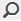

# 管理集合 {#managing-collections}

集合是Adobe Experience Manager Assets內的一組資產。 使用集合在使用者之間共用資產。 此集可以是靜態集合或以搜尋結果為基礎的動態集合。

與資料夾不同，集合可以包含不同位置的資產。 您可以與被指派不同權限層級的各種使用者共用集合，包括檢視、編輯等。

您可以與使用者共用多個集合。 每個集合都包含資產的參考。 資產的參考完整性會在各集合間維持。

集合的收集方式會根據資產的收集方式，分為下列類型：

* 包含資產、資料夾和其他集合之靜態參考清單的集合。
* 智慧型集合，根據搜尋條件以動態方式包含資產。

## 存取集合主控台 {#navigating-the-collections-console}

若要開啟&#x200B;**[!UICONTROL 集合]**，請點選或按一下Experience Manager標誌。 從導覽頁面，前往&#x200B;**[!UICONTROL Assets]** > **[!UICONTROL Collections]**。

## 建立集合 {#creating-a-collection}

您可以使用[靜態參考](#creating-a-collection-with-static-references)或根據[搜尋准則型篩選器](#creating-a-smart-collection)建立集合。 您也可以從燈箱建立集合。

### 使用靜態參考建立集合 {#creating-a-collection-with-static-references}

您可以建立包含靜態參照的集合，例如，包含資產、資料夾、集合、回轉集和影像集參考的集合。

1. 導覽至&#x200B;**[!UICONTROL 集合]**&#x200B;主控台。
1. 在工具列中，點選/按一下「**[!UICONTROL 建立]**」。
1. 在&#x200B;**[!UICONTROL 建立系列]**&#x200B;頁面中，輸入系列的標題和可選說明。
1. 新增成員至系列並指派適當的權限。或者，選取「 **[!UICONTROL 公用系列]** 」，讓所有使用者都能存取系列。

   >[!NOTE]
   >
   >要使成員能夠與其他用戶共用集合，請在路徑`home/users`上提供`dam-users`組讀取權限。 授予`/content/dam/collections`位置的使用者權限，讓使用者可檢視快顯清單中的集合。 或者，讓用戶成為`dam-users`組的一部分。

1. （選用）為系列新增縮圖影像。
1. 點選/按一 **[!UICONTROL 下「建立]**」，然後點選/按一 **[!UICONTROL 下「確定]** 」以關閉對話方塊。具有指定標題和屬性的系列會在「系列」主控台中開啟。

   >[!NOTE]
   >
   >Experience Manager資產可讓您建立集合的審核工作，類似於為資產資料夾建立審核工作的方式。

   若要新增資產至集合，請導覽至「資產」使用者介面。 如需詳細資訊，請參閱[將資產新增至集合](/help/assets/managing-collections-touch-ui.md#adding-assets-to-a-collection)。

### 使用放置區建立集合 {#create-collections-using-dropzone}

您可以從資產UI將資產拖曳至集合。 您也可以建立集合的復本，並將資產拖曳至該處。

1. 從「資產」UI中，選取您要新增至集合的資產。
1. 將資產拖曳至「集合」中的&#x200B;**[!UICONTROL 拖放]**&#x200B;區域。

   

   當Dropzone處於活動狀態，且其標籤更改為&#x200B;**[!UICONTROL Drop to Add]**&#x200B;時，釋放滑鼠按鈕。

   

   或者，點選/按一下工具列中的&#x200B;**[!UICONTROL 至系列]**&#x200B;圖示。

   

1. 在「新增 **[!UICONTROL 至系列」頁面中]** ，點選/按一下工具列 **[!UICONTROL 中的「建立系列]** 」圖示。

   如果您想要將資產新增至現有的系列，請從頁面中選取資產，然後點選/按一下「新 **[!UICONTROL 增]**」。依預設，會選取最近更新的系列。

1. 在「建 **[!UICONTROL 立新系列]** 」對話方塊中，指定系列的名稱。如果您希望系列可供所有使用者存取，請選取「公用 **[!UICONTROL 系列」]**。
1. 點選/按一下&#x200B;**[!UICONTROL 繼續]**&#x200B;以建立系列。

### 建立智慧型集合 {#creating-a-smart-collection}

智慧型集合會使用搜尋條件來動態填入資產。 您可以僅使用檔案而不使用資料夾或檔案和資料夾來建立智慧集合。

若要建立智慧型系列，請遵循下列步驟：

1. 導覽至「資產」使用者介面，然後點選/按一下搜尋圖示。

1. 在Omnisearch方塊中輸入搜尋關鍵字，然後按Enter。 開啟「篩選」面板並套用搜尋篩選。

1. 從&#x200B;**[!UICONTROL 檔案和資料夾]**&#x200B;清單中，選擇&#x200B;**[!UICONTROL 檔案]**。

   

1. 點選/按一下&#x200B;**[!UICONTROL 儲存智慧型集合]**。
1. 指定集合的名稱。 選取&#x200B;**[!UICONTROL Public]** ，將具有檢視器角色的DAM使用者群組新增至智慧型集合。

   

   >[!NOTE]
   >
   >如果選擇&#x200B;**[!UICONTROL Public]**，則建立後具有所有者角色的每個人都可以使用智慧集合。 如果您取消選取&#x200B;**[!UICONTROL Public]**&#x200B;選項，DAM使用者群組將不再與智慧型集合相關聯。

1. 點選/按一 **[!UICONTROL 下「儲存]** 」以建立智慧型系列，然後關閉訊息方塊以完成程式。

   新的智慧型系列也會新增至「已儲存的搜尋」]**清單。**[!UICONTROL 

   

   「建立智慧選 **[!UICONTROL 擇」按鈕的標籤將更改為]** 「編 **[!UICONTROL 輯智慧選擇」]**。要編輯智慧系列的設定，請從「檔案和文 **[!UICONTROL 件夾]** 」列 **[!UICONTROL 表中選擇「檔案]** 」。然後，點選/按一下「編 **[!UICONTROL 輯智慧型選取]** 」按鈕。

   

## 新增資產至集合 {#adding-assets-to-a-collection}

您可以新增資產至包含參考資產或資料夾清單的集合。 智慧型集合會使用搜尋查詢來填入資產。 因此，資產和資料夾的靜態參考不適用。

1. 在「資產」使用者介面中，選取資產，然後點選/按一下工具列中的&#x200B;**[!UICONTROL 至集合]**&#x200B;圖示。

   

   或者，您也可以將資產拖曳至介面上的&#x200B;**[!UICONTROL 拖放集合]**&#x200B;區域。 當地區的標籤變更為&#x200B;**[!UICONTROL 拖放至新增]**&#x200B;時，新增資產。

1. 在&#x200B;**[!UICONTROL 新增至集合]**&#x200B;頁面中，選取您要新增資產的集合。

1. 點選/按一下&#x200B;**[!UICONTROL 新增]**，然後關閉確認訊息。 資產會新增至集合。

## 編輯智慧型集合 {#editing-a-smart-collection}

智慧型集合是透過儲存搜尋來建立，因此您可以修改[已儲存搜尋](#editing-saved-searches)的搜尋參數來變更其內容。

1. 在「資產」使用者介面中，點選/按一下工具列中的搜尋圖示。

   

1. 在Omnisearch框中使用游標，按Return鍵。

1. 點選/按一下「全域導覽」圖示，以顯示「篩選器」面板。

1. 從「保 **[!UICONTROL 存的搜索]** 」清單中，選擇要修改的智慧系列。「搜尋」面板會顯示為儲存的搜尋設定的篩選器。

   

1. 從&#x200B;**[!UICONTROL 檔案和資料夾]**&#x200B;清單中，選擇&#x200B;**[!UICONTROL 檔案]**。

1. 視需要修改一或多個篩選器。 點選/按一下&#x200B;**[!UICONTROL 編輯智慧型集合]**。

   您也可以編輯智慧型系列的名稱。

   

1. 點選/按一下&#x200B;**[!UICONTROL 儲存]**。 此時將顯示「編輯智慧集合&#x200B;]**」對話框。**[!UICONTROL 

1. 點選/按一下「**[!UICONTROL 覆寫]**」 ，將原始智慧型系列取代為已編輯的系列。 或者，選取&#x200B;**[!UICONTROL 另存新檔]**&#x200B;以個別儲存已編輯的集合。

1. 在確認對話方塊中，點選/按一下&#x200B;**[!UICONTROL 儲存]**&#x200B;以完成程式。

## 檢視及編輯系列中繼資料 {#viewing-and-editing-collection-metadata}

集合中繼資料包含關於集合的資料，包括所新增的任何標籤。

1. 從「系列」主控台，選取系列，然後點選/按一下工具列中的「屬性&#x200B;**** 」圖示。
1. 在「系列 **[!UICONTROL 中繼資料]** 」頁面中，從「基本」和「進階」標籤檢視系 **[!UICONTROL 列中繼資]** 料 **** 。
1. 視需要修改中繼資料，然後從工具列點選/按一下「儲存並關閉&#x200B;]**」以儲存變更。**[!UICONTROL 

### 大量編輯多個集合的中繼資料 {#editing-collection-metadata-in-bulk}

您可以同時編輯多個集合的中繼資料。 此功能可協助您快速復寫多個集合中的通用中繼資料。

1. 在「集合」控制台中，選擇要編輯元資料的兩個或多個集合。
1. 在工具列中，點選/按一下「屬性」****。
1. 在「系 **[!UICONTROL 列中繼資料]** 」頁面中，視需要編輯「基本」和「進階」標籤下的中繼資料 ******** 。
1. 若要檢視特定系列的中繼資料屬性，請取消選取系列清單中剩餘的系列。 中繼資料編輯器欄位會填入特定集合的中繼資料。

   >[!NOTE]
   >
   >* 在集合屬性頁面中，您可以取消選取集合，從集合清單中移除集合。 集合清單預設會選取所有集合。 您移除之集合的中繼資料不會更新。
   >* 在清單頂端，選取&#x200B;**[!UICONTROL Title]**&#x200B;附近的核取方塊，以在選取集合和清除清單之間切換。

1. 從工具列點選/按一下&#x200B;**[!UICONTROL 儲存並關閉]**，然後關閉確認對話方塊以完成程式。
1. 要將新元資料與現有元資料一起附加，請選擇&#x200B;**[!UICONTROL Append mode]**。 如果您未選取此選項，新的中繼資料會取代欄位中現有的中繼資料。點選/按一 **[!UICONTROL 下提交]**。

   >[!NOTE]
   >
   >您為所選集合新增的中繼資料會覆寫這些集合的先前中繼資料。 使用[!UICONTROL 附加模式]在可包含多個值的欄位中，將新值新增至現有中繼資料。 一律會覆寫單值欄位。 您在[!UICONTROL 標籤]欄位中新增的任何標籤，都會附加至中繼資料中的現有標籤清單。

要自定義元資料[!UICONTROL 屬性]頁，包括添加、修改、刪除元資料屬性，請使用架構編輯器。

>[!TIP]
>
>大量編輯方法適用於集合中的可用資產。 對於可跨資料夾使用或符合通用條件的資產，可以在搜尋這些資產後大量更新中繼資料。

## 搜尋集合 {#searching-collections}

您可以從集合控制台搜尋集合。 當您在Omnisearch方塊中搜尋關鍵字時，[!DNL Experience Manager]資產會搜尋集合名稱、中繼資料，以及新增至集合的標籤。

如果您從頂層搜尋集合，則搜尋結果中只會傳回個別的集合。 集合內的資產或資料夾會遭排除。 在所有其他情況下（例如在個別集合或資料夾階層中），會傳回所有相關資產、資料夾和集合。

## 在集合內搜尋 {#searching-within-collections}

在「系列」主控台中，點選/按一下系列以開啟它。

在系列中，搜尋會限制為您檢視之系列中的資產（及其標籤和中繼資料）。 在資料夾內搜尋時，會傳回目前資料夾內所有相符的資產和子資料夾。 在集合內搜尋時，系統只會傳回相符的資產、資料夾和其他集合，這些集合是集合的直接成員。

## 編輯集合設定 {#editing-collection-settings}

您可以編輯系列設定，例如標題和說明，或將成員新增至系列。

1. 選取集合，然後點選/按一下工具列中的&#x200B;**[!UICONTROL 設定]**&#x200B;圖示。 或者，從集合縮圖使用&#x200B;**[!UICONTROL Settings]**&#x200B;快速操作。
1. 修改「系列設定」頁面中 **[!UICONTROL 的系列設定]** 。例如，修改系列標題、說明、成員和權限，如[新增系列](#creating-a-collection)中所述。

1. 若要儲存變更，請點選/按一下「**[!UICONTROL 儲存]**」。

## 刪除集合 {#deleting-a-collection}

1. 從「系列」主控台中，選取一或多個系列，然後點選/按一下工具列中的刪除圖示。

1. 在對話方塊中，點選/按一下&#x200B;**[!UICONTROL Delete]**&#x200B;以確認刪除動作。

   >[!NOTE]
   >
   >您也可以透過[刪除已儲存的搜尋](#deleting-saved-searches)刪除智慧型集合。

## 下載集合 {#downloading-a-collection}

下載集合時，會下載集合內的整個資產階層，包括資料夾和子集合。

1. 從「系列」控制台中，選擇要下載的一個或多個系列。
1. 從工具列中，點選/按一下下載圖示。
1. 在&#x200B;**[!UICONTROL 下載]**&#x200B;對話方塊中，點選/按一下&#x200B;**[!UICONTROL 下載]**。 如果您想要下載系列內資產的轉譯，請選取「**[!UICONTROL 轉譯]**」。 選取&#x200B;**[!UICONTROL Email]**&#x200B;選項，以傳送電子郵件通知給集合的擁有者。

   當您選取要下載的集合時，會下載集合下的完整資料夾階層。 若要將您下載的每個系列（包括父系列下巢狀的子系列中的資產）包含在個別資料夾中，請選取「為每個資產建立個別資料夾」 ****。

## 建立巢狀集合 {#creating-nested-collections}

您可以將集合新增至其他集合，借此建立巢狀集合。

1. 從「系列」主控台，選取所需的系列或系列群組，然後點選或按一下工具列中的「至系列」**[!UICONTROL 圖示。]**

   

1. 從&#x200B;**[!UICONTROL 新增至系列]**&#x200B;頁面中，選取要新增系列的系列。

   >[!NOTE]
   >
   >預設會在&#x200B;**[!UICONTROL 新增至系列]**&#x200B;頁面中選取最近更新的系列。

1. 點選/按一下&#x200B;**[!UICONTROL 新增]**。 訊息會確認集合已新增至&#x200B;**[!UICONTROL Select Destination]**&#x200B;頁面中的目標集合。 關閉訊息以完成程式。

>[!NOTE]
>
>智慧型集合無法巢狀。 換言之，智慧型集合不能包含任何其他集合。

## 已儲存的搜尋 {#saved-searches}

在「資產」使用者介面中，您可以根據特定規則、搜尋准則或自訂搜尋刻面來搜尋或篩選資產。如果您將這些項目儲存為「 **[!UICONTROL 已儲存的搜尋]**」，您稍後可從「篩選」面板的「已儲存的搜尋 **** 」清單中存取。建立儲存的搜尋也會建立智慧型系列。

### 建立已儲存的搜尋 {#creating-saved-searches}

儲存的搜尋會在您建立智慧型系列時建立。智慧型系列會自動新增至「已儲 **[!UICONTROL 存的搜尋]** 」清單。集合的「已保存的搜索」查詢將保存在`dam:query`相對位置`/content/dam/collections/`的crxde的屬性中。 您可以儲存的搜尋沒有限制，而清單中顯示的已儲存搜尋也沒有限制。

>[!NOTE]
>
>您可以以共用靜態集合的相同方式共用智慧型集合。

### 編輯保存的搜索 {#editing-saved-searches}

編輯已儲存的搜尋與編輯智慧型集合相同。 如需詳細資訊，請參閱[編輯智慧型集合](/help/assets/managing-collections-touch-ui.md#editing-a-smart-collection)。

### 刪除保存的搜索 {#deleting-saved-searches}

1. 在「資產」使用者介面中，點選/按一下工具列中的搜尋圖示。

   

1. 在Omnisearch欄位中使用游標，按Enter鍵。

1. 按一下或點選「全域導覽」圖示，以顯示「篩選器」面板。

1. 從&#x200B;**[!UICONTROL 儲存的搜尋]**&#x200B;清單中，點選/按一下您要刪除的智慧型系列旁的刪除圖示。

   

1. 在對話方塊中，點選/按一下&#x200B;**[!UICONTROL Delete]**&#x200B;以刪除儲存的搜尋。

## 對集合執行工作流程 {#running-a-workflow-on-a-collection}

您可以為集合內的資產執行工作流程。 如果集合包含巢狀集合，工作流程也會在巢狀集合內的資產上執行。 不過，如果集合和巢狀集合包含重複資產，工作流程只會針對這些資產執行一次。

1. 從「集合」控制台中，選擇要對其運行工作流的集合。
1. 點選/按一下GlobalNav圖示，然後從清單中選擇&#x200B;**[!UICONTROL 時間軸]**。
1. 在時間軸中，按一下或點選底部的脫字元號圖示，然後點選/按一下「開始工 **[!UICONTROL 作流程」]**。

   

1. 在「開 **[!UICONTROL 始工作流]** 」部分，從清單中選擇工作流模型。例如，選取「 **[!UICONTROL DAM更新資產」模型]** 。
1. 輸入工作流程的標題，然後點選/按一下「**[!UICONTROL 開始]**」。
1. 在對話方塊中，點選/按一下&#x200B;**[!UICONTROL 繼續]**。 工作流程會在集合中的所有資產上執行。

>[!MORELIKETHIS]
>
>* [設定Experience Manager資產電子郵件通知](/help/sites-administering/notification.md#assetsconfig)
>* [為集合建立審核任務](bulk-approval.md)

