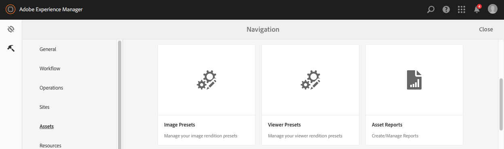
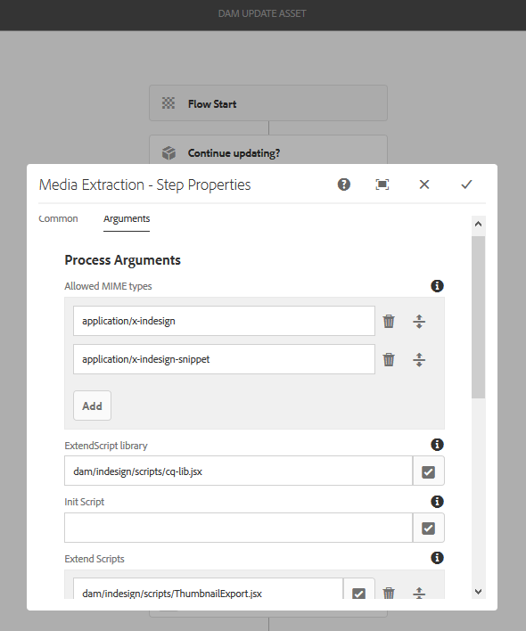

# 管理Dynamic Media影像預設集 {#managing-image-presets}

>[!CAUTION]
>
>AEM 6.4已結束延伸支援，本檔案不再更新。 如需詳細資訊，請參閱 [技術支援期](https://helpx.adobe.com//tw/support/programs/eol-matrix.html). 尋找支援的版本 [此處](https://experienceleague.adobe.com/docs/).

影像預設集可讓AEM Assets以不同大小、不同格式，或以動態產生的其他影像屬性來動態傳送影像。 每個影像預設集代表用於顯示影像的大小調整和格式設定命令的預定義集合。 建立影像預設集時，您會選擇影像傳送的大小。 您也可以選擇格式設定命令，以便在傳送影像以供查看時優化影像的外觀。

管理員可以建立匯出資產的預設集。 用戶在導出影像時可以選擇預設集，這也會按照管理員指定的規範重新格式化影像。

您也可以建立回應式的影像預設集。 如果您將回應式影像預設集套用至資產，則會根據所檢視的裝置或螢幕大小而變更。 除了「RGB」或「灰色」外，您還可以配置影像預設集以在顏色空間中使用CMYK。

本節說明如何建立、修改和一般管理影像預設集。 您可以隨時預覽影像，將影像預設集套用至影像。 請參閱 [套用影像預設集](image-presets.md).

>[!NOTE]
>
>智慧型影像處理可與您現有的影像預設集搭配使用，並會在傳送時的最後毫秒內運用智慧，根據瀏覽器或網路連線速度進一步縮小影像檔案大小。 請參閱 [智慧型影像](imaging-faq.md) 以取得更多資訊。

## 了解Dynamic Media影像預設集 {#understanding-image-presets}

像軟體宏一樣，「影像預設集」是儲存在名稱下的大小調整和格式設定命令的預定義集合。 若要了解「影像預設集」的運作方式，假設您的網站要求每個產品影像以不同大小、不同格式以及案頭和行動傳送的壓縮率顯示。

您可以建立兩個影像預設集：案頭版為500 x 500像素，行動版為150 x 150像素。 您可以建立兩個影像預設集，其中一個稱為 *放大* 以500x500像素顯示影像，並稱為 *縮圖* 以150 x 150像素顯示影像。 要以「放大」和「縮圖」大小傳送影像，AEM將查找「放大影像預設集」和「縮圖影像預設集」的定義。 然後，AEM會以每個影像預設集的大小和格式規格動態產生影像。

動態傳送時大小縮小的影像可能會失去清晰度和細節。 因此，每個影像預設集都包含格式控制項，用於在以特定大小傳送影像時對其進行最佳化。 這些控制項可確保影像在傳送至您的網站或應用程式時清晰清晰銳利。

管理員可以建立影像預設集。 若要建立影像預設集，您可以從草稿開始，也可以從現有的預設集開始，並以新名稱儲存。

## 管理Dynamic Media影像預設集 {#managing-image-presets-1}

您可以點選AEM標誌以存取全域導覽主控台，然後點選「工具」圖示並導覽至，以管理AEM中的影像預設集 **[!UICONTROL 資產>影像預設集]**.



>[!NOTE]
>
>您建立的任何影像預設集在您預覽或傳送資產時，也可以以動態轉譯的形式使用。
>
>在 *Dynamic Media - Scene7模式*, *not* 需要發佈影像預設集，因為會自動發佈影像預設集。
>
>在 *Dynamic Media — 混合模式*，您需要手動發佈影像預設集。
>
>請參閱 [發佈影像預設集。](#publishing-image-presets)

>[!NOTE]
>
>當您選取「 」時，系統會顯示各種轉譯 **[!UICONTROL 轉譯]** 在資產的 **[!UICONTROL 詳細資料]** 檢視。 您可以增加或減少顯示的影像預設集數目。 請參閱 [增加顯示的影像預設集數目](#increasing-or-decreasing-the-number-of-image-presets-that-display).

### Adobe Illustrator(AI)、Postscript(EPS)和PDF檔案格式 {#adobe-illustrator-ai-postscript-eps-and-pdf-file-formats}

如果您想要支援擷取AI、EPS和PDF檔案，以便產生這些檔案格式的動態轉譯，則在建立影像預設集之前，您可能需要檢閱下列資訊。

Adobe Illustrator的檔案格式是PDF的變體。 AEM Assets的主要差異如下：

* Adobe Illustrator檔案包含單一頁面及多個層。 每個層會擷取為主要Illustrator資產下的PNG子資產。
* PDF文檔包含一個或多個頁。 每個頁面都會擷取為主多頁PDF檔案下的單頁PDF子資產。

子資產由 `Create Sub Asset process` 整體 `DAM Update Asset` 工作流程。 若要在工作流程中查看此程式元件，請點選 **[!UICONTROL 「工具」>「工作流」>「模型」>「DAM更新資產」>「編輯」]**.

另請參閱 [檢視多頁檔案的頁面](/help/assets/managing-linked-subassets.md#view-pages-of-a-multi-page-file).

您可以在開啟資產時檢視子資產或頁面，點選「內容」功能表，然後選取 **[!UICONTROL 子資產]** 或 **[!UICONTROL 頁面]**. 子資產是真實資產。 也就是說，PDF頁面會由 `Create Sub Asset` 工作流程元件。 接著，這些資料會儲存為 `page1.pdf`, `page2.pdf`，以及主要資產下方的。 儲存後， **[!UICONTROL DAM更新資產]** 工作流程會處理它們。

若要使用Dynamic Media來預覽和產生AI、EPS或PDF檔案的動態轉譯，需要下列處理步驟：

1. 在 **[!UICONTROL DAM更新資產]** 工作流程， **[!UICONTROL 柵格化PDF/AI影像預覽轉譯]** 處理元件會使用已設定的解析度，將原始資產的第一頁柵格化為 `cqdam.preview.png` 轉譯。

1. 此 `cqdam.preview.png` 然後，將格式副本最佳化為PTIFF **[!UICONTROL Dynamic Media處理影像資產]** 工作流程中的處理元件。

>[!NOTE]
>
>在 **[!UICONTROL DAM更新資產]** 工作流程， **[!UICONTROL EPS縮圖]** step會為EPS檔案產生縮圖。

### PDF/AI/EPS資產中繼資料屬性 {#pdf-ai-eps-asset-metadata-properties}

| **中繼資料屬性** | **說明** |
|---|---|
| dam:Physicalwidthinichs | 文檔寬度（英吋）。 |
| dam：物理高度 | 文檔高度（英吋）。 |

您可以存取 **[!UICONTROL 柵格化PDF/AI影像預覽轉譯]** 流程元件選項(通過 **[!UICONTROL DAM更新資產]** 工作流程。

點選左上方的Adobe Experience Manager，導覽至 **[!UICONTROL 「工具」>「工作流」>「模型」]**. 在 **[!UICONTROL 工作流程模型]** 頁面，選取 **[!UICONTROL DAM更新資產]**，然後在工具列點選 **[!UICONTROL 編輯]**. 在 **[!UICONTROL DAM更新資產工作流程]** 頁面，按兩下 **[!UICONTROL 柵格化PDF/AI影像預覽轉譯]** 處理元件以開啟 **[!UICONTROL 步驟屬性]** 對話框。

### 柵格化PDF/AI影像預覽轉譯選項 {#rasterize-pdf-ai-image-preview-rendition-options}


**柵格化PDF或AI工作流的參數**

<table> 
 <tbody> 
  <tr> 
   <td><strong>進程參數</strong></td>
   <td><strong>預設設定</strong></td>
   <td><strong>說明</strong></td>
  </tr> 
  <tr> 
   <td>Mime 類型</td>
   <td><p>application/pdf</p> <p>application/postscript</p> <p>application/illustrator<br/> </p> </td>
   <td>被視為PDF或Illustrator文檔的文檔mime類型清單。<br/> </td>
  </tr> 
  <tr> 
   <td>寬度上限</td>
   <td>2048</td>
   <td>產生的預覽轉譯的最大寬度（像素）。<br/> </td>
  </tr> 
  <tr> 
   <td>高度上限</td>
   <td>2048</td>
   <td>產生的預覽轉譯的最大高度（像素）。<br/> </td>
  </tr> 
  <tr> 
   <td>解析度</td>
   <td>72</td>
   <td>以ppi（每英吋像素）顯示第一頁的解析度。</td>
  </tr>
 </tbody>
</table>

使用預設進程參數，PDF/AI文檔的第一頁柵格化為72 ppi，生成的預覽影像的大小為2048 x 2048像素。 對於一般部署，您可能希望將解析度提高至至少150 ppi或更高。 例如，300 ppi的美國字母大小文檔要求最大寬度和高度分別為2550 x 3300像素。

**[!UICONTROL 最大寬度]** 和 **[!UICONTROL 最大高度]** 限制光柵化的解析度。 例如，如果最大值未變更，且「解析度」設為300 ppi，則美國信函檔案的光柵化為186 ppi。 也就是說，文檔為1581 x 2046像素。

此 **[!UICONTROL 柵格化PDF/AI影像預覽轉譯]** 進程元件已定義最大值，以確保它不會在記憶體中建立過大的映像。 此類大型映像可能會使提供給JVM（Java虛擬機）的記憶體溢出。 請務必注意，為JVM提供足夠的記憶體，以管理已配置的並行工作流數，每個工作流都有可能以最大配置的大小建立映像。

### InDesign(INDD)檔案格式 {#indesign-indd-file-format}

如果要支援導入INDD檔案，以便生成此檔案格式的動態格式副本，則在建立影像預設集之前，可能需要查看以下資訊。

對於InDesign檔案，只有在Adobe InDesign伺服器與AEM整合時，才會擷取子資產。 參考的資產會根據其中繼資料進行連結。 InDesign Server不是連結的必要項目。 不過，在處理InDesign檔案之前，必須先在AEM記憶體在參照的資產，才能在InDesign檔案與參照的資產之間建立連結。

請參閱 [整合AEM Assets與InDesign Server](indesign.md).

中的媒體擷取程式元件 **[!UICONTROL DAM更新資產]** 工作流程執行數個預先設定的 **[!UICONTROL 擴充指令碼]** 處理InDesign檔案。



此 **[!UICONTROL 擴展指令碼]** 路徑 **[!UICONTROL 媒體擷取]** 處理元件 **[!UICONTROL DAM更新資產]** 工作流程。

下列指令碼供Dynamic Media整合使用：

<table> 
 <tbody> 
  <tr> 
   <td><strong>擴展指令碼名稱</strong></td>
   <td><strong>預設</strong></td>
   <td><strong>說明</strong></td>
  </tr> 
  <tr> 
   <td>ThumbnailExport.jsx</td>
   <td>是</td>
   <td>產生300 ppi <code>thumbnail.jpg</code> 最佳化的轉譯，並透過 <code>Dynamic Media Process Image Assets</code> 處理元件。<br/> </td>
  </tr> 
  <tr> 
   <td>JPEGPagesExport.jsx</td> 
   <td>是</td> 
   <td>為每個頁面產生300 ppiJPEG子資產。 JPEG子資產是儲存在InDesign資產下的實際資產。 也會經過最佳化，並由 <code>DAM Update Asset</code> 工作流程。<br/> </td>
  </tr> 
  <tr> 
   <td>PDFPagesExport.jsx</td>
   <td>否</td>
   <td>為每個頁面產生PDF子資產。 PDF子資產會依照先前所述進行處理。 由於PDF僅包含單一頁面，因此不會產生子資產。<br/> </td>
  </tr> 
 </tbody> 
</table>

## 設定影像縮圖大小 {#configuring-image-thumbnail-size}

您可以在 **[!UICONTROL DAM更新資產]** 工作流程。 工作流程中有兩個步驟可讓您設定影像資產的縮圖大小。 雖然有一個(**[!UICONTROL Dynamic Media處理影像資產]**)用於動態影像資產，而其他(**[!UICONTROL 處理縮圖]**)產生靜態縮圖，或當所有其他程式無法產生縮圖時， *both* 應具有相同的設定。

在「動 **[!UICONTROL 態媒體處理影像資產」步驟中]** ，影像伺服器會產生縮圖，此組態與套用至「處理縮圖」步驟的組態無關 **** 。透過「處理縮圖 **[!UICONTROL 」步驟產生縮圖]** ，是建立縮圖的最慢且記憶體最耗用的方式。

縮圖大小定義為下列格式： **寬度:height:中心**，例如 *80:80:false*. 寬度和高度決定縮圖的像素大小；中心值為false或true，若設為true，表示縮圖影像的大小與設定中指定的大小完全相同。 如果調整大小的影像較小，則會在縮圖中置中。

>[!NOTE]
>
>* EPS檔案的縮圖大小是在 **[!UICONTROL EPS縮圖]** 步驟，在 **[!UICONTROL 引數]** 標籤 **[!UICONTROL 縮圖]**.
>
>* 視訊的縮圖大小是在「參數」下的「 **[!UICONTROL Process]** 」 (處理) 頁籤的「 **[!UICONTROL FFmpeg縮圖]** 」步驟中設定 ****。
>


**設定縮圖大小**:

1. 點選 **[!UICONTROL 「工具」>「工作流」>「模型」>「DAM更新資產」>「編輯」]**.
1. 點選 **[!UICONTROL Dynamic Media處理影像資產]** 步驟，然後點選 **[!UICONTROL 縮圖]** 標籤。 視需要變更縮圖大小，然後點選「 **[!UICONTROL 確定]**」。

   

1. 點選「處 **[!UICONTROL 理縮圖]** 」步驟，然後點選「縮 **[!UICONTROL 圖]** 」標籤。視需要變更縮圖大小，然後點選 **[!UICONTROL 確定]**.

   >[!NOTE]
   >
   >「處理縮圖」步驟中縮圖引數中 **[!UICONTROL 的值必須與「動態媒體處理影像資產」]** 步驟中的縮圖引數相符 **** 。

1. 點選 **[!UICONTROL 儲存]** 以儲存對工作流程的變更。

### 增加或減少顯示的Dynamic Media影像預設集數目 {#increasing-or-decreasing-the-number-of-image-presets-that-display}

您建立的影像預設集在您預覽資產時可以動態轉譯。 AEM會在從 **[!UICONTROL 詳細資料檢視>轉譯]**. 您可以增加或減少顯示的轉譯限制。

**增加或減少顯示的Dynamic Media影像預設集數目**:

1. 導覽至 **[!UICONTROL CRXDE Lite]** ([http://localhost:4502/crx/de](http://localhost:4502/crx/de))。
1. 在導覽至影像預設集清單節點 `/libs/dam/gui/coral/content/commons/sidepanels/imagepresetsdetail/imgagepresetslist`

   

1. 在 **[!UICONTROL 限制]** 屬性，更改 **[!UICONTROL value]**，預設會設為15，設為所需數字。
1. 導航到以下位置的影像預設資料源： `/libs/dam/gui/coral/content/commons/sidepanels/imagepresetsdetail/imgagepresetslist/datasource`

   

1. 在limit屬性中，將數字變更為所需數字，例如 `{empty requestPathInfo.selectors[1] ? "20" : requestPathInfo.selectors[1]}`
1. 點選 **[!UICONTROL 全部儲存]**.

### 建立Dynamic Media影像預設集 {#creating-image-presets}

建立Dynamic Media影像預設集可讓您在預覽或發佈時將這些設定套用至任何影像。

>[!NOTE]
>
>如果您使用Internet Explorer 9，在儲存後建立預設集不會立即出現在預設集清單中。 若要解決此問題，請停用IE9的快取。

如果您想要支援擷取AI、PDF和EPS檔案，以便產生這些檔案格式的動態轉譯，則在建立影像預設集之前，您可能需要檢閱下列資訊。\
請參閱 [Adobe Illustrator(AI)、Postscript(EPS)和PDF檔案格式](#adobe-illustrator-ai-postscript-eps-and-pdf-file-formats).

如果要支援導入INDD檔案，以便生成此檔案格式的動態格式副本，則在建立影像預設集之前，可能需要查看以下資訊。  請參閱 [InDesign(INDD)檔案格式](#indesign-indd-file-format).

>[!NOTE]
>
>若要建立Dynamic Media影像預設集，您必須以AEM管理員或Admin Console管理員的身分擁有管理員權限。

**建立Dynamic Media影像預設集的方式**:

1. 在AEM中，點選AEM標誌以存取全域導覽主控台。
1. 點選 **[!UICONTROL 工具]** 圖示，然後導覽至 **[!UICONTROL 資產>影像預設集]**.
1. 點選 **[!UICONTROL 建立]**.

   

   >[!NOTE]
   >
   >若要讓此影像預設變得自適應，請擦除 **[!UICONTROL 寬度]****[!UICONTROL 和高度欄]** 位中的值，並保留空白。

1. 在 **[!UICONTROL 編輯影像預設集]** 頁面中輸入值 **[!UICONTROL 基本]** 和 **[!UICONTROL 進階]** 索引標籤，包括名稱。 這些選項在「影像預設 [集選項」中概述](#image-preset-options)。預設集會出現在左窗格中，並可與其他資產一起即時使用。

   

1. 按一下「**[!UICONTROL 儲存]**」。

### 建立回應式影像預設集 {#creating-a-responsive-image-preset}

若要建立回應式影像預設集，請執行 [建立影像預設集](#creating-image-presets). 在 **[!UICONTROL 編輯影像預設集]** ，請拭除值並保留空白。

將它們保留為空白會告訴AEM此影像預設集是回應式的。 您可以視需要調整其他值。


>[!NOTE]
>
>若要查看 **[!UICONTROL URL]** 和 **[!UICONTROL RESS]** 按鈕將影像預設集套用至資產時，必須發佈資產。
>
>在Dynamic Media - Scene7模式中，會自動發佈影像預設集和影像資產。
>
>在Dynamic Media — 混合模式中，您必須手動發佈影像預設集和影像資產。

### 影像預設集選項 {#image-preset-options}

建立或編輯影像預設集時，您有本節所述的選項。 此外，Adobe建議以下三項 *最佳實務* 選項可以開始：

* **[!UICONTROL 格式]** (**[!UICONTROL 基本]** 頁簽) — 選擇 **[!UICONTROL JPEG]** 或符合您要求的其他格式。 所有網頁瀏覽器都支援JPEG影像格式；它在小檔案大小和影像品質之間提供良好的平衡。但是，JPEG格式影像使用有損壓縮方案，如果壓縮設定太低，則該壓縮方案會引入不想要的影像偽影。因此，Adobe建議將壓縮品質設為75。此設定在影像品質和檔案大小之間取得良好的平衡。
* **[!UICONTROL 啟用簡單銳利化]**  — 不選擇 **[!UICONTROL 啟用簡單銳利化]** （此銳利化濾鏡提供的控制力比「銳利化遮色片」設定少）。
* **[!UICONTROL 銳利化：重新取樣模式]**  — 選擇 **[!UICONTROL Sharp2]**.

#### 基本索引標籤選項 {#basic-tab-options}

<table> 
 <tbody> 
  <tr> 
   <td><strong>欄位</strong></td>
   <td><strong>說明</strong></td>
  </tr> 
  <tr> 
   <td><strong>名稱</strong></td>
   <td>輸入不含空格的描述性名稱。在名稱中加入影像大小規格可幫助使用者識別此影像預設集。</td>
  </tr>
  <tr> 
   <td><strong>寬度和高度</strong></td>
   <td>以像素輸入影像傳送的大小。 寬度和高度必須大於0像素。 如果其中一個值為0，則不會建立任何預設集。 如果兩個值皆空白，則會建立回應式影像預設集。</td>
  </tr> 
  <tr> 
   <td><strong>格式</strong></td>
   <td><p>從功能表中選擇格式。</p> <p>選擇 <strong>JPEG</strong> 提供下列其他選項：</p>
    <ul> 
     <li><strong>品質</strong>  — 控制JPEG壓縮級別。 此設定會同時影響檔案大小和影像品質。 JPEG質量等級為1-100。 拖曳滑桿時，比例會顯示。</li> 
     <li><strong>啟用JPG色度縮減取樣</strong>  — 由於眼睛對高頻顏色資訊的敏感度比高頻亮度低，JPEG影像將影像資訊分為亮度和顏色分量。 當JPEG影像被壓縮時，亮度分量以全解析度保持，而顏色分量通過平均一組像素被縮減。 縮減取樣會將資料量減少一半或三分之一，幾乎不會影響感知的品質。 縮減採樣不適用於灰度影像。 此技術可減少對具有高對比度的影像（例如具有重疊文字的影像）有用的壓縮量。</li>
    </ul>
    <div>
      選擇
     <strong>GIF</strong> 或
     <strong>含Alpha的GIF</strong> 提供
     <strong>GIF顏色量化</strong> 選項：
    </div>
    <ul> 
     <li><strong>類型 </strong> — 選擇 <strong>適應性</strong> （預設）、 <strong>Web</strong>，或 <strong>Macintosh</strong>. 如果您選取 <strong>GIFAlpha</strong>，則「Macintosh」選項不可用。</li>
     <li><strong>Dither</strong>  — 選擇 <strong>擴散</strong> 或 <strong>關閉</strong>.</li>
     <li><strong>顏色數 </strong> — 輸入介於2和256之間的數字。</li>
     <li><strong>顏色清單</strong>  — 輸入逗號分隔清單。 例如，對於白色、灰色和黑色，請輸入000000、888888、ffffff。</li>
    </ul> 
    <div>
      選擇
     <strong>PDF</strong>,
     <strong>TIFF</strong>，或
     <strong>含Alpha的TIFF</strong> 提供此額外選項：
    </div>
    <ul>
     <li><strong>壓縮</strong>  — 選擇壓縮算法。 PDF的演算法選項為 <strong>無</strong>, <strong>郵遞區號</strong>，和 <strong>Jpeg</strong>;TIFF為 <strong>無</strong>, <strong>LZW</strong>, <strong>Jpeg</strong>，和 <strong>郵遞區號</strong>;而使用Alpha的TIFF為 <strong>無</strong>, <strong>LZW</strong>，和 <strong>郵遞區號</strong>.</li>
    </ul> <p>選擇 <strong>PNG</strong>, <strong>含Alpha的PNG、</strong> 或 <strong>EPS</strong> 不提供其他選項。</p> </td>
  </tr>
  <tr>
   <td><strong>銳利化</strong></td>
   <td>選取 <strong>啟用簡單銳利化</strong> 選項，在所有縮放發生後，將基本銳利化濾鏡應用到影像。銳利化有助於補償以不同大小顯示影像時可能產生的模糊性。 </td>
  </tr>
 </tbody>
</table>

#### 進階索引標籤選項 {#advanced-tab-options}

<table>
 <tbody>
  <tr>
   <td><strong>欄位</strong></td>
   <td><strong>說明</strong></td>
  </tr>
  <tr>
   <td><strong>色域</strong></td>
   <td>選擇 <strong>RGB, CMYK,</strong> 或 <strong>灰階</strong> 顏色空間。</td>
  </tr>
  <tr>
   <td><strong>色彩設定檔</strong></td>
   <td>如果資產與工作設定檔不同，請選取應轉換為的輸出色域設定檔。</td>
  </tr>
  <tr>
   <td><strong>渲染方法</strong></td>
   <td>您可以覆寫預設的呈現方式。 渲染意圖確定目標顏色配置檔案中無法再現的顏色（超出色域）的結果。 如果「渲染目的」與ICC配置檔案不相容，則將忽略它。
    <ul> 
     <li>選擇 <strong>知覺</strong> 當原始影像中的一個或多個顏色超出目標顏色空間的色域時，將總色域從一個顏色空間壓縮到另一個顏色空間。</li>
     <li>選擇 <strong>相對比色</strong> 當當前顏色空間中的顏色超出目標顏色空間中的色域時，您希望將其映射到目標顏色空間的色域內最接近的可能顏色，而不影響任何其他顏色。 </li>
     <li>選擇 <strong>飽和度</strong> 在轉換為目標顏色空間時重現原始影像顏色飽和度。 </li>
     <li>選擇 <strong>絕對比色</strong> 以完全匹配顏色，而不調整會改變影像亮度的白點或黑點。</li>
    </ul> </td>
  </tr>
  <tr>
   <td><strong>黑點補償</strong></td>
   <td>如果輸出配置檔案支援此功能，請選擇此選項。 如果黑點補償與指定的ICC配置檔案不相容，則會忽略它。</td>
  </tr>
  <tr>
   <td><strong>正在遞色</strong></td>
   <td>選擇此選項以可能避免或減少色帶偽影。 </td>
  </tr>
  <tr>
   <td><strong>銳利化類型</strong></td>
   <td><p>選擇 <strong>無</strong>, <strong>銳利化</strong>，或 <strong>不銳利化遮色片</strong>. </p>
    <ul>
     <li>選擇 <strong>無</strong> 停用銳利化。</li>
     <li>選擇 <strong>銳利化 </strong>以在所有縮放發生後，將基本銳利化濾鏡應用到影像。 銳利化有助於補償以不同大小顯示影像時可能產生的模糊性。 </li>
     <li>選擇<strong> 不銳利化遮色片</strong> 來微調最終縮減取樣影像的銳利化濾鏡效果。 您可以控制效果的強度、效果半徑（以像素計量），以及將忽略的對比度臨界值。 此效果使用的選項與 Photoshop的「遮色片銳利化」濾鏡相同。</li>
    </ul> <p>在 <strong>不銳利化遮色片</strong>，您有下列選項：</p>
    <ul> 
     <li><strong>金額</strong>  — 控制套用至邊緣像素的對比度量。 預設的實數值為1.0。對於高解析度影像，您可以將其增加到高達5.0。請將「量」想像為濾鏡強度的度量。</li>
     <li><strong>半徑</strong>  — 決定影響銳利化的邊緣像素周圍的像素數。 對於高解析度影像，請輸入從1到2的實數。 低值只會銳化邊緣像素；高值銳化較寬的像素帶。 正確值取決於影像的大小。</li>
     <li><strong>臨界值</strong>  — 決定套用遮色片銳利化濾鏡時要忽略的對比度範圍。 換句話說，此選項可決定銳化像素與周圍區域的差異程度，之後才會被視為邊緣像素且銳化。 為避免引入雜訊，請使用2到20之間的整數值進行實驗。 </li>
     <li><strong>套用至</strong>  — 確定未銳利化是應用於每種顏色還是亮度。</li>
    </ul>
    <div>
      銳利化在  
     <a href="https://experienceleague.adobe.com/docs/experience-manager-64/assets/sharpening_images.pdf">Adobe Dynamic Media Classic影像品質和銳利化最佳作法</a>.
    </div> </td>
  </tr>
  <tr>
   <td><strong>重新取樣模式</strong></td>
   <td>選取 <strong>重採樣模式</strong> 選項。 這些選項會在縮減取樣時銳化影像：
    <ul>
     <li><strong>雙線性</strong>  — 最快的重採樣方法。某些鋸齒偽影是可以注意到的。</li>
     <li><strong>雙立方</strong>  — 增加CPU使用量，但產生更清晰的影像，並產生較少明顯的鋸齒偽影。</li>
     <li><strong>Sharp2</strong>  — 可產生比雙立方體稍銳的結果，但CPU成本更高。</li>
     <li><strong>雙銳</strong>  — 選取Photoshop預設重新取樣器以縮小影像大小，稱為 <strong>雙比克</strong> 在Adobe Photoshop。</li>
     <li><strong>每種顏色</strong> 和 <strong>亮度</strong>  — 每種方法都可依據顏色或亮度。 依預設 <strong>每種顏色</strong> 中所有規則的URL。</li>
    </ul> </td>
  </tr>
  <tr>
   <td><strong>打印解析度</strong></td>
   <td>選擇用於打印此影像的解析度；預設為72像素。</td>
  </tr>
  <tr>
   <td><strong>影像修飾元</strong></td>
   <td><p>除了UI中可用的通用影像設定，Dynamic Media還支援許多進階影像修改，您可以在 <strong>影像修飾元</strong> 欄位。 這些參數定義於 <a href="https://experienceleague.adobe.com/docs/dynamic-media-developer-resources/image-serving-api/image-serving-api/http-protocol-reference/command-reference/c-command-reference.html">映像伺服器協定命令參考</a>.</p> <p>重要：不支援API中列出的下列功能：</p>
    <ul>
     <li>基本模板和文本呈現命令： <code>text= textAngle= textAttr= textFlowPath= textFlowXPath= textPath=</code> 和 <code>textPs=</code></li>
     <li>本地化命令： <code>locale=</code> 和 <code>req=xlate</code></li>
     <li><code>req=set</code> 無法用於一般用途。</li>
     <li><code>req=mbrset</code></li>
     <li><code>req=saveToFile</code></li>
     <li><code>req=targets</code></li>
     <li><code>template=</code></li>
     <li>非核心Dynamic Media服務：SVG、影像轉譯和網路印刷</li>
    </ul> </td>
  </tr>
 </tbody>
</table>

## 使用影像修飾元定義影像預設集選項 {#defining-image-preset-options-with-image-modifiers}

除了 **[!UICONTROL 基本]** 和 **[!UICONTROL 進階]** 索引標籤，您可以在定義影像預設集時定義影像修飾元，以提供更多選項。 影像轉譯仰賴Dynamic Media影像轉譯API。 API在 [HTTP通訊協定參考](https://experienceleague.adobe.com/docs/dynamic-media-developer-resources/image-serving-api/image-serving-api/http-protocol-reference/c-http-protocol-reference.html).

以下是一些您可以使用影像修飾元的基本範例。

>[!NOTE]
>
>一些影像修飾元 [無法在AEM中使用](#advanced-tab-options).

* [op_invert](https://experienceleague.adobe.com/docs/dynamic-media-developer-resources/image-serving-api/image-serving-api/http-protocol-reference/command-reference/r-op-invert.html)  — 反轉負影像效果的每個顏色分量。

   ```xml
   &op_invert=1
   ```

   

* [op_blur](https://experienceleague.adobe.com/docs/dynamic-media-developer-resources/image-serving-api/image-serving-api/http-protocol-reference/command-reference/r-op-blur.html)  — 對影像應用模糊濾鏡。

   ```xml
   &op_blur=25
   ```

   

* 組合命令 — op_blur和op-invert

   ```xml
   &op_invert=1&op_blur=25
   ```

   

* [op_brightness](https://experienceleague.adobe.com/docs/dynamic-media-developer-resources/image-serving-api/image-serving-api/http-protocol-reference/command-reference/r-op-brightness.html)  — 降低或增加亮度。

   ```xml
   &op_brightness=75
   ```

   

* [opac](https://experienceleague.adobe.com/docs/dynamic-media-developer-resources/image-serving-api/image-serving-api/http-protocol-reference/command-reference/r-opac.html)  — 調整影像不透明度。 可讓您降低前景不透明度。

   ```xml
   opac=50
   ```

   

## 編輯影像預設集 {#modifying-image-presets}

**要編輯影像預設集**:

1. 在AEM中，點選AEM標誌以存取全域導覽主控台。
1. 點選 **[!UICONTROL 工具]** 圖示，然後導覽至 **[!UICONTROL 資產>影像預設集]**.

   

1. 選取預設集，然後點選 **[!UICONTROL 編輯]**.
1. 在 **[!UICONTROL 編輯影像預設集]** 頁面，進行您想要的變更，然後點選 **[!UICONTROL 儲存]**.

## 發佈Dynamic Media影像預設集 {#publishing-image-presets}

如果您執行的是Dynamic Media — 混合模式，您必須手動發佈影像預設集。

如果您執行的是Dynamic Media - Scene7模式，則會自動發佈影像預設集；您不需要完成這些步驟。

**若要在Dynamic Media — 混合模式中發佈影像預設集**:

1. 在AEM中，點選AEM標誌以存取全域導覽主控台。
1. 點選 **[!UICONTROL 工具]** 圖示，然後導覽至 **[!UICONTROL 資產>影像預設集]**.
1. 從影像預設集清單中選取影像預設集或多個影像預設集，然後點選 **[!UICONTROL 發佈]**.
1. 影像預設集發佈後，狀態會從未發佈變更為已發佈。

   

## 刪除Dynamic Media影像預設集 {#deleting-image-presets}

1. 在AEM中，點選AEM標誌以存取全域導覽主控台。
1. 點選 **[!UICONTROL 工具]** 圖示，然後導覽至 **[!UICONTROL 資產>影像預設集]**.
1. 選取預設集，然後點選 **[!UICONTROL 刪除]**. Dynamic Media會確認您要刪除它。 點選 **[!UICONTROL 刪除]**.
