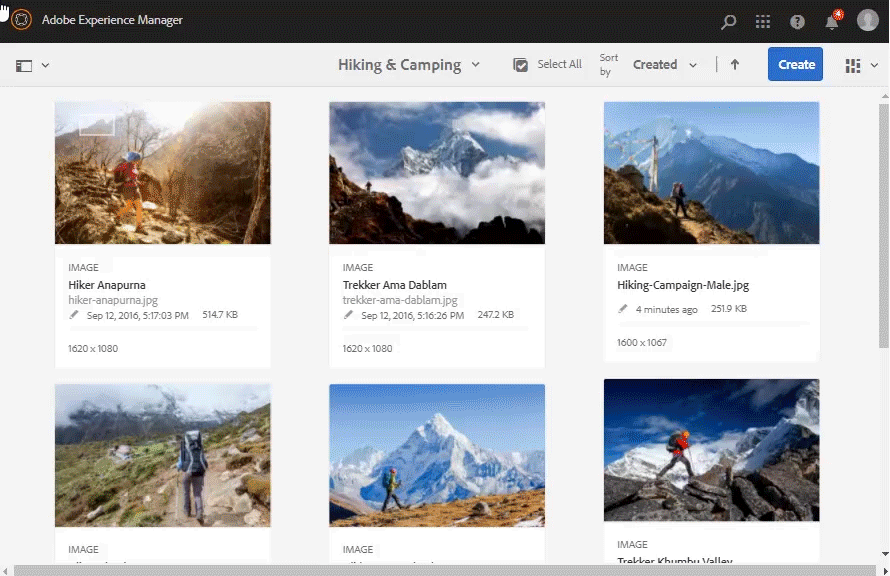

# 管理多個資產和集合 {#managing-multiple-assets-and-collections}

>[!CAUTION]
>
>AEM 6.4已結束延伸支援，本檔案不再更新。 如需詳細資訊，請參閱 [技術支援期](https://helpx.adobe.com//tw/support/programs/eol-matrix.html). 尋找支援的版本 [此處](https://experienceleague.adobe.com/docs/).

了解如何同時編輯多個資產和集合的中繼資料，以快速傳播常見的中繼資料變更。

AdobeEnterprise Manager Assets可讓您同時編輯多個資產的中繼資料，以便快速將通用中繼資料變更大量傳播至資產。 您也可以大量編輯多個集合的中繼資料。

使用「屬性」頁面，對多個資產或集合執行中繼資料變更：

* 將中繼資料屬性變更為公用值
* 新增或修改標籤

要自定義元資料屬性頁，包括添加、修改、刪除元資料屬性，請使用結構編輯器。

>[!NOTE]
>
>大量編輯方法適用於資料夾或集合中的可用資產。 對於可跨資料夾使用或符合通用條件的資產，可以從資產搜尋結果大量更新中繼資料。

## 編輯多個資產的中繼資料屬性 {#editing-metadata-properties-of-multiple-assets}

1. 在「資產」使用者介面中，導覽至您要編輯之資產的位置。
1. 選取您要編輯公用屬性的資產。
1. 在工具列中，按一下 **[!UICONTROL 屬性]** 開啟所選資產的屬性頁面。
1. 修改各種標籤下所選資產的中繼資料屬性。
1. 若要檢視特定資產的中繼資料，請取消在清單中選取剩餘資產。 如果您取消在 [!UICONTROL 屬性] 頁面中，不會更新這些資產的中繼資料。
1. 若要為資產選取不同的中繼資料結構，請按一下 **[!UICONTROL 設定]** 從工具欄中，選擇方案。 按一下&#x200B;**[!UICONTROL 「儲存並關閉」]**。
1. 若要在包含多個值的欄位中，將新中繼資料與現有中繼資料一起附加，請選取「附 **[!UICONTROL 加模式」]**。如果您未選取此選項，新的中繼資料會取代欄位中現有的中繼資料。按一下 **[!UICONTROL 提交]**.

>[!CAUTION]
>
>對於單值欄位，即使您選擇「附加模式」，新元資料也不會附加到欄位中的現 **[!UICONTROL 有值]**。

## 配置批量元資料更新的限制 {#configure-limit-for-bulk-metadata-update}

為了防止DOS之類的情況， [!DNL Experience Manager] 限制Sling要求中支援的參數數量。 一次更新多個資產的中繼資料時，您可能會達到上限，且不會針對更多資產更新中繼資料。 [!DNL Experience Manager] 在記錄中產生下列警告：

`org.apache.sling.engine.impl.parameters.Util Too many name/value pairs, stopped processing after 10000 entries`

要更改限制，請訪問 **[!UICONTROL 「工具」>「操作」>「Web控制台」]** 並變更 [!UICONTROL 最大POST參數] in [!UICONTROL Apache Sling要求參數處理] OSGi配置。

>[!MORELIKETHIS]
>
>* [大量編輯多個集合的中繼資料](managing-collections-touch-ui.md#editing-collection-metadata-in-bulk)

