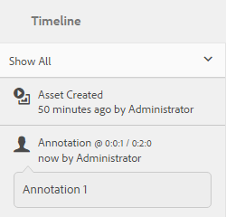

# 管理影片資產 {#managing-video-assets}

瞭解如何在Adobe Experience Manager(AEM)Assets中管理和編輯視訊資產。 此外，如果您有使用動態媒體的授權，請參閱[動態媒體視訊檔案](video.md)。

## 上傳和預覽視訊資產{#uploading-and-previewing-video-assets}

AEM Assets會使用副檔名MP4產生視訊資產的預覽。 如果資產的格式不是MP4，請安裝FFmpeg套件以產生預覽。 Fmpeg會建立OGG和MP4類型的視訊轉譯。 您可以在AEM Assets使用者介面中預覽這些轉譯。

1. 在「數位資產」檔案夾或子檔案夾中，導覽至您要新增數位資產的位置。
1. 若要上傳資產，請按一下或點選工具列中的「建立&#x200B;**[!UICONTROL 」，然後選擇「檔案**[!UICONTROL  a3/>」。 ]**]**&#x200B;或者，直接將它拖曳至資產區域。 如需有關上傳作業的詳細資訊，請參閱[上傳資產](managing-assets-touch-ui.md#uploading-assets)。
1. 若要在「卡片」檢視中預覽影片，請點選影片資產上的&#x200B;**[!UICONTROL 播放]**&#x200B;按鈕。

   

   您只能在&#x200B;**[!UICONTROL Card]**&#x200B;檢視中暫停或播放視訊。 在&#x200B;**[!UICONTROL List]**&#x200B;檢視中，「播放／暫停」按鈕不可用。

1. 點選卡片上的&#x200B;**[!UICONTROL 編輯]**&#x200B;圖示，在&#x200B;**[!UICONTROL 詳細資料]**&#x200B;檢視中預覽視訊。

   視訊會在瀏覽器的原生視訊播放器中播放。 您可以播放、暫停、控制音量，以及將視訊縮放至全螢幕。

   

## 上傳大於2 GB {#configuration-to-upload-video-assets-that-are-larger-than-gb}的資產的設定

依預設，AEM資產不會讓您上傳任何大於2 GB的資產，因為檔案大小限制。 但是，您可以轉到CRXDE Lite並在`/apps`目錄下建立節點，以覆蓋此限制。 節點必須具有相同的節點名稱、目錄結構和可比的節點順序屬性。

除了AEM Assets組態外，請變更下列組態以上傳大型資產：

* 增加代號過期時間。 請參閱Web Console中`https://[aem_server]:[port]/system/console/configMgr`的[!UICONTROL Adobe Granite CSRF Servlet]。 如需詳細資訊，請參閱[CSRF保護](/help/sites-developing/csrf-protection.md)。
* 在Dispatcher配置中增加`receiveTimeout`。 如需詳細資訊，請參閱[Experience Manager Dispatcher configuration](https://docs.adobe.com/content/help/en/experience-manager-dispatcher/using/configuring/dispatcher-configuration.html#renders-options)。

>[!NOTE]
>
>AEM Classic使用者介面沒有2GB檔案大小限制。 此外，大型視訊的端對端工作流程也未完全受支援。

要配置較高的檔案大小限制，請在`/apps`目錄中執行以下步驟。

1. 在 AEM 中，點選&#x200B;**[!UICONTROL 「工具」>「一般」>「CRXDE Lite」]**。
1. 在&#x200B;**[!UICONTROL CRXDE Lite]**&#x200B;頁面中，在左側的目錄窗口中，導航至`/libs/dam/gui/content/assets/jcr:content/actions/secondary/create/items/fileupload`。 要查看目錄窗口，請按一下`>>`表徵圖。
1. 在工具列中，點選「覆蓋節點」。 ]****[!UICONTROL &#x200B;或者，從上 **[!UICONTROL 下文選單選取]** 「覆蓋節點」。
1. 在「覆蓋 **[!UICONTROL 節點」對話方]** ，點選「 **[!UICONTROL 確定」]**。

   

1. 重新整理瀏覽器。 已選取覆蓋節點`/apps/dam/gui/content/assets/jcr:content/actions/secondary/create/items/fileupload`。
1. 在&#x200B;**[!UICONTROL Properties]**&#x200B;標籤中，以位元組為單位輸入適當的值，以將大小限制增大到所需的大小。 例如，輸入`32212254720`值，將大小限制提高到30 GB。

1. 從工具列中，點選「全部儲存」。]****[!UICONTROL 
1. 在AEM中，點選「 **[!UICONTROL 工具 > 作業 > Web Console]**」。
1. 在&#x200B;**[!UICONTROL Adobe Experience Manager Web Console Bundles]**&#x200B;頁面的表格&#x200B;**[!UICONTROL Name]**&#x200B;欄下，找到並點選&#x200B;**[!UICONTROL Adobe Granite Workflow External Process Job Handler]**。
1. 在&#x200B;**[!UICONTROL Adobe Granite Workflow External Process Job Handler]**&#x200B;頁面中，將&#x200B;**[!UICONTROL Default Timeout]**&#x200B;和&#x200B;**[!UICONTROL Max Timeout]**&#x200B;欄位的秒數設為`18000`（5小時）。
1. 點選&#x200B;**[!UICONTROL Save]**。
1. 在AEM中，點選「**[!UICONTROL 工具>工作流程>模型]**」。
1. 在&#x200B;**[!UICONTROL 工作流程模型]**&#x200B;頁面上，選擇&#x200B;**[!UICONTROL 動態媒體編碼視訊]**，然後點選&#x200B;**[!UICONTROL 編輯]**。
1. 在&#x200B;**[!UICONTROL Workflow]**&#x200B;頁面上，點選兩下&#x200B;**[!UICONTROL Dynamic Media Video Service Process]**&#x200B;元件。
1. 在「步 **[!UICONTROL 驟屬性]** 」對話框的「常用」頁籤下，展開「 **[!UICONTROL 高級設定」]******。
1. 在「逾 **[!UICONTROL 時]** 」欄位中，指定值 `18000`，然後點選「確定」以返回「動態媒體編碼 ******** 視訊」工作流程頁面。
1. 在頁面頂端的&#x200B;**[!UICONTROL 動態媒體編碼視訊]**&#x200B;頁面標題下方，點選&#x200B;**[!UICONTROL 儲存]**。

## 發佈視訊資產{#publishing-video-assets}

發佈視訊資產後，您就可透過URL或內嵌在網頁上，將其加入網頁。 請參閱[發佈資產](publishing-dynamicmedia-assets.md)。

## 註解視訊資產{#annotating-video-assets}

1. 在「資產」主控台中，點選資產資訊卡上的&#x200B;**[!UICONTROL 編輯]**&#x200B;圖示以顯示資產詳細資訊頁面。
1. 點選&#x200B;**[!UICONTROL 預覽]**&#x200B;圖示以播放影片。
1. 若要註解視訊，請點選&#x200B;**[!UICONTROL Annotate]**&#x200B;按鈕。 在視訊中的特定時點（畫格）加入註解。

   在加上註解時，您可以在畫布上繪圖，並在繪圖中加入註解。 注釋會自動儲存在Adobe Experience Manager Assets中。

   

   要退出注釋嚮導，請按一下&#x200B;**[!UICONTROL 關閉]**。

1. 若要跳至視訊中的特定點，請在文字欄位中指定時間（以秒為單位），然後按一下「跳至&#x200B;****」。 例如，若要略過前20秒的視訊，請在文字欄位中輸入`20`。

   

1. 按一下注釋可在時間軸中查看。 點選「**[!UICONTROL 刪除]**」，從時間軸移除註解。

   
