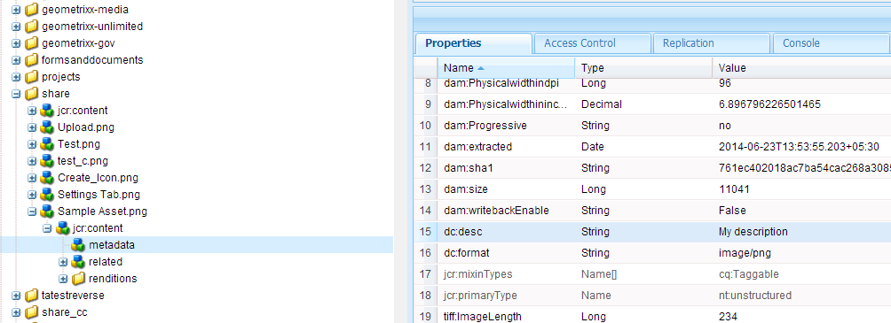

# 中繼資料設定檔 {#metadata-profiles}

中繼資料設定檔可讓您將預設中繼資料套用至資料夾中的資產。 建立中繼資料描述檔並將其套用至資料夾。 您隨後上傳至資料夾的任何資產都會繼承您在中繼資料描述檔中設定的預設中繼資料。

## 新增中繼資料設定檔{#adding-a-metadata-profile}

1. 點選或按一下AEM標誌，並導覽至「**[!UICONTROL 工具>資產>中繼資料描述檔]**」，然後點選「**[!UICONTROL 建立]**」。
1. 輸入中繼資料描述檔的標題，例如範例中繼資料，然後按一下「提交&#x200B;****」。 此時將顯示元資料配置檔案的&#x200B;**[!UICONTROL 編輯表單]**。

   

1. 按一下元件，並在&#x200B;**[!UICONTROL Settings]**&#x200B;標籤中設定其屬性。 例如，按一下&#x200B;**[!UICONTROL Description]**&#x200B;元件並編輯其屬性。

   

   編輯&#x200B;**[!UICONTROL Description]**&#x200B;元件的以下屬性：

   * **[!UICONTROL 欄位標籤]**:中繼資料屬性的顯示名稱。僅供使用者參考。
   * **[!UICONTROL 對應至屬性]**:此屬性的值為資產節點提供了相對路徑／名稱，該資產節點保存在儲存庫中。值應始終以`./`開頭，因為它表示路徑位於資產節點下。

   

   您為&#x200B;**[!UICONTROL 映射至屬性]**&#x200B;指定的值會儲存為資產中繼資料節點下的屬性。 例如，如果您指定。`/jcr:content/metadata/dc:desc` AEM Assets會將值儲 **[!UICONTROL 存在資產的中繼資]** `dc:desc` 料節點上，作為Map to property的名稱。

   * **[!UICONTROL 預設值]**:使用此屬性可為中繼資料元件新增預設值。例如，如果您指定「我的說明」，則此值會指派給資產中繼資料節點上的屬性`dc:desc`。

   

   >[!NOTE]
   >
   >新增預設值至新的中繼資料屬性(在中已不存在。 `/jcr:content/metadata` node)預設不會在資產的「屬性」頁面上顯示屬 **** 性及其值。要在資產的[!UICONTROL Properties]頁上查看新屬性，請修改相應的模式表單。

1. （可選）從&#x200B;**[!UICONTROL 建置表單]**&#x200B;標籤將更多元件新增至&#x200B;**[!UICONTROL 編輯表單]**，並在&#x200B;**[!UICONTROL 設定]**&#x200B;標籤中設定其屬性。 「生成表單」頁籤提供 **[!UICONTROL 以下屬性]** :

| 元件 | 屬性 |
|---|---|
| [!UICONTROL 區段標題] | 欄位標籤，  說明 |
| [!UICONTROL 單行文字] | 欄位標籤，  映射到屬性，  預設值 |
| [!UICONTROL 多值文字] | 欄位標籤，  映射到屬性，  預設值 |
| [!UICONTROL 數量] | 欄位標籤，  映射到屬性，  預設值 |
| [!UICONTROL 日期] | 欄位標籤，  映射到屬性，  預設值 |
| [!UICONTROL 標準標記] | 欄位標籤，  映射到屬性，  預設值，  說明 |

1. 按一下&#x200B;**[!UICONTROL Done]**。 元資料配置檔案被添加到&#x200B;**[!UICONTROL 元資料配置檔案]**&#x200B;頁中的配置檔案清單中。

   

## 複製元資料配置檔案{#copying-a-metadata-profile}

1. 從&#x200B;**[!UICONTROL 中繼資料描述檔]**&#x200B;頁面中，選取要複製的描述檔。

   

1. 按一下工具欄中的&#x200B;**[!UICONTROL Copy]**。
1. 在&#x200B;**[!UICONTROL 複製元資料配置檔案]**&#x200B;對話框中，輸入配置檔案新副本的標題。
1. 按一下&#x200B;**[!UICONTROL Copy]**。 配置檔案的副本將出現在&#x200B;**[!UICONTROL 元資料配置檔案]**&#x200B;頁的配置檔案清單中。

   

## 刪除元資料配置檔案{#deleting-a-metadata-profile}

1. 從&#x200B;**[!UICONTROL 中繼資料描述檔]**&#x200B;頁面中，選取要刪除的描述檔。

   

1. 按一下工具欄中的&#x200B;**[!UICONTROL 刪除元資料配置檔案]**。
1. 在對話框中，按一下&#x200B;**[!UICONTROL Delete]**&#x200B;以確認刪除操作。 元資料配置檔案將從清單中刪除。

## 將元資料配置檔案應用於資料夾{#applying-a-metadata-profile-to-folders}

將元資料配置檔案分配給資料夾時，任何子資料夾都會自動從其父資料夾繼承該配置檔案。 這表示您只能將一個中繼資料描述檔指派給資料夾。 因此，請仔細考慮您上傳、儲存、使用和封存資產的檔案夾結構。

如果您指派不同的中繼資料描述檔給資料夾，新的描述檔會覆寫先前的描述檔。 舊有的資料夾資產仍維持不變。 新的描述檔會套用至稍後新增至資料夾的資產。

在用戶介面中，配置有配置檔案的資料夾將通過卡名稱中顯示的配置檔案名稱來指示。

您可以將中繼資料設定檔套用至特定資料夾，或全域套用至所有資產。

### 將元資料配置檔案應用於特定資料夾{#applying-metadata-profiles-to-specific-folders}

您可以從「工具」菜單或者在資料夾內的「屬性」中，將元資料配置檔案應 **[!UICONTROL 用到資料夾]******。本節說明如何以兩種方式將中繼資料描述檔套用至資料夾。

已為其分配配置檔案的資料夾將通過資料夾名稱正下方的配置檔案名稱顯示來指示。

#### 從Profiles用戶介面{#applying-metadata-profiles-to-folders-from-profiles-user-interface}將元資料配置檔案應用到資料夾

1. 點選AEM標誌並導覽至「**[!UICONTROL 工具>資產>中繼資料描述檔]**」。
1. 選擇要應用於資料夾或多個資料夾的元資料配置檔案。

   

1. 點選「**[!UICONTROL 將中繼資料描述檔套用至資料夾]**」，並選取您要用來接收新上傳資產的資料夾或多個資料夾，然後點選「完成」。 ****&#x200B;已為其分配配置檔案的資料夾將通過資料夾名稱正下方的配置檔案名稱顯示來指示。

#### 從「屬性{#applying-metadata-profiles-to-folders-from-properties}」將中繼資料描述檔套用至資料夾

1. 在左側導軌中，點選&#x200B;**[!UICONTROL Assets]**，然後導覽至您要套用中繼資料描述檔的資料夾。
1. 在資料夾上點選核取標籤以選取它，然後點選&#x200B;**[!UICONTROL 屬性]**。

1. 選擇&#x200B;**[!UICONTROL 元資料配置檔案]**&#x200B;頁籤，然後從下拉菜單中選擇配置檔案，然後按一下&#x200B;**[!UICONTROL 保存]**。

   

   已為其分配配置檔案的資料夾將通過資料夾名稱正下方的配置檔案名稱顯示來指示。

### 全域套用中繼資料設定檔{#applying-a-metadata-profile-globally}

除了將描述檔套用至檔案夾外，您也可以全域套用一個，如此任何檔案夾中上傳至AEM資產的內容都會套用選取的描述檔。 若要全域套用中繼資料設定檔，請遵循下列步驟：

1. 執行下列任一項作業：

   * 導覽至`https://[aem_server]:[port]/mnt/overlay/dam/gui/content/assets/foldersharewizard.html/content/dam`並套用適當的描述檔，然後點選或按一下「儲存&#x200B;**[!UICONTROL a2/>」。]**

      

   * 導覽至CRXDE Lite至下列節點：`/content/dam/jcr:content`。 新增屬性`metadataProfile:/etc/dam/metadata/dynamicmedia/<name_of_metadata_profile>`並點選&#x200B;**[!UICONTROL 全部儲存]**。

      

## 從資料夾{#removing-a-metadata-profile-from-folders}中刪除元資料配置檔案

從資料夾中刪除元資料配置檔案時，任何子資料夾都會自動繼承從其父資料夾中刪除配置檔案。 不過，對檔案夾中發生的檔案處理仍維持不變。

您可以從「工具」功能表內的資料夾或在資料夾內的「屬性」中移除中繼資料描述檔，或從「屬性」中移除中繼資料描述檔，或從「屬性」中移除中繼資料描述檔，或從「工具 **[!UICONTROL 」功能表]** 移除中繼資料描述檔 ****。本節將說明如何以兩種方式從資料夾中移除中繼資料描述檔。

### 通過Profiles用戶介面{#removing-metadata-profiles-from-folders-via-profiles-user-interface}從資料夾中刪除元資料配置檔案

要通過配置檔案用戶介面從資料夾中刪除元資料配置檔案，請執行以下步驟：

1. 點選AEM標誌並導覽至「**[!UICONTROL 工具>資產>中繼資料描述檔]**」。
1. 選擇要從資料夾或多個資料夾中刪除的元資料配置檔案。
1. 點選&#x200B;**[!UICONTROL 「從資料夾移除中繼資料描述檔」]**&#x200B;並選取您要用來移除描述檔的資料夾或多個資料夾，然後點選&#x200B;**[!UICONTROL Done]**。

   您可以確認中繼資料描述檔不再套用至資料夾，因為該名稱不會再顯示在資料夾名稱下方。

### 透過屬性{#removing-metadata-profiles-from-folders-via-properties}從資料夾移除中繼資料描述檔

1. 點選AEM標誌並導覽&#x200B;**[!UICONTROL Assets]**，然後導覽至您要從中移除中繼資料描述檔的檔案夾。
1. 在資料夾上點選核取標籤以選取它，然後點選&#x200B;**[!UICONTROL 屬性]**。
1. 選擇&#x200B;**[!UICONTROL 中繼資料描述檔]**&#x200B;標籤，然後從下拉式選單中選擇&#x200B;**[!UICONTROL 無]**。 點選&#x200B;**[!UICONTROL Save]**。

已為其分配配置檔案的資料夾將通過資料夾名稱正下方的配置檔案名稱顯示來指示。
