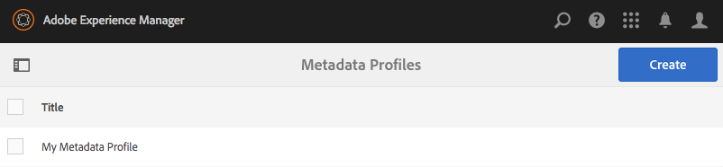
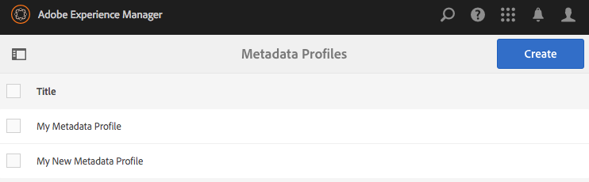

# 中繼資料設定檔 {#metadata-profiles}

>[!CAUTION]
>
>AEM 6.4已結束延伸支援，本檔案不再更新。 如需詳細資訊，請參閱 [技術支援期](https://helpx.adobe.com//tw/support/programs/eol-matrix.html). 尋找支援的版本 [此處](https://experienceleague.adobe.com/docs/).

中繼資料設定檔可讓您將預設中繼資料套用至資料夾內的資產。 建立中繼資料描述檔並將其套用至資料夾。 您隨後上傳至資料夾的任何資產都會繼承您在中繼資料設定檔中設定的預設中繼資料。

## 新增中繼資料設定檔 {#adding-a-metadata-profile}

1. 點選或按一下 [!DNL Experience Manager] 標誌和導航 **[!UICONTROL 工具>資產>中繼資料設定檔]**，然後點選 **[!UICONTROL 建立]**.
1. 輸入中繼資料描述檔的標題，例如範例中繼資料，然後按一下 **[!UICONTROL 提交]**. 此 **[!UICONTROL 編輯表單]** 中繼資料描述檔的。

   

1. 按一下元件，並在 **[!UICONTROL 設定]** 標籤。 例如，按一下 **[!UICONTROL 說明]** 元件並編輯其屬性。

   

   編輯下列屬性 **[!UICONTROL 說明]** 元件：

   * **[!UICONTROL 欄位標籤]**:中繼資料屬性的顯示名稱。 僅供使用者參考。
   * **[!UICONTROL 對應至屬性]**:此屬性的值提供儲存在儲存庫中的資產節點的相對路徑/名稱。 值應一律以開頭 `./` 因為它表示路徑位於資產的節點下。

   

   您為指定的值 **[!UICONTROL 對應至屬性]** 會儲存為資產中繼資料節點下的屬性。 例如，如果您指定。`/jcr:content/metadata/dc:desc` 作為的名稱 **[!UICONTROL 對應至屬性]**, [!DNL Experience Manager] 資產會儲存值 `dc:desc` 在資產的中繼資料節點。

   * **[!UICONTROL 預設值]**:使用此屬性為元資料元件添加預設值。 例如，如果您指定「My description」，則會將此值指派給屬性 `dc:desc` 在資產的中繼資料節點。

   

   >[!NOTE]
   >
   >新增預設值至新中繼資料屬性（在中尚未存在）。 `/jcr:content/metadata` 節點)不會在資產的上顯示屬性及其值 **[!UICONTROL 屬性]** 頁面。 若要在上檢視新屬性， [!UICONTROL 屬性] 頁面，修改對應的結構表單。

1. （選用）新增更多元件至 **[!UICONTROL 編輯表單]** 從 **[!UICONTROL 建置表單]** ，並在 **[!UICONTROL 設定]** 標籤。 「生成表單」頁籤提供 **[!UICONTROL 以下屬性]** :

| Component | 屬性 |
|---|---|
| [!UICONTROL 區段標題] | 欄位標籤，   說明 |
| [!UICONTROL 單行文字] | 欄位標籤，   對應至屬性，   預設值 |
| [!UICONTROL 多值文字] | 欄位標籤，   對應至屬性，   預設值 |
| [!UICONTROL 數字] | 欄位標籤，   對應至屬性，   預設值 |
| [!UICONTROL 日期] | 欄位標籤，   對應至屬性，   預設值 |
| [!UICONTROL 標準標記] | 欄位標籤，   對應至屬性，   預設值，   說明 |

1. 按一下 **[!UICONTROL 完成]**. 中繼資料設定檔會新增至 **[!UICONTROL 中繼資料設定檔]** 頁面。

   

## 複製中繼資料設定檔 {#copying-a-metadata-profile}

1. 從 **[!UICONTROL 中繼資料設定檔]** 頁面，選擇要複製的配置檔案。

   

1. 按一下 **[!UICONTROL 複製]** 的上界。
1. 在 **[!UICONTROL 複製中繼資料設定檔]** 對話框，輸入配置檔案新副本的標題。
1. 按一下 **[!UICONTROL 複製]**. 描述檔的復本會顯示在 **[!UICONTROL 中繼資料設定檔]** 頁面。

   

## 刪除中繼資料設定檔 {#deleting-a-metadata-profile}

1. 從 **[!UICONTROL 中繼資料設定檔]** 頁面，選擇要刪除的配置檔案。

   

1. 按一下 **[!UICONTROL 刪除中繼資料設定檔]** 的下一頁。
1. 在對話方塊中，按一下 **[!UICONTROL 刪除]** 確認刪除操作。 元資料設定檔會從清單中刪除。

## 將中繼資料設定檔套用至資料夾 {#applying-a-metadata-profile-to-folders}

將元資料配置檔案分配給資料夾時，任何子資料夾都會自動從其父資料夾繼承配置檔案。 這表示您只能將一個中繼資料描述檔指派給資料夾。 因此，請仔細考慮上傳、儲存、使用和封存資產的資料夾結構。

如果您指派不同的中繼資料描述檔給資料夾，新的描述檔會覆寫先前的描述檔。 先前的資料夾資產維持不變。 新設定檔會套用至稍後新增至資料夾的資產。

在用戶介面中，會以卡片名稱中顯示的設定檔名稱來表示已為其指派設定檔的資料夾。

您可以將中繼資料設定檔套用至特定資料夾，或全域套用至所有資產。

### 將中繼資料設定檔套用至特定資料夾 {#applying-metadata-profiles-to-specific-folders}

您可以從「工具」菜單或者在資料夾內的「屬性」中，將元資料配置檔案應 **[!UICONTROL 用到資料夾]******。本節說明如何以兩種方式將中繼資料描述檔套用至資料夾。

已為其分配配置檔案的資料夾將通過資料夾名稱正下方的配置檔案名稱顯示來指示。

#### 從設定檔使用者介面將中繼資料設定檔套用至資料夾 {#applying-metadata-profiles-to-folders-from-profiles-user-interface}

1. 點選 [!DNL Experience Manager] 標誌和導航 **[!UICONTROL 工具>資產>中繼資料設定檔]**.
1. 選取您要套用至資料夾或多個資料夾的中繼資料設定檔。

   

1. 點選 **[!UICONTROL 將中繼資料描述檔套用至資料夾]** 並選取您要用來接收新上傳資產的資料夾或多個資料夾，然後點選 **[!UICONTROL 完成]**. 已為其分配配置檔案的資料夾將通過資料夾名稱正下方的配置檔案名稱顯示來指示。

#### 從屬性將元資料配置檔案應用到資料夾 {#applying-metadata-profiles-to-folders-from-properties}

1. 在左側導軌中，點選 **[!UICONTROL 資產]** 然後導覽至您要套用中繼資料描述檔的資料夾。
1. 在資料夾中，點選核取記號以選取，然後點選  **[!UICONTROL 屬性]**.

1. 選取 **[!UICONTROL 中繼資料設定檔]** ，然後從下拉式選單中選取設定檔，然後按一下 **[!UICONTROL 儲存]**.

   

   已為其分配配置檔案的資料夾將通過資料夾名稱正下方的配置檔案名稱顯示來指示。

### 全域套用中繼資料設定檔 {#applying-a-metadata-profile-globally}

除了將設定檔套用至資料夾外，您也可以全域套用一個設定檔，這樣任何內容都能上傳至 [!DNL Experience Manager] 任何資料夾中的資產皆已套用選取的設定檔。 若要全域套用中繼資料設定檔，請遵循下列步驟：

1. 執行下列任一項作業：

   * 導覽至 `https://[aem_server]:[port]/mnt/overlay/dam/gui/content/assets/foldersharewizard.html/content/dam` 並套用適當的設定檔，然後點選或按一下 **[!UICONTROL 儲存]**.

      

   * 導覽至CRXDE Lite至下列節點： `/content/dam/jcr:content`. 新增屬性 `metadataProfile:/etc/dam/metadata/dynamicmedia/<name_of_metadata_profile>` 點選 **[!UICONTROL 全部儲存]**.

      

## 從資料夾中移除中繼資料描述檔 {#removing-a-metadata-profile-from-folders}

從資料夾移除中繼資料描述檔時，任何子資料夾都會自動從其父資料夾移除描述檔。 不過，資料夾內發生的檔案處理仍維持不變。

您可以從「工具」功能表內的資料夾或在資料夾內的「屬性」中移除中繼資料描述檔，或從「屬性」中移除中繼資料描述檔，或從「屬性」中移除中繼資料描述檔，或從「工具 **[!UICONTROL 」功能表]** 移除中繼資料描述檔 ****。本節將說明如何以兩種方式從資料夾中移除中繼資料描述檔。

### 透過設定檔使用者介面，從資料夾移除中繼資料設定檔 {#removing-metadata-profiles-from-folders-via-profiles-user-interface}

若要透過設定檔使用者介面從資料夾移除中繼資料設定檔，請執行下列步驟：

1. 點選 [!DNL Experience Manager] 標誌和導航 **[!UICONTROL 工具>資產>中繼資料設定檔]**.
1. 選取要從資料夾或多個資料夾中移除的中繼資料設定檔。
1. 點選 **[!UICONTROL 從資料夾中移除中繼資料描述檔]** ，然後選取您要用來從中移除描述檔的資料夾或多個資料夾，然後點選 **[!UICONTROL 完成]**.

   您可以確認中繼資料描述檔不再套用至資料夾，因為資料夾名稱下方不再顯示該名稱。

### 透過「屬性」從資料夾移除中繼資料描述檔 {#removing-metadata-profiles-from-folders-via-properties}

1. 點選 [!DNL Experience Manager] 標誌和導航 **[!UICONTROL 資產]** 然後，移至您要從中移除中繼資料描述檔的資料夾。
1. 在資料夾中，點選核取記號以選取，然後點選 **[!UICONTROL 屬性]**.
1. 選取 **[!UICONTROL 中繼資料設定檔]** ，然後選取 **[!UICONTROL 無]** 從下拉式功能表。 點選 **[!UICONTROL 儲存]**.

已為其分配配置檔案的資料夾將通過資料夾名稱正下方的配置檔案名稱顯示來指示。
