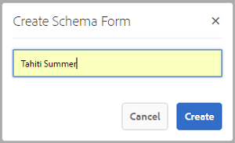

# 中繼資料結構 {#metadata-schemas}

>[!CAUTION]
>
>AEM 6.4已結束延伸支援，本檔案不再更新。 如需詳細資訊，請參閱 [技術支援期](https://helpx.adobe.com//tw/support/programs/eol-matrix.html). 尋找支援的版本 [此處](https://experienceleague.adobe.com/docs/).

在 [!DNL Experience Manager Assets]，中繼資料結構會定義屬性頁面的配置，以及使用特定結構的資產所顯示的中繼資料屬性。 中繼資料屬性包括標題、說明、MIME類型、標籤等。 您可以使用中繼資料結構Forms編輯器來修改現有結構或新增自訂中繼資料結構。

若要檢視及編輯資產的屬性頁面，請執行下列步驟：

1. 按一下或點選 **[!UICONTROL 檢視屬性]** 在「卡片」檢視中，從資產圖磚上的快速動作取得。

   

   或者，選取資產，然後按一下或點選 **[!UICONTROL 屬性]** 圖示。

   

1. 您可以在可用標籤下編輯各種可編輯的中繼資料屬性。 不過，您無法修改資產 [!UICONTROL 類型] 在 [!UICONTROL 基本] 頁簽。

   

   若要修改資產的MIME類型，請使用自訂中繼資料結構表單或修改現有表單。 請參閱 [編輯中繼資料結構Forms](metadata-schemas.md#editing-metadata-schema-forms) 以取得更多資訊。 如果您修改特定MIME類型的中繼資料結構，則會修改目前MIME類型資產和所有資產子類型的屬性頁面配置。 例如，修改 `jpeg` 綱要 `default/image` 只會修改MIME類型資產的中繼資料配置（資產屬性） `IMAGE/JPEG`. 不過，如果您編輯預設結構，您的變更會修改所有資產類型的中繼資料配置。

## 中繼資料結構表單 {#default-metadata-schema-forms}

若要檢視表單/範本清單，請在 [!DNL Experience Manager] 介面導覽至 **[!UICONTROL 工具]** > **[!UICONTROL 資產]** > **[!UICONTROL 中繼資料結構]**.

[!DNL Experience Manager] 提供下列中繼資料結構表單範本：

| 範本 |  | 說明 |
|---|---|---|
| [!UICONTROL 預設] |  | 資產的基本中繼資料結構表單。 |
|  | 以下子表單將繼承 [!UICONTROL 預設] 表單： |  |
|  | <ul><li> [!UICONTROL dm_video]</li></ul> | Dynamic Media影片的結構描述表單。 |
|  | <ul><li> [!UICONTROL 影像]</li></ul> | MIME類型為「image」的資產的結構表單，例如影像/jpeg、影像/png等。   此 [!UICONTROL 影像] 表單具有以下子表單模板： <ul><li> [!UICONTROL jpeg]:子類型資產的結構表單 [!UICONTROL jpeg].</li> <li>[!UICONTROL tiff]:具有子類型的資產的結構表單 [!UICONTROL tiff].</li></ul> |
|  | <ul><li> [!UICONTROL 應用程式]</li></ul> | MIME類型為「application」的資產結構表單，例如application/ pdf、application/ zip等。  [!UICONTROL pdf]:子類型pdf的資產結構表單。 |
|  | <ul><li>[!UICONTROL 視訊]</li></ul> | MIME類型為「video」的資產結構表單，例如video/avi、video/mp4等。 |
| [!UICONTROL 集合] |  | 集合的結構描述表單。 |
| [!UICONTROL contentfragment] |  | 內容片段的結構描述表單。 |
| [!UICONTROL 表單] |  | 此結構表單與 [Adobe Experience Manager Forms](/help/forms/home.md). |

>[!NOTE]
>
>若要檢視結構表單的子表單，請按一下/點選結構表單名稱。

## 新增中繼資料結構表單 {#adding-a-metadata-schema-form}

1. 若要將自訂範本新增至清單，請按一下 **[!UICONTROL 建立]** 的上界。

   >[!NOTE]
   >
   >未編輯的範本會在前面顯示鎖定圖示。 如果您自訂任何範本，範本消失前的鎖定圖示。

1. 在對話方塊中，輸入架構表單的標題，然後按一下 **[!UICONTROL 建立]** 以完成表單建立程式。

   

## 編輯中繼資料結構表單 {#editing-metadata-schema-forms}

您可以編輯新增或現有的中繼資料結構表單。 中繼資料結構表單包含下列項目：

* 索引標籤
* 標籤內的表單項目。

您可以將這些表單項目對應/設定至CRX存放庫中中繼資料節點內的欄位。

您可以將新索引標籤或表單項目新增至中繼資料結構表單。 從父級派生的頁簽和表單項處於鎖定狀態。 不能在子級更改它們。

1. 在 **[!UICONTROL 綱要Forms]** 頁面，在表單之前選取核取方塊，然後按一下 **[!UICONTROL 編輯]** 的上界。

   

1. 在「元數 **[!UICONTROL 據結構編輯器]** 」頁中，通過將一個或多個元件從「構建表單」頁籤中的元件類型清單拖到「基本」頁籤，自定義資產的屬性頁 ******** 。

   

1. 若要設定元件，請選取元件，並修改其屬性，位於 **[!UICONTROL 設定]** 標籤。

### 「構建表單」頁簽中的元件 {#components-within-the-build-form-tab}

此 **[!UICONTROL 建置表單]** 索引標籤會列出您在架構表單中使用的表單項目。 此 **[!UICONTROL 設定]** 索引標籤提供您在 **[!UICONTROL 建置表單]** 標籤。 下表列出 **[!UICONTROL 建置表單]** 標籤：

| 元件名稱 | 說明 |
|---|---|
| [!UICONTROL 區段標題] | 新增區段標題，以取得通用元件清單。 |
| [!UICONTROL 單行文字] | 新增單行文字屬性。 會儲存為字串。 |
| [!UICONTROL 多值文字] | 新增多值文字屬性。 會儲存為字串陣列。 |
| [!UICONTROL 數字] | 新增數字元件。 |
| [!UICONTROL 日期] | 新增日期元件。 |
| [!UICONTROL 下拉式] | 新增下拉式清單。 |
| [!UICONTROL 標準標記] | 新增標記. |
| [!UICONTROL 智慧標記] | 借由自動新增中繼資料標籤來增加搜尋功能。 |
| [!UICONTROL 隱藏欄位] | 新增隱藏欄位。 資產儲存時會以POST參數的形式傳送。 |
| [!UICONTROL 資產引用者] | 新增此元件以檢視資產參考的資產清單。 |
| [!UICONTROL 資產引用] | 新增以顯示參考資產的資產清單。 |
| [!UICONTROL 產品參考] | 新增以顯示與資產連結的產品清單。 |
| [!UICONTROL 資產評等] | 新增至顯示資產評等選項。 |
| [!UICONTROL 關聯式中繼資料] | 「新增」可控制資產屬性頁面中其他中繼資料索引標籤的顯示。 |

### 編輯中繼資料元件 {#editing-the-metadata-component}

要編輯表單上元資料元件的屬性，請按一下該元件，然後在 **[!UICONTROL 設定]** 標籤。

**欄位標籤**:資產屬性頁面上顯示的中繼資料屬性名稱。

**對應至屬性**:此屬性會指定資產節點的相對路徑/名稱，資產節點會儲存在CRX存放庫中。 開頭為 `./` 因為會指出路徑位於資產的節點下。

以下是此屬性的有效值：

* `./jcr:content/metadata/dc:title`:將值儲存在資產的中繼資料節點，做為屬性 `dc:title`。

* `./jcr:created`:在資產節點顯示JCR屬性。 如果您在檢視屬性上設定這些屬性，建議您將它們標示為「停用編輯」，因為這些屬性受到保護。否則，錯誤 [!UICONTROL 資產無法修改] 結果。

為確保元資料結構表單中正確顯示元件，屬性路徑不應包含任何空格。

**預留位置**:使用此屬性可指定與中繼資料屬性相關的預留位置文字。

**必填**:使用此屬性可在屬性頁面上將中繼資料屬性標示為必要屬性。

**禁用編輯**:使用此屬性可使元資料屬性在屬性頁面上不可編輯。

**以只讀方式顯示空欄位**:將此屬性標籤為在屬性頁面上顯示元資料屬性（即使它沒有值）。 預設情況下，當元資料屬性沒有值時，它不會列在屬性頁面上。

**顯示已排序的清單**:使用此屬性可顯示選擇的有序清單

**選擇**:使用此屬性可指定清單中的選擇

**說明** :使用此屬性可為中繼資料元件新增簡短說明。

**類別**:屬性關聯的對象類。

**刪除圖示** 按一下此表徵圖可從架構表單中刪除元件。

>[!NOTE]
>
>「隱藏欄位」元件不包括這些屬性。 而是包含屬性，例如屬性名稱、值、欄位標籤和說明。 「隱藏欄位」元件的值在儲存資產時會以POST參數的形式傳送。 不會將其儲存為資產的中繼資料。

如果您選取「必 **[!UICONTROL 要]** 」選項，可以搜尋遺失必要中繼資料的資產。從「篩 **[!UICONTROL 選器]** 」面板中，展開「中繼資料 **[!UICONTROL 驗證謂語]** 」並選取「 **[!UICONTROL 無效]** 」選項。搜尋結果會顯示遺失您透過結構表單設定之必要中繼資料的資產。

如果您將內容中繼資料元件新增至任何結構表單的任何索引標籤，該元件會在套用特定結構的資產的屬性頁面中顯示為清單。 此清單包含除了您套用內容中繼資料元件的索引標籤以外的所有其他索引標籤。 目前，此功能提供基本功能，可根據內容控制中繼資料的顯示。

除了套用內容中繼資料元件的索引標籤之外，若要在屬性頁面中包含任何索引標籤，請從清單中選取索引標籤。 索引標籤會新增至屬性頁面。

### 在JSON檔案中指定屬性 {#specifying-properties-in-json-file}

您不必在「設定」標籤中指定選項的屬 **[!UICONTROL 性]** ，而是可以透過指定對應的索引鍵值配對，來定義JSON檔案中的選項。在「 **[!UICONTROL JSON路徑」欄位中指定JSON檔案的]** 路徑。

### 在架構表單中新增或刪除索引標籤 {#adding-deleting-a-tab-in-the-schema-form}

架構編輯器可讓您新增或刪除標籤。預設模式表單包 **[!UICONTROL 括Basic]**、 **[!UICONTROL Advanced]** 、 **[!UICONTROL IPTC]**&#x200B;和 **** IPTC Extension頁籤，預設情況下。

按一下 `+` 在架構表單上添加新頁簽。 依預設，新索引標籤的名稱為 `Unnamed-1`. 您可以從 **[!UICONTROL 設定]** 標籤。 按一下 `X` 刪除頁簽。

## 刪除中繼資料結構表單 {#deleting-metadata-schema-forms}

[!DNL Experience Manager] 可讓您僅刪除自訂結構描述表單。 它不會讓您刪除預設的結構描述表單/範本。 不過，您可以刪除這些表單中的任何自訂變更。

若要刪除表單，請選取表單並按一下 **[!UICONTROL 刪除]** 表徵圖。

>[!NOTE]
>
>刪除對預設表單的自定義更改後，「元資料結構」介面上將重新顯示鎖定表徵圖，以指示表單已恢復到其預設狀態。

>[!NOTE]
>
>您無法刪除中的現成中繼資料結構表單 [!DNL Experience Manager] 資產。

## MIME類型的架構表單 {#schema-forms-for-mime-types}

[!DNL Experience Manager] Assets提供各種現成MIME類型的預設表單。 不過，您可以為各種MIME類型的資產新增自訂表單。

### 為MIME類型添加新表單 {#adding-new-forms-for-mime-types}

在適當的表單類型下建立新表單。例如，若要為 `image/png` 子類型，在 `image` 表單。 方案表單的標題是子類型名稱。在此案例中，標題為 `png`.

### 對各種MIME類型使用現有架構模板 {#using-an-existing-schema-template-for-various-mime-types}

您可以將現有範本用於不同的MIME類型。 例如，使用 `image/jpeg` MIME類型資產的表單 `image/png`.

在此情況下，請在 `/etc/dam/metadataeditor/mimetypemappings` 在CRX存放庫中。 指定節點的名稱並定義下列屬性：

| 名稱 | 說明 | 類型 | 值 |
|---|---|---|---|
| `exposedmimetype` | 要映射的現有表單的名稱 | `String` | `image/jpeg` |
| `mimetypes` | 使用中定義之表單的MIME類型清單 `exposedmimetype` 屬性 | `String` | `image/png` |

[!DNL Experience Manager] Assets會對應下列MIME類型和結構表單：

| 結構表單 | MIME類型 |
|---|---|
| image/jpeg | image/pjpeg |
| image/tiff | 影像/x-tiff |
| application/pdf | application/postscript |
| application/x-ImageSet | Multipart/Related; type=application/x-ImageSet |
| application/x-SpinSet | Multipart/Related; type=application/x-SpinSet |
| application/x-MixedMediaSet | Multipart/Related; type=application/x-MixedMediaSet |
| video/quicktime | video/x-quicktime |
| 視頻/mpeg4 | video/mp4 |
| video/avi | video/avi, video/msvideo, video/x-msvideo |
| video/wmv | video/x-ms-wmv |
| video/flv | video/x-flv |

## 授予中繼資料結構的存取權 {#granting-access-to-metadata-schemas}

中繼資料結構功能僅供管理員使用。 不過，管理員可以提供對非管理員使用者的存取權 **[!UICONTROL 建立]**, **[!UICONTROL 修改]**，和 **[!UICONTROL 刪除]** 權限 `/conf` 檔案夾。

## 套用資料夾特定中繼資料 {#applying-folder-specific-metadata}

[!DNL Experience Manager] 資產可讓您定義中繼資料結構的變體，並套用至特定資料夾。

例如，您可以定義預設中繼資料結構的變體，並將其套用至資料夾。 套用修改後的結構時，會覆寫套用至資料夾內資產的原始預設中繼資料結構。

只有上傳至套用此結構的資料夾的資產，才會符合變體中繼資料結構中定義的修改中繼資料。

套用原始結構的其他資料夾中的資產會繼續符合原始結構中定義的中繼資料。

資產的中繼資料繼承是以套用至階層中第一層資料夾的結構為基礎。 換言之，如果資料夾不包含子資料夾，資料夾內的資產會繼承套用至資料夾之結構的中繼資料。

如果資料夾有子資料夾，如果子資料夾層級套用了不同的結構，則子資料夾內的資產會繼承子資料夾層級所套用結構的中繼資料。 但是，如果子資料夾層級未套用結構或相同結構，子資料夾資產則會繼承父資料夾層級所套用結構的中繼資料。

1. 按一下 [!DNL Experience Manager] 標誌，然後導航 **[!UICONTROL 工具>資產>中繼資料結構]**. 此時會顯示&#x200B;**[!UICONTROL 「中繼資料結構描述表單」]**&#x200B;頁面。
1. 選取表單前的核取方塊，例如預設中繼資料表單，然後按一下或點選 **[!UICONTROL 複製]** 圖示並儲存為自訂表單。 指定表單的自訂名稱，例如 `my_default`. 或者，您也可以建立自訂表單。

   

1. 在 **[!UICONTROL 中繼資料結構Forms]** 頁面，選擇 `my_default` 表單，然後按一下 **[!UICONTROL 編輯]**.

1. 在 **[!UICONTROL 中繼資料結構編輯器]** 頁面，將文本欄位添加到架構表單中。 例如，新增帶標籤的欄位 **[!UICONTROL 類別]**.

   

1. 按一下「**[!UICONTROL 儲存]**」。修改後的表單會列在 **[!UICONTROL 中繼資料結構Forms]** 頁面。
1. 按一下/點選 **[!UICONTROL 應用於資料夾]** ，將自訂中繼資料套用至資料夾。

   

1. 選取要套用已修改架構的資料夾，然後按一下/點選 **[!UICONTROL 套用]**.

   

1. 如果資料夾已套用其他中繼資料結構，則會出現警告，指出您即將覆寫現有的中繼資料結構。 按一下 **[!UICONTROL 覆寫]**.
1. 按一下 **[!UICONTROL 確定]** 來關閉成功訊息。
1. 導覽至您套用已修改中繼資料結構的資料夾。

## 定義必要中繼資料 {#defining-mandatory-metadata}

您可以在資料夾層級定義必填欄位，這會對上傳至資料夾的資產強制執行。 如果您上傳的資產上傳了先前定義之必填欄位的中繼資料遺失，卡片檢視的資產上會顯示遺失中繼資料的視覺指示。

>[!NOTE]
>
>根據其他欄位的值，中繼資料欄位可定義為必填欄位。 在「卡片」檢視中， [!DNL Experience Manager] 不會顯示有關此類必要中繼資料欄位遺失中繼資料的警告訊息。

1. 按一下 [!DNL Experience Manager] 標誌，然後導航 **[!UICONTROL 工具>資產>中繼資料結構]**. 此時會顯示&#x200B;**[!UICONTROL 「中繼資料結構描述表單」]**&#x200B;頁面。
1. 將預設中繼資料表單儲存為自訂表單。 例如，將其儲存為 `my_default`.

   

1. 編輯自訂表單。 新增必填欄位。 例如，新增 **類別** 欄位，並將欄位設為必填。

   

1. 按一下「**[!UICONTROL 儲存]**」。修改後的表單會列在 **[!UICONTROL 中繼資料結構Forms]** 頁面。 若要將自訂中繼資料套用至資料夾，請選取表單並按一下/點選 **[!UICONTROL 應用於資料夾]** 的上界。

1. 導覽至資料夾，並上傳一些資產，其中遺失您新增至自訂表單之必填欄位的中繼資料。 資產的「卡片」檢視會顯示必填欄位中缺少中繼資料的訊息。

   

1. （可選）存取 `http://[server]:[port]/system/console/components/`. 配置和啟用 `com.day.cq.dam.core.impl.MissingMetadataNotificationJob` 預設停用的元件。 設定頻率， [!DNL Experience Manager] 檢查資產上中繼資料的有效性。
此設定會新增屬性 `hasValidMetadata` 至jcr:assets的內容。 使用此屬性， [!DNL Experience Manager] 可以篩選搜尋中的結果。

>[!NOTE]
>
>如果在排程檢查後新增資產，系統不會將資產標籤為 `hasValidMetadata` 直到下次排程的檢查。 資產不會顯示在中間搜尋結果中。

>[!CAUTION]
>
>中繼資料驗證檢查耗用大量資源，且可能會影響您的系統效能。 據此安排檢查。 若 [!DNL Experience Manager] 部署存在效能問題，請嘗試禁用此作業。
