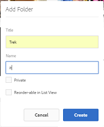

# 準備翻譯資產 {#preparing-assets-for-translation}

>[!CAUTION]
>
>AEM 6.4已結束延伸支援，本檔案不再更新。 如需詳細資訊，請參閱 [技術支援期](https://helpx.adobe.com//tw/support/programs/eol-matrix.html). 尋找支援的版本 [此處](https://experienceleague.adobe.com/docs/).

多語言資產是指具有多種語言的二進位檔、中繼資料和標籤的資產。 資產的二進位檔、中繼資料和標籤通常以一種語言存在，然後轉譯為其他語言，以用於多語言專案。

在Adobe Experience Manager Assets中，多語言資產會包含在資料夾中，每個資料夾都包含不同語言的資產。

每個語言資料夾都稱為語言副本。 語言副本的根資料夾（稱為語言根）標識語言副本中內容的語言。 例如， */content/dam/it* 是義大利語副本的義大利語根。 語言副本必須使用 [正確配置的語言根](preparing-assets-for-translation.md#creating-a-language-root) 以便在執行來源資產的翻譯時定位正確的語言。

您最初新增資產的語言副本是語言主要。 語言主要是翻譯成其他語言的源。

範例資料夾階層包含數種語言根：

```java
/content
    /- dam
             |- en
             |- fr
             |- de
             |- es
             |- it
             |- ja
             |- zh
```

執行下列步驟準備翻譯資產：

1. 建立語言主要的語言根。 例如，範例資料夾階層中英文副本的語言根為 `/content/dam/en`. 請根據 [建立語言根](preparing-assets-for-translation.md#creating-a-language-root).

1. 將資產新增至您的語言主要版本。
1. 建立您需要語言副本的每種目標語言的語言根。

## 建立語言根 {#creating-a-language-root}

要建立語言根，請建立資料夾並使用ISO語言代碼作為Name屬性的值。 建立語言根後，您就可以在語言根的任何層級建立語言副本。

例如，範例階層的義大利文語言副本的根頁面具有 `it` 作為Name屬性。 Name屬性會作為存放庫中資產節點的名稱，因此會決定資產的路徑。(`https://[AEM_server]:[port]/assets.html/content/dam/it/*`)

1. 在「資產」主控台中，按一下/點選「 **[!UICONTROL 建立]** 」，然後從 **[!UICONTROL 選單選擇「資料夾]** 」。

   

1. 在「名稱」欄位中，以 `<language-code>`.

   

1. 按一下或點選 **[!UICONTROL 建立]**. 語言根目錄會在Assets主控台中建立。

## 查看語言根 {#viewing-language-roots}

觸控最佳化UI提供「參考」面板，顯示內建的語言根清單 [!DNL Experience Manager] 資產。

1. 在Assets控制台中，選取您要建立語言副本的主要語言。
1. 按一下或點選「全域導覽」圖示，然後選擇 **[!UICONTROL 參考]** 以開啟「參考」窗格。

   

1. 在「參考」窗格中，按一下或點選 **[!UICONTROL 語言副本]**. 「語言復本」面板會顯示資產的語言復本。

   
