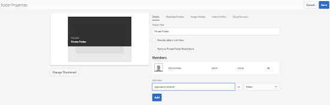
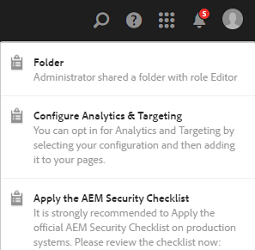

# 私人資料夾共用 {#private-folder-sharing}

>[!CAUTION]
>
>AEM 6.4已結束延伸支援，本檔案不再更新。 如需詳細資訊，請參閱 [技術支援期](https://helpx.adobe.com//tw/support/programs/eol-matrix.html). 尋找支援的版本 [此處](https://experienceleague.adobe.com/docs/).

您可以在Adobe Experience Manager Assets使用者介面中建立專供您使用的私人資料夾。 您可以將此私人資料夾共用給其他使用者，並為其指派各種權限。 根據您指派的權限層級，使用者可以對資料夾執行各種工作，例如在資料夾內檢視資產或編輯資產。

1. 在「資產」主控台中，點選/按一下 **[!UICONTROL 建立]** 從工具列，然後選擇 **[!UICONTROL 資料夾]** 的上界。

   

1. 在 **[!UICONTROL 新增資料夾]** 對話框，輸入資料夾的標題和名稱（可選），然後選擇 **[!UICONTROL 私人]**.

   

1. 點選/按一下 **[!UICONTROL 建立]**. UI中會建立私人資料夾。

   

1. 要與其他用戶共用資料夾以及為其分配權限，請選擇該資料夾，然後按一下工具欄中的「屬性 **** 」表徵圖。

   

   >[!NOTE]
   >
   >在您共用資料夾之前，該資料夾不會顯示給任何其他使用者。

1. 在「資料夾屬性」頁面中，從 **[!UICONTROL 添加用戶]** 清單，將角色指派給私人資料夾上的使用者，然後按一下 **[!UICONTROL 新增]**.

   

   >[!NOTE]
   >
   >您可以將各種角色（例如編輯者、擁有者或檢視者）指派給您共用資料夾的使用者。 如果您將「擁有者」角色指派給使用者，則使用者對資料夾具有「編輯者」權限。 此外，使用者可與其他人共用資料夾。 如果您指派編輯者角色，使用者可以編輯您私人資料夾中的資產。 如果您指派檢視器角色，使用者只能檢視您私人資料夾中的資產。

1. 按一下「**[!UICONTROL 儲存]**」。根據您指派的角色，當使用者登入時，系統會為使用者指派一組權限給您的私人資料夾 [!DNL Experience Manager] 資產。
1. 按一下 **[!UICONTROL 確定]** 以關閉確認訊息。
1. 您與其共用資料夾的使用者會收到共用通知。 登入 [!DNL Experience Manager] 具有用來檢視通知之使用者認證的資產。

   

1. 點選/按一下「通知」圖示以開啟通知清單。

   

1. 按一下/點選管理員共用之私人資料夾的項目，以開啟資料夾。

>[!NOTE]
>
>要建立專用資料夾，需要對要建立專用資料夾的父資料夾進行讀取和編輯ACL權限。 如果您不是管理員，預設不會為您啟用這些權限 */content/dam*. 在此情況下，請先取得使用者ID/群組的這些權限，再嘗試建立私人資料夾或檢視資料夾設定。
