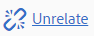

# 相關資產 {#related-assets}

>[!CAUTION]
>
>AEM 6.4已結束延伸支援，本檔案不再更新。 如需詳細資訊，請參閱 [技術支援期](https://helpx.adobe.com//tw/support/programs/eol-matrix.html). 尋找支援的版本 [此處](https://experienceleague.adobe.com/docs/).

Adobe Experience Manager資產可讓您使用「相關資產」功能，根據組織的需求手動關聯資產。 例如，您可以將授權檔案與類似主題上的資產或影像/視訊產生關聯。 您可以將共用特定共同屬性的資產關聯。 您也可以使用功能建立資產之間的來源/衍生關係。 例如，如果您有一個從INDD檔案生成的PDF檔案，則可將PDF檔案與其源INDD檔案相關。

這樣，您就可以靈活地與供應商/代理共用低解析度檔案(例如PDF/JPG)，並僅應要求提供高解析度檔案（例如INDD）。

## 相關資產 {#relating-assets}

1. 從「資產」介面，開啟您要關聯之資產的屬性頁面。

   

   或者，從清單檢視中選取資產。

   

   您也可以從集合中選取資產。

   

1. 若要將另一個資產與您選取的資產產生關聯，請按一下/點選 **[!UICONTROL 相關]** 圖示。

   

1. 執行下列任一項作業：

   * 要關聯資產的源檔案，請選擇 **[!UICONTROL 來源]** 從清單中。
   * 要關聯派生檔案，請選擇 **[!UICONTROL 衍生]** 從清單中。
   * 若要在資產之間建立雙向關係，請選取 **[!UICONTROL 其他]** 從清單中。

   

1. 從 **[!UICONTROL 選取資產]** 畫面中，導覽至您要關聯的資產位置，然後選取它。

   

1. 按一下/點選 **[!UICONTROL 確認]** 表徵圖。
1. 按一下/點選 **[!UICONTROL 確定]** 以關閉對話方塊。 根據您在步驟3中選擇的關係，相關資產會列在 **[!UICONTROL 相關]** 區段。 例如，如果您相關的資產是目前資產的來源檔案，則會列在 **[!UICONTROL 來源]**.

   

1. 若要解除資產的關聯，請按一下/點選 **[!UICONTROL 不相關]** 圖示。

   

1. 選取您要與 **[!UICONTROL 刪除關係]** 對話框，然後按一下/點選 **[!UICONTROL 不相關]**.

   

1. 按一下/點選 **[!UICONTROL 確定]** 以關閉對話方塊。 您移除關係的資產會從 **[!UICONTROL 相關]** 區段。

## 換算相關資產 {#translating-related-assets}

使用「相關資產」功能建立資產之間的來源/衍生關係，在翻譯工作流程中也很實用。 對衍生資產執行翻譯工作流程時， [!DNL Experience Manager] 資產會自動擷取來源檔案參考的任何資產，並加入以進行翻譯。 這樣，源資產引用的資產與源資產和派生資產一起翻譯。 例如，假設您的英文副本包含衍生資產及其來源檔案，如所示。

如果源檔案與另一個資產相關， [!DNL Experience Manager] 資產會擷取經過反覆的資產，並納入以進行翻譯。

1. 依照 [建立新的翻譯專案](translation-projects.md#create-a-new-translation-project). 例如，在此案例中，將資產翻譯為法文。
1. 從「項目」頁開啟翻譯資料夾。

   

1. 按一下/點選專案圖磚，以開啟詳細資訊頁面。

   

1. 按一下/點選「翻譯工作」卡片下方的點，以檢視翻譯狀態。

   

1. 選取資產，然後按一下/點選 **[!UICONTROL 在資產中顯示]** 從工具列檢視資產的翻譯狀態。

   

1. 若要確認與來源相關的資產是否已翻譯，請按一下/點選來源資產。

   

1. 選取與來源相關的資產，然後按一下/點選 **[!UICONTROL 在資產中顯示]**. 隨即顯示翻譯的相關資產。

   
