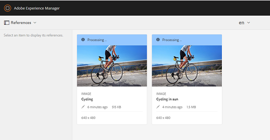

# 相關資產{#related-assets}

Adobe Experience Manager(AEM)資產可讓您使用「相關資產」功能，根據組織的需求手動建立資產關聯。 例如，您可以將授權檔案與類似主題上的資產或影像／視訊建立關聯。 您可以建立與共用特定共同屬性的資產關聯。 您也可以使用此功能來建立資產間的來源／衍生關係。 例如，如果您有PDF檔案是從INDD檔案產生，則可將PDF檔案與其來源INDD檔案建立關聯。

如此，您就可以彈性地將低解析度檔案（例如PDF/JPG）共用給廠商／代理商，並且僅在要求時提供高解析度檔案（例如INDD）。

## 相關資產{#relating-assets}

1. 從「資產」介面，開啟您要建立關聯之資產的屬性頁面。

   

   或者，從清單檢視中選取資產。

   

   您也可以從系列中選取資產。

   

1. 若要將另一個資產與您選取的資產建立關聯，請按一下／點選工具列中的&#x200B;**[!UICONTROL 關聯]**&#x200B;圖示。

   

1. 執行下列任一項作業：

   * 要關聯資產的源檔案，請從清單中選擇&#x200B;**[!UICONTROL 源]**。
   * 要關聯派生檔案，請從清單中選擇&#x200B;**[!UICONTROL Derived]**。
   * 若要在資產之間建立雙向關係，請從清單中選取&#x200B;**[!UICONTROL Others]**。

   

1. 從&#x200B;**[!UICONTROL 選擇資產]**&#x200B;畫面，瀏覽至您要建立關聯的資產所在位置，然後選擇它。

   

1. 按一下／點選&#x200B;**[!UICONTROL 確認]**&#x200B;表徵圖。
1. 按一下／點選&#x200B;**[!UICONTROL OK]**&#x200B;以關閉對話框。 根據您在步驟3中選擇的關係，相關資產會列在&#x200B;**[!UICONTROL Related]**&#x200B;一節中適當類別下。 例如，如果您相關的資產是目前資產的來源檔案，則會列在&#x200B;**[!UICONTROL Source]**&#x200B;下。

   

1. 若要解除資產關聯，請按一下／點選工具列中的&#x200B;**[!UICONTROL 解除關聯]**&#x200B;圖示。

   

1. 從&#x200B;**[!UICONTROL 移除關係]**&#x200B;對話方塊中選取您要解除關聯的資產，然後按一下／點選&#x200B;**[!UICONTROL 解除關聯]**。

   

1. 按一下／點選&#x200B;**[!UICONTROL OK]**&#x200B;關閉對話框。 您移除關係的資產會從&#x200B;**[!UICONTROL Related]**&#x200B;區段下的相關資產清單中刪除。

## 轉換相關資產{#translating-related-assets}

使用「相關資產」功能建立資產間的來源／衍生關係，在轉譯工作流程中也很有幫助。 當您對派生資產運行翻譯工作流時，AEM Assets會自動提取源檔案引用的任何資產，並將其包括在翻譯中。 這樣，源資產引用的資產與源資產和衍生資產一起折算。 例如，假設您的英文版副本包含衍生資產及其來源檔案，如所示。

如果源檔案與另一個資產相關，AEM Assets將讀取經過改變的資產，並將其包含在轉換中。

1. 按照[建立新翻譯項目](translation-projects.md#create-a-new-translation-project)中的步驟，將源資料夾中的資產翻譯為目標語言。 例如，在此例中，請將您的資產翻譯為法文。
1. 在「項目」頁面中，開啟翻譯資料夾。

   

1. 按一下／點選專案圖格以開啟詳細資訊頁面。

   

1. 按一下／點選翻譯工作卡下的省略號以查看翻譯狀態。

   

1. 選取資產，然後從工具列按一下／點選「資產中顯現」(**[!UICONTROL Reveal in Assets]**)，以檢視資產的轉譯狀態。

   

1. 若要確認是否已轉換與來源相關的資產，請按一下／點選來源資產。

   

1. 選取與來源相關的資產，然後按一下／點選&#x200B;**[!UICONTROL 「在資產中顯現」]**。 會顯示已轉換的相關資產。

   
