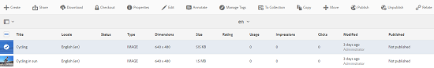
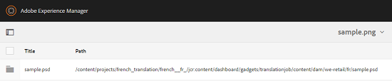

# 相關資產 {#related-assets}

Adobe Experience Manager資產可讓您使用「相關資產」功能，根據組織的需求手動關聯資產。 例如，您可以將授權檔案與類似主題上的資產或影像/視訊產生關聯。 您可以將共用特定共同屬性的資產關聯。 您也可以使用功能建立資產之間的來源/衍生關係。 例如，如果PDF檔案是從INDD檔案生成的，則可將PDF檔案與其源INDD檔案相關。

這樣，您就可以靈活地與供應商/代理共用低解析度檔案（例如PDF/JPG），並僅應要求提供高解析度檔案（例如INDD）。

## 相關資產 {#relating-assets}

1. 從「資產」介面，開啟您要關聯之資產的屬性頁面。

   

   或者，從清單檢視中選取資產。

   

   您也可以從集合中選取資產。

   

1. 若要將另一個資產與您選取的資產產生關聯，請按一下/點選工具列中的「**[!UICONTROL 相關]**」圖示。

   

1. 執行下列任一操作：

   * 要關聯資產的源檔案，請從清單中選擇&#x200B;**[!UICONTROL 源]**。
   * 要關聯派生檔案，請從清單中選擇&#x200B;**[!UICONTROL Derived]**。
   * 若要建立資產之間的雙向關係，請從清單中選取&#x200B;**[!UICONTROL Others]**。

   

1. 從&#x200B;**[!UICONTROL 選取資產]**&#x200B;畫面，導覽至您要關聯的資產位置，然後選取它。

   

1. 按一下/點選&#x200B;**[!UICONTROL 確認]**&#x200B;圖示。
1. 按一下/點選&#x200B;**[!UICONTROL 確定]**&#x200B;以關閉對話方塊。 根據您在步驟3中的關係選擇，相關資產會列在&#x200B;**[!UICONTROL Related]**&#x200B;區段中的適當類別下。 例如，如果您相關的資產是當前資產的源檔案，則它會列在&#x200B;**[!UICONTROL Source]**&#x200B;下。

   

1. 若要取消資產的關聯，請按一下/點選工具列中的&#x200B;**[!UICONTROL 取消關聯]**&#x200B;圖示。

   

1. 從&#x200B;**[!UICONTROL 移除關係]**&#x200B;對話方塊中選取您要取消關聯的資產，然後按一下/點選&#x200B;**[!UICONTROL 取消關聯]**。

   

1. 按一下/點選&#x200B;**[!UICONTROL 確定]**&#x200B;以關閉對話方塊。 您移除關係的資產會從&#x200B;**[!UICONTROL Related]**&#x200B;區段下的相關資產清單中刪除。

## 換算相關資產 {#translating-related-assets}

使用「相關資產」功能建立資產之間的來源/衍生關係，在翻譯工作流程中也很實用。 當您對衍生資產執行翻譯工作流程時，[!DNL Experience Manager]資產會自動擷取來源檔案所參考的任何資產，並加入以進行翻譯。 這樣，源資產引用的資產與源資產和派生資產一起翻譯。 例如，假設您的英文副本包含衍生資產及其來源檔案，如所示。

如果來源檔案與其他資產相關，[!DNL Experience Manager]資產會擷取經過反覆的資產，並納入以進行翻譯。

1. 依照[建立新翻譯專案](translation-projects.md#create-a-new-translation-project)中的步驟，將來源資料夾中的資產翻譯為目標語言。 例如，在此案例中，將資產翻譯為法文。
1. 從「項目」頁開啟翻譯資料夾。

   

1. 按一下/點選專案圖磚，以開啟詳細資訊頁面。

   

1. 按一下/點選「翻譯工作」卡片下方的點，以檢視翻譯狀態。

   

1. 選取資產，然後從工具列按一下/點選「在資產中顯現」]**以檢視資產的翻譯狀態。**[!UICONTROL 

   

1. 若要確認與來源相關的資產是否已翻譯，請按一下/點選來源資產。

   

1. 選取與來源相關的資產，然後按一下/點選「**[!UICONTROL 在資產中顯現」]**。 隨即顯示翻譯的相關資產。

   
