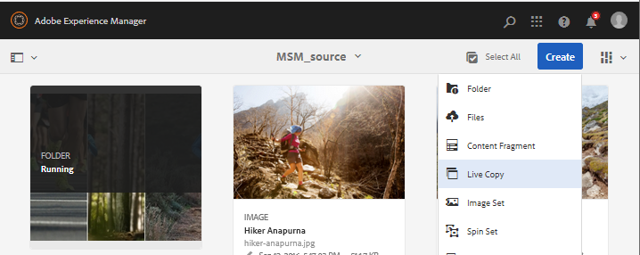
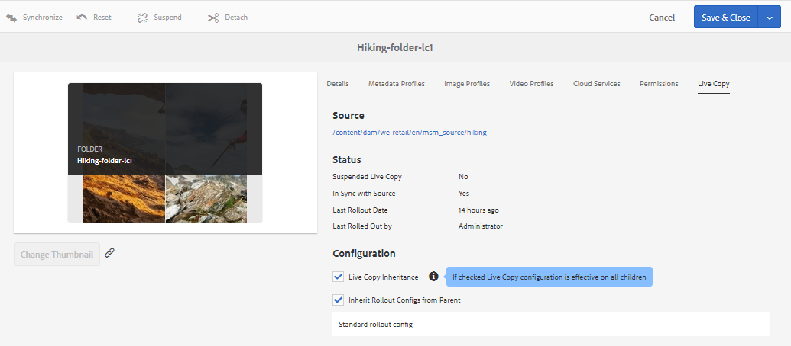
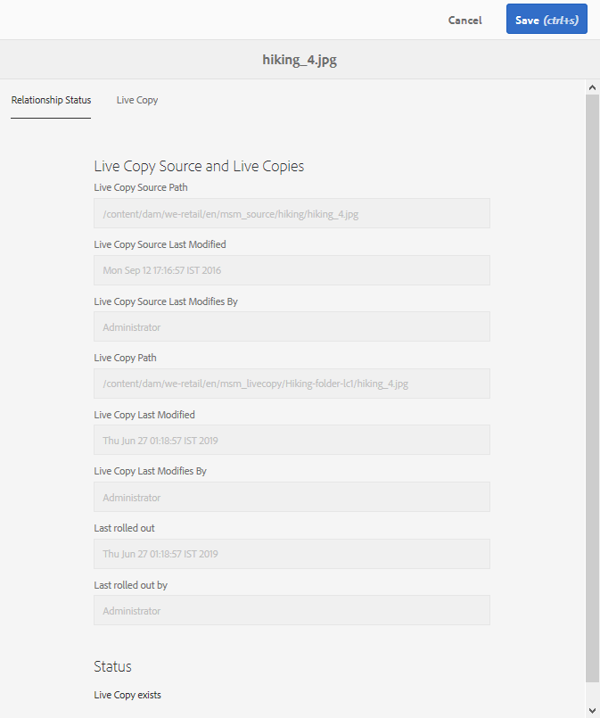

# 使用MSM為資產{#reuse-assets-using-msm-for-assets}重複使用資產

Adobe Experience Manager(AEM)中的Multi Site Manager(MSM)功能可讓使用者重複使用一次製作的內容，並可跨多個網站位置重複使用。 數位資產也適用於MSM for Assets功能。 使用MSM for Assets，您可以：

* 只要建立資產一次，就可複製這些資產，以便在網站的其他區域重複使用。
* 在同步過程中保留多個拷貝，並更新一次原始主拷貝以將更改推送到子拷貝。
* 暫時或永久暫停父資產和子資產之間的連結，以進行本機變更。

## 必備條件 {#msm-prerequisites}

若要將MSM用於資產，請至少安裝Service Pack 5。 如需詳細資訊，請參閱版本注意事項。
[發行說明](/help/release-notes/assets.md)。

## 瞭解優點和概念{#understand-benefits-concepts}

### 其運作方式及優點{#how-it-works-the-benefits}

若要瞭解在多個Web位置重複使用相同內容（文字和資產）的使用情形，請參閱[可能的MSM案例](/help/sites-administering/msm.md#possible-scenarios)。 AEM會維護原始資產與其連結副本之間的連結，稱為即時副本(LC)。 維護的連結可讓集中變更推送至多個即時副本。 這樣可加快更新速度，同時不受管理重複副本的限制。 更改的傳播是無錯誤的，且集中的。 此功能可讓更新空間受限於選取的即時副本。 使用者可以分離連結（即中斷繼承），並在下次更新主要副本並執行變更時，進行不會覆寫的本機編輯。 您可以對數個選取的中繼資料欄位或整個資產進行分離。 它允許靈活地在本地更新最初繼承自主副本的資產。

MSM在來源資產與其即時副本之間維持即時關係，以便：

* 對源資產的更改也會應用（滾出）到即時拷貝，即即時拷貝與源同步。

* 您可以暫停即時關係或移除少數有限欄位的繼承，以更新即時副本。 對來源的修改將不再套用至即時副本。

### MSM資產術語辭彙表{#glossary-msm-for-assets}

* **來源：** 原始資產或資料夾。從中派生即時拷貝的主拷貝。

* **即時副本：** 與其來源同步的來源資產／資料夾副本。即時副本可以是更多即時副本的來源。 請參見[如何建立LC](#create-live-copy-asset)。

* **繼承：** 即時副本資產／資料夾與其來源之間的連結／參考，系統會使用此連結／參考來記住要將更新傳送至何處。中繼資料欄位的繼承存在於精細層級。 您可以移除選擇性中繼資料欄位的繼承，同時保留來源與其即時副本之間的即時關係。

* **推出**:將對源所做的修改推送到其活動副本下游的操作。使用轉出動作，可在一次執行中更新一或多個即時副本。 請參閱[rovolt](#rollout-action)。

* **轉出設定：** 決定要同步哪些屬性、方式與時間的規則。這些配置在建立即時拷貝時適用；稍後可以編輯；子項可從其父項資產繼承轉出配置。 對於MSM for Assets，請僅使用標準轉出設定。 其他的推出設定不適用於MSM for Assets。

* **同步：除** 了轉出外，還有另一個動作，可透過從來源傳送更新至即時副本，在來源和即時副本之間產生奇偶性。系統會針對特定即時副本啟動同步，而動作會從來源提取變更。 使用此動作，僅能更新其中一個即時副本。 請參閱[synchronize action](#about-synchronize-action)。

* **暫停：** 暫時移除即時副本與其來源資產／資料夾之間的即時關係。你可以恢復關係。 請參閱[暫停操作](#suspend-and-resume-relationship)。

* **繼續：** 繼續即時關係，讓即時副本再次開始從來源接收更新。請參閱[resume操作](#suspend-and-resume-relationship)。

* **重置：重** 置操作通過覆蓋任何本地更改，使即時拷貝再次成為源的複製副本。它也會移除繼承取消，並重設所有中繼資料欄位的繼承。 要在將來進行本地修改，您必須再次取消特定欄位的繼承。 請參見對LC](#make-local-modifications-to-live-copy)的[本地修改。

* **分離：不** 可撤銷地移除即時副本資產／資料夾的即時關係。分離操作後，即時副本將永遠無法從源接收更新，並且不再是即時副本。 請參閱[remove relationship](#remove-live-relationship)。

## 建立資產{#create-live-copy-asset}的即時副本

若要從一或多個來源資產或檔案夾建立即時副本，請遵循下列其中一項：

* **方法1**:選取來源資產，然後按一 **[!UICONTROL 下頂端的「建]** 立>即時組排」工具列。
* **方法2**:在AEM使用者介面中，按 **[!UICONTROL 一下介]** 面右上角的「建立>即時組排」。

您可以一次建立資產或資料夾的即時副本。 您可以建立衍生自資產或即時副本本身之資料夾的即時副本。

使用案例不支援內容片段(CF)。 嘗試建立其即時副本時，CF會依原樣複製，沒有任何關係。 複製的CF是及時的快照，在更新原始CF時不會更新。

若要使用第一種方法建立即時副本，請遵循下列步驟：

1. 選擇源資產或資料夾。 在工具列中，按一下「建立>即時副本&#x200B;**[!UICONTROL 」。]**
   
1. 選擇源資產或資料夾。 按一下&#x200B;**[!UICONTROL 下一步]**。
1. 提供標題和名稱。 資產沒有子項。 建立資料夾的即時副本時，您可以選擇包含或排除子項。
1. 選擇轉出配置。 按一下&#x200B;**[!UICONTROL 建立]**。

若要使用第二種方法建立即時副本，請依照下列步驟進行：

1. 在AEM介面中，從右上角按一下「建立>即時副本&#x200B;**[!UICONTROL 」。]**
   
1. 選擇源資產或資料夾。 按一下&#x200B;**[!UICONTROL 下一步]**。
1. 選擇目標資料夾。 按一下&#x200B;**[!UICONTROL 下一步]**。
1. 提供標題和名稱。 資產沒有子項。 建立資料夾的即時副本時，您可以選擇包含或排除子項。
1. 選擇轉出配置。 按一下&#x200B;**[!UICONTROL 建立]**。

>[!NOTE]
>
>移動源或即時副本時，將保留關係。 刪除即時副本時，會移除關係。

## 查看源和即時副本的各種屬性和狀態{#view-properties-statuses-source-and-lc}

您可以從AEM使用者介面的不同區域檢視即時副本的資訊和MSM相關狀態，例如關係、同步、推出等。 以下兩種方法適用於資產和檔案夾：

* 選擇即時複製資產，並在其&#x200B;**[!UICONTROL 屬性]**&#x200B;頁面中尋找資訊。
* 從&#x200B;**[!UICONTROL 即時副本控制台]**&#x200B;中選擇源資料夾並查找每個即時副本的詳細資訊。

>[!TIP]
>
>要檢查幾個單獨的即時拷貝的狀態，請使用第一個方法，即&#x200B;**[!UICONTROL Properties]**&#x200B;頁。 要檢查多個即時拷貝的狀態，請使用第二個方法，即，請參閱&#x200B;**[!UICONTROL 關係狀態]**&#x200B;頁。

### 即時副本{#information-status-of-one-lc}的資訊和狀態

若要檢查即時副本資產或資料夾的資訊和狀態，請遵循下列步驟。

1. 選取即時副本資產或資料夾。 按一下工具欄中的&#x200B;**[!UICONTROL 屬性]**。 或者，使用鍵盤快速鍵`p`。
1. 按一下「即時副本」。 ]****[!UICONTROL 您可以檢查源的路徑、暫停狀態、同步狀態、上次轉出日期，以及上次轉出的用戶。
   
1. 如果子資產借用即時副本設定，您可以啟用或停用。
1. 您可以選擇即時副本的選項，從父項繼承轉出配置或變更配置。

### 資料夾{#information-status-of-all-lcs-of-folder}的所有即時副本的資訊和狀態

AEM提供主控台，可檢查來源檔案夾所有即時副本的狀態。 此控制台顯示所有子資產的狀態。

1. 選擇源資料夾。 按一下工具欄中的&#x200B;**[!UICONTROL 屬性]**。 或者，使用鍵盤快速鍵`p`。
1. 按一下「 **[!UICONTROL 即時複製來源」]**。若要開啟主控台，請按一下「即 **[!UICONTROL 時複製概述」]**。此控制面板提供所有子資產的頂層狀態。
   
1. 若要檢視即時副本檔案夾中每個資產的詳細資訊，請選取資產，然後從工具列按一 **[!UICONTROL 下「關係狀態]** 」。
   

>[!TIP]
>
>您可以快速查看其他資料夾的即時副本狀態，而不需瀏覽太多。 只要變更&#x200B;**[!UICONTROL 即時副本概述]**&#x200B;介面中間上方快顯清單中的資料夾即可。

### 源{#quick-actions-from-references-rail-for-source}的「參考」邊欄中的快速操作

對於來源資產或資料夾，您可以看到下列資訊，並直接從「參考」邊欄採取下列動作：

* 查看即時副本的路徑。
* 在AEM使用者介面中開啟或顯示特定即時副本。
* 將更新同步至特定即時副本。
* 暫停特定即時副本的關係或變更轉出設定。
* 存取即時副本概述主控台。

選取來源資產或資料夾，開啟左側導軌，然後按一下「參考」****。 或者，選取資產或檔案夾，然後使用鍵盤快速鍵 `Alt + 4`。

對於特定的即時副本，按一下「編輯即時副本」以暫停關係或變更轉出設定。****

### 從「參考」邊欄快速動作即時副本{#quick-actions-from-references-rail-for-live-copy}

對於即時副本資產或資料夾，您可以看到下列資訊，並直接從「參考」邊欄採取下列動作：

* 查看其源的路徑。
* 在AEM使用者介面中開啟或顯示特定即時副本。
* 推出更新。

選取即時複製資產或資料夾，開啟左側導軌，然後按一下「參 **[!UICONTROL 考」]**。或者，選取資產或檔案夾，然後使用鍵盤快速鍵 `Alt + 4`。

## 將修改從源複製到即時拷貝{#propagate-modifications-from-source-to-live-copies}

修改源後，可以使用同步操作或轉出操作將更改傳播到即時拷貝。 要瞭解兩個操作之間的差異，請參見[術語表](#glossary-msm-for-assets)。

### 轉出動作{#rollout-action}

您可以從來源資產啟動轉出動作，並更新全部或部分選擇的即時副本。

1. 選取即時副本資產或資料夾。 按一下工具欄中的&#x200B;**[!UICONTROL 屬性]**。 或者，使用鍵盤快速鍵`p`。
1. 按一下「 **[!UICONTROL 即時複製來源」]**。從工具列按一下&#x200B;**[!UICONTROL Rolovate]**。
1. 選擇要更新的即時副本。 按一下&#x200B;**[!UICONTROL Rovolt]**。
1. 若要推出子資產的更新，請選取&#x200B;**[!UICONTROL Rovolt Source和所有子資產]**。
   

>[!NOTE]
>
>在來源資產中所做的修改僅會推出至直接相關的即時副本。 如果即時副本是衍生自其他即時副本，則不會將修改轉出至衍生的即時副本。

或者，您也可以在選取特定即時副本後，從[!UICONTROL References]邊欄啟動轉出動作。 如需詳細資訊，請參閱「從參考邊欄快速動作即時副本」[。 ](#quick-actions-from-references-rail-for-live-copy)在此轉出方法中，只會更新選取的即時副本及其子系。

### 關於同步操作{#about-synchronize-action}

同步操作僅將源中的修改提取到選定的即時副本。 同步動作會尊重並維護取消繼承後所做的本機修改。 不會覆寫本機修改，也不會重新建立取消的繼承。 您可以以三種方式啟動同步動作。

| 在AEM介面中的位置 | 使用時機和理由 | 如何使用 |
|---|---|---|
| [!UICONTROL 參考] 鐵路 | 已選取來源時，可快速同步。 | 請參閱[來源](#quick-actions-from-references-rail-for-source)參考邊欄的快速動作 |
| [!UICONTROL 屬性]頁中的工具欄 | 當您已開啟即時副本屬性時，啟動同步。 | 請參閱[同步即時副本](#synchronize-live-copy) |
| [!UICONTROL 即時副本概觀] 主控台 | 選取來源資料夾或[!UICONTROL 即時副本概述]控制台已開啟時，可快速同步多個資產（不一定全部）。 同步動作會一次針對一個資產啟動，但是是一次執行多個資產同步的更快方式。 | 請參閱「在即時副本資料夾中對許多資產執行的動作」 |

### 同步即時副本{#synchronize-live-copy}

若要啟動同步動作，請開啟即 **[!UICONTROL 時副本的「屬性]** 」頁面，按一下「即時 **** 副本」，然後從工具列按一下所要的動作。

要瞭解與同步操作相關的狀態和資訊，請參閱[資料夾的所有即時副本的資訊和狀態](#information-status-of-all-lcs-of-folder)。

>[!NOTE]
>
>如果關係被暫停，則工具欄中不提供同步操作。 雖然同步動作可在[!UICONTROL References]導軌中使用，但即使在報告成功轉出後，修改也不會傳播。

## 暫停和恢復關係{#suspend-and-resume-relationship}

您可以暫時暫停關係，以防止即時副本接收對來源資產或資料夾所做的修改。 您也可以恢復即時副本的關係，以開始從來源接收修改。

若要暫停或繼續，請開啟即 **[!UICONTROL 時副本的「屬性]** 」頁面，按一下「即時副本 **** 」，然後從工具列按一下所要的動作。

或者，您也可以從即時副本概述主控台，快速暫停或繼續即時副本資料夾中多 **[!UICONTROL 個資產的關係]** 。請參 [閱對即時副本資料夾中的許多資產採取動作](#take-actions-on-many-assets-in-lcfolder)。

## 對即時副本進行本機修改{#make-local-modifications-to-live-copy}

即時拷貝是原始源建立時的副本。 即時副本的中繼資料值會繼承自來源。 中繼資料欄位個別地維持與來源資產各自欄位的繼承。

不過，您有彈性對即時副本進行本機修改，以變更一些選取的屬性。若要進行本機修改，請取消所要屬性的繼承。當取消一個或多個元資料欄位的繼承時，保留資產的即時關係和其它元資料欄位的繼承。任何同步或轉出都不會覆寫本機修改。若要這麼做，請開啟即 **[!UICONTROL 時復本資產的「屬性]** 」頁面，按一下中繼 **[!UICONTROL 資料欄位旁的取消繼承]** 圖示。

您可以還原所有本機修改，並將資產還原為其來源狀態。 重設動作可立即覆寫所有本機修改，並重新建立所有中繼資料欄位的繼承。 若要回復，請從即時複製資產的&#x200B;**[!UICONTROL 屬性]**&#x200B;頁面，按一下工具列的&#x200B;**[!UICONTROL 重設]**。

## 移除即時關係{#remove-live-relationship}

您可以使用「分離」操作完全移除源和即時副本之間的關係。 即時副本分離後，即時副本會變成獨立的資產或資料夾。 在分離後立即在AEM介面中顯示為新資產。 要將即時副本從其源中分離，請執行以下步驟。

1. 選取即時副本資產或資料夾。 按一下工具欄中的&#x200B;**[!UICONTROL 屬性]**。 或者，使用鍵盤快速鍵p。
1. 按一下「即時副本」。 ]****[!UICONTROL &#x200B;按一下工具欄中的&#x200B;**[!UICONTROL Detach]**。 從顯示的對話框中按一下&#x200B;**[!UICONTROL Detach]**。
   

>[!CAUTION]
>
>從對話框中按一下[!UICONTROL Detach]後，關係即被刪除。 不能通過按一下「屬性」頁上的[!UICONTROL Cancel]來撤消。

或者，您也可以從&#x200B;**[!UICONTROL 即時副本概述]**&#x200B;主控台快速分離即時副本資料夾中的多個資產。 請參 [閱對即時副本資料夾中的許多資產採取動作](#take-actions-on-many-assets-in-lcfolder)。

## 對即時副本資料夾{#take-actions-on-many-assets-in-lcfolder}中的許多資產採取動作

如果您在即時副本資料夾中有多個資產，則啟動每個資產的動作可能相當麻煩。 您可以從即時副本主控台，快速對許多資產啟動基本動作。 上述方法仍適用於個別資產。

1. 選擇源資料夾。 按一下工具欄中的&#x200B;**[!UICONTROL 屬性]**。 或者，使用鍵盤快速鍵p。
1. 按一下「 即時複製來源」。若要開啟主控台，請按一下「即 **[!UICONTROL 時複製概述」]**。
1. 在此控制面板中，從即時複製資料夾選取即時複製資產。從工具列按一下所需的動作。可用的操作包括&#x200B;**[!UICONTROL Edit]**、**[!UICONTROL Synchronize]**、**[!UICONTROL Reset]**、**[!UICONTROL Suspend]**&#x200B;和&#x200B;**[!UICONTROL Detach]**。 您可以快速對任意數量的即時副本資料夾中與選定來源資料夾處於即時關係的任何資產啟動這些操作。
   

## 擴充資產的MSM {#extend-msm-for-assets}

AEM可讓您使用MSM Java API來擴充功能。 對於Assets，擴充功能的運作方式與MSM for Site的運作方式相同。 如需詳細資訊，請參閱[擴充MSM](../sites-developing/extending-msm.md)和下列章節，以取得特定工作的詳細資訊：

* [API概觀](../sites-developing/extending-msm.md#overview-of-the-java-api)
* [建立新的同步操作](../sites-developing/extending-msm.md#creating-a-new-synchronization-action)
* [建立新的轉出設定](../sites-developing/extending-msm.md#creating-a-new-rollout-configuration)
* [建立和使用簡單的LiveActionFactory類別](../sites-developing/extending-msm.md#creating-and-using-a-simple-liveactionfactory-class)

>[!NOTE]
>
>* MSM for Site中的Blueprint稱為MSM for Assets中的即時副本來源。
>* MSM for Assets不支援移除建立網站精靈中的章節步驟。
>* MSM的「資產」不支援在頁面屬性上設定MSM鎖（觸控式UI）。

## 資產管理任務對即時拷貝的影響{#impact-of-asset-management-tasks-on-live-copies}

即時副本和來源是可在一定程度上作為數字資產進行管理的資產或資料夾。 AEM中的某些資產管理工作會對即時副本產生特定影響。

* 複製即時副本時，會建立與第一個即時副本來源相同的即時副本資產。
* 當您移動來源或其即時副本時，即時關係會保留。
* 編輯動作不適用於即時複製資產。
* 即時複製資產無法使用結帳動作。
* 對於源資料夾，可以使用建立審閱任務的選項。
* 在清單檢視和欄檢視中檢視資產清單時，即時副本資產或資料夾會針對其顯示「即時副本」。 這可協助您輕鬆識別資料夾中的即時副本。

## 資產和地點的MSM比較{#compare-msm-for-assets-and-sites}

在更多情況下，MSM for Assets會符合MSM for Sites功能的行為。 需要注意的主要差異有：

* 在「網站」中，您可以比較藍圖及其即時副本，但是「資產」中無法比較來源與即時副本。
* 網站通常有子系，但資產則否。 建立個別資產的即時副本時，不會顯示包含或排除子項的選項。
* MSM for Assets不支援移除建立網站精靈中的章節步驟。
* MSM的「資產」不支援在頁面屬性上設定MSM鎖（觸控式UI）。
* 對於MSM for Assets，請僅使用標準轉出設定。 其他的推出設定不適用於MSM for Assets。

## MSM資產限制{#limitations-of-msm-for-assets}

以下為山天能源對資產之限制。

* 使用案例不支援內容片段(CF)。 嘗試建立其即時副本時，CF會依原樣複製，沒有任何關係。 複製的CF是及時的快照，在更新原始CF時不會更新。
