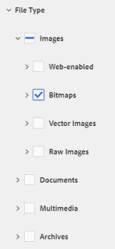

# 在AEM中搜尋資產 {#search-assets-in-aem}

瞭解如何使用「篩選」面板在AEM中尋找所需資產，以及如何使用顯示在搜尋中的資產。

使用「篩選」面板來搜尋資產、資料夾、標籤和中繼資料。 您可以使用通配符星號搜索字串的部分。

「篩選」面板提供多種選項，可以用多種方式來搜尋資產和資料夾，而非以一般分類順序來搜尋。

您可以根據下列選項（謂語）進行搜尋：

* 檔案類型
* 檔案大小
* 欄位名稱
* 上次修改時間
* 狀態
* 方向
* 樣式
* 分析

<!-- TBD keystroke 65 article and port applicable changes here. This content goes. -->

您可以自訂「篩選」面板，並使用搜尋Facet新增／移除搜尋 [謂語](search-facets.md)。 要顯示「濾鏡」面板，請執行以下步驟：

1. 在「資產」使用者介面中，從工具列點選/  ，以顯示「Omnisearch」方塊。
1. 輸入您的搜尋詞，然後按Enter。 或者，只要按Enter鍵，不輸入任何搜尋詞即可。 請勿輸入任何前導空格，否則搜索將無效。

1. 點選／按一下GlobalNav圖示。 隨即顯示「濾鏡」面板。

   

   依您搜尋的項目類型而定，搜尋結果頂端會指出符合的數目。

   

## 搜尋檔案類型 {#search-for-file-types}

「篩選」面板可協助您為搜尋體驗增加更精細的度，並讓搜尋功能更具通用性。 您可以輕鬆深入瞭解所需的詳細程度。

例如，如果您在尋找影像，請使用「檔案類型 **** 」述詞來選擇要點陣圖影像還是向量影像。

您可以指定影像的MIME類型，進一步縮小搜尋範圍。

同樣地，在搜尋檔案時，您可以指定格式，例如PDF或MS Word。

## 根據檔案大小搜尋 {#search-based-on-file-size}

使用「 **檔案大小** 」述詞，根據資產大小搜尋資產。 您可以指定大小範圍的下限和上限，以縮小搜尋範圍。 您也可以指定單位，例如千位元組、兆位元組等。

## 根據上次修改資產的時間進行搜尋 {#search-based-on-when-assets-are-last-modified}

如果您管理進行中資產或監控審核工作流程，您可以根據精確的時間戳記搜尋上次修改資產的時間。 例如，指定修改資產之前或之後的日期。

您也可以使用下列選項，在搜尋中達到更高的精細度：

## 根據狀態搜尋 {#search-based-on-status}

使用 **Status** predicate可根據各種狀態類型（例如「發佈」、「核准」、「結帳」和「過期」）來搜尋資產。

例如，在監控資產發佈時，您可以使用適當的選項來搜尋要發佈的資產。

監控資產的審閱狀態時，請使用適當的選項來尋找已核准的資產或待核准的資產。

## 根據前瞻分析資料進行搜尋 {#search-based-on-insights-data}

使用 **Insights** predicate，根據資產從各種Creative應用程式取得的使用統計資料來搜尋資產。 使用資料分組在下列類別下：

* 使用分數
* 印象
* 點按數
* 資產出現的媒體通道

