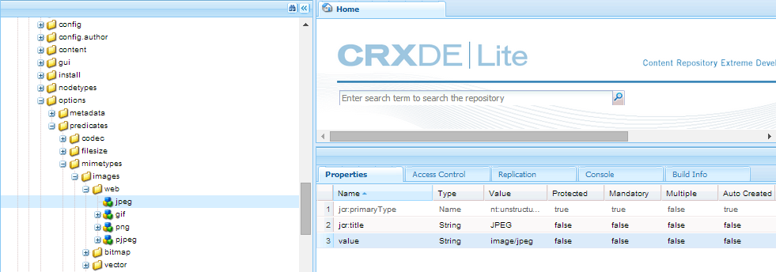

# 搜尋 Facet {#search-facets}

了解如何在AEM中建立、修改及使用搜尋刻面。

Adobe Experience Manager(AEM)Assets在整個企業範圍內部署，能儲存許多資產。 有時候，如果您只使用AEM的一般搜尋功能，尋找正確的資產可能既困難又耗時。

在「篩選器」面板中使用搜尋Facet，為您的搜尋體驗新增更精細的粒度，並讓搜尋功能更有效率且更通用。 搜尋Facet會新增多個維度（述詞），讓您執行更複雜的搜尋。 「篩選器」面板包含一些標準Facet。 您也可以新增自訂搜尋Facet。

總之，搜尋Facet可讓您以多種方式來搜尋資產，而非以單一、預先決定的分類順序來搜尋。 您可以輕鬆深入到所需的詳細程度，以便進行更集中的搜尋。

例如，如果要查找影像，則可以選擇要點陣圖還是向量影像。 您可以指定影像的MIME類型，進一步縮小搜尋範圍。 同樣，在搜索文檔時，可以指定格式，例如PDF或MS Word。

## 新增述詞 {#adding-a-predicate}

顯示在「篩選器」面板中的搜尋刻面，是使用述詞在基礎搜尋表單中定義。 若要顯示更多或不同的刻面，您可以將述詞新增至預設表單，或使用包含您所選刻面的自訂表單。

如需全文搜尋，請將全文述詞新增至表單。 使用屬性述詞來搜尋符合您指定之單一屬性的資產。 使用「選項」述詞來搜尋符合特定屬性之一或多個值的資產。 新增日期範圍述詞以搜尋在指定日期範圍內建立的資產。

1. 點選/按一下[!DNL Experience Manager]標誌，然後前往&#x200B;**[!UICONTROL Tools]** > **[!UICONTROL General]** > **[!UICONTROL Search Forms]**。
1. 從「搜尋Forms」頁面，選取「**[!UICONTROL Assets管理搜尋邊欄]**」，然後點選「**Edit** 」。

   

   找出並選取「資產管理搜尋邊欄」

   >[!NOTE]
   >
   >若要使用先前[!DNL Experience Manager]版本中預先設定之&#x200B;**資產管理搜尋邊欄**&#x200B;的資料夾搜尋功能，請執行下列步驟：
   > 
   >1. 導覽至CRX-DE中的&#x200B;*/conf/global/settings/dam/search/facets/assets/jcr:content/items*。
   >1. 刪除&#x200B;**type**&#x200B;節點。
   >1. 從路徑 */libs/settings/dam/search/facets/assets/jcr:content/items*，將節點資產、目錄、類型、排除路徑和 **searchtype****** ，複製到步驟1提及的路徑。
   >1. 儲存變更。


1. 在「編輯搜索Forms」頁中，將謂詞從&#x200B;**[!UICONTROL 選擇謂詞]**&#x200B;頁簽拖動到主窗格。 例如，拖曳&#x200B;**[!UICONTROL 屬性述詞]**。

   

   拖放述詞以自訂搜尋篩選器

1. 在「設定」標籤中，輸入謂語的欄位標籤、佔位符文本和說明。 指定您要與謂語關聯的中繼資料屬性的有效名稱。

   「設定」索引標籤中的標題標籤可識別所選述詞的類型。

   

   使用「設定」標籤提供謂語的必要選項

1. 在「屬 **[!UICONTROL 性名稱]** 」欄位中，指定您要與謂語關聯的中繼資料屬性的有效名稱。它是根據其執行搜索的名稱。例如，輸入 `jcr:content/metadata/dc:description` 或 `./jcr:content/metadata/dc:description`。

   您也可以從選取對話方塊中選取現有節點。

   

   在「屬性名稱」欄位中將中繼資料屬性與謂語關聯

1. 點選/按一下&#x200B;**[!UICONTROL 預覽]** 以產生「篩選器」面板的預覽，如您新增述詞後所顯示。
1. 在「預覽」模式中檢閱述詞的配置。

   

   提交更改前預覽搜索表單

1. 若要關閉預覽，請點選/按一下預覽右上角的&#x200B;**[!UICONTROL 關閉]** 。
1. 點選&#x200B;**[!UICONTROL 完成]**&#x200B;以儲存設定。
1. 導覽至「資產」使用者介面中的「搜尋」面板。 「屬性述詞」會新增至面板。
1. 在文字方塊中輸入要搜尋的資產說明。 例如，輸入「Adobe」。 執行搜尋時，說明符合「Adobe」的資產會列在搜尋結果中。

## 新增選項述詞 {#adding-an-options-predicate}

「選項」述詞可讓您在「篩選器」面板中新增多個搜尋選項。 您可以在「篩選」面板中選取一或多個這些選項以搜尋資產。 例如，若要根據檔案類型搜尋資產，請設定選項，例如搜尋表單中的「影像」、「多媒體」、「檔案」和「封存」。 配置這些選項後，當您在「濾鏡」面板中選擇「影像」選項時，將對GIF、JPEG、PNG等類型的資產執行搜索。

要將選項映射到相應的屬性，請為選項建立節點結構，並在Options謂詞的Property Name屬性中提供父節點的路徑。 父節點的類型應為`sling`:`OrderedFolder`。 選項的類型應為`nt:unstructured`。 選項節點應配置屬性`jcr:title`和`value`。

`jcr:title`屬性是「篩選器」面板上顯示之選項的好記名稱。 查詢中使用`value`欄位來匹配指定的屬性。

選擇選項時，將根據選項節點及其子節點的`value`屬性（如果有）執行搜索。 會遍歷選項節點下的整個樹，並使用OR操作組合每個子節點的`value`屬性，以形成搜索查詢。

例如，如果您為檔案類型選取「影像」，則會使用OR運算結合屬性來建立資 `value` 產的搜尋查詢。例如，通過組合影像/jpeg *、* image/gif *、* png影像、影像 */jpeg影像、以及使用OR操作對Tiff屬性進行搜索的Joff影像*****`jcr:content/metadata/dc:format` /Tiff影像的匹配結果來構建影像搜索查詢。



檔案類型的值屬性（如CRXDE中所示）用於搜索查詢以正常工作

您不必在CRX儲存庫中手動建立選項的節點結構，而是可以透過指定對應的索引鍵值配對，在JSON檔案中定義選項。在「屬性名稱」欄位中指定JSON檔 **[!UICONTROL 案的路徑]** 。例如，您可以定義鍵值配對、 `image/bmp`、 `image/gif``image/jpeg`、和 `image/png` 並指定其值，如下列範例JSON檔案中所示。在「屬 **[!UICONTROL 性名稱]** 」欄位中，您可以指定此檔案的CRX路徑。

```json
{
    "options" :
 [
          {"value" : "image/bmp","text" : "BMP"},
          {"value" : "image/gif","text" : "GIF"},
          {"value" : "image/jpeg","text" : "JPEG"},
          {"value" : "image/png","text" : "PNG"}
 ]
}
```

如果要使用現有節點，請使用選擇對話框指定它。

>[!NOTE]
>
>Options述詞是自訂包裝函式，包含用來演示所述行為的屬性述詞。 目前沒有可用於本機支援此功能的REST端點。

1. 點選[!DNL Experience Manager]標誌，然後前往「**[!UICONTROL 工具>一般>搜尋Forms]**」。
1. 從「搜 **[!UICONTROL 尋表單」頁面]** ，選取「資 ****&#x200B;產管理搜尋邊欄」，然後點選「編輯」圖示。
1. 在「編 **[!UICONTROL 輯搜索表單]** 」頁中，將「選 **[!UICONTROL 項謂詞」從]** 「選擇謂詞 **** 」頁籤拖到主窗格。
1. 在「設 **[!UICONTROL 定]** 」標籤中，輸入屬性的標籤和名稱。例如，若要根據資產的格式來搜尋資產，請為標籤指定好記的名稱，例如「檔案類 **[!UICONTROL 型」]**。指定在屬性欄位中根據其執行搜索的屬性，例如 `jcr:content/metadata/dc:format.`
1. 執行下列任一操作：

   * 在&#x200B;**[!UICONTROL 屬性名稱]**&#x200B;欄位中，提及JSON檔案的路徑，您可在此定義選項的節點，並指定對應的索引鍵值配對。
   * 點選「選項」欄位旁的「新增」圖示若要新增其他選項，請點選/按一下「新增圖示](assets/do-not-localize/aem_assets_add_icon.png) 」，然後重複此步驟。![

1. 確保清 **[!UICONTROL 除「單選]** 」，讓使用者一次為檔案類型選取多個選項 (例如影像、檔案、多媒體和封存)。如果您選 **[!UICONTROL 取「單選]**」，使用者一次只能為檔案類型選取一個選項。

   

   選項述詞中的可用欄位

1. 在&#x200B;**Description**&#x200B;欄位中，輸入可選說明，然後按一下&#x200B;**[!UICONTROL Done]**。
1. 導覽至「搜尋」面板。 「選項謂語」已新增至&#x200B;**Search**&#x200B;面板。 **[!UICONTROL 檔案類型]**&#x200B;的選項顯示為複選框。

## 新增多值屬性述詞 {#adding-a-multi-value-property-predicate}

「多值屬性」述詞可讓您搜尋多個值的資產。 假設您在[!DNL Experience Manager]資產中有多個產品的影像，且每個影像的中繼資料包含與產品相關聯的SKU編號。 您可以使用此述詞來根據多個SKU編號來搜尋產品影像。

1. 按一下[!DNL Experience Manager]標誌，然後前往&#x200B;**[!UICONTROL Tools]** > **[!UICONTROL General]** > **[!UICONTROL Search Forms]**。
1. 在「搜尋Forms」頁面上，選取「**[!UICONTROL Assets管理搜尋邊欄]**」，點選「**Edit** 」。
1. 在「編輯搜索表單」頁中，將「 **[!UICONTROL Multi Value Property Predicate]** 」從「 **[!UICONTROL Select Predicate]** 」頁籤拖動到主窗格。
1. 在&#x200B;**[!UICONTROL Settings]**&#x200B;標籤中，輸入謂語的標籤和佔位符文本。 指定在屬性欄位中根據其執行搜索的屬性名稱，例如`jcr:content/metadata/dc:value`。 您也可以使用選取對話方塊來選取節點。
1. 請確定已 **[!UICONTROL 選取「分隔字元]** 」支援。在「輸入 **[!UICONTROL 分隔字元]** 」欄位中，指定分隔字元以分隔個別值。依預設，逗號會指定為分隔字元。您可以指定不同的分隔字元。
1. 在&#x200B;**Description**&#x200B;欄位中，輸入可選說明，然後點選&#x200B;**[!UICONTROL Done]**。
1. 導覽至「資產」使用者介面中的「篩選」面板。The **[!UICONTROL Multi Value Property]** predicate is added to the panel.
1. 在「多值」欄位中指定多個值（由分隔字元分隔），然後執行搜索。 述詞會擷取與您指定值完全相符的文字。

## 新增標籤述詞 {#adding-a-tags-predicate}

「標籤述詞」可讓您執行資產的標籤式搜尋。 依預設， [!DNL Experience Manager]資產會根據您指定的標籤，搜尋一或多個符合的標籤。 換言之，搜尋查詢會使用指定的標籤執行OR操作。 不過，您可以使用「比對所有標籤」選項，來搜尋包含您所指定之所有標籤的資產。

1. 按一下[!DNL Experience Manager]標誌，然後前往&#x200B;**[!UICONTROL Tools]** > **[!UICONTROL General]** > **[!UICONTROL Search Forms]**。
1. 從「搜尋Forms」頁面，選取「**[!UICONTROL Assets管理搜尋邊欄]**」，然後點選「**Edit** 」。
1. 在「編輯搜索表單」頁中，將&#x200B;**[!UICONTROL 標籤謂詞]**&#x200B;從「選擇謂詞」頁簽拖動到主窗格。
1. 在「設定」標籤中，輸入謂語的預留位置文字。 指定屬性欄位中要根據其執行搜尋的屬性名稱，例如&#x200B;*jcr:content/metadata/cq:tags*。 或者，您也可以從選取對話方塊中選取CRXDE中的節點。
1. 設定此述詞的根標籤路徑屬性，以填入「標籤」清單中的各種標籤。
1. 選取 **[!UICONTROL 「顯示符合所有標籤」選項]** ，以搜尋包含您所指定之所有標籤的資產。

   

   標籤述詞的典型設定

1. 在&#x200B;**[!UICONTROL Description]**&#x200B;欄位中，輸入可選說明，然後按一下/點選&#x200B;**[!UICONTROL Done]**。
1. 導覽至「搜尋」面板。 「搜尋」面板新增&#x200B;**[!UICONTROL Tags]**&#x200B;述詞。
1. 指定您要根據其搜尋資產或從建議清單中選取的標籤。

   

   輸入標籤名稱時AEM提供的建議

1. 選擇&#x200B;**[!UICONTROL 「全部匹配」]**&#x200B;以搜索包含您指定的所有標籤的匹配項。

## 新增其他述詞 {#adding-other-predicates}

與新增屬性述詞或選項述詞的方式類似，您可以將下列其他述詞新增至「搜尋」面板：

| 謂語名稱 | 說明 | 屬性 |
|---|---|---|
| [!UICONTROL 全文] | 搜尋述詞，以在整個資產節點上執行全文搜尋。 它已與jcr:contains運算子對應。 如果要對資產節點的特定部分執行全文搜索，可以指定相對路徑。 | <ul><li>標籤</li><li>預留位置</li><li>屬性名稱</li><li>說明</li></ul> |
| [!UICONTROL 路徑瀏覽器] | 搜尋述詞，以在預先設定的根路徑搜尋資料夾和子資料夾中的資產 | <ul><li>預留位置</li><li>根路徑</li><li>說明</li></ul> |
| [!UICONTROL 路徑] | 使用它來篩選位置上的結果。 您可以指定不同的路徑作為選項。 | <ul><li>標籤</li><li>路徑</li><li>說明</li></ul> |
| [!UICONTROL 發佈狀態] | 搜尋述詞以根據資產的發佈狀態來搜尋資產 | <ul><li>標籤</li><li>屬性名稱</li><li>說明</li></ul> |
| [!UICONTROL 相對日期] | 搜尋述詞，以根據資產建立的相對日期來搜尋資產。 例如，您可以設定選項，例如2個月前、3週前等。 | <ul><li>標籤</li><li>屬性名稱</li><li>相對日期</li></ul> |
| [!UICONTROL 範圍] | 搜尋述詞以搜尋位於指定範圍內的資產。 在「搜尋」面板中，您可以指定範圍的最小值和最大值。 | <ul><li>標籤</li><li>屬性名稱</li><li>說明</li></ul> |
| [!UICONTROL 日期範圍] | 搜尋述詞，以搜尋在日期屬性的指定範圍內建立的資產。 在「搜尋」面板中，您可以使用日期選擇器指定「開始」和「結束」日期。 | <ul><li>標籤</li><li>預留位置</li><li>屬性名稱</li><li>範圍文字（開始日期）</li><li>範圍文字（至）</li><li>說明</li></ul> |
| [!UICONTROL 日期] | 根據日期屬性，以滑桿式搜尋資產時的搜尋述詞。 | <ul><li>標籤</li><li>屬性名稱</li><li>說明</li></ul> |
| [!UICONTROL 檔案大小] | 搜尋述詞以根據資產大小來搜尋資產。 它是基於滑塊的謂詞，您可在其中從可配置節點中選擇滑塊選項。 預設選項是在CRX存放庫的/libs/dam/options/predicates/filesize中定義。 檔案大小以位元組為單位。 | <ul><li>標籤</li><li>屬性名稱</li><li>路徑</li><li>說明</li></ul> |
| [!UICONTROL 上次修改的資產] | 搜尋述詞以搜尋最近修改的資產 | <ul><li>屬性名稱</li><li>屬性值</li><li>說明</li></ul> |
| [!UICONTROL 發佈狀態] | 搜尋述詞，以根據資產的發佈狀態來搜尋資產 | <ul><li>標籤</li><li>屬性名稱</li><li>說明</li></ul> |
| [!UICONTROL 評等] | 搜尋述詞，以根據資產的平均評等來搜尋資產 | <ul><li>標籤</li><li>屬性名稱</li><li>選項路徑</li><li>說明</li></ul> |
| [!UICONTROL 到期狀態] | 搜尋述詞，以根據資產的到期狀態來搜尋資產 | <ul><li>標籤</li><li>屬性名稱</li><li>說明</li></ul> |
| [!UICONTROL 隱藏] | 定義要搜尋資產之隱藏欄位屬性的搜尋述詞 | <ul><li>屬性名稱</li><li>屬性值</li><li>說明</li></ul> |

## 還原預設搜尋Facet {#restoring-default-search-facets}

依預設，在&#x200B;**[!UICONTROL 搜尋Forms]**&#x200B;頁面的&#x200B;**[!UICONTROL Assets管理員搜尋邊欄]**&#x200B;前會顯示「鎖定」圖示。 如果向表單中添加搜索Facet以指示已修改預設表單，則「鎖定」表徵圖會消失。


針對「搜尋Forms」頁面上的選項鎖定圖示，表示預設設定完整且未自訂。

要還原預設搜索面，請執行以下步驟：

1. 在&#x200B;**[!UICONTROL 搜尋Forms]**&#x200B;頁面中，選取「資產管理搜尋邊欄」 **[!UICONTROL 。]**
1. 點選工具列中的&#x200B;**[!UICONTROL Delete]** 。
1. 在確認對話方塊中，點選&#x200B;**[!UICONTROL Delete]**&#x200B;以移除自訂變更。

   刪除搜尋Facet的自訂變更後，在「搜尋表單」頁面的「資產管 **[!UICONTROL 理搜尋邊欄]** 」前會重 **** 新顯示「鎖定」圖示。

## 使用者權限 {#user-permissions}

如果您未獲派管理員角色，以下是執行與搜尋刻面相關的編輯、刪除和預覽動作所需的權限清單。

| 動作 | 權限 |
|---|---|
| [!UICONTROL 編輯] | 在CRX中對/apps節點讀取和寫入權限 |
| [!UICONTROL 刪除] | 在CRX中讀取、寫入和刪除/apps節點的權限 |
| [!UICONTROL 預覽] | 在CRX中讀取、寫入和刪除/var/dam/content節點的權限。 此外，對/apps節點具有讀取和寫入權限。 |

>[!MORELIKETHIS]
>
>* [擴充資產的搜尋](searchx.md)
>* [搜尋資產](search-assets.md)
>* [搜尋視訊資產](search-video-assets.md)

