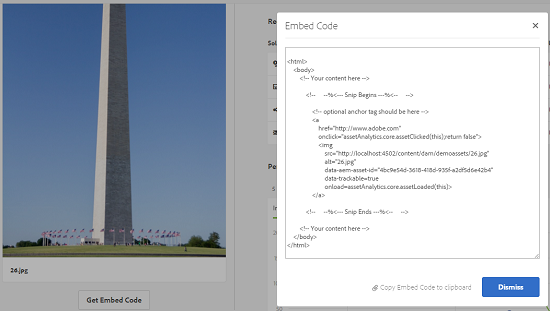

# 資產分析{#asset-insights}

瞭解「資產前瞻分析」功能如何讓您追蹤第三方網站、行銷活動和Adobe創意解決方案中所使用資產的使用者評分和使用統計資料。

「資產前瞻分析」功能可讓您追蹤第三方網站、行銷活動和Adobe創意解決方案中使用的資產的使用者評分和使用統計資料，以獲得有關其績效和人氣的深入資訊。

Assets Insights會擷取使用者活動詳細資訊，例如資產被評級、點按和曝光（資產在網站上載入的次數）的次數。 它會根據這些統計資料來指派分數給資產。 您可以使用分數和績效統計資料來選取要納入目錄、行銷活動等的熱門資產。 您甚至可以根據這些統計資料，針對資產制定封存和授權續約政策。

若是「資產前瞻分析」，以從網站擷取資產的使用統計資料，您必須在網站代碼中包含資產的內嵌代碼。

若要讓「資產前瞻分析」顯示資產的使用統計資料，請先設定功能，從[!DNL Adobe Analytics]擷取報告資料。 如需詳細資訊，請參閱[設定資產前瞻分析](touch-ui-configuring-asset-insights.md)。 若要使用此功能，請個別購買[!DNL Adobe Analytics]授權。 [!DNL Managed Services]的客戶會收到與[!DNL Experience Manager]搭售的[!DNL Analytics]授權。 請參閱[Managed Services產品說明](https://helpx.adobe.com/legal/product-descriptions/adobe-experience-manager-managed-services.html)。

>[!NOTE]
>
>我們僅支援影像的深入資訊。

## 檢視資產{#viewing-statistics-for-an-asset}的統計資料

您可以從中繼資料頁面檢視「資產前瞻分析」分數。

1. 從「資產」使用者介面(UI)中，選取資產，然後點選／按一下工具列中的「屬性&#x200B;****」圖示。
1. 從「屬性」頁麵點選／按一下&#x200B;**[!UICONTROL Insights]**&#x200B;標籤。
1. 在&#x200B;**[!UICONTROL Insights]**&#x200B;標籤中檢閱資產的使用詳細資訊。 **[!UICONTROL Score]**&#x200B;區段說明資產的資產使用總數和績效分數。

   使用分數說明資產在各種解決方案中的使用次數。

   **[!UICONTROL 印象]**&#x200B;分數是資產在網站上載入的次數。 顯示在&#x200B;**[!UICONTROL Clicks]**&#x200B;下方的數字是資產被點按的次數。

1. 請檢閱&#x200B;**[!UICONTROL 使用統計資料]**&#x200B;一節，以瞭解資產屬於哪些實體以及最近使用該資產的創意解決方案。 使用率越高，資產在使用者中受歡迎的機率就越高。 使用資料會顯示在下列標題下：

   * **[!UICONTROL 資產]**:資產屬於系列或複合資產的次數
   * **[!UICONTROL 網頁與行動裝置]**:資產加入網站和應用程式的次數
   * **[!UICONTROL Social]**:資產用於解決方案(例如Adobe Social和Adobe Campaign)的次數
   * **[!UICONTROL 電子郵件]**:資產用於電子郵件促銷活動的次數

   

   >[!NOTE]
   >
   >「資產前瞻分析」功能會定期從[!DNL Adobe Analytics]擷取解決方案資料，解決方案區段可能不會顯示最新資料。 顯示資料的時段取決於資產前瞻分析執行擷取作業的排程，以擷取[!DNL Analytics]資料。

1. 要以圖形方式查看某個時段內資產的效能統計資訊，請在「效能統計資訊」部分中 **[!UICONTROL 選擇該時段]** 。詳細資訊 (包括點按次數和印象) 會顯示為圖形的趨勢線。

   

   >[!NOTE]
   >
   >與解決方案區段中的資料不同，效能統計資料區段會顯示最新的資料。

1. 若要取得您包含在網站中的資產的內嵌代碼，以取得效能資料，請按一下資產縮圖下方的「取得內嵌代碼」。 ****&#x200B;如需如何將內嵌程式碼加入協力廠商網頁的詳細資訊，請參閱[使用頁面追蹤器和網頁內嵌程式碼](touch-ui-using-page-tracker.md)。

   

## 檢視資產{#viewing-aggregate-statistics-for-assets}的匯總統計資料

您可以使用前瞻分析檢視同時檢視資料夾內所有資產 **[!UICONTROL 的分數]**。

1. 在「資產」使用者介面中，導覽至包含您要檢視其見解之資產的檔案夾。
1. 點選／按一下工具列中的「版面」圖示，然後選擇&#x200B;**[!UICONTROL 前瞻分析檢視]**。
1. 頁面會顯示資產的使用分數。 比較各種資產的評分並獲取見解。

## 排程背景工作{#scheduling-background-job}

「資產分析」會定期從Adobe Analytics報表套裝擷取資產的使用資料。 依預設，資產前瞻分析會在每24小時於2 AM執行背景工作，以擷取資料。 不過，您可以通過從Web控制台配置&#x200B;**[!UICONTROL Adobe CQDAM資產效能報告同步作業]**&#x200B;服務來修改頻率和時間。

1. 點選AEM標誌，並前往「工 **[!UICONTROL 具 > 作業 > Web Console]**」。
1. 開啟&#x200B;**[!UICONTROL Adobe CQDAM資產效能報告同步作業]**&#x200B;服務配置。

   

1. 在屬性調度器表達式中指定所需的調度器頻率和作業的啟動時間。 儲存變更。
