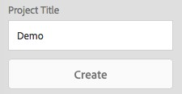
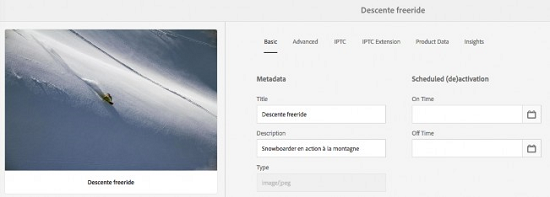

# 建立翻譯專案 {#creating-translation-projects}

若要建立語言副本，請觸發Assets UI中「參考」邊欄下方可用的下列語言副本工作流程之一：

**建立和翻譯**

在此工作流程中，要翻譯的資產會複製到您要翻譯之語言的語言根目錄。 此外，系統會根據您選擇的選項，在「專案」主控台中為資產建立翻譯專案。 視設定而定，翻譯專案可以手動啟動，或在建立翻譯專案後立即自動執行。

**更新語言副本**

您可以執行此工作流程來翻譯其他資產群組，並將其納入特定地區的語言副本中。 在此情況下，翻譯的資產會新增至已包含先前翻譯資產的目標資料夾。

>[!NOTE]
>
>只有翻譯服務提供者支援二進位檔的翻譯，資產二進位檔才會翻譯。

>[!NOTE]
>
>如果您啟動複雜資產(例如PDF和InDesign檔案)的翻譯工作流程，則不會提交其子資產或轉譯（如果有）以供翻譯。

## 建立和翻譯工作流程 {#create-and-translate-workflow}

您可以使用「建立和翻譯」工作流，首次為特定語言生成語言副本。 工作流程提供下列選項：

* 僅建立結構
* 建立新的翻譯專案
* 新增至現有翻譯專案

### 僅建立結構 {#create-structure-only}

使用「 **僅建立結構** 」選項，在目標語言根目錄中建立目標資料夾層次結構，以匹配源語言根目錄中源資料夾的層次結構。在這種情況下，來源資產會複製到目標資料夾。但是，不會生成任何翻譯項目。

1. 在「資產」UI中，選取您要在目標語言根目錄中建立結構的來源資料夾。
1. 開啟「參 **[!UICONTROL 考」窗格]** ，然後按一下「復本」下的「語言復本 **[!UICONTROL 」(Language Copies]****[!UICONTROL )]**。

   

1. 按一下/點選底部的「建立並翻譯」]**。**[!UICONTROL 

   

1. 從&#x200B;**[!UICONTROL 目標語言]**&#x200B;清單中，選擇要為其建立資料夾結構的語言。

   

1. 從「專 **[!UICONTROL 案]** 」清單中，選 **[!UICONTROL 擇「僅建立結構」]**。

   

1. 按一下/點選「 **[!UICONTROL 建立]**」。目標語言的新結構列在&#x200B;**[!UICONTROL 語言副本]**&#x200B;下。

   

1. 按一下/點選清單中的結構，然後按一下/點選「在資產中顯現」]**以導覽至目標語言內的資料夾結構。**[!UICONTROL 

   

### 建立新的翻譯專案 {#create-a-new-translation-project}

如果您使用此選項，要翻譯的資產會複製到您要翻譯之語言的語言根目錄。 系統會根據您選擇的選項，在「專案」主控台中為資產建立翻譯專案。 視設定而定，翻譯專案可以手動啟動，或在建立翻譯專案後立即自動執行。

1. 在「資產」UI中，選取您要建立語言副本的來源資料夾。
1. 開啟「參 **[!UICONTROL 考」窗格]** ，然後按一下「復本」下的「語言復本 **[!UICONTROL 」(Language Copies]****[!UICONTROL )]**。

   

1. 按一下/點選底部的「建立並翻譯」]**。**[!UICONTROL 

   

1. 從「目 **[!UICONTROL 標語言]** 」清單中，選取您要建立檔案夾結構的語言。

   

1. 從&#x200B;**[!UICONTROL 項目]**&#x200B;清單中，選擇&#x200B;**[!UICONTROL 建立新翻譯項目]**。

   

1. 在「專 **[!UICONTROL 案標題]** 」欄位中，輸入專案標題。

   

1. 按一下/點選&#x200B;**[!UICONTROL 「建立」]**。 來源資料夾中的資產會複製到您在步驟4中選取的地區設定的目標資料夾。

   

1. 若要導覽至資料夾，請選取語言副本，然後按一下「在資產中顯現」**[!UICONTROL 。]**

   

1. 導覽至「專案」主控台。 翻譯資料夾會複製到「專案」主控台。

   

1. 開啟資料夾以檢視翻譯專案。

   

1. 按一下/點選專案以開啟詳細資訊頁面。

   

1. 要查看翻譯作業的狀態，請按一下&#x200B;**[!UICONTROL 翻譯作業]**&#x200B;表徵圖底部的刪節號。

   

   有關作業狀態的詳細資訊，請參閱[監視翻譯作業的狀態](/help/sites-administering/tc-manage.md#monitoring-the-status-of-a-translation-job)。

1. 導覽至「資產」UI，並開啟每個翻譯資產的「屬性」頁面以檢視翻譯的中繼資料。

   

   >[!NOTE]
   >
   >此功能可供資產和資料夾使用。 選取資產（而非資料夾）時，系統會複製語言根目錄之上的整個資料夾階層，以建立資產的語言副本。

### 新增至現有翻譯專案 {#add-to-existing-translation-project}

如果您使用此選項，則會在執行先前的翻譯工作流程後，針對您新增至來源資料夾的資產執行翻譯工作流程。 只會將新增的資產複製到目標資料夾中，該資料夾包含先前翻譯的資產。 在此情況下不會建立新的翻譯專案。

1. 在「資產」UI中，導覽至包含未翻譯資產的來源資料夾。
1. 選取您要轉換的資產，並開啟「參考」 **[!UICONTROL 窗格]**。「語 **[!UICONTROL 言副本]** 」部分顯示當前可用的翻譯副本數。
1. 按一下/點選「 **[!UICONTROL 復本」下的]** 「語言 **[!UICONTROL 復本」]**。將顯示可用翻譯副本的清單。
1. 按一下/點選底部的「建立並翻譯」]**。**[!UICONTROL 

   

1. 從「目 **[!UICONTROL 標語言]** 」清單中，選取您要建立檔案夾結構的語言。

   

1. 從「項 **[!UICONTROL 目]** 」清單中，選擇「 **[!UICONTROL 添加到現有翻譯項目」]** ，以在資料夾中運行翻譯工作流。

   

   >[!NOTE]
   >
   >如果選擇「**[!UICONTROL 添加到現有翻譯項目]**」選項，則只有在項目設定與現有項目的設定完全匹配時，您的翻譯項目才會添加到預先存在的項目。 否則，會建立新專案。

1. 從&#x200B;**[!UICONTROL 現有翻譯專案]**&#x200B;清單中，選取要新增翻譯資產的專案。

   

1. 按一下/點選「 **[!UICONTROL 建立]**」。要翻譯的資產會新增至目標資料夾。更新的資料夾會列在「語言復 **[!UICONTROL 本」區段下]** 。

   

1. 導覽至「專案」主控台，並開啟您新增至的現有翻譯專案。
1. 按一下/點選翻譯專案檢視專案詳細資訊頁面。

   

1. 按一下/點選&#x200B;**翻譯工作**&#x200B;圖磚底部的刪節號，以檢視翻譯工作流程中的資產。 翻譯工作清單也會顯示資產中繼資料和標籤的項目。 這些項目表示資產的中繼資料和標籤也會翻譯。

   >[!NOTE]
   >
   >如果您刪除標籤或中繼資料的項目，則不會為任何資產翻譯任何標籤或中繼資料。

   >[!NOTE]
   >
   >如果您使用機器翻譯，資產二進位檔將不會翻譯。

   >[!NOTE]
   >
   >如果您新增至翻譯工作的資產包含子資產，請選取子資產並移除這些子資產，以便翻譯繼續，不會有任何問題。

1. 若要開始資產的翻譯，請按一下/點選「翻譯工作&#x200B;]**」方塊上的箭頭，然後從清單中選取「**[!UICONTROL &#x200B;開始&#x200B;]**」。**[!UICONTROL 

   

   訊息會通知翻譯工作開始。

   

1. 要查看翻譯作業的狀態，請按一下/點選&#x200B;**[!UICONTROL 翻譯作業]**&#x200B;表徵圖底部的省略號。

   

   有關更多詳細資訊，請參閱[監視翻譯作業的狀態](/help/sites-administering/tc-manage.md#monitoring-the-status-of-a-translation-job)。

1. 翻譯完成後，狀態會變更為「準備檢閱」。 導覽至「資產」UI，並開啟每個翻譯資產的「屬性」頁面以檢視翻譯的中繼資料。

## 更新語言副本 {#update-language-copies}

執行此工作流程以轉譯任何其他資產集，並將其納入特定地區設定的語言副本中。 在此情況下，翻譯的資產會新增至已包含先前翻譯資產的目標資料夾。 系統會根據選項的選擇，建立翻譯專案，或為新資產更新現有的翻譯專案。 「更新語言副本」工作流包含以下選項：

* 建立新的翻譯專案
* 新增至現有翻譯專案

### 建立新的翻譯專案 {#create-a-new-translation-project-1}

如果您使用此選項，系統會針對您要更新語言副本的資產集，建立翻譯專案。

1. 從「資產」UI中，選取您新增資產的來源資料夾。
1. 開啟「參 **[!UICONTROL 考]** 」窗格，然後按一下/點選「復本」下的「語言復本 ******** 」，以顯示語言復本清單。
1. 選中「語言副本」 **[!UICONTROL 之前的複選框]**，然後選擇與相應地區對應的目標資料夾。

   

1. 按一下/點選底部的「更新語言副本&#x200B;]**」。**[!UICONTROL 

   

1. 從&#x200B;**[!UICONTROL 項目]**&#x200B;清單中，選擇&#x200B;**[!UICONTROL 建立新翻譯項目]**。

   

1. 在「專 **[!UICONTROL 案標題]** 」欄位中，輸入專案標題。

   

1. 按一下/點選「 **[!UICONTROL 開始]**」。
1. 導覽至「專案」主控台。 翻譯資料夾會複製到「專案」主控台。

   

1. 開啟資料夾以檢視翻譯專案。

   

1. 按一下/點選專案以開啟詳細資訊頁面。

   

1. 若要開始資產的翻譯，請按一下&#x200B;**[!UICONTROL 翻譯工作]**&#x200B;方塊上的箭頭，然後從清單中選取&#x200B;**[!UICONTROL 開始]**。

   

   訊息會通知翻譯工作開始。

   

1. 要查看翻譯作業的狀態，請按一下/點選&#x200B;**[!UICONTROL 翻譯作業]**&#x200B;表徵圖底部的省略號。

   

   有關作業狀態的詳細資訊，請參閱[監視翻譯作業的狀態](../sites-administering/tc-manage.md#monitoring-the-status-of-a-translation-job)。

1. 導覽至「資產」UI，並開啟每個翻譯資產的「屬性」頁面以檢視翻譯的中繼資料。

### 新增至現有翻譯專案 {#add-to-existing-translation-project-1}

如果使用此選項，則資產集將添加到現有翻譯項目中，以更新所選地區的語言副本。

1. 從資產UI中，選取您新增資產資料夾的來源資料夾。
1. 開啟「參 **[!UICONTROL 考」窗格]**，然後按一下/點選「復本」下的「語言復本 ******** 」，以顯示語言復本清單。

   

1. 在「語言副本」之前選 **[!UICONTROL 取核取方塊]**，以選取所有語言副本。取消選擇與要翻譯的語言環境相對應的語言副本 (副本) 以外的其他副本。

   

1. 按一下/點選底部的「更新語言副本&#x200B;]**」。**[!UICONTROL 

   

1. 從&#x200B;**[!UICONTROL 項目]**&#x200B;清單中，選擇&#x200B;**[!UICONTROL 添加到現有翻譯項目]**。

   

1. 從&#x200B;**[!UICONTROL 現有翻譯專案]**&#x200B;清單中，選取要新增翻譯資產的專案。

   

1. 按一下/點選「 **[!UICONTROL 開始]**」。
1. 請參閱[添加到現有翻譯項目](translation-projects.md#add-to-existing-translation-project)的步驟9-14以完成其餘步驟。

## 建立臨時語言副本 {#creating-temporary-language-copies}

當您執行翻譯工作流程以使用原始資產的編輯版本更新語言副本時，會保留現有語言副本，直到您核准翻譯的資產為止。 [!DNL Experience Manager] 資產會將新翻譯的資產儲存在臨時位置，並在您明確核准資產後更新現有語言副本。如果您拒絕資產，語言副本將維持不變。

1. 按一下/點選「語言復本」下方的「來源根檔案夾」( **[!UICONTROL Language Copies]** )，然後按一下/點選「在資產中顯現 **** 」(Reveal in Assets)，以開啟「 Assets」(AEM Assets)中的檔案夾。[!DNL Experience Manager]

   

1. 從「資產」UI中，選取您已翻譯的資產，然後按一下/點選工具列中的&#x200B;**[!UICONTROL Edit]**&#x200B;圖示，以在編輯模式中開啟資產。

   

1. 編輯資產，然後儲存變更。
1. 執行[添加到現有翻譯項目](#add-to-existing-translation-project)過程的步驟2-14以更新語言副本。
1. 按一下/點選&#x200B;**[!UICONTROL 翻譯工作]**&#x200B;圖磚底部的刪節號。 從&#x200B;**[!UICONTROL 翻譯工作]**&#x200B;頁面中的資產清單中，您可以清楚查看儲存資產翻譯版本的臨時位置。

   

1. 選取&#x200B;**[!UICONTROL Title]**&#x200B;旁的核取方塊。
1. 在工具列中，按一下/點選「 **[!UICONTROL Accept Translation]** 」 (接受翻譯)，然後在對話方塊中按一下/點選「 **[!UICONTROL Accept]** 」 (接受)，以使用已編輯資產的翻譯版本覆寫目標資料夾中的翻譯資產。

   

   >[!NOTE]
   >
   >若要啟用翻譯工作流程以更新目標資產，請接受資產和中繼資料。

   按一下/點選&#x200B;**[!UICONTROL 拒絕翻譯]**&#x200B;以保留目標地區根中資產的原始翻譯版本，並拒絕編輯的版本。

   

1. 導覽至「資產」主控台，並開啟每個翻譯資產的「屬性」頁面，以檢視翻譯的中繼資料。

如需有效轉譯資產中繼資料的秘訣，請參閱此封存頁面，內容關於[5步驟，以有效轉譯中繼資料](https://web.archive.org/web/20181217033517/https://blogs.adobe.com/experiencedelivers/experience-management/translate_aemassets_metadata/)。
