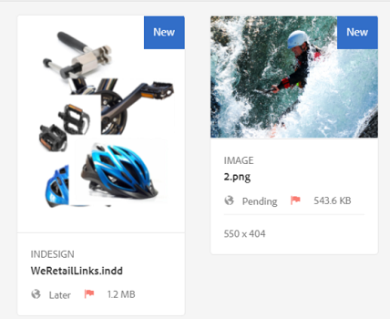

# 資產中的使用者體驗增強功能 {#user-experience-enhancements-in-assets}

AEM 6.4 Assets包含數種可用性改進，可提供順暢的使用體驗並提高生產力。 您建立／管理上市內容的速度提高，可提升業務的內容速度。

此介面回應速度更快，可協助您有效率地管理大量資產。 您可以快速搜尋、顯示、排序及順暢捲動長清單項目。

您可以個人化各種檢視——卡片、清單和欄檢視。 例如，您可以設定要在「卡片」檢視中顯示的縮圖大小。 在「清單」檢視中，您可以設定要在清單中顯示資產的詳細程度。 AEM 6.4 Assets包含新的樹狀檢視，可讓您輕鬆導覽至「資產」存放庫並尋找資產。

## 延遲載入 {#lazy-loading}

當您在AEM 6.4 Assets中瀏覽／搜尋資產時，一次最多會顯示200個資產。 您可以更快速捲動結果，這在瀏覽長的結果清單時特別有用。 由於一次會載入大量資產，因此瀏覽體驗十分順暢。

如果您點選／按一下資產以檢閱其詳細資訊頁面，您只需點選／按一下工具列中的「上一步」按鈕，即可返回結果頁面。

## 資訊卡檢視改良功能 {#card-view-improvements}

視您使用的裝置和所需的詳細程度而定，您可以在「卡片」檢視中調整資產縮圖大小。 這樣，您就可以個人化檢視，並控制顯示的縮圖數。

若要調整卡片檢視中縮圖的大小，請執行下列步驟：

1. 點選／按一下工具列中的「版面」圖示，然後選擇「檢視 **[!UICONTROL 設定]** 」選項。

   

1. 從「檢視 **[!UICONTROL 設定」對話方塊]** ，選取所要的縮圖大小，然後點選／按一下「 **[!UICONTROL 更新」]**。

   

1. 檢視以所選大小顯示的縮圖。

   

卡片檢視中的方塊現在會顯示其他資訊，例如出版物狀態。

## 清單檢視改良功能 {#list-view-improvements}

在「清單」檢視中，第一欄現在預設會顯示資產的檔案名稱。 此外，還會顯示其他資訊，例如出版和處理狀態和地區設定。

您可以選擇設定要顯示的詳細資料量。 點選／按一下「版面」圖示，選擇「檢 **[!UICONTROL 視設定」]** ，並指定您要在「檢視設定」對話 **[!UICONTROL 方塊中顯示的欄]** 。

## 欄檢視改良功能 {#column-view-improvements}

除了「卡片」和「清單」檢視外，您現在還可以從「欄」檢視導覽至資產的詳細資訊頁面。 從「欄」檢視中選取資產，然後點選／按一下資產快 **[!UICONTROL 照下的「更多詳細資訊]** 」。

## 樹視圖 {#tree-view}

AEM 6.4 Assets包含樹狀檢視，可讓您輕鬆瀏覽資產階層並導覽至所需的資產或檔案夾。

若要開啟樹狀檢視，請點選／按一下選單中的GlobalNav圖 `Assets UI`示，然後從選單 **[!UICONTROL 選擇「內容樹狀]** 」。

從內容階層，導覽至所要的資產。

## 導覽資產詳細資訊 {#navigating-asset-details}

資產詳細資料頁面現在包含工具列中的「上一頁」和「下一頁」按鈕，因此您可以連續檢視資料夾中的所有影像。

視您的裝置而定，您也可以滑動或使用鍵盤上的方向鍵，在影像之間來回移動。

您可以依據選擇的版面，以下列方式開啟資產的詳細資料頁面：

| **檢視** | **如何開啟資產詳細資訊頁面** |
|---|---|
| [!UICONTROL 卡片檢視] | 點選／按一下資產圖格。 |
| [!UICONTROL 清單檢視] | 點選／按一下清單中資產的列項目。 |
| [!UICONTROL 欄檢視] | 從資產快照點選/ **[!UICONTROL 按一下]** 「更多詳細資料」按鈕。 |

使用「上一頁／下一頁」按鈕，在資產之間來回移動。

