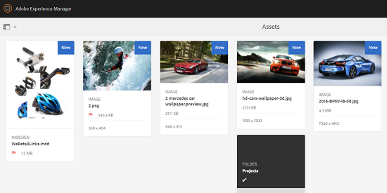

# Assets中的使用者體驗增強功能 {#user-experience-enhancements-in-assets}

>[!CAUTION]
>
>AEM 6.4已結束延伸支援，本檔案不再更新。 如需詳細資訊，請參閱 [技術支援期](https://helpx.adobe.com//tw/support/programs/eol-matrix.html). 尋找支援的版本 [此處](https://experienceleague.adobe.com/docs/).

[!DNL Experience Manager] 6.4 Assets包含數項可用性改善，可提供順暢的使用者體驗並提高生產力。 您可以建立/管理上市內容的速度增加，可提高業務的內容速度。

介面回應速度更快，可協助您有效管理大量資產。 您可以快速搜尋、顯示、排序，以及順利捲動一長串項目。

您可以個人化各種檢視 — 卡片、清單和欄檢視。 例如，您可以設定要在「卡片」檢視中顯示的縮圖大小。 對於「清單」檢視，您可以設定要針對清單中的資產顯示的詳細資訊層級。 [!DNL Experience Manager] 6.4 Assets包含新的樹狀檢視，可讓您輕鬆導覽Assets存放庫並尋找資產。

## 延遲載入 {#lazy-loading}

當您在 [!DNL Experience Manager] 6.4資產，一次最多顯示200個資產。 您可以更快捲動結果，這在瀏覽長清單的結果時特別有用。 由於一次載入了大量資產，因此瀏覽體驗會很流暢。

如果您點選/按一下資產以檢閱其詳細資訊頁面，您只需點選/按一下工具列中的「上一步」按鈕，即可返回結果頁面。

## 卡片檢視改善 {#card-view-improvements}

您可以根據您使用的裝置和所需的詳細程度，在「卡片」檢視中調整資產縮圖的大小。 這樣，您就可以個人化您的檢視，並控制顯示的縮圖數目。

要在「卡片」視圖中調整縮圖的大小，請執行以下步驟：

1. 點選/按一下工具列中的「版面」圖示，然後選擇 **[!UICONTROL 檢視設定]** 選項。

   

1. 從 **[!UICONTROL 檢視設定]** 對話方塊，選取所需的縮圖大小，然後點選/按一下 **[!UICONTROL 更新]**.

   

1. 查看以所選大小顯示的縮略圖。

   

「卡片」檢視中的方塊現在會顯示其他資訊，例如發佈狀態。

## 清單檢視改善 {#list-view-improvements}

在「清單」檢視中，第一欄現在預設會顯示資產的檔案名稱。 也會顯示其他資訊，例如發佈和處理狀態及地區設定。

您可以選擇設定要顯示的詳細資訊量。 點選/按一下「版面」圖示，選擇 **[!UICONTROL 檢視設定]** ，並指定要在 **[!UICONTROL 檢視設定]** 對話框。

## 欄檢視改善 {#column-view-improvements}

除了「卡片」和「清單」檢視，您現在還可以從「欄」檢視導覽至資產的詳細資訊頁面。 從「欄」檢視中選取資產，然後點選/按一下 **[!UICONTROL 更多詳情]** 在資產快照下。

## 樹視圖 {#tree-view}

[!DNL Experience Manager] 6.4資產包含樹狀檢視，可讓您輕鬆瀏覽資產階層，並導覽至所需的資產或資料夾。

若要開啟「樹」檢視，請點選/按一下 `Assets UI`，選擇 **[!UICONTROL 內容樹]** 的上界。

從內容階層導覽至所需的資產。

## 導覽資產詳細資訊 {#navigating-asset-details}

資產詳細資訊頁面現在包含工具列中的「上一頁」和「下一頁」按鈕，讓您可以連續檢視資料夾中的所有影像。

您也可以滑動或使用鍵盤上的方向鍵，在影像之間來回移動（視您的裝置而定）。

您可以依據所選的配置，透過下列方式開啟資產的詳細資訊頁面：

| **檢視** | **如何開啟資產詳細資訊頁面** |
|---|---|
| [!UICONTROL 卡片檢視] | 點選/按一下資產圖磚。 |
| [!UICONTROL 清單檢視] | 點選/按一下清單中資產的列項目。 |
| [!UICONTROL 欄檢視] | 點選/按一下 **[!UICONTROL 更多詳情]** 按鈕。 |

使用「上一頁/下一頁」按鈕，在資產之間來回移動。

