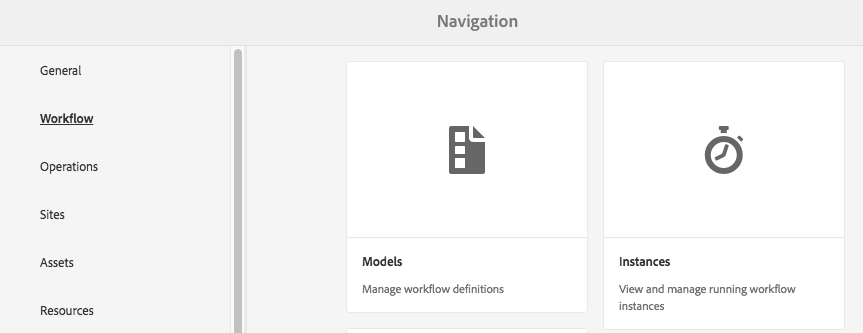
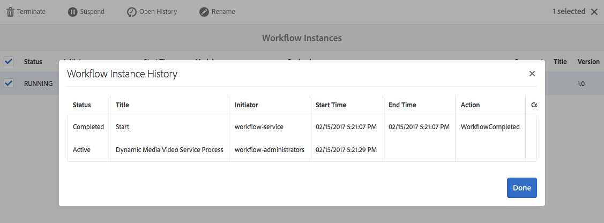
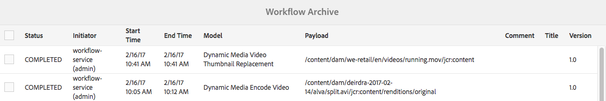

# 影片 {#video}

本節說明如何在Dynamic Media中使用影片。

## 快速入門：影片 {#quick-start-videos}

下列逐步工作流程說明旨在協助您透過Dynamic Media中的最適化視訊集快速上手並執行。 在每個步驟之後，會交叉參照主題標題，以取得詳細資訊。

>[!NOTE]
>
>在Dynamic Media中處理影片之前，請確定您的AEM管理員已啟用並設定Dynamic MediaCloud Services。
>
>* 請參閱在設定Dynamic Media — 混合模式中設定Dynamic MediaCloud Services[。](/help/assets/config-dynamic.md)
>* 請參閱[設定Dynamic Media - Scene7模式](config-dms7.md)和[疑難排解Dynamic Media - Scene7模式](troubleshoot-dms7.md)

>


1. **執行下列** 操作，上傳Dynamic Media影片：

   * 建立您自己的視訊編碼設定檔。 或者，您只需使用Dynamic Media隨附的預先定義「最適化視訊編碼」設定檔即可。

      * [建立視訊編碼設定檔](video-profiles.md)。
      * 深入了解[視訊編碼最佳實務](#best-practices-for-encoding-videos)。
   * 將視訊處理設定檔關聯至您要上傳主視訊的一或多個資料夾。

      * [將視訊描述檔套用至資料夾](video-profiles.md#applying-a-video-profile-to-folders)。
      * 深入了解[組織數位資產以使用處理設定檔的最佳實務](organize-assets.md#organize-using-folders)。
      * 深入了解[組織數位資產](organize-assets.md)。
   * 將主視訊上傳至資料夾。 您可以上傳每個高達15 GB的視訊檔案。 將視訊新增至資料夾時，會根據您指派給資料夾的視訊處理設定檔進行編碼。

      * [上傳您的影片](managing-video-assets.md#uploading-and-previewing-video-assets)。
      * 深入了解[支援的輸入檔案格式](assets-formats.md#supported-multimedia-formats)。
   * 監視[視訊編碼從資產或工作流程檢視進行](#monitoring-video-encoding-and-youtube-publishing-progress)的方式。


1. **執行下列任** 一操作，管理您的Dynamic Media影片：

   * 組織、瀏覽及搜尋影片資產

      * [組織數位資產](organize-assets.md)

         深入了解[組織數位資產以使用處理設定檔的最佳實務](organize-assets.md#organize-using-folders)

      * [搜尋視訊](search-video-assets.md) 資產 [或搜尋資產](managing-assets-touch-ui.md#searching-assets)
   * 預覽和發佈視訊資產

      * 檢視來源視訊和編碼的視訊轉譯及其相關聯的縮圖：

         [預覽](managing-video-assets.md#uploading-and-previewing-video-assets) 視訊或 [預覽資產](previewing-assets.md)

         [檢視視訊轉譯](video-renditions.md)

         [管理視訊轉譯](managing-assets-touch-ui.md#managing-renditions)

      * [管理檢視器預設集](managing-viewer-presets.md)
      * [發佈資產](publishing-dynamicmedia-assets.md)
   * 使用視訊中繼資料

      * 檢視編碼視訊轉譯的屬性，例如影格速率、音訊和視訊位元速率，以及轉碼器：

         [檢視視訊轉譯屬性](video-renditions.md)

      * 編輯視訊的屬性，例如標題、說明和標籤、自訂中繼資料欄位：

         [編輯視訊屬性](managing-assets-touch-ui.md#editing-properties)

      * [管理數位資產的中繼資料](metadata.md)
      * [中繼資料結構](metadata-schemas.md)
   * 檢閱、核准及註解影片

      * [為視訊](managing-video-assets.md#annotating-video-assets) 加上注 [解資產](managing-assets-touch-ui.md#annotating)
      * [將工作流程套](assets-workflow.md) 用至 [資產，或啟動資產的工作流程](managing-assets-touch-ui.md#starting-a-workflow-on-an-asset)
      * [檢閱資料夾資產](bulk-approval.md)
      * [專案](/help/sites-authoring/projects.md)


1. **執行下列** 其中一項操作以發佈Dynamic Media影片：

   * 如果您使用Adobe Experience Manager作為網頁內容管理系統，則可以直接將視訊新增至網頁。

      * [將視訊新增至您的網頁](adding-dynamic-media-assets-to-pages.md)。
   * 如果您使用協力廠商網頁內容管理系統，您可以將視訊連結或內嵌至您的網頁。

      * 使用URL整合視訊：

         [將 URL 連結至您的 Web 應用程式](linking-urls-to-yourwebapplication.md).
      * 使用網頁上的內嵌程式碼整合視訊：

         [將視訊檢視器內嵌在網頁上](embed-code.md)。
   * [將影片發佈至YouTube](#publishing-videos-to-youtube)。
   * [產生視訊報表](#viewing-video-reports)。
   * [為視訊新增字幕](#adding-captions-to-video)。


## 在Dynamic Media中使用影片 {#working-with-video-in-dynamic-media}

Dynamic Media中的視訊是端對端解決方案，可讓您輕鬆發佈高品質的最適化視訊，以在多個畫面間串流，包括桌上型電腦、iOS、Android、Blackberry和Windows行動裝置。 適用性視訊集將以不同位速率和格式（如400 kbps、800 kbps和1000 kbps）編碼的相同視訊的版本分組。 台式電腦或行動裝置會偵測可用頻寬。

例如，在iOS行動裝置上，會偵測頻寬，例如3G、4G或Wi-Fi。 然後，它自動從自適應視訊集內的各種視訊位速率中選取正確編碼的視訊。 視訊會串流至桌上型電腦、行動裝置或平板電腦。

此外，如果案頭或行動裝置上的網路條件改變，視訊品質會自動動態切換。 此外，如果客戶在桌上型電腦上進入全螢幕模式，適用性視訊集會使用更佳的解析度來回應，進而改善客戶的觀看體驗。 使用最適化視訊集，可讓客戶在多個畫面和裝置上播放Dynamic Media視訊，獲得最佳的播放效果。

視訊播放器用來判斷播放或播放期間要選取的編碼視訊的邏輯，是根據下列演算法：

1. 視訊播放器會根據最接近播放器本身中為「初始位元速率」所設定的值的位元速率，載入初始視訊片段。
1. 視訊播放器會根據頻寬速度的變更，使用下列條件進行切換：

   1. 播放器會選擇低於或等於估計頻寬的最高頻寬流。
   1. 播放器僅考慮可用頻寬的80%。 然而，如果它在轉換，則只有70%會更為保守，以避免高估，並立即重新轉換。

如需演算法的詳細技術資訊，請參閱[https://android.googlesource.com/platform/frameworks/av/+/master/media/libstagefright/httplive/LiveSession.cpp](https://android.googlesource.com/platform/frameworks/av/+/master/media/libstagefright/httplive/LiveSession.cpp)

若要管理單一視訊和最適化視訊集，支援下列項目：

* 從多種支援的視訊格式和音訊格式上傳視訊，並將視訊編碼為MP4 H.264格式，以便在多個畫面間播放。 您可以使用預先定義的最適化視訊預設集、單一視訊編碼預設集，或自訂自己的編碼以控制視訊的品質和大小。

   * 產生最適化視訊集時，會包含MP4視訊。
   * **注意**:主視訊/來源視訊不會新增至最適化視訊集。

* 所有HTML5視訊檢視器中的視訊字幕。
* 透過完整的中繼資料支援，組織、瀏覽和搜尋視訊，以有效管理視訊資產。
* 將最適化視訊集傳送至網路以及桌上型電腦和行動裝置，包括iPhone、iPad、Android、Blackberry和Windows電話。

多種iOS平台均支援最適化視訊串流。 請參閱[Adobe檢視器參考指南](https://experienceleague.adobe.com/docs/dynamic-media-developer-resources/library/home.html)。

Dynamic Media支援MP4 H.264視訊的行動視訊播放。 您可以在以下位置找到支援此視頻格式的Blackberry設備：[Blackberry](https://support.blackberry.com/kb/articleDetail?ArticleNumber=000005482)上支援的視頻格式。

您可以在以下位置找到支援此視頻格式的Windows設備：[Windows Phone](https://msdn.microsoft.com/library/windows/apps/ff462087%28v=vs.105%29.aspx)上支援的視訊格式

* 使用Dynamic Media視訊檢視器預設集播放視訊，包括下列內容：

   * 單一影片檢視器。
   * 混合媒體檢視器，可結合視訊和影像內容。

* 設定視訊播放器以符合您的品牌需求。
* 將視訊與您的網站、行動網站或行動應用程式整合，並使用簡單的URL或內嵌程式碼。

<!-- See [Dynamic video playback](https://s7d9.scene7.com/s7/uvideo.jsp?asset=GeoRetail/Mop_AVS&config=GeoRetail/Universal_Video1&stageSize=640,480). -->

另請參閱「AdobeDynamic Media檢視器參考指南」中的[關於HTML5檢視器](https://experienceleague.adobe.com/docs/dynamic-media-developer-resources/library/viewers-for-aem-assets-only/c-html5-aem-asset-viewers.html?lang=en#viewers-for-aem-assets-only)。

## 最佳實務：使用HTML5視訊檢視器 {#best-practice-using-the-html-video-viewer}

Dynamic Media HTML5視訊檢視器預設集是強大的視訊播放器。 您可以使用它們來避免與HTML5視訊播放相關的許多常見問題，以及與行動裝置相關的問題，例如缺乏最適化串流傳送以及案頭瀏覽器觸及率有限。

在播放器的設計端，您可以使用標準網頁開發工具來設計所有視訊播放器的功能。 例如，您可以使用HTML5和CSS來設計按鈕、控制項和自訂海報影像背景，以協助您以自訂外觀觸及客戶。

在檢視器的播放端，會自動偵測瀏覽器的視訊功能。 然後，使用HLS串流（最適化視訊串流）提供視訊。 或者，如果這些傳送方法不存在，則會改用HTML5漸進式。

結合為單一播放器，即可使用HTML5和CSS設計播放元件、內嵌播放，以及根據瀏覽器功能使用最適化和漸進式串流，將多媒體內容的觸及範圍擴展至案頭和行動使用者，並確保簡化的視訊體驗。

另請參閱「Adobe檢視器參考指南」中的[關於HTML5檢視器](https://experienceleague.adobe.com/docs/dynamic-media-developer-resources/library/viewers-for-aem-assets-only/c-html5-aem-asset-viewers.html)。

### 使用HTML5視訊檢視器在桌上型電腦和行動裝置上播放視訊 {#playback-of-video-on-desktop-computers-and-mobile-devices-using-the-html-video-viewer}

針對案頭和行動最適化視訊串流，用於位元速率切換的視訊是以最適化視訊集中的所有MP4視訊為基礎。

使用HLS（HTTP即時串流）視訊串流或漸進式視訊下載時，就會發生視訊播放。 在舊版AEM（例如6.0、6.1和6.2）中，影片會透過HTTP串流化。

不過，在AEM 6.3及更新版本中，視訊現在會透過HTTPS串流（亦即HLS視訊串流），因為DM閘道服務URL一律使用HTTPS。 請注意，此預設行為不會影響客戶。 也就是說，除非瀏覽器不支援，否則視訊串流一律會透過HTTPS進行。 （請參閱下表）。 因此，

* 如果您的HTTPS網站採用HTTPS視訊串流，則串流沒問題。
* 如果您的HTTP網站採用HTTPS視訊串流，串流沒問題，且網頁瀏覽器沒有混合的內容問題。

HLS（HTTP即時串流）是適用性視訊串流的Apple標準，可根據網路頻寬容量自動調整播放。 它也可讓客戶「搜尋」視訊中的任何點，而不需要等待視訊的其餘部分下載（另請參閱HTTP即時串流）。

通過將視頻下載並本地儲存到用戶的案頭螢幕或移動設備來提供漸進式視頻。

下表說明使用Dynamic Media視訊檢視器在桌上型電腦和行動裝置上播放視訊的裝置、瀏覽器和播放方法。

<table> 
 <tbody> 
  <tr> 
   <td><strong>裝置</strong></td>
   <td><strong>瀏覽器</strong></td>
   <td><strong>視訊播放模式</strong></td>
  </tr>
  <tr> 
   <td>桌面</td>
   <td>Internate Explorer 9和10</td>
   <td>漸進式下載。</td>
  </tr>
  <tr> 
   <td>桌面</td>
   <td>Internate Explorer 11+</td>
   <td>在Windows 8和Windows 10上 — 每當請求HLS時，強制使用HTTPS。 已知限制：HLS上的HTTP在此瀏覽器/作業系統組合<br /> <br /> Windows 7上無法運作 — 漸進式下載。 使用標準邏輯來選取HTTP與HTTPS通訊協定。</td>
  </tr>
  <tr> 
   <td>桌面</td>
   <td>Firefox 23-44</td>
   <td>漸進式下載。</td>
  </tr>
  <tr> 
   <td>桌面</td>
   <td>Firefox 45或更新版本</td>
   <td>HLS視訊串流。</td>
  </tr>
  <tr> 
   <td>桌面</td>
   <td>鉻黃</td>
   <td>HLS視訊串流。</td>
  </tr>
  <tr> 
   <td>桌面</td>
   <td>Safari(Mac)</td>
   <td>HLS視訊串流。</td>
  </tr>
  <tr> 
   <td>行動</td>
   <td>Chrome（Android 6或更舊版本）</td>
   <td>漸進式下載。</td>
  </tr>
  <tr> 
   <td>行動</td>
   <td>Chrome（Android 7或更新版本）</td>
   <td>HLS視訊串流。</td>
  </tr>
  <tr> 
   <td>行動</td>
   <td>Android（預設瀏覽器）</td>
   <td>漸進式下載。</td>
  </tr>
  <tr> 
   <td>行動</td>
   <td>Safari(iOS)</td>
   <td>HLS視訊串流。</td>
  </tr>
  <tr> 
   <td>行動</td>
   <td>Chrome(iOS)</td>
   <td>HLS視訊串流。</td>
  </tr>
  <tr> 
   <td>行動</td>
   <td>Blackberry</td>
   <td>HLS視訊串流。</td>
  </tr>
 </tbody>
</table>

## Dynamic Media視訊解決方案架構 {#architecture-of-dynamic-media-video-solution}

下圖顯示影片的整體製作工作流程，這些影片會透過DMGateway上傳和編碼，並供公眾使用。


## 影片的混合發佈架構 {#hybrid-publishing-architecture-for-videos}


## 編碼視訊的最佳作法 {#best-practices-for-encoding-videos}

如果您 **** 已啟用動態媒體並設定視訊雲端服務，「動態媒體編碼視訊」工作流程會對視訊進行編碼。此工作流程會擷取工作流程處理歷程記錄和失敗資訊。請參閱 [監控視訊編碼和YouTube發佈進度](#monitoring-video-encoding-and-youtube-publishing-progress)。如果您已啟用Dynamic Media並設定視訊雲端服務，當您上傳視訊時，**[!UICONTROL Dynamic Media編碼視訊]**&#x200B;工作流程會自動生效。 (如果您未使用Dynamic Media, **[!UICONTROL DAM更新資產]**&#x200B;工作流程將生效。)

<!-- DEAD ARTICLE AND VIDEO LINK The following are best-practice tips for encoding source video files.

For advice about video encoding, see the following:

* Article: *Streaming 101: The Basics — Codecs, Bandwidth, Data Rate, and Resolution:* [www.adobe.com/go/learn_s7_streaming101_en](https://www.adobe.com/go/learn_s7_streaming101_en).
* Video: *Video Encoding Basics:* [www.adobe.com/go/learn_s7_encoding_en](https://www.adobe.com/go/learn_s7_encoding_en). -->

### 源視頻檔案 {#source-video-files}

為視訊檔案編碼時，請使用盡可能高品質的來源視訊檔案。 請避免使用先前編碼的視訊檔案，因為這些檔案已經壓縮，而進一步編碼會造成品質欠佳的視訊。

下表說明了在對源視頻檔案進行編碼之前，您應該具有的建議大小、外觀比例和最小比特率：

| 大小 | 外觀比例 | 最小比特率 |
|--- |--- |--- |
| 1024 X 768 | 4:3 | 大部分視訊為4500 kbps。 |
| 1280 X 720 | 16:9 | 3000 - 6000 kbps，視訊中的運動量而定。 |
| 1920 X 1080 | 16時9分 | 6000 - 8000 kbps，視訊中的運動量而定。 |

### 取得檔案的中繼資料 {#obtaining-a-file-s-metadata}

您可以使用視訊編輯工具檢視其中繼資料，或使用專為取得中繼資料而設計的應用程式，以取得檔案的中繼資料。 以下是使用協力廠商應用程式MediaInfo來取得視訊檔案中繼資料的指示：

1. 轉到此網頁：[https://mediaarea.net/en/MediaInfo](https://mediaarea.net/en/MediaInfo)。
1. 選擇並下載所用GUI版本的安裝程式，並按照安裝說明操作。
1. 安裝後，按一下右鍵視頻檔案（僅限Windows）並選擇&#x200B;**[!UICONTROL MediaInfo]**，或開啟&#x200B;**[!UICONTROL MediaInfo]**&#x200B;並將視頻檔案拖入應用程式。 您會看到與視訊檔案相關聯的所有中繼資料，包括其寬度、高度和fps。

### 外觀比例 {#aspect-ratio}

當您選擇或建立主視訊檔案的視訊編碼預設集時，請確定預設集與主視訊檔案的外觀比例相同。 長寬比是視訊寬度與高度的比率。

若要確定視訊檔案的長寬比，請取得檔案的中繼資料，並記下檔案的寬度和高度（請參閱上方取得檔案的中繼資料）。 然後使用此公式來確定外觀比例：

*寬/高=長寬比*

下表說明公式結果如何轉換為通用外觀比例選擇：

| 公式結果 | 外觀比例 |
|--- |--- |
| 1.33 | 4:3 |
| 0.75 | 3:4 |
| 1.78 | 16時9分 |
| 0.56 | 9時16分 |

例如，寬度為1440 x 1080的視頻的長寬比為1440/1080，即1.33。在這種情況下，您可以選擇長寬比為4:3的視頻編碼預設集來編碼視頻檔案。

### 位元速率 {#bitrate}

位元速率是經過編碼，組成視訊播放一秒的資料量。 位元速率以千比特/秒（每秒位元組數）測量。

因為所有轉碼器都使用有損壓縮，所以位元速率是視訊品質中最重要的因素。 有損壓縮越是壓縮視頻檔案，質量就越降低。 因此，所有其他特性相等（解析度、幀速率和編解碼器），位元速率越低，壓縮檔案的質量就越低。

選取位元速率編碼時，可以選擇兩種類型：

* **常數位元速率編碼** (CBR) — 在CBR編碼期間，位元速率或每秒位數在整個編碼過程中保持相同。CBR編碼在整個視頻中將設定的資料速率保存為設定。 此外，CBR編碼不會為質量優化介質檔案，但會節省儲存空間。

   如果視頻在整個視頻中包含類似的運動級別，則使用CBR。 CBR最常用於流式視頻內容。 另請參閱[使用自訂新增的視訊編碼參數](video-profiles.md#using-custom-added-video-encoding-parameters)。

* **變數位元速率編碼** (VBR)- VBR編碼會根據壓縮程式所需的資料，將資料速率調低至您設定的上限。這表示在VBR編碼過程中，媒體檔案的位元速率會根據媒體檔案的位元速率需求，以動態方式增加或減少。

   VBR編碼需要較長的時間，但會產生最有利的結果；媒體檔案的品質優越。 VBR最常用於http漸進式傳送視訊內容。

**何時應使用VBR或CRB?**
在選擇VBR或CBR時，幾乎總是建議您將VBR用於介質檔案。VBR以有競爭力的位元速率提供更高品質的檔案。 使用VBR時，請務必使用兩遍編碼，並將最大位元速率設為目標視訊位元速率的1.5倍。

選擇視訊編碼預設集時，請考慮目標使用者的連線速度。 選擇資料速率為該速度80%的預設集。 例如，如果目標最終用戶的連接速度為1000 Kbps，則最佳預設是視頻資料速率為800 Kbps的預設。

此表描述了典型連接速度的資料速率。

| 速度(Kbps) | 連線類型 |
|--- |--- |
| 256 | 撥號連接。 |
| 800 | 典型的行動連線。 對於此連線，若為3G體驗，將資料速率定位在400到最大800的範圍內。 |
| 2000年 | 典型的寬頻案頭連接。 對於此連接，目標資料速率為800-2000 Kbps，大多數目標平均為1200-1500 Kbps。 |
| 5000 | 典型的高寬頻連接。 不建議使用此上限的編碼，因為大多數消費者無法使用此速度的視訊傳送。 |

### 解析度 {#resolution}

**** 解析度以像素說明視訊檔案的高度和寬度。大部分的源視頻都以高解析度儲存（例如1920 x 1080）。 為了串流目的，來源視訊會壓縮為較小的解析度（640 x 480或更小）。

解析度和資料速率是決定視訊品質的兩個整體連結因素。 若要維持相同的視訊品質，視訊檔案中的像素數目越多（解析度越高），資料速率就必須越高。 例如，請考慮解析度為320 x 240和解析度為640 x 480的視頻檔案中每幀的像素數：

| 解析度 | 每幀像素 |
|--- |--- |
| 320 x 240 | 七萬六千八百 |
| 640 x 480 | 30.72萬 |

640 x 480檔案的像素是每幀的4倍。 若要針對這兩個範例解析度取得相同的資料速率，您可對640 x 480檔案套用4倍的壓縮，以降低視訊品質。 因此，250 Kbps的視頻資料速率以320 x 240解析度產生高質量的觀看，而不是以640 x 480解析度產生。

一般而言，您使用的資料速率越高，視訊的外觀越好，使用的解析度越高，您維持檢視品質所需的資料速率就越高（解析度越低）。

由於解析度和資料速率是連結的，因此在對視訊進行編碼時有兩個選項：

* 選擇資料速率，然後以最高解析度編碼，且以您選擇的資料速率看起來不錯。
* 選擇解析度，然後按照所需的資料速率進行編碼，以按您選擇的解析度實現高質量視頻。

當您選擇（或建立）主視訊檔案的視訊編碼預設集時，請使用下表來鎖定正確的解析度：

| 解析度 | 高度 (像素) | 螢幕大小 |
|--- |--- |--- |
| 240便士 | 240 | 小螢幕 |
| 300便士 | 300 | 小螢幕，通常用於行動裝置 |
| 360便士 | 360 | 小螢幕 |
| 480便士 | 480 | 中螢幕 |
| 720便士 | 720 | 大螢幕 |
| 1080便士 | 1080 | 高清大螢幕 |

### Fps（每秒幀數） {#fps-frames-per-second}

在美國和日本，大多數視頻以每秒29.97幀(fps)拍攝；在歐洲，大多數視頻以25幀/秒的速度拍攝。 以24 fps拍攝。

選擇符合主視訊檔案的fps速率的視訊編碼預設集。 例如，如果主視訊是25 fps，請選擇編碼預設集(25 fps)。 依預設，所有自訂編碼都使用主視訊檔案的fps。 因此，建立視訊編碼預設集時，您不需要明確指定fps設定。

### 視訊編碼維度 {#video-encoding-dimensions}

為獲得最佳結果，請選取編碼維度，使來源視訊是所有已編碼視訊的整數倍。

要計算此比率，可將源寬度除以編碼寬度以獲得寬比。 然後，將源高度除以編碼高度以得到高度比。

如果產生的比率是整數，則表示視訊已最佳縮放。 如果產生的比率不是整數，它會在顯示器上保留剩餘的像素偽影，以影響視訊品質。 當視訊有文字時，此效果最顯著。

例如，假設您的來源視訊為1920 x 1080。 在下表中，三個已編碼的視訊可提供要使用的最佳編碼設定。

<table> 
 <tbody> 
  <tr> 
   <th><p>視訊類型</p> </th> 
   <th><p>寬x高</p> </th> 
   <th><p>寬度比例</p> </th> 
   <th><p>高度比</p> </th> 
  </tr>
  <tr> 
   <td><p>來源</p> </td> 
   <td><p>1920x1080</p> </td> 
   <td><p>1</p> </td> 
   <td><p>3</p> </td> 
  </tr> 
  <tr> 
   <td><p>編碼</p> </td> 
   <td><p>960 x 540</p> </td> 
   <td><p>2</p> </td> 
   <td><p>2</p> </td> 
  </tr> 
  <tr> 
   <td><p>編碼</p> </td> 
   <td><p>640 x 360</p> </td> 
   <td><p>3</p> </td> 
   <td><p>3</p> </td> 
  </tr> 
  <tr> 
   <td><p>編碼</p> </td> 
   <td><p>480 x 270</p> </td> 
   <td><p>4</p> </td> 
   <td><p>4</p> </td> 
  </tr> 
 </tbody> 
</table>

### 編碼視訊檔案格式 {#encoded-video-file-format}

Dynamic Media建議使用MP4 H.264視訊編碼預設集。 由於MP4檔案使用H.264視訊轉碼器，因此可提供高品質的視訊，但檔案大小壓縮。

## 將影片發佈至YouTube {#publishing-videos-to-youtube}

您可以直接將內部部署的AEM視訊資產發佈至您先前建立的YouTube管道。

若要將影片資產發佈至YouTube，請使用標籤設定AEM Assets。 將這些標籤與YouTube管道建立關聯。 如果影片資產的標籤符合YouTube頻道的標籤，則影片會發佈至YouTube。 如果視訊資產沒有標籤，則不會發佈至YouTube。

發佈至YouTube會略過AEM中的處理設定檔系統，因此也會略過視訊編碼設定檔。 發生此次略過是因為YouTube有其專屬的編碼，因此不需要視訊處理設定檔。 不過，在大多數情況下，您應該已讓視訊資產通過視訊處理設定檔。 略過視訊處理設定檔並直接發佈至YouTube時，這只是表示AEM Asset中的視訊資產沒有可檢視的縮圖。 這也表示，如果您以dynamicmedia執行模式執行，未編碼的視訊將無法用於任何Dynamic Media資產類型。

將視訊資產發佈至YouTube伺服器時，必須完成下列工作，以確保透過YouTube進行安全的伺服器對伺服器驗證：

1. [設定Google雲端設定](#configuring-google-cloud-settings)
1. [建立YouTube管道](#creating-a-youtube-channel)
1. [新增要發佈的標籤](#adding-tags-for-publishing)
1. [啟用YouTube Publish復寫代理](#enabling-the-youtube-publish-replication-agent)
1. [在AEM中設定YouTube](#setting-up-youtube-in-aem)
1. [（選用）自動設定已上傳影片的預設YouTube屬性](#optional-automating-the-setting-of-default-youtube-properties-for-your-uploaded-videos)
1. [將影片發佈至您的YouTube頻道](#publishing-videos-to-your-youtube-channel)
1. [（選用）驗證YouTube上發佈的影片](video.md#optional-verifying-the-published-video-on-youtube)
1. [將YouTube URL連結至您的Web應用程式](#linking-youtube-urls-to-your-web-application)

您也可以[取消發佈視訊，以從YouTube](#unpublishing-videos-to-remove-them-from-youtube)中移除視訊。

### 配置Google雲端設定 {#configuring-google-cloud-settings}

若要發佈至YouTube，您需要Google帳戶。 如果您有GMAIL帳戶，則您已有Google帳戶。 如果您沒有Google帳戶，便可輕鬆建立帳戶。 您需要帳戶，因為您需要憑證才能將影片資產發佈至YouTube。 如果您已建立帳戶，請略過此任務，然後繼續[建立YouTube通道](#creating-a-youtube-channel)。

>[!NOTE]
>
>在編寫本文時，以下步驟是正確的。 不過，谷歌會不經通知就定期更新其網站。 因此，這些步驟可能略有不同。

**若要配置Google雲端設定**:

1. 建立新的Google帳戶。

   [https://accounts.google.com/SignUp?service=mail](https://accounts.google.com/SignUp?service=mail)

   如果您已有Google帳戶，請跳至下一個步驟。

1. 前往[https://cloud.google.com/](https://cloud.google.com/)。
1. 在「Google雲端平台」頁面的頂端附近，點選「**[!UICONTROL 主控台]**」。 您可能需要使用您的Google帳戶憑證登入&#x200B;**。**
1. 在&#x200B;**[!UICONTROL 控制面板]**&#x200B;頁面上，點選&#x200B;**[!UICONTROL 建立專案]**。
1. 在&#x200B;**[!UICONTROL 新建項目]**&#x200B;對話框中，在項目名稱中輸入。

   請注意，您的專案ID是以您的專案名稱為基礎。 因此，請謹慎選擇專案名稱；建立後無法變更。 此外，您稍後在Adobe Experience Manager中設定YouTube時，將需要再次輸入相同的專案ID。 您可以記下專案的ID。
1. 點選&#x200B;**[!UICONTROL 建立]**。

1. 在專案的&#x200B;**[!UICONTROL Dashboard]**&#x200B;中，在&#x200B;**[!UICONTROL Getting Started]**&#x200B;卡片中，點選&#x200B;**[!UICONTROL Enable API並取得金鑰]**&#x200B;之類的憑證。
1. 在&#x200B;**[!UICONTROL Dashboard]**&#x200B;頁面頂端附近，點選&#x200B;**[!UICONTROL 啟用API]**。
1. 在&#x200B;**[!UICONTROL Library]**&#x200B;頁面的YouTube API底下，點選&#x200B;**[!UICONTROL YouTube Data API]**。
1. 在&#x200B;**[!UICONTROL YouTube資料API v3]**&#x200B;頁面頂端附近，點選&#x200B;**[!UICONTROL 啟用]**&#x200B;以開啟它。
1. 若要使用API，您可能需要憑證。 如有必要，請點選&#x200B;**[!UICONTROL 建立憑證]**。
1. 從&#x200B;**[!UICONTROL 您要從何處呼叫API?]** 下拉清單，選 **[!UICONTROL 取「Web伺服器」（例如node.js、Tomcat）]**。
1. 在&#x200B;**[!UICONTROL 下，您將訪問哪些資料？]** 選取 **[!UICONTROL 使用者資料]**。
1. 點選&#x200B;**[!UICONTROL 我需要什麼憑證？]** 按鈕.
1. 在&#x200B;**[!UICONTROL 建立OAuth 2.0用戶端ID]**&#x200B;標題下，輸入唯一名稱。
1. 在&#x200B;**[!UICONTROL 授權Javascript原始項]**&#x200B;標題下的文本欄位中，輸入以下路徑，在路徑中替換您自己的域和埠號，然後按&#x200B;**[!UICONTROL Enter]**&#x200B;將路徑添加到清單中：

   `https://<servername.domain>:<port_number>`

   例如， `https://1a2b3c.mycompany.com:4321`

   **注意**:上述路徑範例僅供說明之用。

1. 在&#x200B;**[!UICONTROL Authorized redirect URIs]**&#x200B;標題下的文本欄位中，輸入以下內容，在路徑中替換您自己的域和埠號，然後按Enter將路徑添加到清單中：

   `https://<servername.domain>:<port#>/etc/cloudservices/youtube.youtubecredentialcallback.json`

   例如， `https://1a2b3c.mycompany.com:4321/etc/cloudservices/youtube.youtubecredentialcallback.json`

   **注意**:上述路徑範例僅供說明之用。

1. 點選&#x200B;**[!UICONTROL 建立用戶端ID]**。
1. 在「認證」頁面的「**[!UICONTROL 設定OAuth 2.0同意書畫面]** 」標題下，選取您目前使用的Gmail位址。
1. 在&#x200B;**[!UICONTROL 顯示給使用者的產品名稱]**&#x200B;標題下方的文字欄位中，輸入您要在同意畫面上顯示的內容。

   AEM管理員向YouTube驗證時，會顯示同意畫面；AEM會聯絡YouTube以取得權限。

1. 點選&#x200B;**[!UICONTROL 繼續]**。
1. 在「**[!UICONTROL 下載憑證]**」標題下，點選「**[!UICONTROL 下載]**」。
1. 保存`client_id.json`檔案。

   稍後在Adobe Experience Manager中設定YouTube時，您需要此下載的json檔案。

1. 點選&#x200B;**[!UICONTROL Done]**。

   現在您將建立YouTube管道。

### 建立YouTube管道 {#creating-a-youtube-channel}

若要將影片發佈至YouTube，您必須擁有一或多個管道。 如果您已建立YouTube管道，可以略過此工作，然後前往&#x200B;**新增標籤以進行發佈**。

>[!CAUTION]
>
>請確定您已在YouTube &amp;ast;before&amp;ast；中設定一或多個通道您可以在AEM的「YouTube設定」下新增管道(請參閱下方的「在AEM](#setting-up-youtube-in-aem)中設定YouTube」)。 [若您未執行此動作，則不會收到任何警告，指出沒有現有管道。 不過，新增管道時仍會發生Google驗證，但無法選擇要傳送視訊的管道。

**若要建立YouTube管道**:

1. 前往[https://www.youtube.com](https://www.youtube.com/)並使用您的Google帳戶憑證登入。
1. 在YouTube頁面的右上角，點選您的描述檔圖片（也可能以實色圓圈內的字母顯示），然後點選&#x200B;**[!UICONTROL YouTube設定]**（圓齒輪圖示）。
1. 在&#x200B;**[!UICONTROL 概述]**&#x200B;頁面的&#x200B;**[!UICONTROL 其他功能]**&#x200B;標題下，點選&#x200B;**[!UICONTROL 查看所有我的頻道或建立新頻道]**。
1. 在&#x200B;**[!UICONTROL 頻道]**&#x200B;頁面，點選&#x200B;**[!UICONTROL 建立新頻道]**。
1. 在「**[!UICONTROL 品牌帳戶]**」頁面的「**[!UICONTROL 品牌帳戶名稱]**」欄位中，輸入商業名稱或您選擇要發佈視訊資產的任何其他頻道名稱，然後點選「**[!UICONTROL 建立]**」。

   請記住您在這裡輸入的名稱，因為在AEM中設定YouTube時，您需要再次輸入名稱。

1. （選用）如有必要，請新增更多管道。

   現在您將新增發佈的標籤。

### 新增要發佈的標籤 {#adding-tags-for-publishing}

若要發佈至YouTube的影片，AEM會將標籤關聯至一或多個YouTube頻道。 若要新增要發佈的標籤，請參閱[管理標籤](/help/sites-administering/tags.md)。

或者，如果您想在AEM中使用預設標籤，可以跳過此任務並轉至[啟用YouTube Publish複製代理](#enabling-the-youtube-publish-replication-agent)。

### 啟用YouTube Publish復寫代理 {#enabling-the-youtube-publish-replication-agent}

1. 在AEM的左上角，點選AEM標誌，然後在左側導軌中，點選「 **[!UICONTROL 工具>部署>復寫>製作上的代理」]**。
1. 在&#x200B;**[!UICONTROL 作者代理]**&#x200B;頁面上，點選&#x200B;**[!UICONTROL YouTube Publish(youtube)]**。
1. 在工具列的「設定」右側，點選「**[!UICONTROL Edit]**」。
1. 選中&#x200B;**[!UICONTROL 啟用]**&#x200B;複選框以開啟複製代理。
1. 點選&#x200B;**[!UICONTROL 確定]**。

   現在您將在AEM中設定YouTube。

### 在AEM中設定YouTube {#setting-up-youtube-in-aem}

1. 在AEM的左上角，點選AEM標誌，然後在左側導軌中，點選「 **[!UICONTROL 工具>部署>Cloud Services」]**。
1. 在&#x200B;**[!UICONTROL 第三方服務]**&#x200B;標題下，點選「YouTube」下，點選「**[!UICONTROL 立即配置」]**。
1. 在&#x200B;**[!UICONTROL 建立配置]**&#x200B;對話框中，在相應欄位中輸入標題（必填）和名稱（選填）。
1. 點選&#x200B;**[!UICONTROL 建立]**。
1. 在&#x200B;**[!UICONTROL YouTube帳戶設定]**&#x200B;對話方塊的&#x200B;**[!UICONTROL 應用程式名稱]**&#x200B;欄位中，輸入Google專案ID。

   您最初設定Google Cloud設定時，已指定專案ID。

   保持&#x200B;**[!UICONTROL YouTube帳戶設定]**&#x200B;對話框開啟；你稍後會回來。

1. 使用純文字編輯器，開啟您先前在「設定Google雲端」設定工作中下載並儲存的JSON檔案。
1. 選取並複製整個JSON文字。
1. 返回&#x200B;**[!UICONTROL YouTube帳戶設定]**&#x200B;對話方塊。 在「 **[!UICONTROL JSON設定」欄位中]** ，貼上JSON文字。
1. 點選&#x200B;**[!UICONTROL 確定]**。

   您現在將在AEM中設定YouTube管道。

1. 在「可用頻道」 **[!UICONTROL 的右側]**，點 **[!UICONTROL 選+]**  (加號圖示)。
1. 在&#x200B;**[!UICONTROL YouTube通道設定]**&#x200B;對話框的&#x200B;**[!UICONTROL 標題]**&#x200B;欄位中，輸入您在先前建立YouTube通道&#x200B;]**的任務** C[!UICONTROL 中建立的通道名稱。

   您可以視需要選擇新增說明。

1. 點選&#x200B;**[!UICONTROL 確定]**。
1. YouTube/Google驗證隨即顯示。 如果您尚未登入Google雲端帳戶，請略過此步驟。

   * 輸入與上述Google專案ID和JSON文字相關聯的Google使用者名稱和密碼。
   * 視您的帳戶有多少管道而定，您會看到兩個或多個項目。 選取管道。 不要選擇電子郵件地址。
   * 在下一頁，點選&#x200B;**[!UICONTROL 接受]**&#x200B;以允許存取此通道。

1. 點選&#x200B;**[!UICONTROL 允許]**。

   您現在將設定發佈的標籤。

1. **設定要發佈的標籤**  — 在「 **[!UICONTROL Cloud Services>]** YouTube」頁 **** 面上，點選「Pencilicon」以編輯您要使用的標籤清單。
1. 點選下拉式清單圖示（向上插入符號），以顯示AEM中可用標籤的清單。
1. 點選一或多個標籤以新增。

   若要刪除您已新增的標籤，請選取標籤，然後點選&#x200B;**[!UICONTROL X]**。

1. 添加完所需標籤後，點選&#x200B;**[!UICONTROL OK]**。

   現在您可將影片發佈至YouTube頻道。

### （選用）自動設定已上傳影片的預設YouTube屬性 {#optional-automating-the-setting-of-default-youtube-properties-for-your-uploaded-videos}

您可以在上傳影片時自動設定YouTube屬性。 您需在AEM中建立中繼資料處理設定檔，才能達成此目的。

若要建立中繼資料處理設定檔，您必須先從「欄位標籤 **[!UICONTROL 」、「對應至屬性]********** 」和「選擇」欄位複製值，這些全都可在視訊的中繼資料結構中找到。然後，您會新增這些值，以建立您的YouTube視訊中繼資料處理設定檔。

**若要選擇自動設定您所上傳影片的預設YouTube屬性**:

1. 在AEM的左上角，點選AEM標誌，然後在左側導軌中，點選「 **[!UICONTROL 工具>資產>中繼資料結構]**」。
1. 點選&#x200B;**[!UICONTROL default]**。 （請勿在「預設」左側的選取方塊中新增核取記號。）
1. 在&#x200B;**[!UICONTROL default]**&#x200B;頁面上，核取&#x200B;**[!UICONTROL video]**&#x200B;左側的方塊，然後點選&#x200B;**[!UICONTROL Edit]**。
1. 在「**[!UICONTROL 中繼資料結構編輯器]**」頁面上，點選「**[!UICONTROL 進階]**」標籤。
1. 在「 YouTube Publishing」標題下，點選「**[!UICONTROL YouTube Category]**」。 (請勿點選「YouTube類別」下拉式清單。)
1. 在頁面右側的&#x200B;**[!UICONTROL Settings]**&#x200B;標籤下，執行下列操作：

   * 在&#x200B;**[!UICONTROL 欄位標籤]**&#x200B;文本欄位中，選擇並複製值。

      將複製的值貼到開啟的文字編輯器中。 稍後當您建立中繼資料處理設定檔時，將需要此值。 將文字編輯器保持開啟。

   * 在&#x200B;**[!UICONTROL 映射至屬性]**&#x200B;文字欄位中，選取並複製值。

      將複製的值貼到開啟的文字編輯器中。 稍後當您建立中繼資料處理設定檔時，將需要此值。 將文字編輯器保持開啟。

   * 在&#x200B;**[!UICONTROL Choices]**&#x200B;下，選擇並複製您要使用的預設值（如「人物和部落格」或「科學與技術」）。

      將複製的值貼到開啟的文字編輯器中。 稍後當您建立中繼資料處理設定檔時，將需要此值。 將文字編輯器保持開啟。

1. 在「YouTube Publishing」標題下，點選&#x200B;**[!UICONTROL YouTube Privacy]**。 (請勿點選「YouTube隱私權」下拉式清單。)
1. 在頁面右側的&#x200B;**[!UICONTROL Settings]**&#x200B;標籤下，執行下列操作：

   * 在&#x200B;**[!UICONTROL 欄位標籤]**&#x200B;文本欄位中，選擇並複製值。

      將複製的值貼到開啟的文字編輯器中。 稍後當您建立中繼資料處理設定檔時，將需要此值。 將文字編輯器保持開啟。

   * 在&#x200B;**[!UICONTROL 映射至屬性]**&#x200B;文字欄位中，選取並複製值。

      將複製的值貼到開啟的文字編輯器中。 稍後當您建立中繼資料處理設定檔時，將需要此值。 將文字編輯器保持開啟。

   * 在&#x200B;**[!UICONTROL Choices]**&#x200B;下，選擇並複製您要使用的預設值。 請注意，「選擇」會分組為兩組。 配對中的底部欄位是您要複製的預設值，例如公用、未列出或私用。

      將複製的值貼到開啟的文字編輯器中。 稍後當您建立中繼資料處理設定檔時，將需要此值。 將文字編輯器保持開啟。

1. 在「**[!UICONTROL 中繼資料結構編輯器]**」頁面的右上角附近，點選「**[!UICONTROL 取消」]**。
1. 在AEM的左上角，點選AEM標誌，然後在左側導軌中，點選「 **[!UICONTROL 工具>資產>中繼資料描述檔]**」。

1. 在&#x200B;**[!UICONTROL 中繼資料描述檔]**&#x200B;頁面的右上角附近，點選&#x200B;**[!UICONTROL 建立]**。 在&#x200B;**[!UICONTROL 添加元資料配置檔案]**&#x200B;對話框的&#x200B;**[!UICONTROL 配置檔案標題]**&#x200B;文本欄位中，輸入名稱`YouTube Video`。
1. 在「**[!UICONTROL 中繼資料描述檔編輯器]**」頁面上，點選「**[!UICONTROL 進階]**」標籤。
1. 執行下列動作，將複製的YouTube Publishing值新增至設定檔：

   * 在頁面的右側，點選「**[!UICONTROL Build Form]** 」標籤。
   * 將標籤為&#x200B;**[!UICONTROL Section Header]**&#x200B;的元件拖到左側，並將其拖放到表單區域中。
   * 點選&#x200B;**[!UICONTROL 欄位標籤]**&#x200B;以選取元件。
   * 在頁面右側的&#x200B;**[!UICONTROL Settings]**&#x200B;標籤下，在&#x200B;**[!UICONTROL Field Label]**&#x200B;文本欄位中，輸入`YouTube Publishing`。
   * 點選「**[!UICONTROL 建置表單]**」標籤，然後拖曳標示為「**[!UICONTROL 單行文字]**」的元件，並將其拖曳至您剛建立的&#x200B;**[!UICONTROL YouTube Publishing]**&#x200B;標題下方。
   * 點選&#x200B;**[!UICONTROL 欄位標籤]**&#x200B;以選取元件。
   * 在頁面右側，在&#x200B;**[!UICONTROL Settings]**&#x200B;標籤下，將您先前複製的&#x200B;**[!UICONTROL YouTube Publishing]**&#x200B;值（**[!UICONTROL 欄位標籤]**&#x200B;值和&#x200B;**[!UICONTROL Map to property]**&#x200B;值）貼到表單上各自的欄位中。 將&#x200B;**[!UICONTROL Choices]**&#x200B;值貼入&#x200B;**[!UICONTROL 預設值]**&#x200B;欄位。

1. 執行下列動作，將複製的YouTube隱私權值新增至設定檔：

   * 在頁面的右側，點選「**[!UICONTROL Build Form]** 」標籤。
   * 將標籤為&#x200B;**[!UICONTROL Section Header]**&#x200B;的元件拖到左側，並將其拖放到表單區域中。
   * 點選&#x200B;**[!UICONTROL 欄位標籤]**&#x200B;以選取元件。
   * 在頁面右側的「設定」標籤下，在「欄位標籤」文本欄位中，輸入`YouTube Privacy`。
   * 點選「**[!UICONTROL 建置表單]**」標籤，然後拖曳標示為「**[!UICONTROL 單行文字]**」的元件，並將其拖曳至您剛建立的&#x200B;**[!UICONTROL YouTube Privacy]**&#x200B;標題下方。
   * 點選&#x200B;**[!UICONTROL 欄位標籤]**&#x200B;以選取元件。
   * 在頁面右側，在&#x200B;**[!UICONTROL Settings]**&#x200B;標籤下，將您先前複製的&#x200B;**[!UICONTROL YouTube Publishing]**&#x200B;值（**[!UICONTROL 欄位標籤]**&#x200B;值和&#x200B;**[!UICONTROL Map to property]**&#x200B;值）貼到表單上各自的欄位中。 將&#x200B;**[!UICONTROL Choices]**&#x200B;值貼入&#x200B;**[!UICONTROL 預設值]**&#x200B;欄位。

1. 在頁面的右上角附近，點選&#x200B;**[!UICONTROL Save]**。
1. 將YouTube發佈中繼資料設定檔套用至您要上傳影片的資料夾。 您必須同時設定中繼資料描述檔和視訊描述檔。

   請參 [閱中繼資料](metadata-profiles.md)[描述檔和視訊描述檔](video-profiles.md)。

### 將影片發佈至您的YouTube頻道 {#publishing-videos-to-your-youtube-channel}

現在，您將先前新增的標籤與視訊資產建立關聯。 此程式可讓AEM知道要發佈至您的YouTube管道的資產。

若要從YouTube發佈內容，AEM會使用&#x200B;**[!UICONTROL 發佈至YouTube]**工作流程，讓您監控進度並檢視任何失敗資訊。
請參閱 [監控視訊編碼和YouTube發佈進度](#monitoring-video-encoding-and-youtube-publishing-progress)。

**若要將影片發佈至您的YouTube頻道**:

1. 在AEM中，導覽至您要發佈至YouTube管道的視訊資產。
1. 選取視訊資產。

   無論您選取的視訊資產（例如原始來源視訊或其編碼轉譯）為何，原始來源視訊一律會上傳。

1. 在工具列上，點選&#x200B;**[!UICONTROL 屬性]**。
1. 在&#x200B;**[!UICONTROL Basic]**&#x200B;標籤中，在「中繼資料」標題下，點選&#x200B;**[!UICONTROL Tags]**&#x200B;欄位右側的&#x200B;**[!UICONTROL Browse]** 。
1. 在&#x200B;**[!UICONTROL 選擇標籤]**&#x200B;頁面，導覽至您要使用的標籤，然後選取一或多個標籤。
1. 在頁面的右上角，點選&#x200B;**[!UICONTROL Confirm]**&#x200B;圖示。
1. 在視訊屬性頁面的右上角，點選&#x200B;**[!UICONTROL Save]**。
1. 在工具列上，點選&#x200B;**[!UICONTROL 發佈>發佈]**。

   您可以選擇驗證您的YouTube頻道上已發佈的視訊。

### （選用）驗證YouTube上發佈的影片 {#optional-verifying-the-published-video-on-youtube}

您可以監控YouTube發佈（或取消發佈）的進度。

請參閱 [監控視訊編碼和YouTube發佈進度](#monitoring-video-encoding-and-youtube-publishing-progress)。

發佈時間可能會因許多因素而大不相同，這些因素包括主視訊的格式、檔案大小和上傳流量。 發佈程式可能需要幾分鐘到數小時的時間。 另外，請注意，解析度較高的格式呈現速度會慢得多。 例如，720p和1080p的顯示時間要比480p長得多。

八小時後，如果您仍看到顯示「已上傳（處理，請稍候）」的狀態訊息，請嘗試從我們的網站移除視訊，然後再次上傳。****

### 將YouTube URL連結至您的Web應用程式 {#linking-youtube-urls-to-your-web-application}

您可以取得YouTube URL字串，此字串在您發佈影片後由Dynamic Media產生。 複製YouTube URL時，剪貼簿會隨即顯示，因此您可以視需要將其貼至網站或應用程式中的頁面。

在您將視訊資產發佈至YouTube之前，無法複製YouTube URL。

**若要將YouTube URL連結至您的Web應用程式**:

1. 導覽至您要複製其URL的YouTube *已發佈*&#x200B;視訊資產，然後選取它。

   請記住，YouTube URL僅可在&#x200B;*之後複製*，而您已先將&#x200B;*已發佈*&#x200B;視訊資產複製到YouTube。

1. 在工具列上，點選&#x200B;**[!UICONTROL 屬性]**。
1. 點選&#x200B;**[!UICONTROL 進階]**&#x200B;標籤。
1. 在&#x200B;**[!UICONTROL YouTube發佈]**&#x200B;標題下，在&#x200B;**[!UICONTROL YouTube URL]**&#x200B;清單中，選取URL文字並複製至網頁瀏覽器，以預覽資產或新增至您的網頁內容頁面。

### 取消發佈影片以將其從YouTube中移除 {#unpublishing-videos-to-remove-them-from-youtube}

在AEM中取消發佈視訊資產時，視訊會從YouTube中移除。

>[!CAUTION]
>
>如果您直接從YouTube中移除影片，AEM不會察覺，且會繼續以視訊仍發佈至YouTube的方式運作。 一律透過AEM從YouTube取消發佈視訊資產。

若要從YouTube移除內容，AEM會使用&#x200B;**[!UICONTROL 從YouTube取消發佈]**工作流程，讓您監控進度並檢視任何失敗資訊。
請參閱 [監控視訊編碼和YouTube發佈進度](#monitoring-video-encoding-and-youtube-publishing-progress)。

**若要取消發佈影片以將其從YouTube中移除**:

1. 在AEM的左上角，點選AEM標誌，然後在左側導軌中，點選「**[!UICONTROL 工具>資產」]**。
1. 導覽至您要從YouTube管道取消發佈的視訊資產。
1. 在資產選取模式中，選取一或多個已發佈的視訊資產。
1. 在工具列上，點選&#x200B;**[!UICONTROL 取消發佈>取消發佈]**。

## 監控視訊編碼和YouTube發佈進度 {#monitoring-video-encoding-and-youtube-publishing-progress}

當您將新視訊上傳至已套用視訊編碼的資料夾，或將視訊發佈至youtube時，可以透過多種方式監控視訊編碼/youtube發佈的進展（或失敗）。 實際YouTube發佈進度僅可透過記錄檔取得，但會以下列程式說明的其他方式列出該進度是否失敗或成功。 此外，當YouTube發佈工作流程或視訊編碼完成或中止時，您可能會收到電子郵件通知。

### 監控進度 {#monitoring-progress}

若要監控進度(包括編碼失敗/YouTube發佈):

1. 在資產資料夾中檢視視訊編碼進度：

   * 在&#x200B;**[!UICONTROL 卡片檢視]**&#x200B;中，視訊編碼進度會依百分比顯示在資產上。 如果發生錯誤，此資訊也會顯示在資產上。

      

   * 在&#x200B;**[!UICONTROL 清單檢視]**&#x200B;中，視訊編碼進度會顯示在&#x200B;**[!UICONTROL 處理狀態]**&#x200B;欄中。 如果出現錯誤，則該欄會顯示此訊息。

      

      預設不會顯示此欄。要啟用該列，請從&#x200B;**[!UICONTROL Views]**&#x200B;下拉菜單中選擇&#x200B;**[!UICONTROL View Settings]**，然後添加&#x200B;**[!UICONTROL Processing Status]**&#x200B;列並點選&#x200B;**[!UICONTROL Update]**。

      

1. 在資產詳細資訊中檢視進度。 點選資產時，請開啟下拉式選單並選取「**[!UICONTROL 時間軸]**」。 若要將其縮小至編碼或YouTube發佈等工作流程活動，請選取「**[!UICONTROL 工作流程]**」。

   

   時間軸中會顯示任何工作流程資訊，例如編碼。 若為YouTube發佈，**[!UICONTROL 工作流程]**&#x200B;時間軸也包含YouTube頻道和YouTube視訊URL的名稱。 此外，您在&#x200B;**[!UICONTROL Workflow]**&#x200B;時間軸中看到任何失敗通知。

   >[!NOTE]
   >
   >由於&#x200B;**[!UICONTROL retrys]**、**[!UICONTROL retry delay]**&#x200B;和&#x200B;**[!UICONTROL timeout]**(來自[http://localhost:4502/system/console/configMgr](http://localhost:4502/system/console/configMgr))的多個工作流配置，最終記錄失敗/錯誤消息可能需要很長的時間，例如：
   >
   >* Apache Sling作業佇列設定
   >* AdobeGranite工作流程外部流程作業處理常式
   >* Granite工作流程逾時佇列

   > 
   >您可以調整這些 **[!UICONTROL 配置中]****[!UICONTROL 的重試]**、重試延遲 **[!UICONTROL ,]** 以及超時屬性。

1. 如需進行中的工作流程，請參閱&#x200B;**[!UICONTROL 工具>工作流程>例項]**&#x200B;中提供的&#x200B;**工作流程例項** 。

   >[!NOTE]
   >
   >您可能需要管理權限才能訪問&#x200B;**[!UICONTROL 工具]**&#x200B;菜單。

   

   選取執行個體，然後點選&#x200B;**[!UICONTROL 開啟History]**。

   

   從&#x200B;**[!UICONTROL 工作流實例]**&#x200B;區域，您還可以暫停、終止或更名工作流。 如需詳細資訊，請參閱[管理工作流程](/help/sites-administering/workflows-administering.md) 。

1. 有關失敗的作業，請參閱&#x200B;**[!UICONTROL 工具>工作流>失敗]**&#x200B;中提供的&#x200B;**工作流失敗**。 「工作 **[!UICONTROL 流失敗]** 」(Workflow Failure)列出所有失敗的工作流活動。

   >[!NOTE]
   >
   >您可能需要管理權限才能訪問&#x200B;**[!UICONTROL 工具]**&#x200B;菜單。

   

   >[!NOTE]
   >
   >由於&#x200B;**[!UICONTROL 重試]**、**[!UICONTROL 重試延遲]**&#x200B;和&#x200B;**[!UICONTROL 逾時]**&#x200B;來自[http://localhost:4502/system/console/configMgr](http://localhost:4502/system/console/configMgr)的多個工作流配置，最終記錄錯誤訊息可能需要很長時間，例如：
   >
   >* Apache Sling作業佇列設定
   >* AdobeGranite工作流程外部流程作業處理常式
   >* Granite工作流程逾時佇列

   >
   >您可以調整這些 **[!UICONTROL 配置中]****[!UICONTROL 的重試]**、重試延遲 **[!UICONTROL ,]** 以及超時屬性。

1. 有關已完成的工作流，請參閱&#x200B;**[!UICONTROL 工具>工作流>存檔]**&#x200B;中提供的&#x200B;**[!UICONTROL 工作流存檔]**。 「工作 **[!UICONTROL 流程存檔]** 」會列出所有已完成的工作流活動。

   您可能需要管理權限才能訪問&#x200B;**[!UICONTROL 工具]**&#x200B;菜單。

   

1. 您可能會收到有關中止或失敗工作流程作業的電子郵件通知。 管理員可設定這些電子郵件通知。
請參閱[設定電子郵件通知](#configuring-e-mail-notifications)。

#### 配置電子郵件通知 {#configuring-e-mail-notifications}

您可能需要管理權限才能訪問&#x200B;**[!UICONTROL 工具]**&#x200B;菜單。

設定通知的方式取決於您要接收編碼作業或YouTube發佈作業的通知：

* 對於編碼作業，您可以在&#x200B;**[!UICONTROL 工具>操作> Web Console]**&#x200B;中搜索&#x200B;**[!UICONTROL Day CQ Workflow Email Notification Service]**，訪問所有AEM工作流電子郵件通知的配置頁。 請參閱[在AEM](/help/sites-administering/notification.md)中設定電子郵件通知。 您可以選擇或清除&#x200B;**[!UICONTROL Notify on Abort]**&#x200B;或&#x200B;**[!UICONTROL Notify on Complete]**&#x200B;的複選框。

* 若為YouTube發佈工作，請執行下列動作：

1. 在AEM中，選擇&#x200B;**[!UICONTROL 工具>工作流>模型]**。
1. 選取「**[!UICONTROL 發佈至YouTube]**」工作流程，然後點選「**[!UICONTROL 編輯]**」。
1. 以滑鼠右鍵按一下「**[!UICONTROL YouTube上傳]**」工作流程步驟，然後點選「**[!UICONTROL 編輯]**」。
1. 點選&#x200B;**[!UICONTROL 引數]s**&#x200B;標籤。
1. 您可以選取或清除下列核取方塊：

   * **[!UICONTROL 發佈開始]**
   * **[!UICONTROL 發佈失敗]**
   * **[!UICONTROL 發佈完成]**，包括關於管道和URL的資訊

   清除核取方塊表示您不會從YouTube發佈工作流程接收指定的電子郵件通知。

   >[!NOTE]
   >
   >這些電子郵件是YouTube專屬的，且是一般工作流程電子郵件通知的外掛程式。 因此，您可能會收到兩組電子郵件通知： **Day CQ Workflow Email Notification Service**&#x200B;中提供的一般通知，以及根據您的組態設定而為YouTube指定的一組通知。

## 檢視視訊報表 {#viewing-video-reports}

執行Dynamic Media — 混合模式時，即可使用視訊報表；執行Dynamic Media - Scene7模式時，無法使用報表。

「視訊報表」會顯示指定時段內的數個匯總量度，協助您監控*已發佈*個別和匯總視訊是否如預期般執行。 系統會針對整個網站上所有發佈的視訊匯總下列排名在前的量度資料：

* 視訊開始
* 完成率
* 視訊平均逗留時間
* 視訊總逗留時間
* 每次造訪的影片

也會列出所有&#x200B;*已發佈*&#x200B;影片的表格，讓您能夠根據總視訊開始次數追蹤網站上最常檢視的影片。

當您點選清單中的影片名稱時，它會以折線圖的形式顯示影片的對象保留（下拉式）報表。 圖表會顯示視訊播放期間任何指定時刻的檢視次數。 當您播放視訊時，垂直條會與播放器中的時間指示器同步追蹤。 折線圖資料中斷，指出您的受眾從不感興趣的位置下降。

如果視訊在Adobe Experience Manager Dynamic Media外部編碼，就無法使用對象保留率（下拉式清單）圖表和表格中的播放百分比資料。

另請參閱[設定Dynamic MediaCloud Services](/help/assets/config-dynamic.md)。

>[!NOTE]
>
>追蹤和報表資料僅以使用Dynamic Media自己的視訊播放器和相關的視訊播放器預設集為基礎。 因此，您無法追蹤並報告透過其他視訊播放器播放的視訊。

依預設，當您首次輸入視訊報表時，報表會顯示從當月的第一個開始，到當月的日期結束的視訊資料。 不過，您可以指定自己的日期範圍來覆寫預設日期範圍。 下次輸入視訊報表時，會使用您指定的日期範圍。

為了讓視訊報表正常運作，設定Dynamic MediaCloud Services時，會自動建立報表套裝ID。 同時，報表套裝ID會推送至發佈伺服器，以便您在預覽資產時能使用「複製URL」功能。 不過，這需要先設定發佈伺服器。 如果未設定發佈伺服器，您仍可以發佈以查看視訊報表，但您將需要返回Dynamic Media雲端設定，然後點選&#x200B;**確定**。

**若要檢視視訊報表**:

1. 在AEM的左上角，點選AEM標誌，然後在左側導軌中，點選「 **[!UICONTROL 工具>資產>視訊報表]**」。
1. 在視訊報表頁面上，執行下列其中一項作業：

   * 在右上角附近，點選「 **[!UICONTROL 重新整理視訊報表]**」圖示。

      如果報表的結束日期是當天，您只需使用「重新整理」即可。 這可確保您查看自上次執行報表以來發生的視訊追蹤。

   * 在右上角附近，點選「**[!UICONTROL 日期選擇器]**」圖示。

      指定您要視訊資料的開始和結束日期範圍，然後點選&#x200B;**[!UICONTROL 執行報表]**。
   **[!UICONTROL 排名在前的量度]**&#x200B;群組方塊可識別您網站上所有&#x200B;*已發佈*&#x200B;視訊的各種匯總測量。

1. 在列出最常發佈影片的表格中，點選影片名稱以播放影片，並查看影片的對象保留率（下拉式清單）報表。

### 根據您使用Dynamic Media HTML5檢視器SDK建立的視訊檢視器檢視視訊報表 {#viewing-video-reports-based-on-a-video-viewer-that-you-created-using-the-scene-hmtl-viewer-sdk}

如果您使用Dynamic Media提供的現成視訊檢視器，或是您根據現成視訊檢視器建立自訂檢視器預設集，則不需要其他步驟即可檢視視訊報表。 不過，如果您已根據HTML5檢視器SDK API建立自己的視訊檢視器，則請使用下列步驟，確保您的視訊檢視器將追蹤事件傳送至Dynamic Media視訊報表。

使用[AdobeDynamic Media檢視器參考指南](https://experienceleague.adobe.com/docs/dynamic-media-developer-resources/library/home.html)和[HTML5檢視器SDK API](https://s7d1.scene7.com/s7sdk/3.10/docs/jsdoc/index.html)建立您自己的視訊檢視器。

若要根據您使用HTML5檢視器SDK API建立的視訊檢視器來檢視視訊報表：

1. 導覽至任何已發佈的視訊資產。
1. 在資產頁面的左上角附近，從下拉式清單中選取「檢 **[!UICONTROL 視器]**」。
1. 選取任何視訊檢視器預設集並複製內嵌程式碼。
1. 在內嵌程式碼中，尋找包含下列項目的行：

   `videoViewer.setParam("config2", "<value>");`

   `config2`參數可在HTML5檢視器中啟用追蹤。 也是公司專屬的預設集，其中包含視訊報表和客戶專屬Adobe Analytics設定的設定資訊。

   config2參數的正確值可在 **[!UICONTROL Embed Code]**  (內嵌代碼) 和copy **[!UICONTROL URL (複製UICONTROL URL) 函式]** 中找到。在複製 **[!UICONTROL URL命令的URL中]** ，要尋找的參數為 `&config2=<value>` 。值幾乎總是 `companypreset`會出現，但在某些情況下 `companypreset-1`, `companypreset-2`它也可以是、等等。

1. 在自訂視訊檢視器程式碼中，執行下列動作，將AppMeasurementBridge .jsp新增至檢視器頁面：

   * 首先，確定您是否需要`&preset`參數。

      如果`config2`參數為`companypreset`，則您執行&#x200B;*not*&#x200B;需要`&preset=parameter`。

      如果`config2`是其他任何值，請將預設參數設為與`config2`參數相同。 例如，如果`config2=companypreset-2`，請將`&param2=companypreset-2`新增至AppMeasurmentBridge.jsp URL。

   * 然後，新增AppMeasurementBridge.jsp指令碼：

      `<script language="javascript" type="text/javascript" src="https://s7d1.scene7.com/s7viewers/AppMeasurementBridge.jsp?company=robindallas&preset=companypreset-2"></script>`

1. 執行下列動作，建立TrackingManager元件：

   * 呼叫`s7sdk.Util.init();`後，請建立TrackingManager例項以透過新增下列項目來追蹤事件：

      `var trackingManager = new s7sdk.TrackingManager();`

   * 執行下列操作，將元件連線至TrackingManager:

      在`s7sdk.Event.SDK_READY`事件處理常式中，將您要追蹤的元件附加至TrackingManager。

      例如，如果元件為`videoPlayer`，請新增

      `trackingManager.attach(videoPlayer);`

      將元件附加至trackingManager。 若要在頁面上追蹤多個檢視器，請使用多個追蹤管理器元件。

   * 新增下列項目，以建立AppMeasurementBridge物件：

      ```
      var appMeasurementBridge = new AppMeasurementBridge(); appMeasurementBridge.setVideoPlayer(videoPlayer);
      ```

   * 新增下列項目，以新增追蹤函式：

      ```
      trackingManager.setCallback(appMeasurementBridge.track, 
       appMeasurementBridge);
      ```
   appMeasurementBridge物件具有內建追蹤函式。 不過，您也可以提供自己的功能來支援多個追蹤系統或其他功能。

<!--    For more information, see *Using the TrackingManager Component* in the *Scene7 HTML5 Viewer SDK User Guide* available for download from [Adobe Developer Connection](https://help.adobe.com/en_US/scene7/using/WSef8d5860223939e2-43dedf7012b792fc1d5-8000.html). -->

## 為視頻添加字幕 {#adding-captions-to-video}

您可以在單一影片或最適化影片集中新增字幕，將影片的觸角延伸至全球市場。 通過添加字幕，您可以避免對音頻進行重音，或者使用母語者為每種語言重新錄制音頻。 影片以錄制的語言播放。 外語字幕出現，使不同語言的人仍然能夠理解音頻部分。

字幕也可讓聾人或聽力障礙人士使用隱藏式字幕，進一步協助使用。

>[!NOTE]
>
>您使用的視訊播放器必須支援字幕的顯示。

Dynamic Media可將註解檔案轉換為JSON（JavaScript物件標籤法）格式。 這種轉換表示您可以將JSON文字內嵌至網頁，作為視訊的隱藏但完整的記錄。 然後，搜尋引擎可對內容進行編目並建立索引，讓您更容易找到影片，並提供客戶關於影片內容的其他詳細資訊。

如需有關在URL中使用JSON函式的詳細資訊，請參閱&#x200B;*Dynamic Media影像提供與轉譯API說明*&#x200B;中的[提供靜態（非影像）內容](https://experienceleague.adobe.com/docs/dynamic-media-developer-resources/image-serving-api/image-serving-api/c-serving-static-nonimage-contents.html#image-serving-api)。

**要向視頻添加字幕或字幕**:

1. 使用第三方應用程式或服務建立視頻字幕/字幕檔案。

   請確定您建立的檔案符合WebVTT（Web視訊文字追蹤）標準。 字幕副檔名為.vtt。 您可以了解有關WebVTT字幕標準的更多資訊。

   請參閱[WebVTT:Web視頻文本跟蹤格式](https://dev.w3.org/html5/webvtt/)。

   您可以使用免費和優質的工具和服務，在Dynamic Media之外製作字幕/字幕檔案。 例如，要建立不帶樣式的簡單視頻字幕檔案，可以使用以下免費線上字幕創作和編輯工具：

   [WebVTT字幕製作器](https://testdrive-archive.azurewebsites.net/Graphics/CaptionMaker/Default.html)

   為獲得最佳結果，請使用Internet Explorer 9或更新版本、Google Chrome或Safari中的工具。

   在工具的&#x200B;**[!UICONTROL 輸入視訊檔案]**&#x200B;欄位中，貼上視訊檔案的複製URL，然後點選&#x200B;**[!UICONTROL 載入]**。 請參 [閱取得資產的URL](linking-urls-to-yourwebapplication.md#obtaining-a-url-for-an-asset) ，以取得視訊檔案本身的URL，然後您可將它貼入視訊檔案 **[!UICONTROL 的「輸入URL」欄位中]**。然後，Internet Explorer、Chrome或Safari就可以原生播放視訊。

   現在請依照網站的螢幕指示製作和儲存您的WebVTT檔案。 完成後，複製字幕檔案內容並貼到純文字編輯器中，然後以.vtt副檔名儲存。

   >[!NOTE]
   >
   >要以多種語言全球支援視頻字幕，請注意，WebVTT標準要求您為要支援的每種語言分別建立.vtt檔案和調用。

   通常，您想將字幕VTT檔案命名為與視頻檔案相同的名稱，並將其附加到語言區域設定，如 — EN、-FR或 — DE等。 如此一來，您就能透過現有的網頁內容管理系統，協助您自動產生視訊URL。

1. 在AEM中，將WebVTT註解檔案上傳至DAM。
1. 導覽至您要與您上傳之註解檔案建立關聯的&#x200B;*已發佈*&#x200B;視訊資產。

   請記住，URL僅可在您首次發 *布資產* 後 *複製* 。

   請參閱[發佈資產。](publishing-dynamicmedia-assets.md)

1. 執行下列任一操作：

   * 如需快顯視訊檢視器體驗，請點選&#x200B;**[!UICONTROL URL]**。 在「URL」對話方塊中，選取URL並將其複製到剪貼簿，然後將URL移至簡單文字編輯器中。 使用下列語法附加視訊的複製URL:

      `&caption=<server_path>/is/content/<path_to_caption.vtt_file,1>`

      注意標題路徑末尾的`,1`。 緊接在路徑中的.vtt副檔名後面，您可以選擇分別將設為`,1`或`,0`，以啟用（開啟）或停用（關閉）視訊播放器列上的隱藏式字幕按鈕。

   * 如需內嵌的視訊檢視器體驗，請點選「**[!UICONTROL 內嵌程式碼]**」。 在「內嵌程式碼」對話方塊中，選取內嵌程式碼並複製到剪貼簿，然後將程式碼貼到簡單的文字編輯器中。 使用下列語法附加複製的內嵌程式碼：

      `videoViewer.setParam("caption","<path_to_caption.vtt_file,1>");`

      注意標題路徑末尾的`,1`。 緊接在路徑中的.vtt副檔名後面，您可以選擇分別將設為`,1`或`,0`，以啟用（開啟）或停用（關閉）視訊播放器列上的隱藏式字幕按鈕。

## 新增章節標籤至視訊 {#adding-chapter-markers-to-video}

您可以將章節標籤新增至單一視訊或最適化視訊集，讓您更輕鬆觀看和導覽長型視訊。 當使用者播放視訊時，他們可以點選視訊時間軸上的章節標籤（也稱為視訊清除程式），輕鬆導覽至其興趣點，或立即跳至新的內容、示範、教學課程等。

>[!NOTE]
>
>使用的視訊播放器必須支援使用章節標籤。 Dynamic Media視訊播放器確實支援章節標籤，但使用協力廠商視訊播放器則否。

如有需要，您可以使用章節建立並品牌化您自己的自訂視訊檢視器，而不是使用視訊檢視器預設集。 如需使用章節導覽建立自己HTML5檢視器的指示，請在AdobeHTML5檢視器SDK API中，參考`s7sdk.video.VideoPlayer`和`s7sdk.video.VideoScrubber`類別下的「使用修飾元自訂行為」標題。 請參閱[HTML5檢視器SDK API]((https://s7d1.scene7.com/s7sdk/3.10/docs/jsdoc/index.html))檔案。

您為視訊建立章節清單的方式與建立字幕的方式大致相同。 即，建立WebVTT檔案。 但請注意，此檔案必須與您可能也使用的任何WebVTT標題檔案分開；不能將字幕和章節合併為一個WebVTT檔案。

您可以使用下列範例作為建立具有章節導覽的WebVTT檔案時所使用的格式範例：

### 具有視訊章節導覽的WebVTT檔案 {#webvtt-file-with-video-chapter-navigation}

```xml
WEBVTT 
Chapter 1 
00:00.000 --> 01:04.364 
The bicycle store behind it all. 
Chapter 2 
01:04.364 --> 02:00.944 
Creative Cloud. 
Chapter 3 
02:00.944 --> 03:02.937 
Ease of management for a working solution. 
Chapter 4 
03:02.937 --> 03:35.000 
Cost-efficient access to rapidly evolving technology.
```

在上述範例中，`Chapter 1`是提示識別碼，且為選用。 `00:00:000 --> 01:04:364`的提示時間以`00:00:000`格式指定章節的開始時間和結束時間。 最後三位數為毫秒，如果首選，可保留為`000`。 `The bicycle store behind it all`的章節標題是該章節內容的實際說明。 當使用者將滑鼠指標暫留在影片時間軸的視覺提示點上時，提示識別碼、開始提示時間和章節標題都會顯示在影片播放器的快顯視窗中。

因為您使用的是HTML5視訊檢視器，請確定您建立的章節檔案遵循WebVTT（Web視訊文字追蹤）標準。 章節副檔名為.vtt。 您可以了解有關WebVTT字幕標準的更多資訊。

請參閱[WebVTT:Web視頻文本跟蹤格式](https://dev.w3.org/html5/webvtt/)

**若要將章節標籤新增至視訊：**

1. 使用AEM外部的簡單文字編輯器，建立您的視訊章節檔案。

   要以英語以外的語言對視頻章節進行全局支援，請注意，WebVTT標準要求您為要支援的每種語言分別建立.vtt檔案和調用。

1. 將`.vtt`檔案儲存為UTF8編碼，以避免章節標題文字中的字元轉譯問題。

   一般來說，您會想要將章節VTT檔案命名為與視訊檔案相同的名稱，並附加章節。 如此一來，您就能透過現有的網頁內容管理系統，協助您自動產生視訊URL。
1. 在AEM中，上傳您的WebVTT章節檔案。

   請參閱[上傳資產](managing-assets-touch-ui.md#uploading-assets)。

1. 執行下列任一操作：

   <table> 
     <tbody> 
      <tr> 
       <td>快顯視訊檢視器體驗</td> 
       <td> 
       <ol> 
       <li>導覽至您要與您上傳之章節檔案建立關聯之<i>已發佈</i>視訊資產。 請記住，URL僅可在您首次發 <i>布資產</i> 後 <i>複製</i> 。請參閱<a href="/help/assets/publishing-dynamicmedia-assets.md">發佈資產。</a></li> 
       <li>從下拉式選單中，然後點選「<strong>檢視器</strong>」。</li> 
       <li>在左側導軌中，點選視訊檢視器預設集名稱。 視訊的預覽會在個別頁面中開啟。</li> 
       <li>在左側邊欄的底部，點選<strong> URL</strong>。</li> 
       <li>在「URL」對話方塊中，選取URL並將其複製到剪貼簿，然後將URL移至簡單文字編輯器中。</li> 
       <li>使用下列語法附加視訊的複製URL，以將其與複製的URL關聯至您的章節檔案：<br /> <br /> <code>&amp;navigation=&lt;<i>full_copied_URL_path_to_chapter_file</i>.vtt&gt;</code><br /> </li> 
      </ol> </td> 
      </tr> 
      <tr> 
       <td>針對內嵌的視訊檢視器體驗<br /> </td> 
       <td> 
       <ol> 
       <li>導覽至您要與您上傳之章節檔案建立關聯之<i>已發佈</i>視訊資產。 請記住，URL僅可在您首次發 <i>布資產</i> 後 <i>複製</i> 。請參閱<a href="/help/assets/publishing-dynamicmedia-assets.md">發佈資產。</a></li> 
       <li>從下拉式選單中，然後點選「<strong>檢視器</strong>」。</li> 
       <li>在左側導軌中，點選視訊檢視器預設集名稱。 視訊的預覽會在個別頁面中開啟。</li> 
       <li>在左側導軌中，在底部，點選<strong>Embed</strong>。</li> 
       <li>在「內嵌程式碼」對話方塊中，選取整個程式碼並複製到剪貼簿，然後貼到簡單的文字編輯器中。</li> 
       <li>將視訊的內嵌程式碼附加至下列語法，以將其與複製的URL建立關聯至您的章節檔案：<br /> <br /> <code>videoViewer.setParam("navigation","&lt;<i>full_copied_URL_path_to_chapter_file</i>.vtt&gt;"</code></li> 
      </ol> </td> 
      </tr> 
     </tbody> 
    </table>

## 關於視訊縮圖 {#about-video-thumbnails}

您可以從Dynamic Media自動產生的十個縮圖影像中選擇其一，以新增至您的影片。 在AEM Sites、AEM Mobile或AEM Screens的製作環境中，將視訊資產與Dynamic Media元件搭配使用時，視訊播放器會顯示您選取的縮圖。 縮圖可當成靜態圖片，最能代表整個視訊的內容，進一步鼓勵使用者點選「播放」按鈕。

根據影片的總時間，Dynamic Media會將10個（預設）縮圖影像擷取到影片中，分別為1%、11%、21%、31%、41%、51%、61%、71%、81%和91%。 十個縮圖會持續存在，這表示如果您稍後決定選擇不同的縮圖，則不需要重新產生系列。 您可以預覽10個縮圖影像，然後選取您要用於影片的影像。 如果您想要變更為預設值，可以使用CRXDE Lite來設定產生縮圖影像的時間間隔。 例如，如果您只想從視訊產生四張均勻間隔的縮圖影像系列，您可以設定24%、49%、74%和99%的間隔時間。

理想情況下，您可以在上傳視訊之後，以及在網站上發佈視訊之前，隨時新增視訊縮圖。

您可以選擇上傳自訂縮圖以呈現您的視訊，而非使用Dynamic Media產生的縮圖。 例如，您可以建立自訂縮圖影像，其標題為影片、吸引眼球的開頭影像，或從影片擷取的非常特定影像。 上傳的自訂視訊縮圖影像的解析度上限為1280 x 720像素（最小寬度為640像素）且不應大於2MB。

>[!NOTE]
>
>自訂視訊縮圖僅在您執行Dynamic Media — 混合模式時才可用。

### 新增影片縮圖 {#adding-a-video-thumbnail}

1. 導覽至您要新增視訊縮圖的已上傳視訊資產。
1. 在資產選擇模式中，從&#x200B;**[!UICONTROL 清單檢視]**&#x200B;或&#x200B;**[!UICONTROL 卡片檢視]**&#x200B;點選視訊資產。
1. 在工具列上，點選「**[!UICONTROL 檢視屬性]** 」圖示（其中包含「i」的圓圈）。
1. 在視訊的&#x200B;**[!UICONTROL 屬性]**&#x200B;頁面上，點選&#x200B;**[!UICONTROL 變更縮圖]**。
1. 在「 **[!UICONTROL 更改縮略圖]**」頁的工具欄上，點選「 **[!UICONTROL 選擇幀]**」。

   Dynamic Media會根據您自訂的預設時間間隔或時間間隔，從您的視訊產生數列縮圖影像。

1. 預覽產生的縮圖影像，然後選取您要新增至影片的影像。
1. 點選&#x200B;**[!UICONTROL 儲存變更]**。

   視訊的縮圖影像會更新，以使用您選取的縮圖。 如果您稍後決定變更縮圖影像，可以返回&#x200B;**[!UICONTROL 變更縮圖]**&#x200B;頁面並選取新頁面。

   如果您設定了新的預設時間間隔，或上傳了新視訊以取代現有視訊，則需要讓Dynamic Media重新產生縮圖。

   請參閱[設定視訊縮圖產生的預設時間間隔](#configuring-the-default-time-interval-that-video-thumbnails-are-generated)。

#### 設定產生視訊縮圖的預設時間間隔 {#configuring-the-default-time-interval-that-video-thumbnails-are-generated}

當您設定並儲存新的預設時間間隔時，您的變更會自動僅套用至您未來上傳的視訊。 它不會自動將新預設值套用至您先前上傳的影片。 對於現有視頻，必須重新生成縮略圖。

請參閱[新增視訊縮圖](#adding-a-video-thumbnail)。

若要設定產生視訊縮圖的預設時間間隔，

1. 在 AEM 中，點選&#x200B;**[!UICONTROL 「工具」>「一般」>「CRXDE Lite」]**。

1. 在「CRXDE Lite」頁面，在左側的目錄面板中，導覽至`o etc/dam/imageserver/configuration/jcr:content/settings.`

   如果看不到「目錄」面板，則可能需要點選「首頁」標籤左側的>>圖示。

1. 在右下角的面板中，在&#x200B;**[!UICONTROL Properties]**&#x200B;標籤中，按兩下`thumbnailtime`。
1. 在「編輯縮圖時間」對話方塊中，使用文字欄位以百分比輸入間隔值。

   * 點選加號(+)圖示以新增一或多個間隔值欄位。 您可能需要捲動至對話方塊底部，才能查看圖示。
   * 點選間隔值欄位右側的減號(-)圖示，將其從清單中刪除。
   * 點選向上箭頭圖示和向下箭頭圖示，以重新排序間隔值。

1. 點選&#x200B;**[!UICONTROL OK]**&#x200B;以返回&#x200B;**[!UICONTROL 屬性]**&#x200B;標籤。
1. 在CRXDE Lite頁面的左上角附近，點選「**[!UICONTROL Save All]**」，然後點選左上角的「**[!UICONTROL Back Home]**」圖示以返回AEM。

   請參閱[新增視訊縮圖。](#adding-a-video-thumbnail)

### 新增自訂視訊縮圖 {#adding-a-custom-video-thumbnail}

>[!NOTE]
>
>只有在您執行Dynamic Media — 混合模式時，才能使用此功能。

1. 導覽至您要新增視訊縮圖的已上傳視訊資產。
1. 在資產選擇模式中，從&#x200B;**[!UICONTROL 清單檢視]**&#x200B;或&#x200B;**[!UICONTROL 卡片檢視]**&#x200B;點選視訊資產。
1. 在工具列上，點選「**[!UICONTROL 檢視屬性]** 」圖示（其中包含「i」的圓圈）。
1. 在視訊的&#x200B;**[!UICONTROL 屬性]**&#x200B;頁面上，點選&#x200B;**[!UICONTROL 變更縮圖]**。
1. 在&#x200B;**[!UICONTROL 變更縮圖]**&#x200B;頁面的工具列上，點選&#x200B;**[!UICONTROL 上傳新縮圖]**。
1. 導覽至您要使用的縮圖影像，選取該影像，然後點選&#x200B;**[!UICONTROL 開啟]**&#x200B;以開始將影像上傳至AEM
1. 成功上傳影像後，在&#x200B;**[!UICONTROL 變更縮圖]**&#x200B;頁面中，點選&#x200B;**[!UICONTROL 儲存變更]**。

   自訂縮圖會新增至您的影片。
